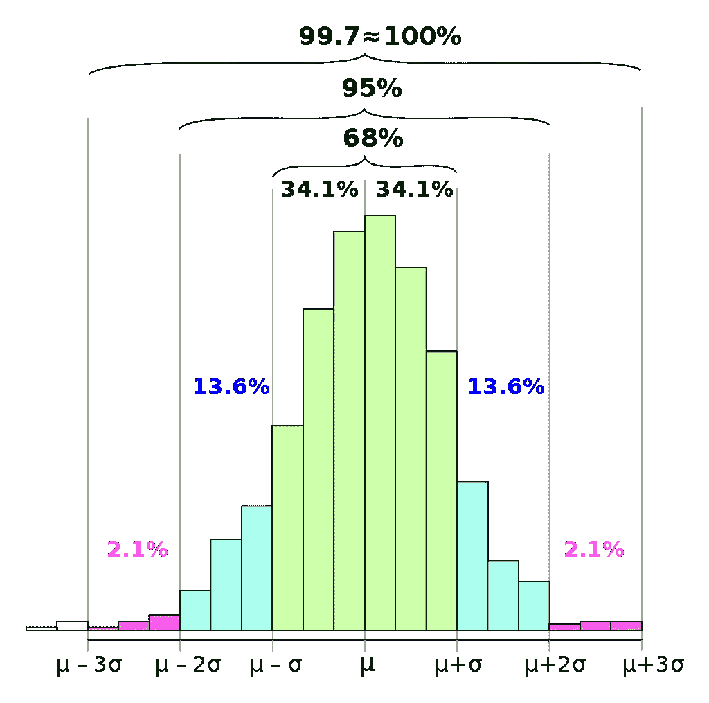
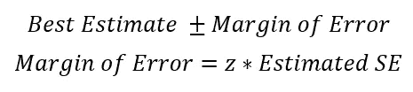
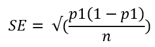
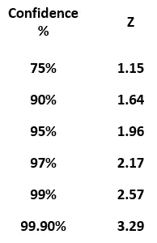
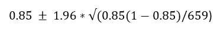
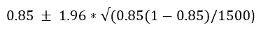

# 置信区间、计算和特征

> 原文：<https://towardsdatascience.com/confidence-interval-calculation-and-characteristics-1a60fd724e1d?source=collection_archive---------17----------------------->

## 什么是置信区间，如何计算它，以及它的重要特征

来源:[维基百科](https://en.wikipedia.org/wiki/68%E2%80%9395%E2%80%9399.7_rule)

置信区间在统计学和数据科学中非常重要。在这篇文章中，我将解释置信区间，如何计算它，以及它的重要特征。

置信区间(CI)是一个数值范围。它以百分比的形式表示，预计包含统计参数的最佳估计值。95%的置信区间意味着，我们的总体参数有 95%的把握位于该置信区间之间。

## 置信区间的解释

这里有一个声明:

在对 659 名带着蹒跚学步的孩子的父母进行的抽样调查中，有 540 人(约 85%)表示，他们在带着孩子的所有旅行中都使用汽车安全座椅。根据这些结果，提供了 95%的置信区间，从大约 82.3%到 87.7%。”

这句话的意思是，95%确定的是，带着他们的孩子在所有旅行中使用汽车安全座椅的人口比例是 82.3 和 87.7。如果我们从这个人群中抽取几个子样本，在 95%的情况下，带着蹒跚学步的孩子出行时使用汽车安全座椅的人群比例将在 82.3%到 87.7%之间。

我们能说置信区间(82.3，87.7)包含了真实的人口比例吗？答案不得而知。人口比例是一个固定值，但未知。**记住 95%的信心并不意味着 95%的可能性，这一点很重要。**

## 为什么置信区间很重要？

这一点很重要，因为大多数时候不可能从一个群体中的每一个人身上获取数据。在上面的例子中，样本量是 659。我们从 659 名父母样本中估计了所有旅行中都使用汽车座椅的幼儿父母的人口比例。我们无法从所有带着蹒跚学步的孩子的父母那里获得数据。因此，我们从现有样本中计算人口比例，并考虑误差幅度。有了这个误差范围，我们就得到了一个范围。这个范围称为置信区间。置信区间是一种表示样本数据代表总体情况的方式。可以计算任意数的置信区间(小于 100%)。但是 95%的置信区间是最常见的。

## 如何计算置信区间

置信区间的公式为:

我们通常想要一个高置信度，比如 75%、95%或 99%。置信水平(CL)越高，精度越低。在上面的例子中，最好的估计是 85%。我们可以通过以下公式计算估计 SE:

在等式中，p1 以上是最佳估计，n 是样本大小。下面是一些常用置信水平的 z 分数表。

输入所有的值，

置信区间分别为 82.3%和 87.7% 。

## CL 越高，CI 的范围越大

同样的，我们可以计算出 99%的置信度。你只需要改变 z 值。从上表中可以看出，99%置信水平的 z 值为 2.57。将该值代入置信区间公式，99%置信水平的置信区间为 81.43%至 88.57%。置信区间的范围越大，置信水平越高。

来源:[维基百科](https://en.wikipedia.org/wiki/68%E2%80%9395%E2%80%9399.7_rule)

在上图中，中间的‘mu’是最佳估计值，sigma 是标准差。我们在示例中使用了标准误差，因为总体标准偏差是未知的。图中显示，68%的人群保持在距离最佳估计值 sigma 的范围内。这是 68%的置信区间。同样，95%置信区间和 99.7%置信区间在距离最佳估计值‘mu’2 sigma 和 3 sigmas 的范围内。另一种表达方式是，95%和 99.7%的人口位于距离最佳估计值‘mu’2σ和 3σ的范围内。如果这张图片让您感到困惑，请不要担心，使用 z 得分表从上面的公式计算不同的置信水平。那会给你一个趋势的概念。

## 样本越大，置信区间越窄

样本量越大，置信区间越精确。让我们用父母带着蹒跚学步的孩子的例子来证明一下。让我们假设最佳估计值保持不变，0.85。但是样本量是 1500 而不是 659。现在，在公式中插入这个新的样本量，并计算出 95%的置信区间。

95%置信水平的置信区间变为 83.2%和 86.8%，比 82.3%和 87.7%窄。