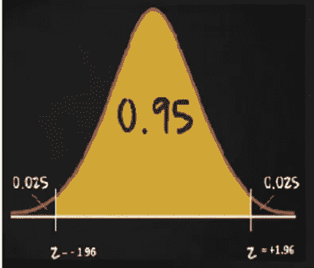
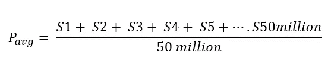
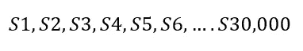
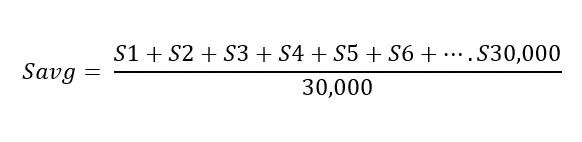
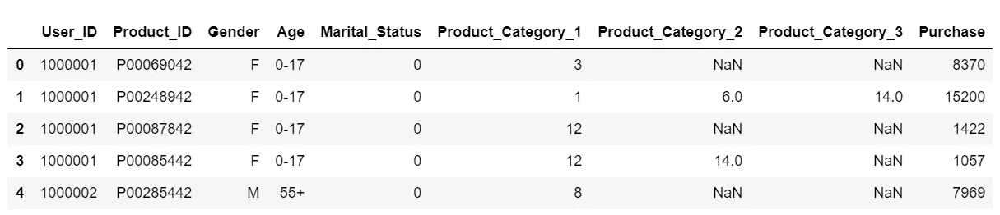
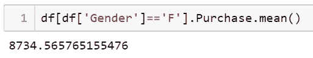
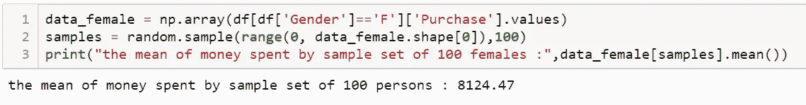
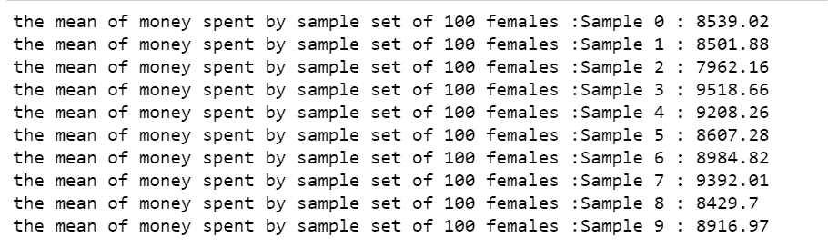
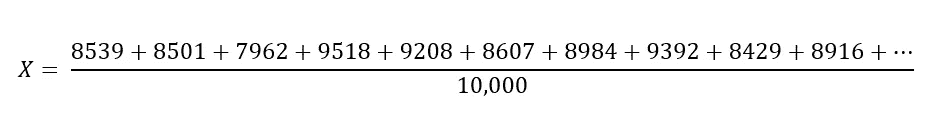
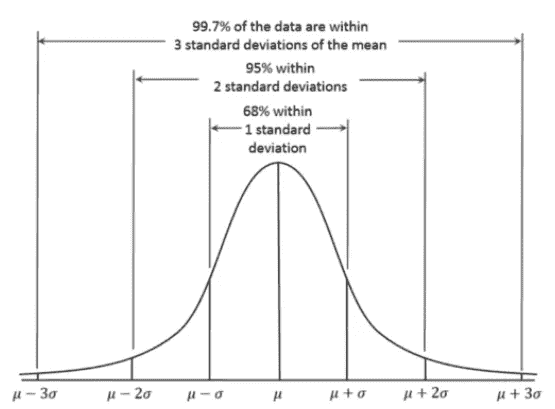

# 向业务用户解释置信区间

> 原文：<https://towardsdatascience.com/confidence-interval-clearly-explained-b9f3fa787d0?source=collection_archive---------17----------------------->

## 如何简洁地回答著名的数据科学面试问题

图片来自 [Coursera-stats](https://sites.google.com/site/courserastats/)

当我们作为数据科学家开始我们的旅程时，少数几个任何人都可能被卡住的话题之一是“置信区间”。是我的实习经历让我对这个概念有了清晰的认识。最近，当我在一次采访中被问到“你如何向商业用户解释置信区间？”，我仍在努力恰当地表达我的答案。

这篇文章是写给那些正在努力理解置信区间概念的人，也是写给那些理解了这个概念但不能和非技术人员交流的人。我在这里的目的只是给出一个关于这个话题的直觉。请将此视为构建概念的起点。

这篇文章有两个部分。在第一部分中，我将尝试用简单的英语解释置信区间的概念。在第二部分，我将展示这个概念背后的数学原理。

# 用英语解释置信区间

假设你是亚马逊的一名数据科学家。现在，亚马逊拥有 1 亿客户。想象一下，其中 5000 万是男性顾客，5000 万是女性顾客。

你想分析两性的消费习惯是否不同。你需要回答的具体问题是:*平均而言，女性每笔交易的花费是否比男性多？*

一种确定方法是跟踪所有这 5000 万女性顾客的每笔交易的花费金额，跟踪所有这 5000 万男性顾客的每笔交易的花费金额，计算平均值并得出结果。您刚才所做的是收集总体数据并确定总体参数。然而，你几乎没有时间和资源(有时是金钱)来收集整个人口数据。因此，你依靠经典统计学来解决问题。

**首先，让我们试着计算一下女性顾客每笔交易的平均支出。**

设每笔交易金额用 Si 表示。所有 5000 万女性顾客的平均交易量，即人口平均数是:

所有 5000 万女性顾客的平均消费

如前所述，由于你没有时间和资源去等待和收集所有 5000 万女性顾客的消费，你可以从这 5000 万女性顾客中抽取一个(随机独立的)女性顾客样本，比如说 30000 个。您将记录这 30，000 名女性顾客的每笔交易支出:

所以现在你有 30，000 笔交易。

现在您将计算这 30，000 笔交易的平均值。

样本中 30，000 名女性顾客的平均消费

## 使用经典统计学有效解决业务案例

在经典统计学中，您使用这个样本平均值来找出总体平均值。在这种情况下，您使用 30，000 名女性客户样本的平均支出来找出 5，000 万名女性客户的整个人口的平均支出。

有两种方法可以做到这一点

1.  你得出结论，3 万女性顾客的平均消费，(样本平均)等于所有 5000 万女性顾客的平均消费(人口平均)。这被称为*点估计*，在这里你使用样本数据得出未知总体参数的最佳猜测。
2.  一个更好更有说服力的方法是用这个样本平均值来找出总体平均值所在的区间。使用这个 30，000 名女性顾客的样本，你将计算出 5，000 万女性顾客的平均消费可能处于的区间。

> 您使用样本数据计算出的总体参数所在的可信区间称为置信区间。间隔的宽度主要由业务决定:90%、95%或 99%是最常见的。

用简单的英语来说，95%的置信区间告诉你 95%的人口参数值，即 5000 万女性顾客在这里的平均消费，所在的范围。因此，我们可以 95%地确信总体均值将位于区间内。(您必须记住，这 95%的总体数据区间是仅利用样本数据中的信息计算出来的)

这里的一个重要方面是如何对数据进行采样。要获得总体的无偏代表样本:

1.  样本量不应该太小
2.  样本应该是随机和独立的。

即，

收集一个数据点不应以任何方式决定您的下一个数据点。例如，仅仅因为你收集了一个 50 岁已婚女性的样本作为你的第一个数据点**，你不应该认为**“现在我将收集一个 20 岁的单身女性”。如果这样做，就会引入偏差，第二个数据点就会依赖于第一个数据点。这样可以确保样本中收集的每个数据点都是随机的并且相互独立。(点击此处了解更多关于选择偏差的信息)

所以，下次当你得到这个问题用非技术的方式解释置信区间时，你可以用这个想法来表述答案。

> 假设您想要计算出您感兴趣的关于人口的一些参数(根据业务进行定制)。收集全部人口的数据既费时又费钱。所以你收集一个随机的数据样本，从这个样本中，使用统计方法，你可以计算出一个总体参数可能存在的区间。这个区间称为置信区间。

## 现在回到业务问题

为了更好地理解置信区间的用处，让我回到我们最初的问题。平均而言，女性在每笔交易上花的钱比男性多吗？这是手头的问题

就像你拿了 3 万个女客户的样本，算出平均值，你就拿了 3 万个男客户的样本，算出平均值。让我们假设从这个样本中计算出的女性顾客的每笔交易的平均花费(Female_avg)是 2350 美元，而从样本中计算出的男性顾客的每笔交易的平均花费(male_avg)是 1350 美元。这里女性平均值大于男性平均值。但是在得出女性在每笔交易中花费更多的结论之前，记住你只有样本信息。即使我们正确地获得了样本，样本平均值也可能与总体平均值相差很大。这就是你找到男顾客和女顾客平均消费的置信区间。

假设你得到的男性用户平均消费对应的 95%置信区间为[1150，1250]，女性用户为[2340，2360]。这意味着 95%的(全部 5000 万)男性顾客的平均消费介于 1150 至 1250 英镑之间。只有 5%的情况下(非常罕见)，你会发现男性的平均支出超过 1250 美元。同样，对于女性来说，只有 5%的时间平均支出低于 2340 美元。因此，你可以得出结论，平均而言，女性在每笔交易中花费的钱比男性多。

具体来说，您正在检查**置信区间是否与**重叠。如果置信区间没有重叠，那么我们可以说有差异。

假设你得到男性用户平均消费的 95% CI 为[2330，2350]。这里你可以看到置信区间重叠。因此，我们不能得出女性在每笔交易中比男性花费更多的结论。

我希望我能让你对这个概念有个直观的理解。现在是数学时间了。

# 置信区间背后的数学

在深入研究之前，你必须具备的一个先决条件是很好地理解中心极限定理。

 [## 中心极限定理的应用

### 以及实际应用中的例子

towardsdatascience.com](/central-limit-theorem-in-action-1d4832599b7f) 

我们在这里使用的数据集是 Kaggle 的黑色星期五销售数据。这里的数据集是黑色星期五在一家零售店进行的交易的样本。为了解释的连续性，考虑这个数据集是亚马逊的。

 [## 黑色星期五购物促销

### Kaggle 是世界上最大的数据科学社区，拥有强大的工具和资源来帮助您实现您的数据…

www.kaggle.com](https://www.kaggle.com/sdolezel/black-friday?select=train.csv) 

黑色星期五销售数据集

记住，我们只有 500 万英镑的交易样本。

你想知道的第一件事是，两性之间的花费是否存在差异。从这个数据集中找出女性顾客在黑色星期五期间的平均消费，然后与男性顾客的平均消费进行比较。

我们先从计算女性顾客的平均消费开始。

女性的平均支出

如前所述，这只是女性用户交易的样本平均值。我们必须用这 8734 美元来得出一个区间，在这个区间内，人口平均数可能会下降。为了计算这个区间值，我们利用中心极限定理。

> 简而言之，中心极限定理表明，无论总体分布如何，如果总体分布具有有限均值和有限方差σ，样本均值的分布将遵循均值和标准差σ /√n 的高斯分布，其中 n 是样本大小，假设样本大小足够大。

## 对该数据集应用中心极限定理

1.  从数据集中随机抽取女性交易的替换 100 个数据点(样本大小)

2.记录该样本的平均值(8124 美元)

3.重复步骤 1 和 2 10，000 次。你得到 10，000 个平均值。

计算 100 个样本中每个样本的平均值。

4.绘制上面收集的所有 10，000 个样本平均值的分布图。*那么根据中心极限定理，这个分布将是一个高斯分布。*

5.计算这些样本均值的平均值 x。

x 大约计算为 8700 美元。

在步骤 4 中获得的分布将具有 X 的平均值，因此将以 X 为中心(因为分布是高斯分布),标准偏差σ /√100。(100 为样本量)。然后用这个 X，我们可以给出一个总体均值的估计范围。

但是怎么做呢？

标准差为σ的高斯分布的一个重要特性是，95%的值将位于[ -2σ，+2 σ]范围内。

[维基百科上的正态分布](https://en.wikipedia.org/wiki/Normal_distribution)

利用这个性质，我们可以计算出以 X 为中心的 95%范围。记住，X 只不过是样本平均值的平均值。所以这个 95%的范围可以理解为:“95%的样本均值将位于[ -2 σ，+2 σ]之间”。

## 计算 95%的置信区间

假设我们知道总体标准差σ，设σ为 500。**(大假设！！)**

样本量=100

样本统计平均值= X = 8700 美元

根据高斯分布的性质，95%的值位于[8600，8800]之间。

区间[8600，8800]是所有女性交易平均花费的 95%置信区间。

说白了，我们可以说【8600，8800】涵盖了所有女性客户平均消费的 95%的数值。就是这样！

或者我们可以说，95%的时间实际人口意味着将位于这个区间。或者我们可以说，我们有 95%的把握认为实际人口平均数在这个范围之内。

任何超出此区间[8600，8800]的值只在 5%的时间内出现。比如所有女性客户平均消费 8200 的概率小于 0.05。

因此，使用一个样本统计量，我们能够给出总体中一个未知参数的一系列似是而非的值。

> 需要注意的一点是，所有这些都是因为中心极限定理才成立的，该定理认为采样分布本身是高斯分布。如果我们不知道抽样分布是高斯分布，我们就不能利用这个性质来计算区间的上限和下限。

现在你可以猜测 99%的置信区间告诉我们什么。它只是给出了一个覆盖女性顾客平均消费 99%的区间。遵循同样的性质，计算为[ -3σ，+3 σ]。因此，99%的置信区间比 95%的置信区间更宽。

为了简单起见，**我做了一个很大的假设，我们知道总体标准差**。**我们大多不会有这方面的信息。**当总体标准差未知时，我们用 t 分布来计算置信区间。

# 注意事项:

1.  在机器学习中，因为数据的数字化，所以非常容易得到人口数据。如果我们有人口数据，就没有必要计算 C.I。如果获取数据的成本很高(医疗应用)或获取此类数据很困难(第三方营销公司)，在这种情况下，像这样的经典统计方法就派上用场了。
2.  计算置信区间的一个用例是 AB 测试。在 AB 测试中，你将你的人群(用户)随机分成两个(或更多)组:控制组和挑战者组。对照和挑战者是总体的两个样本。使用这些样本，你需要确定这个群体的行为。
3.  我们使用中心极限定理，只在需要计算均值的置信区间时才计算置信区间。估计标准差、中位数或第 90 百分位等的置信区间。我们使用自举。这是因为 CLT 不适用于标准差或中位数，而是适用于任何加法或加法后加运算的函数。

我很想知道这篇文章是否对你有所帮助，或者你是否有任何反馈。通过你的评论让我知道。

此外，查看另一个令人困惑的主题的简单解释。

 [## 学会阅读英文版 P-Value

### 理解什么是 P 值，它与零假设有什么关系

towardsdatascience.com](/learn-to-read-p-value-in-english-11725c09f30e) 

如果这篇文章对你有帮助，请鼓掌！

 [## Aparna Gopakumar -会员- Beta Gamma 适马| LinkedIn

### 一名有抱负的数据科学家和一名刚刚毕业的商业分析和项目管理理学硕士…

www.linkedin.com](https://www.linkedin.com/in/aparna-gopakumar/)