# XGBoost 的置信区间

> 原文：<https://towardsdatascience.com/confidence-intervals-for-xgboost-cac2955a8fde?source=collection_archive---------7----------------------->

## 构建正则化分位数回归目标

> 更新:发现我关于渐变提升的新书，[实用渐变提升](https://amzn.to/3GqteUN)。这是用 python 中的许多例子对渐变增强的深入探究。

 [## 实用的渐变增强:深入探究 Python 中的渐变增强

### 这本书的梯度推进方法是为学生，学者，工程师和数据科学家谁希望…](https://amzn.to/3GqteUN) 

梯度增强方法是一种非常强大的工具，可对大型数据集、非线性依赖于大量要素的复杂变量快速执行精确预测。潜在的数学原理在我的另一篇文章中有解释:

 [## 用不到 200 行 python 代码 DIY XGBoost 库

### XGBoost 解释了梯度推进方法和惠普调整，通过建立自己的梯度推进库…

towardsdatascience.com](/diy-xgboost-library-in-less-than-200-lines-of-python-69b6bf25e7d9) 

而且实现方式多种多样: [XGBoost](https://xgboost.ai/) 、 [CatBoost](https://catboost.ai/) 、[GradientBoostingRegressor](https://scikit-learn.org/stable/modules/generated/sklearn.ensemble.GradientBoostingRegressor.html)，各有千秋，这里讨论[这里讨论](/catboost-vs-light-gbm-vs-xgboost-5f93620723db)或者[这里讨论](/boosting-showdown-scikit-learn-vs-xgboost-vs-lightgbm-vs-catboost-in-sentiment-classification-f7c7f46fd956)。这些实现都有一个共同之处，那就是能够选择一个给定的目标进行最小化训练。更有趣的是，XGBoost 和 CatBoost 提供了对自定义目标函数的简单支持。

**为什么我需要定制物镜？**

大多数实现都提供了标准的目标函数，如最小二乘法、最小偏差法、休伯法、RMSE 法……但有时，您正在处理的问题需要更具体的解决方案来达到预期的精度水平。使用自定义物镜通常是我最喜欢的调整模型的方法。

请注意，您可以使用超参数调节来帮助找到最佳物镜。参见我关于这个主题的两篇论文:

 [## 用 XGBoost 调优 XGBoost:编写自己的 Hyper Parameters 优化引擎

towardsdatascience.com](/tuning-xgboost-with-xgboost-writing-your-own-hyper-parameters-optimization-engine-a593498b5fba)  [## 用 SMAC 进行快速超参数调整的 AutoML

### 使用 AutoML 在高维空间中寻找你的路径

towardsdatascience.com](/automl-for-fast-hyperparameters-tuning-with-smac-4d70b1399ce6) 

你能给我们举个例子吗？

当然可以！最近，我一直在寻找一种方法，将我们的一个模型的预测与置信区间联系起来。简单提醒一下，置信区间有两个特征:

1.  区间[x_l，x_u]
2.  置信水平 *C* 确保 C%的时间，我们想要预测的值将位于该区间。

例如，我们可以说地球平均温度的 99%置信区间是[-80，60]。

将置信区间与预测相关联可以让我们量化预测的可信度。

**你如何计算置信区间？**

你需要训练两个模特:

*   一个代表区间的上限
*   一个代表区间的下限

你猜怎么着？您需要特定的指标来实现:分位数回归目标。scikit-learn[GradientBoostingRegressor](https://scikit-learn.org/stable/modules/generated/sklearn.ensemble.GradientBoostingRegressor.html)和 [CatBoost](https://catboost.ai/) 实现都提供了一种使用分位数回归目标函数计算这些值的方法，但两者都使用了这种回归的非平滑标准定义:

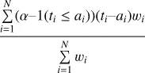

其中 *t_i* 为第 I 个真值， *a_i* 为第 I 个预测值。 *w_i* 是用于衡量误差的可选权重。并且*α*定义了分位数。

例如，使用这个目标函数，如果您将 *alpha* 设置为 0.95，95%的观察值低于预测值。相反，如果将 *alpha* 设置为 0.05，只有 5%的观测值低于预测值。90%的真实值介于这两个预测值之间。

让我们使用下面的代码来绘制它，对于范围[-10，10]和各种 alphas:

正如你在下面的结果图中看到的，这个目标函数是连续的，但它的导数不是连续的。(0，0)中有一个奇点，*即*。就误差而言，这是一个 C_0 函数，但不是 C_1 函数。这是一个问题，因为梯度增强方法需要 C_2 类的目标函数，即可以微分两次来计算梯度和 hessian 矩阵。

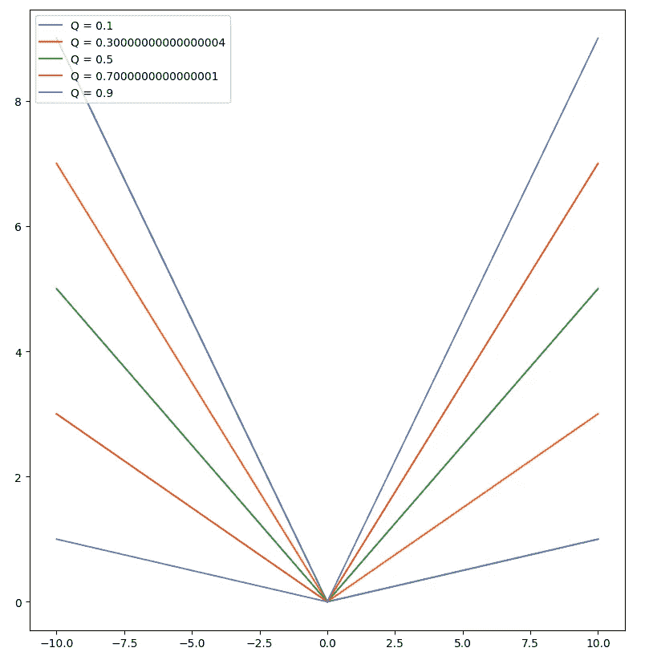

如果您熟悉 MAE 目标，您应该已经认识到这些分位数回归函数只是 MAE、缩放和旋转函数。如果你不是，下面的截图应该可以说服你:

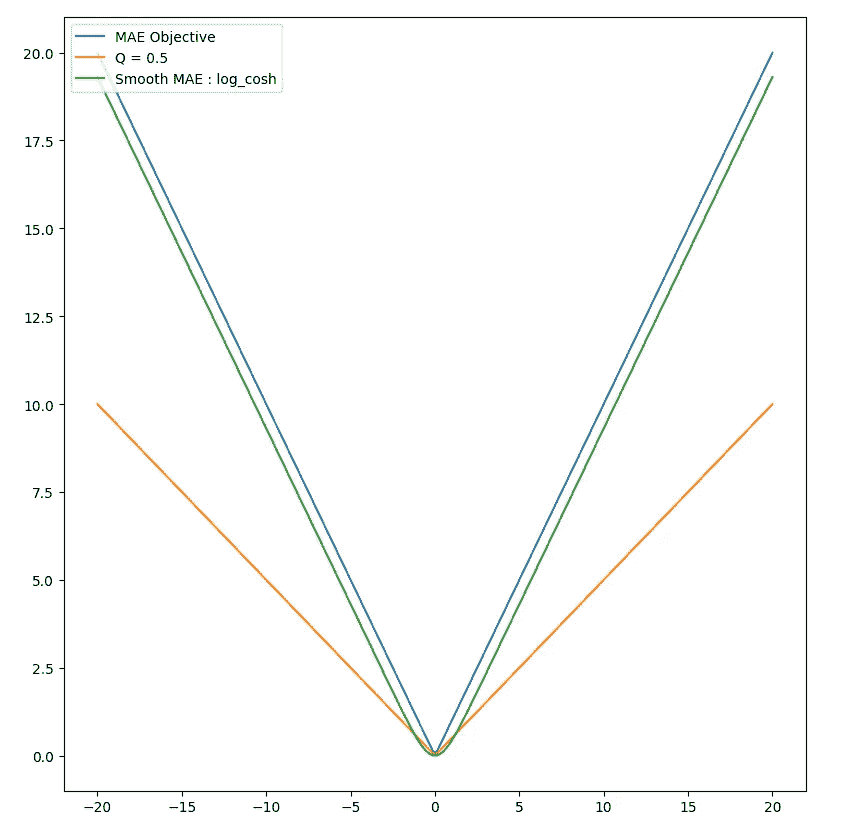

**对数目标**

提醒一下，MAE 目标的公式很简单

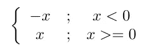

MAE 目标公式

上图还显示了 MAE 的正则化版本，logcosh 目标。如您所见，该目标非常接近 MAE，但却是平滑的，即其导数是连续且可微的。因此，它可以用作任何梯度增强方法中的目标，并且与默认的不可微方法相比，提供了合理的收敛速度。

因为它是 MAE 的非常接近的近似值，如果我们设法缩放和旋转它，我们将得到分位数回归目标函数的两次可微近似值。

你可能已经注意到，平均风速曲线和对数余弦曲线之间有轻微的偏移。我们将在下面详细解释这一点。

对数曲线的公式很简单:

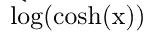

对数目标的公式

**对数曲线的旋转和缩放**

我们现在需要做的就是找到一种方法来旋转和缩放这个目标，使它成为分位数回归目标的一个很好的近似。这里没什么复杂的。由于 logcosh 与 MAE 相似，我们应用了与分位数回归相同的变化，即我们使用 alpha 对其进行缩放:

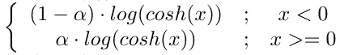

使用对数余弦的平滑分位数回归

这可以用这 12 行代码来完成:

这是可行的，如下所示:

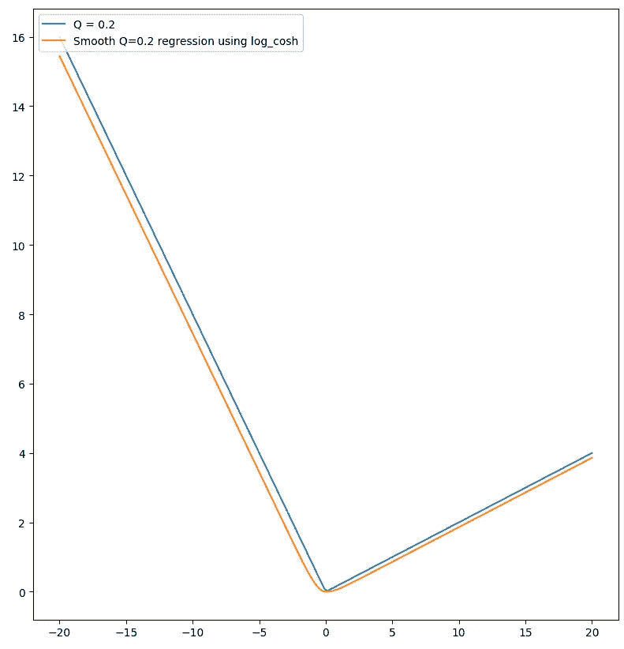

**但是等一下！**

您可能会好奇为什么将 log 和 cosh 这两个非线性函数结合起来会得到如此简单的近似线性曲线。

答案就在 cosh 的公式里:

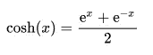

科斯公式

当 x 为正且足够大时， *cosh* 可以近似为

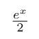

当 x >> 0 时 cosh 的近似值

相反，当 x 足够负时， *cosh* 可以近似为

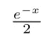

x << 0

We begin to understand how combining these two formulae leads to such linear results. Indeed, as we apply the log to these approximations of cosh, we get :

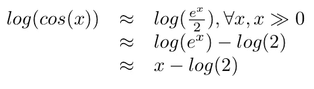

logcosh simplification for x > > 0 时 cosh 的近似值

对于 x >>0。同样代表 x << 0 :

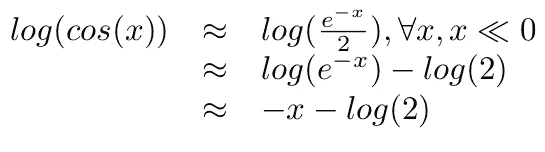

It is now clear why these two functions closely approximate the MAE. We also get as a side benefit the explanation for the slight gap between the MAE and the logcosh. It’s log(2)!

**让我们在一个真实的例子上试试**

现在是时候确保我们上面进行的所有理论数学在现实生活中有效了。我们不会在一个简单的窦上评估我们的方法，如 scikit [这里](https://scikit-learn.org/stable/auto_examples/ensemble/plot_gradient_boosting_quantile.html)所提议的；)相反，我们将使用从 [TLC 行程记录](https://www1.nyc.gov/site/tlc/about/tlc-trip-record-data.page)数据集中提取的真实世界数据，该数据包含超过 10 亿次出租车行程。

下面的代码片段实现了上面提出的想法。它定义了对数分位数回归目标 **log_cosh_quantile** ，计算其梯度和 hessian。这些是最小化目标所必需的。

如本文开头所述，我们需要训练两个模型，一个用于上限，另一个用于下限。

代码的剩余部分只是加载数据并执行最少的数据清理，主要是删除异常值。

在这段代码中，我们选择计算 90%的置信区间。因此，我们使用**α= 0.95**作为上限，使用**α= 0.05**作为下限。

超参数调整已经手动完成，使用相当标准的值。当然还可以改进，但是结果已经足够好来说明这篇论文了。

脚本的最后几行专用于绘制随机构建的测试集的前 150 个预测及其置信区间:

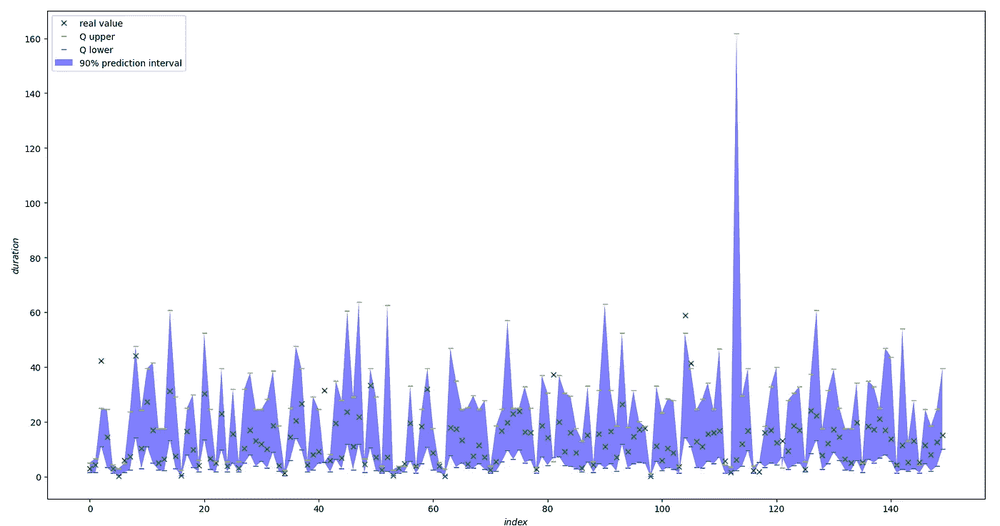

请注意，我们还在脚本末尾包含了一个计数器，用于计算置信区间正确的实数值的数量。在我们的测试集上，24 889 个真实值中有 22 238 个(89.3%)在计算的置信区间内。

该模型已经在 [TLC 行程记录](https://www1.nyc.gov/site/tlc/about/tlc-trip-record-data.page)数据集的 2020 年 1 月数据集的前 100 000 行上进行训练。

**结论**

通过简单的数学，我们已经能够定义一个平滑的分位数回归目标函数，该函数可以插入任何基于目标优化的机器学习算法中。

使用这些正则化函数，我们已经能够为我们的预测预测可靠的置信区间。

这种方法比这里的[所示的](/regression-prediction-intervals-with-xgboost-428e0a018b)方法具有无参数的优势。超参数调优已经是优化 ML 模型的一个要求很高的步骤，我们不需要用另一个参数来增加配置空间的大小；)