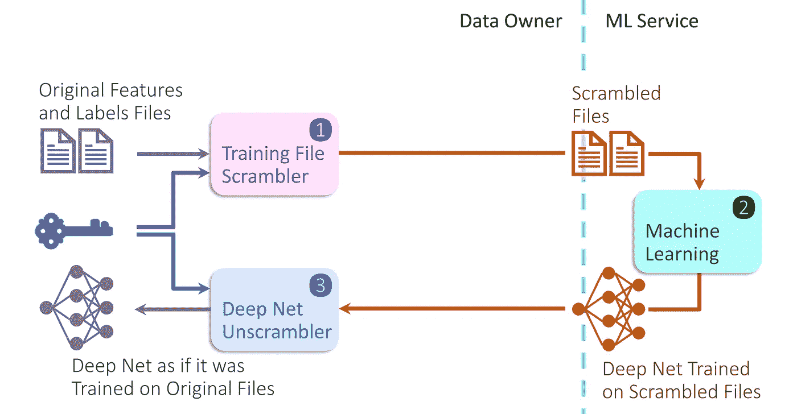

# 机密机器学习

> 原文：<https://towardsdatascience.com/confidential-machine-learning-f45efb0dc2fc?source=collection_archive---------44----------------------->

## 在培训之前、期间和之后保密

机密机器学习- *ConfML -* 是数据所有者在与 ML 服务共享训练数据时遵循的协议。该协议在训练过程中保持训练数据的机密性。

静态数据和传输中数据的机密性可以通过加密来确保。数据在训练开始之前就被解密，并且在训练过程结束之前一直是易受攻击的。ConfML 解决了这个漏洞:它确保了训练过程中训练数据的机密性。

ConfML 协议由两个步骤组成，这两个步骤结束了培训过程:

1.  数据所有者在将训练数据文件发送到 ML 服务之前，使用秘密密钥对它们进行加扰。秘密密钥不与 ML 服务共享。
2.  在从 ML 服务接收到*网络训练加扰数据*后，数据所有者使用步骤 1 的秘密密钥将该网络转换成一个行为相同的网络，就好像它是在原始的未加扰数据上训练的一样。

这两个步骤确保 ML 服务永远看不到原始数据，而数据所有者获得他们想要的网络。



机密机器学习(图片由作者提供)

## scramble_files.py

数据所有者可以使用类似于以下程序的东西来扰乱将用于训练完全连接的前馈深度神经网络的特征和标签文件。

该程序使用密钥对特征和标签 CSV 文件中列的*顺序进行加密。这种列顺序的混乱使得入侵者很难理解数据，但对训练质量几乎没有影响。*

```
#scramble_files.pyimport random
import pandasdef bld_scram_idx(lst_len, key_secret):  #random list based on a key
   my_seed = int(''.join(list(map(str, map(ord, key_secret)))))
   random.seed(my_seed * lst_len)
   scram_idx = list(range(lst_len))
   random.shuffle(scram_idx)
   *return* scram_idxdef scram_list(lst, scram_idx):  #scramble a list of integers
    scram_lst = [0] * len(lst)
    *for* i, item *in* enumerate(lst):
        scram_lst[i] = scram_idx.index(item)
    *return* scram_lstdef scram_df(df, scram_idx):  #scramble a dataframe
    cols_idx = list(range(len(df.columns)))
    cols_idx_scram = scram_list(cols_idx, scram_idx)
    *return* df.reindex(labels = cols_idx_scram, axis='columns')def read_csv_file_write_scram_version(csv_fname, key_secret):
    df_csv = pandas.read_csv(csv_fname, header=None)
    scram_idx = bld_scram_idx(len(df_csv.columns), key_secret)
    df_csv = scram_df(df_csv, scram_idx)
    csv_scram_fname = csv_fname.split('.csv')[0] + '_scrambled.csv'
    df_csv.to_csv(csv_scram_fname, header=None, index=None)
    print(csv_scram_fname + ' file written to disk')KEY_SECRET, FT_CSV_FNAME, LB_CSV_FNAME = "", "", ""  #insert values
read_csv_file_write_scram_version(FT_CSV_FNAME, KEY_SECRET)
read_csv_file_write_scram_version(LB_CSV_FNAME, KEY_SECRET)
```

## 解读 _net.py

数据所有者使用该程序，结合用于对训练数据文件进行加扰的密钥，将*网络训练加扰数据*转换成一个网络，该网络的行为就好像是对原始数据进行训练一样。

这种转换的结果将是网络在原始数据上具有与*网络训练加扰数据的*在加扰数据上相同的精度。

这个程序的细节根据网络如何用代码实现而有所不同。然而，主要思想是根据`scramble_files.py`程序中建立的加扰指数恢复网络输入和输出的顺序。