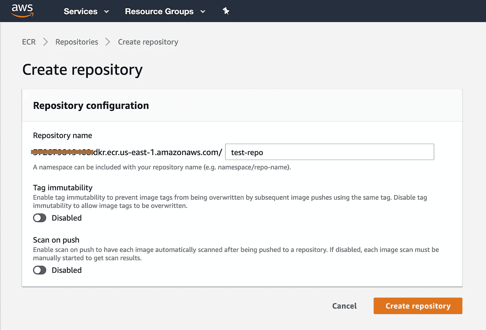
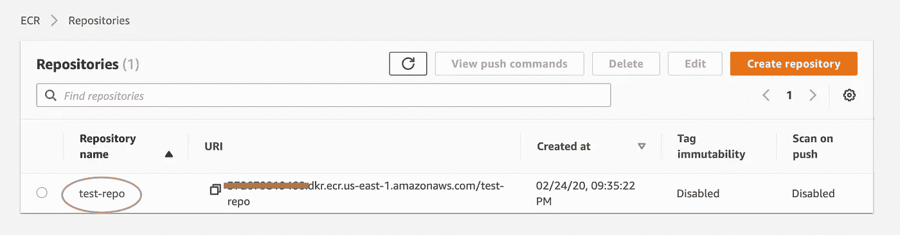
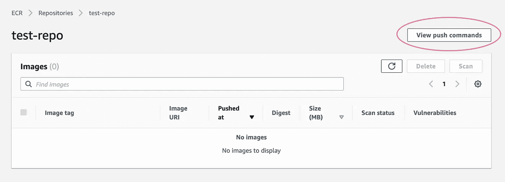
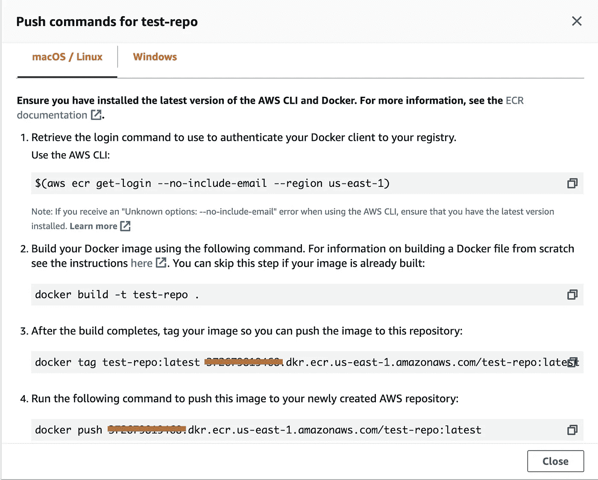

# 为 AWS 上的批处理 ML 作业配置云环境

> 原文：<https://towardsdatascience.com/configure-cloud-environment-for-batch-ml-job-on-aws-82edb5631540?source=collection_archive---------28----------------------->


由[汉弗莱·穆莱巴](https://unsplash.com/@good_citizen?utm_source=medium&utm_medium=referral)在 [Unsplash](https://unsplash.com?utm_source=medium&utm_medium=referral) 拍摄的照片

在这篇文章中，我将带您完成准备步骤，使您能够在 AWS 上将容器化的机器学习模型作为批处理作业进行调度。这是本系列文章的第二部分，假设您已经完成了[第 1 部分](/build-a-docker-container-with-your-machine-learning-model-3cf906f5e07e)中的前 2 步，创建了一个`Dockerfile`并构建了一个容器映像。

为了了解您在准备什么，最终，我们将使用 [AWS Batch](https://aws.amazon.com/batch/) 来安排 ML 作业。

AWS Batch 使用弹性容器服务(ECS)将作业作为 Docker 容器执行。它根据提交的批处理作业的数量和特定资源要求，动态调配计算资源的最佳数量和类型(例如，CPU 或内存优化实例)。

如果您的模型需要很长时间运行或者有复杂的依赖关系，AWS Batch 是一个很好的解决方案。它支持任何可以作为 Docker 容器执行的作业。

但是为了能够使用 AWS Batch，需要为您的云环境做一些准备。在本文中，我们将首先在注册表中注册我们构建的容器，并确保我们有适当的配置。

# 步骤 3—注册您的容器👩🏻‍✈️

我们构建的 Docker 映像当前驻留在我们的本地机器上。要在其他地方运行它，比如云，我们需要把它推到 Docker 注册中心。这非常像将您的本地代码推送到 GitHub，以便您的 EC2 可以克隆它。

类似于我们有不同的版本控制工具，如 GitHub、GitLab、BitBucket 等，也有不同的容器注册中心。Docker Hub 是最受欢迎的一个，但是 [AWS](https://aws.amazon.com/ecr/) 、 [Azure](https://azure.microsoft.com/en-us/services/container-registry/) 、 [GCP](https://cloud.google.com/container-registry/) 也都提供了它们自己的容器注册表。你可以根据自己的喜好选择其中的任何一个。对于本教程，我们将使用 AWS 原生— Amazon 弹性容器注册中心(或 ECR)。

## 创建存储库

打开 AWS 控制台并转到 ECR，选择 **Create repository** 并给它命名。然后点击**创建存储库。**



创建存储库

现在，您已经准备好将容器从您的终端推送到这个存储库了(需要 [AWS CLI](https://aws.amazon.com/cli/) )。单击存储库名称查看推送命令。



通过单击存储库名称查看推送命令



查看推送命令



容器注册库的推送命令

## 推送命令是什么意思

**1)向您的注册中心认证您的 Docker 客户端**

打开您的终端，复制步骤 1 中括号中的内容，以检索您的登录命令，该命令向您的注册表验证您的 Docker 客户端。然后运行返回的登录命令。

如果您有不同的配置文件设置(比如一个用于个人，一个用于商业)，记得在最后添加`--profile username`选项来检索正确的凭证。

**2)树立你的形象**

**3)标记图像，这样我们可以将图像推送到这个注册表**

所以在这里，我们用你的亚马逊 ECR 注册 URI 来标记你创建的图像。

```
$ docker tag <IMAGE_NAME>:<TAG> 012345678901.dkr.ecr.us-east-1.amazonaws.com/<IMAGE_NAME>:<TAG>
```

**4)将图像推送到该注册表**

```
$ # push your image to the AWS ECR repository
$ docker push 012345678901.dkr.ecr.us-east-2.amazonaws.com/<IMAGE_NAME>:<TAG>
```

您可以通过从注册表中提取来测试推送是否成功。

```
$ docker pull 012345678901.dkr.ecr.us-east-2.amazonaws.com/<IMAGE_NAME>:<TAG>
```

现在，您的云帐户可以访问您的容器了，您已经准备好进入第 4 步来配置您的云环境。

# 步骤 4 —配置权限和环境👩🏻‍🎤

## EC2

你们大多数人都已经熟悉 EC2 的设置，但我只想在这里提几件事。我们不会手动创建 EC2，但是无论您选择在 AWS 上使用什么服务，它最终都会创建一些 EC2 来进行计算，因此拥有正确的设置非常重要。

**1)密钥对**

我们需要为 AWS 批处理计算环境容器实例(ec2)设置 pem 密钥。您可以在 EC2 控制台中创建密钥对。创建密钥对后，您可以在创建计算环境时指定密钥对的名称，然后在使用 SSH 登录时提供私钥。

**2)安全组**

我们还需要为 AWS 批处理容器实例指定防火墙规则。例如，允许从您自己的 IP 使用 SSH，从任何地方使用 HTTP 和 HTTPS，以及任何其他规则来打开您的任务所需的端口。您也可以在 EC2 控制台中进行设置。

## VPC

> 虚拟私有云(VPC)使您能够将 AWS 资源启动到您定义的虚拟网络中。您可以完全控制虚拟网络环境，包括选择自己的 IP 地址范围、创建子网以及配置路由表和网络网关。

为了在您安全实践中更加警惕，我们应该设置一个 VPC，并让我们的计算节点驻留在 VPC 的私有子网中(如果需要访问互联网，则使用 NAT 网关)。

但是出于测试目的，您可以创建一个带有单个公共子网的 VPC，我们应该没问题。

## IAM 角色和权限

在您开始尝试 AWS Batch 之前，请通过参考[该清单](https://docs.aws.amazon.com/batch/latest/userguide/get-set-up-for-aws-batch.html)确保您拥有所需的权限(如果您是管理员，请跳过此步骤)。

简而言之，AWS Batch 将创建一个 EC2 节点来使用 Amazon ECS 运行您的代码，因此您需要创建一个 IAM 角色，该角色具有访问计算环境和容器实例的权限，然后将该角色与您的计算环境相关联。

> AWS 批处理计算环境和容器实例角色是在首次运行控制台时自动创建的，因此如果您打算使用 AWS 批处理控制台，可以继续下一节。如果您计划使用 AWS CLI，在创建您的第一个计算环境之前，完成 [AWS 批处理服务 IAM 角色](https://docs.aws.amazon.com/batch/latest/userguide/service_IAM_role.html)和 [Amazon ECS 实例角色](https://docs.aws.amazon.com/batch/latest/userguide/instance_IAM_role.html)中的过程。

## AWS CLI

如果你还没有安装 AWS CLI，现在是安装的好时机。我们将使用它将我们的容器推送到 AWS 注册中心，并与 AWS 批处理交互。

现在我们已经将代码容器化，构建了容器映像，设置了基本的云环境，并确保我们拥有所需的权限，我们已经准备好开始在 AWS 上调度我们的第一批作业。本系列的第 3 部分再见！

# 参考

*   aCloudGuru[AWS ECS——由](https://learn.acloud.guru/course/aws-ecs-scaling-docker/dashboard) [Nick Janetakis](https://twitter.com/nickjanetakis?ref_src=twsrc%5Egoogle%7Ctwcamp%5Eserp%7Ctwgr%5Eauthor) 教授的 Scaling Docker 课程
*   [从 AWS 文档开始使用 AWS 批次](https://docs.aws.amazon.com/batch/latest/userguide/Batch_GetStarted.html)
*   [使用 AWS 文件中的 AWS 批次](https://docs.aws.amazon.com/batch/latest/userguide/get-set-up-for-aws-batch.html)进行设置
*   [创建简单的“获取&运行”AWS 批处理作业](https://aws.amazon.com/blogs/compute/creating-a-simple-fetch-and-run-aws-batch-job/)Bryan Liston
*   [Sunit Mehta 的 AWS 批次](https://medium.com/weareservian/getting-started-with-aws-batch-3442446fc62)入门
*   [快速介绍 Docker 标签](https://www.freecodecamp.org/news/an-introduction-to-docker-tags-9b5395636c2a/)

# 关于作者💁🏻

我是一名机器学习工程师，除了技术教程之外，我还撰写关于生产力和自我发展的文章。我最近的兴趣是学习广东话和中国书法。