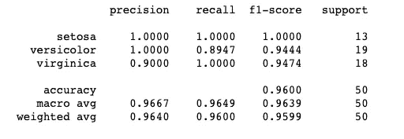

# 用 YAML 配置 XGBoost 型号

> 原文：<https://towardsdatascience.com/configure-xgboost-models-with-yaml-defa99be90ef?source=collection_archive---------22----------------------->

如何使用 YAML 文件使您的模型快速共享，非常灵活，并为生产做好准备

# 介绍

没有什么比开始一个新的 ML 项目更令人愉快的了。首先，你用一些[数据清理](/data-cleaning-with-python-and-pandas-detecting-missing-values-3e9c6ebcf78b)来弄脏你的手，然后你开始将那些干净的数据加载到熊猫 df 中，开始一些[探索性的数据分析](https://medium.com/datadriveninvestor/introduction-to-exploratory-data-analysis-682eb64063ff)(在那里你不可避免地发现你需要回去做更多的数据清理……)接下来，你进入[特征工程](/feature-engineering-for-machine-learning-3a5e293a5114)，然后最后，你处于准备构建一些模型和[实验](/comparing-different-classification-machine-learning-models-for-an-imbalanced-dataset-fdae1af3677f)的阶段！

在整个过程中，您可能已经将所有代码放在了您可信赖的 jupyter 笔记本中。现在，您想要实际应用您的模型，但是您该如何开始呢？你当然不能把笔记本投入生产。

人们可以写一本关于机器学习模型生产化的书。我并不想教你生产所需的所有工程步骤。相反，把这篇文章看作是生产化 [*改善*](https://medium.com/the-mission/the-kaizen-approach-to-achieving-your-biggest-goal-the-philosophy-of-constant-improvement-172033f8346) *:你可以对你的代码做一个小小的改变来为生产做准备。*

在本文中，我将向您展示如何使用 YAML 配置文件来使您的代码更整洁、更具可伸缩性、更易于维护，并且在运行实验时更高效。

# YAML 不是标记语言

[YAML](https://yaml.org/) 是一种递归命名的语言，用于以人类可读的格式存储信息[1]。

对 yaml 结构的详细讨论将使我们离题太远，所以为了满足我们的目的，让我们考虑下面的 yaml 块来初始化 [XGBoost 分类器](/a-beginners-guide-to-xgboost-87f5d4c30ed7)。该块定义了一个字典“模型设置”，将另一个字典作为其值*参数字典。**参数* *字典*保存我们想要设置的 xgboost 模型的每个参数的值。

```
# basic yaml config
model_settings:
  random_state: 90210
  objective: 'binary:logistic'
  eval_metric: ['error', 'map', 'auc', 'aucpr']
  n_jobs: -1
  learning_rate: 0.01
  colsample_bytree: 0.8
  subsample: 0.75
  reg_alpha: 2.5
  reg_lambda: 1.25
  max_depth: 7
  gamma: 0.2
  n_estimators: 1251
  max_delta_step: 8.5
  scale_pos_weight: 2.0
```

通过在 yaml 配置中编写模型的参数，您可以获得 4 个主要好处:

1.  在模型的初始化中，参数不再是硬编码的，这使得代码更加清晰
2.  合作者可以通过传递单个文件(最好是在 git repo 中)轻松实现您的模型
3.  对模型进行更改不再需要代码重构
4.  遵循(3)，您可以轻松地在您的模型上进行“假设”实验。例如 ***如果*** *我把 max-depth 改成更深一层呢？*

# 您的模型的配置对象

我们希望能够将 yaml 文件中包含的信息传递给项目中的其他脚本。为此，我们为您的项目定义了一个包含所有子类(将它们视为模块)的超类，这些子类将包含 yaml 中的值。通过这样做，我们可以强制类型，这样用户就不能在需要 int 的地方传递字符串。让我们定义一个这样的对象。

```
class YamlDemo:
    class ModelSettings:
        def __init__(self, random_state: int, objective: str, eval_metric: list, n_jobs: int, 
                     learning_rate: float, colsample_bytree: float, subsample: float, 
                     reg_alpha: float, reg_lambda: float, max_depth: int, gamma: float, 
                     n_estimators: int, max_delta_step: float, scale_pos_weight: float):
            self.random_state = random_state
            self.objective = objective
            self.eval_metric = eval_metric
            self.n_jobs = n_jobs
            self.learning_rate = learning_rate
            self.colsample_bytree = colsample_bytree
            self.subsample = subsample
            self.reg_alpha = reg_alpha
            self.reg_lambda = reg_lambda
            self.max_depth = max_depth
            self.gamma = gamma
            self.n_estimators = n_estimators
            self.max_delta_step = max_delta_step
            self.scale_pos_weight = scale_pos_weight

    def __init__(self, model_settings: ModelSettings, config_path: str):
        self.model_settings = model_settings
        self.config_path = config_path
```

# 配置分析器

有了 yaml 配置和配置对象，最后一个组件是编写解析器来读取 yaml 并用值填充配置对象。一个简单的配置解析器函数可以帮你做到这一点。

```
import yamldef parse_config(config_path: str) -> YamlDemo:
    """
    parses yaml config; returns populated YamlDemo object
    """
    with open(config_path, 'r') as stream:
            try:
                config_settings = yaml.safe_load(stream)
            except yaml.YAMLError as e:
                print(e)model_settings = YamlDemo.ModelSettings(
            random_state = config_settings["model_settings"]["random_state"],
            objective = config_settings["model_settings"]["objective"],
            eval_metric = config_settings["model_settings"]["eval_metric"],
            n_jobs = config_settings["model_settings"]["n_jobs"],
            learning_rate = config_settings["model_settings"]["learning_rate"],
            colsample_bytree = config_settings["model_settings"]["colsample_bytree"],
            subsample = config_settings["model_settings"]["subsample"],
            reg_alpha = config_settings["model_settings"]["reg_alpha"],
            reg_lambda = config_settings["model_settings"]["reg_lambda"],
            max_depth = config_settings["model_settings"]["max_depth"],
            gamma = config_settings["model_settings"]["gamma"],
            n_estimators = config_settings["model_settings"]["n_estimators"],
            max_delta_step = config_settings["model_settings"]["max_delta_step"],
            scale_pos_weight = config_settings["model_settings"]["scale_pos_weight"]
        )
    config = YamlDemo(model_settings=model_settings, config_path=config_path)
    assert isinstance(config, YamlDemo)
    return config
```

# 将配置对象传递给模型

现在，这个过程的最后一步是将 config 对象中的信息传递给模型。

首先，我们必须解析我们的配置以获得一个填充的对象:

```
config_settings = parse_config('/Users/cole.brendel/Desktop/demo.yaml')
```

接下来，让我们获取一个示例数据集，以查看“运行中”的模型:

```
from sklearn.datasets import load_iris
X,y = load_iris(return_X_y=True)# notice how I set the value for `random_state` from the config!from sklearn.model_selection import train_test_split
X_train, X_test, y_train, y_test = train_test_split(X,y, test_size=0.33, random_state=config_settings.model_settings.random_state)
```

最后，我们将把这个配置传递给一个训练模型的函数。

```
# fits a model on the training set/evals on test set
import pandas as pd
from pandas import DataFrame
import xgboost
from xgboost import XGBClassifier
from sklearn.metrics import classification_reportdef fit_xgb_model(config_settings: YamlDemo, X_train: DataFrame, y_train: DataFrame, X_test: DataFrame, y_test: DataFrame) -> xgboost.XGBClassifier:
    """
    fits an XGB model and returns model obejct 
    """

    eval_set = [(X_test, y_test)]  # used for early stopping# populate the model with settings from config
    xgb = XGBClassifier(
        random_state=config_settings.model_settings.random_state,
        objective=config_settings.model_settings.objective,
        eval_metric=config_settings.model_settings.eval_metric,
        eval_set=eval_set,
        n_jobs=config_settings.model_settings.n_jobs,
        learning_rate=config_settings.model_settings.learning_rate,
        colsample_bytree=config_settings.model_settings.colsample_bytree,
        subsample=config_settings.model_settings.subsample,
        reg_alpha=config_settings.model_settings.reg_alpha,
        reg_lambda=config_settings.model_settings.reg_lambda,
        max_depth=config_settings.model_settings.max_depth,
        gamma=config_settings.model_settings.gamma,
        n_estimators=config_settings.model_settings.n_estimators,
        max_delta_step=config_settings.model_settings.max_delta_step,
        scale_pos_weight=config_settings.model_settings.scale_pos_weight
    )
    # fit the model
    xgb_fit = xgb.fit(X_train, y_train)

    # predict on test set
    y_pred = xgb.predict(X_test)

    # show results
    print(classification_report(y_test, y_pred, digits=4, target_names=['setosa', 'versicolor', 'virginica']))

    return xgb_fitxgb = fit_xgb_model(config_settings, X_train, y_train, X_test, y_test)
```

还有维奥莱！模型已经训练评估过了！



已配置 XGBoost 模型的分类报告

## 这个过程的优点的简短题外话

你可能会问自己:

> 为什么我要写这些代码只是为了给我的模型传递一些参数呢？这看起来像一吨的工作和方式比必要的更多的代码！

确实，您可以简单地用所有的参数填充一个模型，但是您现在将自己锁定在那个配置中了！要进行更改，您需要进入并修改代码。如果你想向你的队友展示你的最新配置，它产生了最好的结果？你会复制/粘贴你的模型代码吗？为什么不把配置文件松掉呢？

这个配置只是冰山一角。通过使用我在这里概述的过程，您可以很容易地指定更多与您的模型管道相关的附加信息。例如，培训文件放在哪里？将该路径放入配置中！每个 ETL 应用后要运行哪些 ETL，临时文件存放在哪里？*配置那个！RandomSearch 应该运行多少次迭代？*再次配置！*为了让您对这些配置的范围有所了解，请考虑以下高度简化的**示例:***

```
ec2_settings:
  ip_address: xxx.xxx.xxx
  pem_file: '/Users/{}/Desktop/demo/ssh/my.pem'
data_settings:
  deploy_date: 'today' # or 'YYYY-MM-DD'
  target_names: ['no', 'yes']
  raw_bucket: '/Users/{}/Desktop/demo/datasets/raw'
  etl_bucket_train: '/Users/{}/Desktop/demo/datasets/etl_train'
  etl_bucket_score: '/Users/{}/Desktop/demo/datasets/etl_score'
  tmp_bucket: '/Users/{}/Desktop/demo/datasets/tmp'
  df_name: 'df.csv'
logger_settings:
  log_name: 'demo.log'
  logs_path: '/Users/{}/Desktop/demo/logs'
etl_settings:
  pickles: '/Users/{}/Desktop/demo/src/etls/pickles'
  target_variable: 'xxx_yyy'
  idx_column: 'idx_col'
model_settings:
  pickles: '/Users/{}/Desktop/demo/src/modeling/pickles'
  predictions: '/Users/{}/Desktop/demo/predictions'
  eval_metric: ['error', 'map', 'aucpr']
  n_iters: 500
  sampling_points: 1000
  optimization_metric: 'f1_weighted'
  cv_folds: 5
```

有了这样一个系统，分享结果和实验就变得简单了，就像把你的同事的文件从一个 yaml 文件中删除一样。

# 结论和下一步措施

现在，您已经拥有了开始为您的机器学习项目编写配置所需的所有工具！这个过程需要一些时间来建立，但从长远来看是值得的。

您可以进行快速实验，并且不必与代码交互就可以对模型进行更改。你使其他科学家能够简单地改变一些设置并进行测试。通过将 YAML 读入 python 类，您可以轻松地强制类型并防止传递错误的值，然后再花钱购买昂贵的计算资源。

# 参考

[1][https://yaml.org/](https://yaml.org/)

[python 中统计计算的数据结构](https://conference.scipy.org/proceedings/scipy2010/pdfs/mckinney.pdf)，McKinney，第九届科学中的 Python 会议录，第 445 卷，2010 年。

```
@software{reback2020pandas,
    author       = {The pandas development team},
    title        = {pandas-dev/pandas: Pandas},
    month        = feb,
    year         = 2020,
    publisher    = {Zenodo},
    version      = {latest},
    doi          = {10.5281/zenodo.3509134},
    url          = {https://doi.org/10.5281/zenodo.3509134}
}
```

Harris，C.R .，Millman，K.J .，van der Walt，S.J .等人*用 NumPy 进行阵列编程*。自然 585，357–362(2020)。DOI:[10.1038/s 41586–020–2649–2](https://doi.org/10.1038/s41586-020-2649-2)。

[sci kit-learn:Python 中的机器学习](http://jmlr.csail.mit.edu/papers/v12/pedregosa11a.html)，Pedregosa *等人*，JMLR 12，第 2825–2830 页，2011 年。

陈，t .，& Guestrin，C. (2016)。XGBoost:一个可扩展的树提升系统。第 22 届 ACM SIGKDD 知识发现和数据挖掘国际会议论文集*(第 785–794 页)。美国纽约州纽约市:ACM。[https://doi.org/10.1145/2939672.2939785](https://doi.org/10.1145/2939672.2939785)*