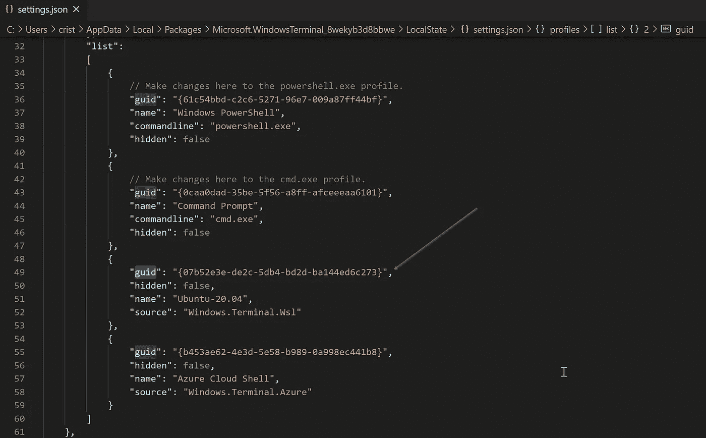
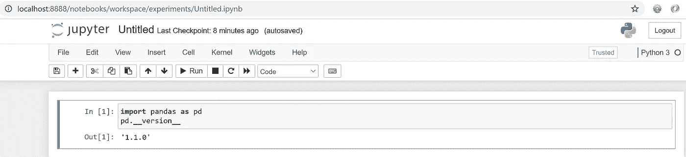

# 在 Windows 子系统 Linux (WSL2)中配置 Jupyter 笔记本

> 原文：<https://towardsdatascience.com/configuring-jupyter-notebook-in-windows-subsystem-linux-wsl2-c757893e9d69?source=collection_archive---------0----------------------->

## 我将解释如何配置 Windows 10/11 和 **Miniconda** 来与使用 **WSL2** 的**笔记本**一起工作

我们将了解如何:

1.  安装和配置 WSL2
2.  安装和配置 Windows 终端
3.  安装 Miniconda 和公共库
4.  发布 Jupyter 实验室/笔记本电脑
5.  将 GUI 和远程桌面安装到 WSL2，以便像 Spyder 或 Anaconda Navigator 一样使用所需的 GUI
6.  谢谢
7.  一些有用的资源

# **首先，安装 WSL2**

Windows 子系统 Linux (WSL2)将于 2020 年 5 月在 Windows 10 版本 2004 中推出。如果你没有，那么按照[https://docs.microsoft.com/en-us/windows/wsl/install-win10](https://docs.microsoft.com/en-us/windows/wsl/install-win10)中的说明安装一个 Ubuntu 发行版


我推荐从微软商店安装 **Windows 终端**，而不是使用默认的 Ubuntu 终端，因为这样可以让你在同一个窗口中拥有多个终端。

使用 Sublime Text 或 Notepad++从 Windows 资源管理器编辑 Linux 文件也更方便，使用的路径是: **\\wsl$\**

您可以在窗口中浏览和编辑 Ubuntu 文件:


并将默认配置文件更改为打开至 Ubuntu 终端打开设置文件，并根据 Ubuntu **指南**更改 **defaultProfile** 的值:



用 Visual Studio 代码打开的 settings.json

# **更新你的 Linux 系统**

在 Ubuntu 上打开一个新的终端，运行以下命令:

```
sudo apt-get update
sudo apt-get upgrade
sudo apt autoremove
```


我将使用 Ubuntu 20.04.1 LTS 来检查版本，如下所示:

```
lsb_release -a
uname -r
```


# 安装迷你康达

最好用 **Miniconda** 而不是 **Anaconda。后者包含了许多你通常不会用到的库，这意味着更慢的发行版更新和更多的磁盘空间。**

我的朋友 Ted Petrou 在[https://medium . com/dunder-data/anaconda-is-budget-set-up-a-lean-robust-data-science-environment-with-miniconda-and-conda-forge-b 48 E1 AC 11646](https://medium.com/dunder-data/anaconda-is-bloated-set-up-a-lean-robust-data-science-environment-with-miniconda-and-conda-forge-b48e1ac11646)中写了一篇详细的文章

从[https://repo.anaconda.com/miniconda/](https://repo.anaconda.com/miniconda/)下载最后一个文件，并按照说明操作:

```
cd ~
wget [https://repo.anaconda.com/miniconda/Miniconda3-latest-Linux-x86_64.sh](https://repo.anaconda.com/miniconda/Miniconda3-latest-Linux-x86_64.sh)
chmod +x Miniconda3-latest-Linux-x86_64.sh
sh Miniconda3-latest-Linux-x86_64.sh
rm Miniconda3-latest-Linux-x86_64.sh
```

如果你更喜欢 **Anaconda，**过程类似，你需要使用来自[https://repo.anaconda.com/archive/](https://repo.anaconda.com/archive/)的最后一个文件


按回车键并阅读完整的许可证


选择安装位置，回车默认


我推荐“是”来设置你的 Ubuntu 用户的活动环境

下次打开终端时，您会注意到在 user@server 提示符前有一个 **(base)** 文本，这意味着在 conda:

```
python
conda info
conda info --envs
```


接下来，我们将进行一些更新:

```
conda update conda
conda update --all
```


# **安装库&工具**

接下来，我们将进行一些基础安装，以获得熊猫、Jupyter 实验室/笔记本和机器学习:

```
conda install pandas scikit-learn matplotlib jupyter jupyterlab sqlalchemy seaborn pip git
```

然后安装 Jupyter 扩展并刷新任何更新:

```
conda install -c conda-forge jupyter_contrib_nbextensions
conda update conda
conda update --all
```

# 推出 Jupyter 实验室和笔记本电脑

我更喜欢 Jupyter Lab 而不是 Notebook，因为它可以让你更灵活地在同一个标签浏览器下打开多个窗口，允许你在命令提示符之外打开多个文件。为了避免消息错误，运行每个带有**无浏览器**参数的命令

# 朱庇特实验室

使用以下命令打开一个新的 Ubuntu 终端:

```
jupyter lab --no-browser
```


复制并粘贴完整的 URL，包括令牌


# Jupyter 笔记本

使用以下命令打开一个新的 Ubuntu 终端:

```
jupyter notebook --no-browser
```


复制并粘贴完整的 URL，包括令牌。



# 网络连接问题

如果您失去了网络连接，例如，在 ping Google 时显示超时错误，那么可能与 **resolv.conf** 文件中的 servername 的更改有关。

```
ping google.com
```

要修复它，您需要删除该文件以断开与运行文件夹的链接，并创建一个 **wsl.conf** 文件以避免再次生成 **resolv.conf** 文件，并执行以下语句:

```
sudo rm /etc/resolv.conf
sudo bash -c 'echo "nameserver 8.8.8.8" > /etc/resolv.conf'
sudo bash -c 'echo "[network]" > /etc/wsl.conf'
sudo bash -c 'echo "generateResolvConf = false" >> /etc/wsl.conf'
sudo chattr +i /etc/resolv.conf
```

# 解决本地主机的问题

有些版本无法使用 localhost 连接。Windows 将发布更新来解决此问题，直到您可以使用 IP 地址连接并更改 **localhost** 。要知道您的 IP 地址，您可以通过命令使用斜杠前面的数字:

```
ip addr | grep eth0 | grep inet
```

# 安装图形界面和远程桌面

WSL2 不包括 GUI，任何需要用户界面的程序都会给出类似的错误:

```
QStandardPaths: XDG_RUNTIME_DIR not set
qt.qpa.screen: QXcbConnection: Could not connect to display
Could not connect to any X display.
```

如果您想运行一些图形接口，如 anaconda-navigator 或 spyder IDE，下一步是可选的。使用以下命令安装:

```
conda install spyder anaconda-navigator
```

如果你通过终端启动程序会这样失败:


按照以下步骤在端口 **3390** 中安装 **XFCE4** lightdm 和远程桌面( **xrdp** )。我更改了端口以避免与本地窗口冲突。

运行下面的命令，选择 **lightdm** 作为 X 显示管理器:

```
sudo apt update && sudo apt -y upgrade
sudo apt-get purge xrdp
sudo apt-get install -y xfce4 xfce4-goodies
sudo apt-get install xrdp
sudo cp /etc/xrdp/xrdp.ini /etc/xrdp/xrdp.ini.bak
sudo sed -i 's/3389/3390/g' /etc/xrdp/xrdp.ini
sudo sed -i 's/max_bpp=32/#max_bpp=32\nmax_bpp=128/g' /etc/xrdp/xrdp.ini
sudo sed -i 's/xserverbpp=24/#xserverbpp=24\nxserverbpp=128/g' /etc/xrdp/xrdp.ini
echo xfce4-session > ~/.xsession
sudo systemctl enable dbus
sudo /etc/init.d/dbus start
sudo /etc/init.d/xrdp start
sudo /etc/init.d/xrdp status
```


选择 lightdm

使用您的 <ip address="">:3388 远程桌面连接</ip>


打开终端运行 spyder IDE

# 谢谢

最后，我要感谢泰德·彼得鲁和 T2·斯科特·波斯顿，他们是善良而知识渊博的人，在我开始学习 Python 熊猫的时候给了我指导和帮助，还有我的兄弟 T4·迈克尔·萨维德拉，是他们启发了我写这篇文章。

[快乐万岁！](https://medium.com/@cristiansaavedra)

# **有用的资源**

[](https://medium.com/dunder-data/anaconda-is-bloated-set-up-a-lean-robust-data-science-environment-with-miniconda-and-conda-forge-b48e1ac11646) [## Anaconda 过于臃肿——用 Miniconda 和 Conda-Forge 建立一个精简、健壮的数据科学环境

### 在本教程中，我将描述在您的……上建立一个瘦的和完整的 Python 数据科学环境的过程

medium.com](https://medium.com/dunder-data/anaconda-is-bloated-set-up-a-lean-robust-data-science-environment-with-miniconda-and-conda-forge-b48e1ac11646) [](https://pbpython.com/wsl-python.html) [## 使用 WSL 在 Windows 上构建 Python 开发环境

### 2016 年，微软推出了面向 Linux 的 Windows 子系统(WSL)，为 Windows 带来了强大的 Unix 功能。在…

pbpython.com](https://pbpython.com/wsl-python.html) [](https://code.visualstudio.com/docs/remote/wsl) [## 用 Visual Studio 代码在 Linux 的 Windows 子系统中开发

### Visual Studio Code Remote - WSL 扩展允许您将 Windows Subsystem for Linux (WSL)用作您的全职…

code.visualstudio.com](https://code.visualstudio.com/docs/remote/wsl) [](https://code.visualstudio.com/docs/remote/wsl-tutorial) [## 使用 Visual Studio 代码在 Linux 的 Windows 子系统中工作

### 本教程将带您了解如何启用 Windows Subsystem for Linux (WSL ),以及如何使用…

code.visualstudio.com](https://code.visualstudio.com/docs/remote/wsl-tutorial) [](https://code.visualstudio.com/docs/python/jupyter-support) [## 在 Visual Studio 代码中使用 Jupyter 笔记本

### Jupyter(以前的 IPython Notebook)是一个开源项目，可以让您轻松地将 Markdown 文本和可执行文件结合起来…

code.visualstudio.com](https://code.visualstudio.com/docs/python/jupyter-support) [](https://docs.microsoft.com/en-us/windows/wsl/) [## Linux 的 Windows 子系统概述

### Linux 的 Windows 子系统允许开发人员运行 GNU/Linux 环境——包括大多数命令行工具…

docs.microsoft.com](https://docs.microsoft.com/en-us/windows/wsl/) [](https://devblogs.microsoft.com/commandline/author/crloewenmicrosoft-com/) [## Craig Loewen，Windows 命令行的作者

### 该网站使用 cookies 进行分析、个性化内容和广告。通过继续浏览本网站，您同意…

devblogs.microsoft.com](https://devblogs.microsoft.com/commandline/author/crloewenmicrosoft-com/)