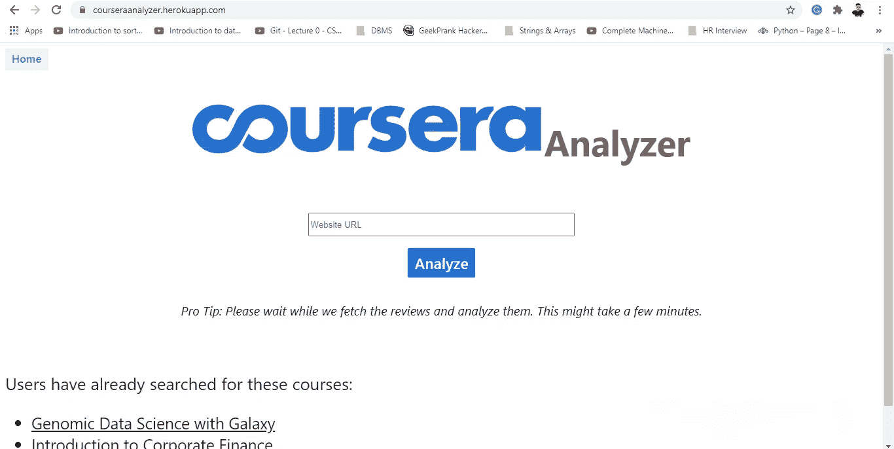

# 困惑于如何在 Coursera 上挑选最好的在线课程？

> 原文：<https://towardsdatascience.com/confused-about-how-to-pick-the-best-online-course-on-coursera-d56f55aa36ae?source=collection_archive---------57----------------------->

## Psst，建一个航向分析器。

帕特里克·托马索在 [Unsplash](https://unsplash.com?utm_source=medium&utm_medium=referral) 上的照片

# 问题是

如今网上课程并不缺乏。在过去几年中，MOOC 平台的受欢迎程度飙升，促使许多其他此类平台涌现出来。

其中最受欢迎的 Coursera 长期以来一直是许多学习者的宠儿。

然而，并不是很多用户对目前的所有课程都满意。

有时难度太高，或者动手实验已经过时，或者教师隐藏在技术术语后面，或者视频缺乏上下文清晰度等等。

面对如此多的课程，学习者只选择最好的课程来节省时间和金钱是很重要的。

一门课程的真正勇气是由负面评价的数量来检验的，因为只有真正失望的用户才会费心去写一个糟糕的评价并给出一个低评级；这就是为什么即使很高的负面评价率也能告诉我们很多关于课程质量的信息。在这个时间就是金钱的时代，重要的是我们不要在不那么好的课程上投入时间。

但是怎么做呢？每门课程都有成千上万的评论，如果不是几百的话，而且大多数显示在首页的评论都是顶级评论，嗯…总是好的。

此外，人们不能只看收视率，因为它们几乎不可靠。甚至我还见过高达 3/4 星的收视率还伴随着差评。

> 需要是发明之母。

我需要一个工具来判断选择哪门课程，而不用列出我所有潜在课程的所有评论和意见。

而 [*CourseraAnalyzer*](https://courseraanalyzer.herokuapp.com/) 就是这样诞生的。

在这篇文章中，我将带您快速浏览一下我是如何开发这个为我提供了极好用途的本地 web 应用程序的。如果您想更深入地研究这背后的代码，请随意查看这个项目的[库](https://github.com/sthitaprajna-mishra/coursera-analyzer)。

# 解决方案

构建一个应用程序，查找用户指定的课程，对评论进行情感分析，然后以可视化的形式显示结果。

听起来很简单，对吧？

不完全是。

这包含了网络抓取+自然语言处理+机器学习+网络开发。难？是的。不可能？号码

我的第一步是摘录课程的评论。

我用的是 BeautifulSoup(想用硒也可以)刮痧。将 URL 作为输入后，我修改了 URL 以访问课程的评论页面，然后从所有页面中抓取所有评论。

*(* ***注意*** *:如果您不能完全理解这一点，请不要担心，因为代码片段只是整个文件的一小部分。我的目的只是给你一个小小的机会，让你知道它是如何工作的。)*

然后，我使用一个文本分类器(我已经事先训练和腌制过)将评论分为正面和负面评论。

统计完评论后，我将数字传递给 Chart.js，它在网页上显示漂亮的交互式图表。

但是有一个讨厌的小问题。

花了太多时间。

搜集成千上万的评论并对它们使用文本分类器是非常耗时的。但我想让它走得更快。

所以我创建了一个. json 文件来存储搜索到的课程列表及其结果。如果用户输入的课程已经存在于。json 文件，我只是加载结果，而不是每次有请求时都重复相同的过程。

最后，我创建了一个小 Flask 应用程序，定义了不同的 API 端点和函数，以便将所有这些程序转换成一个单元。我用 Heroku 把它放到了网上。

这是网站[https://courseraanalyzer.herokuapp.com/](https://courseraanalyzer.herokuapp.com/)主页的截图。

我显然不是最擅长设计的人，但是，只要它能用，对吗？

在左下方，显示了已经分析过的课程列表。如果您正在寻找的课程不存在，请在搜索框中输入课程的 URL，然后单击“分析”。

它将给出所有评论的简要报告，并显示一些可视化效果来帮助您得出结论。

就是这样！

这个应用程序在许多方面仍然落后，但是对于第一个版本来说，这已经很好了。如果您对此有任何疑问，请随时联系我。谢谢大家！

**Github 库:**

[https://github.com/sthitaprajna-mishra/coursera-analyzer](https://github.com/sthitaprajna-mishra/coursera-analyzer)