# 用于目标检测的混淆矩阵

> 原文：<https://towardsdatascience.com/confusion-matrix-and-object-detection-f0cbcb634157?source=collection_archive---------5----------------------->

## 一种评估实例分割模型性能的度量

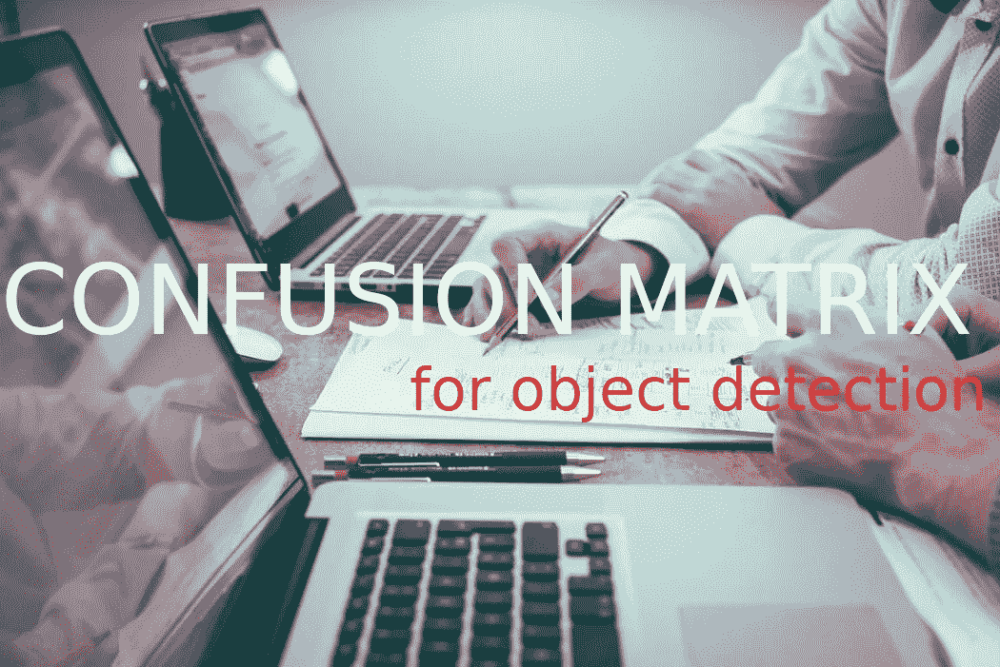

[斯科特·格雷厄姆](https://unsplash.com/@sctgrhm?utm_source=unsplash&utm_medium=referral&utm_content=creditCopyText)在 [Unsplash](https://unsplash.com/s/photos/math?utm_source=unsplash&utm_medium=referral&utm_content=creditCopyText) 上拍照

在训练机器学习分类器之后，下一步是使用相关度量来评估其性能。混淆矩阵是评估指标之一。

混淆矩阵是显示给定一些真值/实例的分类器性能的表格(监督学习类型)。

但是对于对象检测和实例分割任务，混淆矩阵的计算不太直观。首先，有必要理解另一个支持度量:并集上的交集(IoU)。交集/并集(IoU)在对象检测和实例分割任务的计算指标中起着关键作用。

# **交集超过并集(借据)**

**IoU** ，也称为 **Jaccard index** ，是一种评估地面真实掩码( *gt* )和预测掩码( *pd* )之间重叠的度量。在对象检测中，我们可以使用 IoU 来确定给定的检测是否有效。

IoU 的计算方法为 *gt* 和 *pd* 之间的重叠/相交面积除以两者之间的并集面积，即:

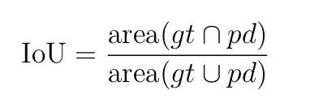

IoU 的定义如下:

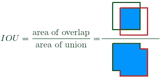

图 1(来源:作者)

**注:** IoU 度量范围从 0 到 1，0 表示没有重叠，1 表示 *gt* 和 *pd* 之间完全重叠。

混淆矩阵由 4 个分量组成，即**真阳性(TP)、真阴性(TN)、假阳性(FP)和假阴性(FN)** 。为了定义所有组件，我们需要根据 IoU 定义一些**阈值(比如α)。**

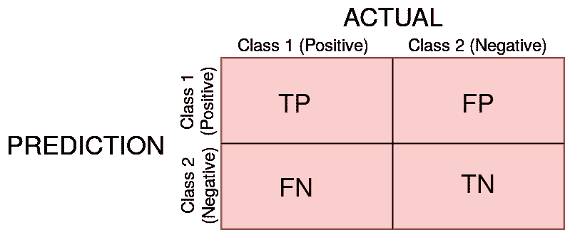

图 2:2 类的混淆矩阵:1 和 2(来源:作者)

*   真阳性(TP) —这是当事实确实为阳性时分类器预测为阳性的实例，即 IoU ≥ α的检测。
*   假阳性(FP) —这是一种误阳性检测，即 IoU < α的检测。
*   假阴性(FN)-这是分类器未检测到的实际实例。
*   真阴性(TN) —如果实际实例也是阴性的，此度量意味着阴性检测。在对象检测中，该度量不适用，因为存在许多不应该在图像中检测到的可能预测。因此，TN 包括未被检测到的所有可能的错误检测。

这些概念可以通过一些图形示例直观地理解(让我们考虑 IOU 阈值，α = 0.5)

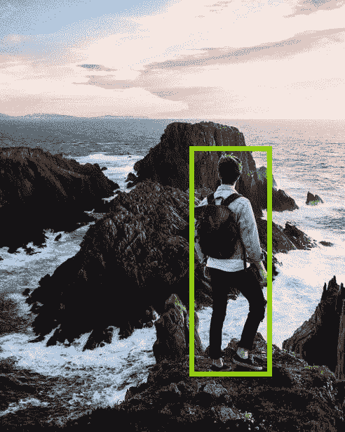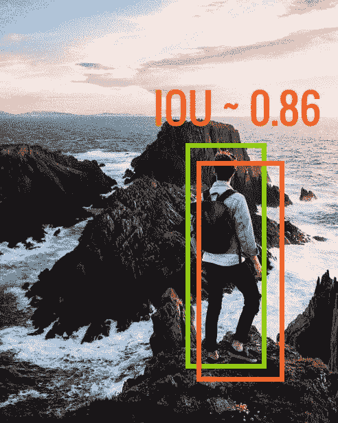

图 3:左:假阴性(FN)，右:真阳性(TP)，演职员表:[丹尼尔·延森](https://unsplash.com/@danielsjensen?utm_source=unsplash&utm_medium=referral&utm_content=creditCopyText)在 [Unsplash](https://unsplash.com/s/photos/person?utm_source=unsplash&utm_medium=referral&utm_content=creditCopyText) 上的照片

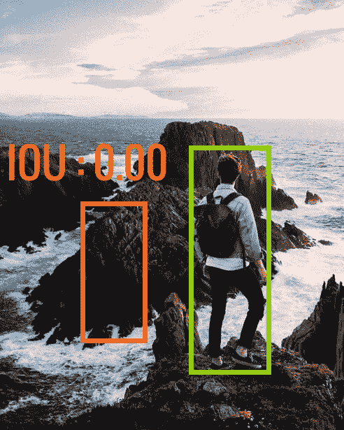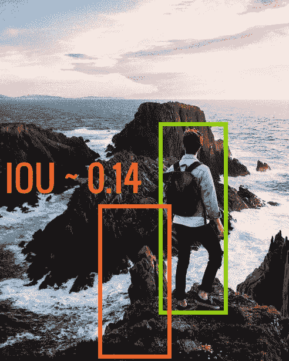

图 4:都是假阳性(FP)，演职员表:照片由[丹尼尔·延森](https://unsplash.com/@danielsjensen?utm_source=unsplash&utm_medium=referral&utm_content=creditCopyText)在 [Unsplash](https://unsplash.com/s/photos/person?utm_source=unsplash&utm_medium=referral&utm_content=creditCopyText) 上拍摄

**备注:**根据 IoU 阈值的定义，如果我们选择阈值大于 0.86，则图 3 右侧变为 FP，如果我们选择 IoU 阈值小于 0.14，则图 4 右侧变为 TP

可以从混淆矩阵中得出的其他指标包括:

*   **精度**是分类器仅识别相关对象的能力。它是正确的正面预测的比例，由下式给出

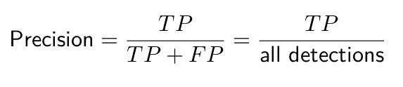

*   **Recall** 是一个衡量分类器找到所有相关案例(即所有基本事实)的能力的指标。它是在所有基本事实中检测到的真阳性的比例，定义为

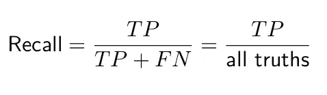

₁分数是精确度和召回率的调和平均值。

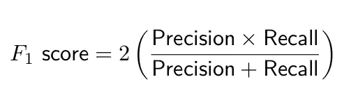

# **示例**

考虑下面的图像，带有基本事实(深蓝色)和分类器检测(红色)。通过观察，你能说出 TP，FP 和 FN 的数目吗？

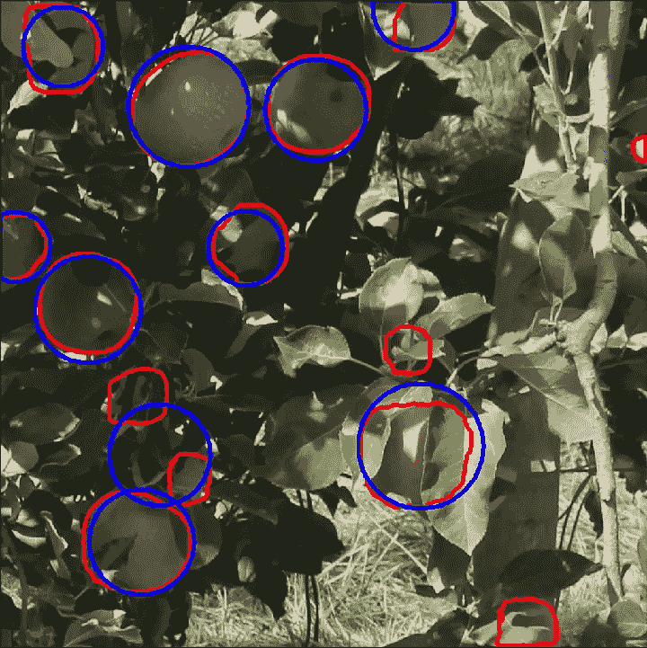

图 5(来源:富士-SfM 数据集(引用于参考资料部分))

# Python 实现

在 Python 中，可以使用 [Shapely](https://pypi.org/project/Shapely/) 库计算混淆矩阵。以下函数 **(** `**evaluation(ground,pred,iou_value)**` →用于 **TP、FP、FN、Precision、Recall、F₁的 6 值元组)**可用于确定上述图像的混淆矩阵(图 5)

**参数:**

*   **地面** —是*n*×*m*×*2*数组，其中 *n* 是给定图像的地面真实实例的数量， *m* 是在掩膜圆周上采样的 *(x，y)* 对的数量。
*   **pred** 为 *p × q × 2* 数组，其中 *p* 为检测数， *q* 为预测掩码采样的 *(x，y)* 点数
*   **iou_value** 为 iou 阈值

对于图 5 和 IoU 阈值，α = 0.5，`**evaluation(ground,pred,iou_value)**`→

```
TP: 9   FP: 5   FN: 0   GT: 10
Precall: 0.643   Recall: 1.0   F1 score: 0.783
```

感谢您的阅读:-)

在 https://medium.com/@kiprono_65591/membership[加入媒体](https://medium.com/@kiprono_65591/membership)以获取媒体上的所有报道。

你也可以在我发文章的时候通过这个链接把文章发到你的邮箱里:[https://medium.com/subscribe/@kiprono_65591](https://medium.com/subscribe/@kiprono_65591)

# **参考文献**

若尔迪·吉恩-莫拉、里卡多·桑斯-科尔蒂埃拉、琼·罗塞尔-波罗、何塞普-拉蒙·莫罗斯、哈维尔·鲁伊斯-伊达尔戈、维罗尼卡·维拉普拉纳和爱德华·格雷戈里奥。(2020).富士 SfM 数据集。芝诺多。[http://doi.org/10.528/zenodo.3712808](http://doi.org/10.5281/zenodo.3712808)

Everingham，m ,, es lami，s . A ,, Van Gool，l ,, Williams，c . k ,, Winn，j ,,和 Zisserman，A,《Pascal 视觉对象类挑战:回顾》。国际计算机视觉杂志，111(1):98–136，2015。

对 ROC 分析的介绍。模式识别快报，27(8):861–874，2006。