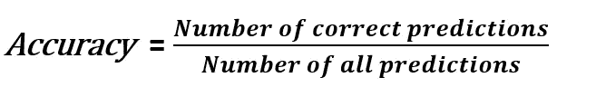
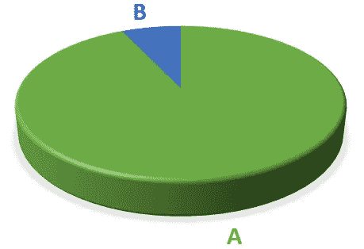
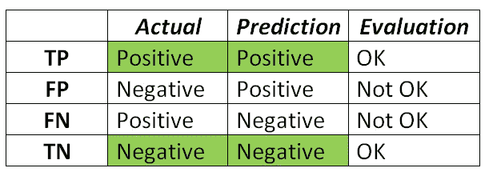
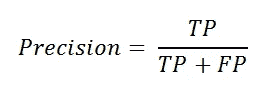
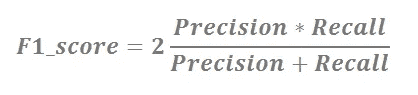
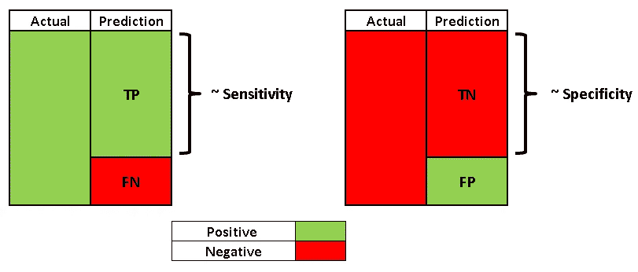

# 混淆矩阵—已解释

> 原文：<https://towardsdatascience.com/confusion-matrix-explained-34e4be19b3ec?source=collection_archive---------46----------------------->

## 如何利用混淆矩阵

由 [Unsplash](https://unsplash.com/s/photos/precise?utm_source=unsplash&utm_medium=referral&utm_content=creditCopyText) 上的 [hue12 摄影](https://unsplash.com/@hue12_photography?utm_source=unsplash&utm_medium=referral&utm_content=creditCopyText)拍摄

分类是一种监督学习方法，其中目标变量是离散的(或分类的)。评估机器学习模型和构建它一样重要。我们正在创建模型来处理新的、以前看不到的数据。因此，需要进行全面和多方面的评估，以创建稳健的模型。当涉及到分类模型时，评估过程变得有些棘手。

# **困惑矩阵背后的动机**

准确度显示正确预测与所有预测的比率:

在某些情况下，准确性不足以评估模型。假设我们为二元分类任务建立一个模型，目标变量的分布是不平衡的(93%的数据点在 A 类中，7%在 B 类中)。

我们有一个只预测 A 类的模型，甚至很难称之为“模型”，因为它预测 A 类，没有任何计算。然而，由于 93%的样本属于 A 类，因此我们的模型的准确率为 93%。

如果正确检测 B 类样本至关重要，而我们又不能对任何 B 类样本进行错误分类(例如癌症预测)，该怎么办？这就是混淆矩阵发挥作用的地方。

# **混乱矩阵**

混淆矩阵不是评估模型的指标，但它提供了对预测的洞察。学习混淆矩阵对于理解其他分类指标很重要，例如**精度**和**召回**。

混淆矩阵通过显示每个类别的正确和错误(即真或假)预测，比分类准确性更深入。在二进制分类任务的情况下，混淆矩阵是 2×2 矩阵。如果有三个不同的类，那就是一个 3x3 的矩阵，以此类推。

假设 A 类是正类，B 类是负类。混淆矩阵的关键术语如下:

*   **真阳性(TP)** :预测阳性类别为阳性(ok)
*   **假阳性(FP)** :将阴性类别预测为阳性(不正常)
*   **假阴性(FN)** :将阳性类别预测为阴性(不正常)
*   **真阴性(TN)** :预测阴性类别为阴性(ok)

期望的结果是预测类和实际类是相同的。这可能看起来令人困惑，但你可以想出一个窍门来记住。我的如下:

> 第二个词是模型预测的。
> 
> 第一个字表示预测是否正确。

> 注意:假阳性也称为 I 型错误。假阴性也称为 II 型错误。

混淆矩阵用于计算精度和召回率。

# **精度和召回**

精确度和召回率度量将分类准确性向前推进了一步，并允许我们获得对模型评估的更具体的理解。选择哪一个取决于任务和我们的目标。

**Precision** 衡量当预测为正时我们的模型有多好。它是正确的正面预测与所有正面**预测**的比率:

**回忆**测量我们的模型在正确预测正类方面有多好。它是正确的正面预测与所有正面**类别**的比率。

精度的焦点是**正预测**所以它表示有多少正预测是真的。召回的焦点是**实际肯定类别**，因此它指示模型能够正确预测多少肯定类别。

**精准还是召回？**

我们不能试图同时最大化精确度和召回率，因为它们之间有一个平衡。提高精度会降低召回率，反之亦然。我们可以根据任务来最大化精确度或回忆。

考虑一个垃圾邮件检测模型，我们试图最大化精确度，因为我们希望当一封邮件被检测为垃圾邮件时是正确的。我们不想将一封普通的电子邮件标记为垃圾邮件(即误报)。如果模型不能捕捉一些垃圾邮件，这是可以接受的。但是，如果一封非常重要的电子邮件被标记为垃圾邮件，后果可能会很严重。

另一方面，对于取消细胞检测任务，我们需要最大化召回，因为我们想要检测每个阳性类别(恶性细胞)。如果模型预测恶性细胞为良性(即假阴性)，这将是一个严重的错误。

还有一个将精确度和召回率结合成一个数字的方法，那就是 F1 分数。

# F1 分数

F1 分数是精确度和召回率的加权平均值。

对于类别分布不均匀的问题，F1 分数是比准确度更有用的度量，因为它考虑了假阳性和假阴性。

f1 得分的最佳值是 1，最差值是 0。

# 敏感性和特异性

敏感度，也称为真阳性率(TPR)，与回忆相同。因此，它测量被正确预测为阳性的阳性类别的比例。

特异性类似于敏感性，但侧重于负类。它测量被正确预测为负面的负面类别的比例。

# 结论

免费的午餐定理在这里也不适用。对于所有的任务，没有一个最优的、容易找到的选择。我们需要清楚地定义需求，并根据这些需求选择度量标准。

感谢您的阅读。如果您有任何反馈，请告诉我。