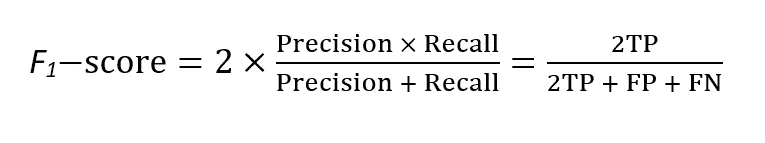
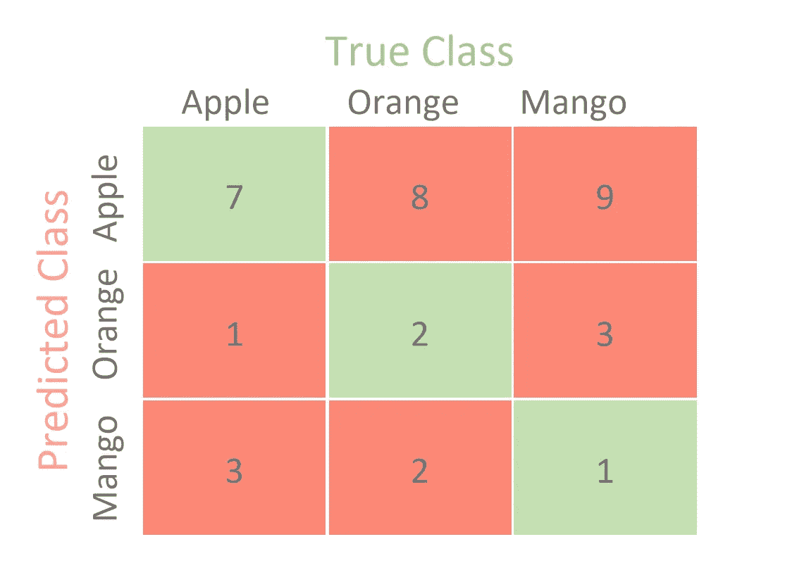
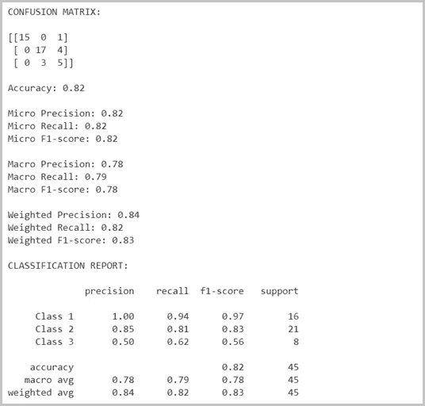

# 多类机器学习模型的混淆矩阵

> 原文：<https://towardsdatascience.com/confusion-matrix-for-your-multi-class-machine-learning-model-ff9aa3bf7826?source=collection_archive---------0----------------------->

## 关于如何计算多类分类问题的精确度、召回率和 F1 分数的初学者指南。

[斯科特·格雷厄姆](https://unsplash.com/@homajob?utm_source=unsplash&utm_medium=referral&utm_content=creditCopyText)在 [Unsplash](https://unsplash.com/@homajob?utm_source=unsplash&utm_medium=referral&utm_content=creditCopyText) 上拍照

混淆矩阵是一种可视化预测模型性能的表格方式。混淆矩阵中的每个条目表示模型做出的正确或错误分类的预测数量。

任何已经熟悉混淆矩阵的人都知道，大多数情况下，它是针对二元分类问题来解释的。这个解释不在其中。今天我们将看到混淆矩阵如何在多类机器学习模型上工作。然而，我们将从使用二元分类的一点背景开始，只是为了正确地看待事情。

# 二元分类的混淆矩阵

二元分类的混淆矩阵

如你所见，二进制分类问题只有两个类要分类，最好是一个正类和一个负类。现在让我们看看混淆矩阵的度量。

**真阳性(TP):** 指分类器正确预测阳性类为正的预测次数。

**真否定(TN):** 指分类器正确预测否定类为否定的预测次数。

**假阳性(FP):** 指分类器错误地将阴性类预测为阳性的预测次数。

**假阴性(FN):** 指分类器错误地将阳性类预测为阴性的预测次数。

用混淆矩阵作为你的机器学习模型的评估标准总是比较好的。它为您的模型提供了一个非常简单而有效的性能测量方法。以下是困惑矩阵中一些你可以使用的最常见的绩效衡量标准。

**准确性:**它给出模型的总体准确性，即被分类器正确分类的样本占总样本的比例。计算精度，用下面的公式:***(TP+TN)/(TP+TN+FP+FN)***。

**错误分类率:**它告诉你有多少预测是错误的。它也被称为分类错误。可以用***(FP+FN)/(TP+TN+FP+FN)***或者***(1-精度)*** 来计算。

**Precision:** 它告诉你一个正类的预测中有多少部分实际上是正的。要计算精度，用下面的公式: ***TP/(TP+FP)*** 。

**回忆:**它告诉您所有阳性样本中有多少被分类器正确预测为阳性。它也被称为真阳性率(TPR)、灵敏度、检测概率。计算召回率，使用以下公式:***【TP/(TP+FN)***。

**特异性:**它告诉您所有阴性样本中有多少部分被分类器正确预测为阴性。它也被称为真实负利率(TNR)。要计算特异性，用下面的公式:***【TN/(TN+FP)***。

F1-score: 它将精确度和召回率结合成一个单一的度量。从数学上来说，这是精确度和召回率的调和平均值。它可以计算如下:

现在，在一个完美的世界里，我们想要一个精度为 1，召回率为 1 的模型。这意味着 F1 分数为 1，即 100%的准确率，这通常不是机器学习模型的情况。因此，我们应该尝试的是获得更高的查准率和更高的查全率。好了，现在我们知道了混淆矩阵的性能度量，让我们看看如何在多类机器学习模型中使用它。

# 多类分类的混淆矩阵

为了简单起见，让我们考虑我们的多类分类问题是一个 3 类分类问题。比方说，我们有一个数据集，它有三个类标签，即 ***苹果*** 、 ***桔子*** 和 ***芒果*** 。下面是这些类的一个可能的混淆矩阵。

多类分类的混淆矩阵

与二进制分类不同，这里没有正类或负类。起初，找到 TP、TN、FP 和 FN 可能有点困难，因为没有正类或负类，但实际上很容易。这里我们要做的是找到每个类的 TP，TN，FP 和 FN。例如，如果我们取苹果类，那么让我们看看混淆矩阵中的度量值是多少。

*   ***TP = 7***
*   ***TN =(2+3+2+1)= 8***
*   ***FP = (8+9) = 17***
*   ***FN = (1+3) = 4***

由于我们从混淆矩阵中获得了苹果类的所有必要度量，现在我们可以计算苹果类的性能度量。例如，苹果公司有

*   ***精度= 7/(7+17) = 0.29***
*   ***回忆= 7/(7+4) = 0.64***
*   ***F1-得分= 0.40***

类似地，我们可以计算其他类的度量。下表显示了每个类的每个测量值。

每门课的精确度、召回率和 F1 分数

现在我们可以通过这些措施做更多的事情。我们可以将每个类的 F1 分数结合起来，为整个模型提供一个单一的度量。有几种方法可以做到这一点，现在让我们来看看。

## 微型 F1

这被称为微观平均 F1 分数。它是通过考虑模型的总 TP、总 FP 和总 FN 来计算的。它不单独考虑每个类，而是全局计算指标。所以在我们的例子中，

*   ***总 TP = (7+2+1) = 10***
*   ***总 FP =(8+9)+(1+3)+(3+2)= 26***
*   ***总 FN =(1+3)+(8+2)+(9+3)= 26***

因此，

*   ***精度= 10/(10+26) = 0.28***
*   ***回忆= 10/(10+26) = 0.28***

现在，我们可以使用 F1 分数的常规公式，并使用上述精度和召回率获得微观 F1 分数。

> **微 F1 = 0.28**

正如您所看到的，当我们计算全局指标时，所有度量都变得相等。如果你计算准确度，你会发现，

> ***精度=召回=微 F1 =准确度***

## 宏 F1

这是 F1 的宏观平均分数。它分别计算每个类别的指标，然后取这些指标的未加权平均值。从图 ***【精确度、召回率和 F1-每类得分】*** 中我们看到，

*   ***类苹果 F1-得分= 0.40***
*   ***级橙 F1-得分= 0.22***
*   ***类芒果 F1-得分= 0.11***

因此，

> **宏 F1 = (0.40+0.22+0.11)/3 = 0.24**

## 加权 F1

最后一个是加权平均 F1 分。与宏 F1 不同，它采用测量值的加权平均值。每个类别的权重是该类别的样本总数。因为我们有 11 个苹果，12 个橘子和 13 个芒果，

> **加权 F1 =((0.40 * 11)+(0.22 * 12)+(0.11 * 13))/(11+12+13)= 0.24**

最后，让我们看一个使用 Python 的 Scikit-learn 计算这些度量的脚本。

下面是脚本的输出。

信用:[谷歌 Colab](https://colab.research.google.com/)

*注意:*[*Scikit-Learn*](https://scikit-learn.org/stable/modules/generated/sklearn.metrics.confusion_matrix.html)*使用行作为“真实类”，使用列作为“预测类”这与我们对苹果、桔子和芒果例子的考虑相反，但在逻辑上是相似的。无论如何，您都可以考虑真实类和预测类。但是如果你使用 Scikit-Learn，那么你必须遵守他们的规则。*

希望你找到了你想要的。感谢阅读。