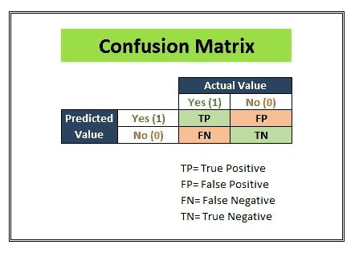
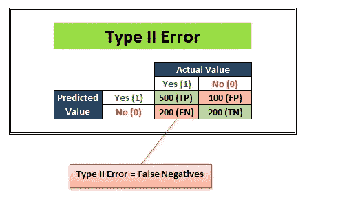
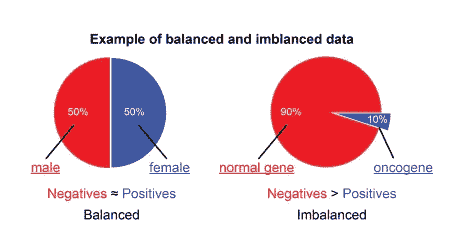

# 混乱矩阵-不再那么混乱了！

> 原文：<https://towardsdatascience.com/confusion-matrix-not-so-confusing-anymore-3b7a934d623c?source=collection_archive---------57----------------------->

## 机器学习基础

## 了解混淆矩阵的所有方面

在本帖中，我们将重点了解混淆矩阵和使用混淆矩阵计算的指标——I 型误差、II 型误差和准确度。这在分类算法的情况下使用，以确定/评估模型的性能。

在构建任何统计或 ML 模型时，我们从开发数据集开始。将数据集分为两部分:训练和测试。将测试数据集放在一边，并使用训练数据集训练模型。一旦模型准备好进行预测，我们就尝试对测试数据集进行预测。一旦我们将结果分割成类似于上图所示的矩阵，我们就可以看到我们的模型能够正确预测多少，以及它的预测有多少是错误的。

我们用测试数据集中的数字填充上图所示的 4 个单元格(例如，有 1000 个观察值)。

1.  **TP(真阳性):**在测试数据集中，该列的实际标签为“是”，而我们的逻辑回归模型也预测为“是”。(500 次观察)
2.  **TN(真阴性):**在测试数据集中，该列的实际标签为“否”，而我们的逻辑回归模型也预测为“否”。(200 项观察)
3.  **FP(假阳性):**在测试数据集中，该列的实际标签为“否”，但我们的逻辑回归模型预测为“是”。(100 项观察)
4.  **FN(假阴性):**在测试数据集中，该列的实际标签为“是”，但我们的逻辑回归模型预测为“否”。(200 项观察)

> 这 4 个单元格构成了“混淆矩阵”,因为在该矩阵中，通过清楚地描绘出我们模型的预测能力，可以减轻对我们模型的良好性的所有混淆。
> 
> 混淆矩阵是一个表格，通常用于**描述分类模型**(或“分类器”)对一组真实值已知的测试数据的性能。

# 可以理解的与混淆矩阵相关的其他指标

# 第一类错误

> 第 1 类错误也称为假阳性，当分类模型错误地预测了最初错误观察的真实结果时就会发生。

例如:假设我们的逻辑模型正在处理垃圾邮件，而不是垃圾邮件。如果我们的模型将一封重要的电子邮件标记为垃圾邮件，那么这就是我们的模型的第一类错误的例子。在这个特定的问题陈述中，我们对尽可能减少 I 类错误非常敏感，因为重要的电子邮件进入垃圾邮件会产生严重的后果。

# 3.第二类错误

> 第二类错误也称为假阴性，发生在分类模型错误地预测了原本真实的观察结果的错误结果时。

例如:假设我们的逻辑模型正在处理一个用例，它必须预测一个人是否患有癌症。如果我们的模型将一个患有癌症的人标记为健康人，并将其错误分类，那么这是我们模型的第二类错误的一个例子。在这个特定的问题陈述中，我们对尽可能减少 II 型错误非常敏感，因为在这种情况下，如果疾病在受影响的人中继续未被诊断，假阴性可能导致死亡。

# 4.准确(性)

现在，上面讨论的三个指标是通用指标，与您拥有的训练和测试数据的种类以及您为问题陈述部署的分类算法的种类无关。

我们现在将讨论非常适合特定类型数据的指标。

让我们从这里开始讨论准确性，这是一个最适合用于平衡数据集的指标。参考下图，该图来源于本媒体[文章](https://medium.com/analytics-vidhya/what-is-balance-and-imbalance-dataset-89e8d7f46bc5)。

来源:[链接](https://medium.com/analytics-vidhya/what-is-balance-and-imbalance-dataset-89e8d7f46bc5)

如您所见，一个平衡的数据集是这样的:1 和 0、是和否、正和负由训练数据均等地表示。另一方面，如果两个类别标签的比率是倾斜的，那么我们的模型将偏向一个类别。

假设我们有一个平衡的数据集，让我们学习什么是准确性。

> 准确度是测量结果与真实值的接近程度。它告诉我们，我们的分类模型能够多准确地预测问题陈述中给出的类别标签。

例如:假设我们的分类模型试图预测客户流失情况。在上图中，在总共 700 个实际流失客户(TP+FN)中，模型能够正确地对 500 个流失客户进行分类(TP)。同样，在总共 300 个保留客户(FP+TN)中，该模型能够正确地对 200 个保留客户(TN)进行分类。

> *准确率=(TP+TN)/客户总数*

在上面的场景中，我们看到模型在 1000 个客户的测试数据集上的准确率是 70%。

现在，我们知道了准确性是一个应该只用于平衡数据集的指标。为什么会这样呢？让我们看一个例子来理解这一点。

在这个例子中，这个模型是在不平衡的数据集上训练的，甚至测试数据集也是不平衡的。准确性指标的得分为 72%，这可能给我们的印象是我们的模型在分类方面做得很好。但是，仔细看，这个模型在预测负面的阶级标签方面做得很糟糕。它只预测了 100 个总阴性标签观察中的 20 个正确结果。这就是为什么如果数据集不平衡，就不应该使用精度指标。

这篇文章的重点是全面理解困惑矩阵。

如果您想了解更多有关可用于评估分类模型的其他指标，如召回率、精确度、AUC-ROC 等。，您可以参考我下面关于这个主题的详尽文章。

 [## 分类 ML 模型的 10 大模型评估指标

### 解释非常规，这将作为评估分类机器学习模型的详尽列表。

towardsdatascience.com](/top-10-model-evaluation-metrics-for-classification-ml-models-a0a0f1d51b9) 

请继续关注这个空间，了解更多关于数据科学、机器学习和统计的信息！

*快乐学习:)*