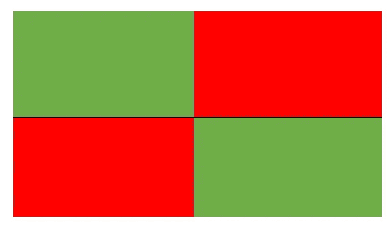
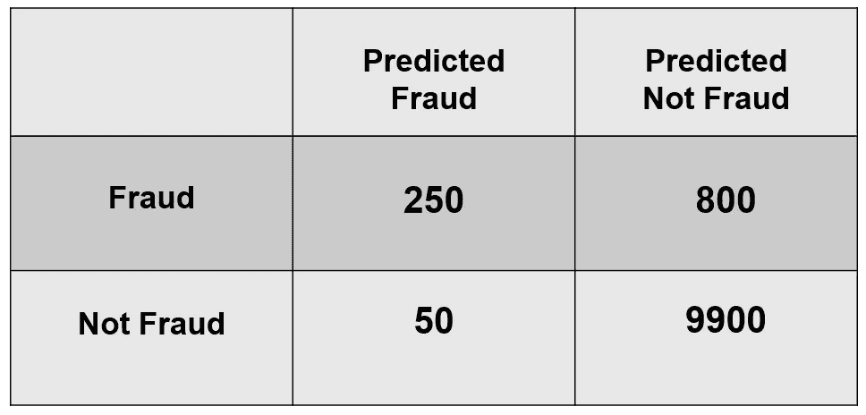

# 混淆矩阵“未混淆”

> 原文：<https://towardsdatascience.com/confusion-matrix-un-confused-1ba98dee0d7f?source=collection_archive---------22----------------------->

## 打破混乱矩阵

工业中应用机器学习的目标是驱动商业价值。因此，能够评估您的机器学习算法的性能对于深入了解您的模型极其重要。

在这篇文章中，我的目标是以一种对那些积极使用它们的人和那些只是好奇的人来说容易理解的方式深入到困惑矩阵中。也就是说，本文的结构如下:

1.  什么是混淆矩阵
2.  如何解读混淆矩阵
3.  案例研究(准确度、召回率、精确度和 F 值)

**混淆矩阵是什么？**

混淆矩阵是用于机器学习中分类任务的有用工具，其主要目的是可视化机器学习模型的性能。

在负类为 0、正类为 1 的二元分类设置中，混淆矩阵由一个 2x2 网格表构成，其中行是数据的实际输出，列是模型的预测值。

图 1:混淆矩阵的可视化表示(没有注释)

*我将解释为什么某些网格是一种颜色，而其他的却是另一种颜色，现在，这只是混淆矩阵是什么以及它对于二进制分类任务看起来会是什么样子的视觉表示。*

**注意:许多来源以不同的方式构建混淆矩阵，例如，行可能是预测值，列可能是实际值。如果您正在使用框架(即 Sci-kit learn ),阅读混淆矩阵的文档以了解混淆矩阵的格式是很重要的。**

> 无论您在*图 1* 中停留在哪个网格块上，其相邻的网格都会以另一种颜色高亮显示。这考虑到了混乱矩阵的不同变化，如果您简单地旋转网格，您可能会看到这些变化。

图 2:混淆矩阵的变化

很好！既然你已经熟悉了二元分类任务的混淆矩阵的格式，现在知道如何填写混淆矩阵是很重要的。

让我们用经典的猫和狗的例子。如果我们的分类任务已经被训练来区分猫和狗，混淆矩阵将为预测模型创建结果摘要以供进一步分析。

图 3:取自 [Badgerati](https://computersciencesource.wordpress.com/2010/01/07/year-2-machine-learning-confusion-matrix/) 的混淆矩阵结果

在*图 3 中的 50 只猫中，*模型预测实际上有 15 只猫，35 只狗。关于狗，模型预测 40 只为猫，10 只为狗。所有正确的预测都被分配在表格的对角线上(从上到下)——是的，你猜对了！这就是为什么这些盒子被涂上了与图 1 中*一样的颜色。*

你现在已经学会了如何绘制你自己的困惑矩阵。作为数据科学家，我们想知道为什么模型做得不好，以便我们更好地了解我们的数据，我们可以使用这些数据为下一个建模阶段设计新功能。

**如何解读困惑矩阵**

我将首先描述一些术语，如果你能猜出它们的走向，那么你就成功了一半:

**真阳性:**模型预测阳性，标签实际阳性。

**真阴性:**模型预测为阴性，标签实际为阴性。

**假阳性:**模型预测为阳性，而标签实际上是阴性——我喜欢把这想象成 ***被错误地归类为阳性*** 。

**假阴性:**模型预测为阴性，而标签实际上是阳性——我喜欢把这想象成 ***被错误地归类为阴性*** 。

图 4:带注释的混淆矩阵

如果你能够将这些标签归类到这些列中，那就太棒了，你现在已经全面掌握了混淆矩阵。让我们进一步挖掘！

我们的混淆矩阵在我们的网格上有两个红色补丁，这向我们推断出我们的模型正在犯的错误的类型。第一类错误是当我们的模型错误地将实际上是阴性的东西分类为阳性(假阳性)——因此它可以被认为是一个错误的警报——例如预测某人患有哮喘，而他们实际上没有。第二类错误是当我们错误地将实际上是阳性的东西归类为阴性(假阴性)——在我们的哮喘病例中，这将是说某人没有哮喘，而实际上他们有。

我知道这些文字会让你很难理解，所以如果你觉得它还没有被很好地接受，回到图 4 来获得一个视觉概念。

您现在已经了解了混淆矩阵是一种用于评估预测模型在分类任务中的性能的工具。此外，您还知道与我们的预测模型的每个输出相关的术语。

**案例研究:**

我们的任务是建立一个分类器，预测不同交易的欺诈或非欺诈。这些数据是由英国一家安全措施非常严格的大银行交给我们的——出于隐私考虑，所有客户的个人信息都被加密了——因此欺诈交易不会经常发生。事实上，他们给我们的数据有 10，000 个负面案例(非欺诈)和 1000 个(欺诈)案例。*图 5* 显示了我们分类器的结果。

图 5:用例模型的结果

***准确度***

准确度是指测量值与标准值或已知值的接近程度。在我们建立了一个分类器并使用它进行预测之后，我们很快地调出我们的混淆矩阵来确定我们的模型有多准确，我们惊讶地发现我们的模型有 92%的准确性。当我们开始梦想我们将从中获得的奖金时，有什么东西拉了拉我们的*数据科学骨骼*并告诉我们更多地查看我们的模型预测，因为我们不知道为什么我们的模型如此准确，因为当我们的目标变量(在这种情况下，欺诈或非欺诈)不平衡时，准确性可能是一个误导性的指标。我们再次回顾了混淆矩阵(参见*图 5)* ，以获得更多的指标来告诉我们为什么我们的模型如此准确。

图 6:精确度公式

**精度和召回**

精度(也称为阳性预测值)告诉我们，从我们的分类器标记为阳性的标签，实际上是阳性的量。

图 7:精度公式

另一方面，回忆(也称为敏感度或真实阳性率)告诉我们我们的模型正确识别的实际阳性的数量。

图 8:召回公式

> **注:精确度和召回率基于对阳性标签(相关性)的理解和测量。**

我们计算刚刚学过的精确和回忆公式:

*精度* = 83%

是啊！！这太棒了，这意味着 83%被我们标记为阳性的标签实际上是阳性的。这是惊人的…是吗？让我们检查一下召回情况。

*回忆* = 24%

这告诉我们，我们的分类器正确识别的阳性标签的数量。换句话说，欺诈在 76%的时间里都没有被发现！不需要博士学位就知道这一点也不好。

对于这个问题，我们希望优化召回，这意味着我们希望通过在更多情况下预测阳性来减少假阴性的数量(当实际标签是阳性时错误地分类为阴性)。然而，有些时候你可能想优化精确度，例如在垃圾邮件分类器中，我们不希望重要的邮件被归类为垃圾邮件并发送到我们的垃圾邮件中。就我们的欺诈分类器而言，我们希望优化召回率，为了做到这一点，我们必须降低分类器的阈值，以将其分类为肯定类别。请注意，由于我们的分类器现在预测阳性更多，它降低了(我们曾经很高的)83%的精度，因为现在我们的模型预测假阳性发出更多假警报的可能性更高，但在这种情况下我们不介意。

**精确和回忆爱恨关系**

精确度和召回率很少被孤立地讨论，正如我们在上面发现的，它们之间经常有一种反比关系——增加一个度量就会减少另一个。当我们需要在精确度和召回率之间取得平衡时，一个更好的度量标准是 F1 值(也称为 F 值)。F1-score 是一种考虑精确度和召回率的精确度衡量标准(下面的公式将向您展示它是如何做到这一点的)。

图 9:F1 分数的公式

总之，从我们的混淆矩阵中可以得出更多的度量。对混淆矩阵中的术语有一个牢固的理解，这是继续理解可以推导出的其他度量的坚实基础。如果你想继续， [Sarang Narkhede](https://medium.com/u/7fe94d3af4e6?source=post_page-----1ba98dee0d7f--------------------------------) 在他的个人资料上有一个关于困惑矩阵的惊人帖子([点击这里导航到那里](/understanding-confusion-matrix-a9ad42dcfd62))。 [Koo Ping Shung](https://medium.com/u/71f58a3cb5e8?source=post_page-----1ba98dee0d7f--------------------------------) 更详细地介绍了何时使用准确度、精确度、回忆和 F1 分数，并且以友好的方式撰写，因此任何人都可以理解([单击此处获取链接](/accuracy-precision-recall-or-f1-331fb37c5cb9))。我们还有著名的维基百科，你可以点击[这里](https://en.wikipedia.org/wiki/Confusion_matrix)进入。我在下面附上了一个帖子，它扩展了混淆矩阵，我们用它来绘制 ROC 曲线，如果你不知道那是什么，或者你知道但不太理解它，那么点击下面的链接可以很好地掌握它。

 [## 理解 AUC-ROC 曲线

### 深入了解 AUC-ROC…

towardsdatascience.com](/comprehension-of-the-auc-roc-curve-e876191280f9)