# 国会如何投票？

> 原文：<https://towardsdatascience.com/congressional-votes-data-visualization-and-analysis-b714b2918825?source=collection_archive---------26----------------------->

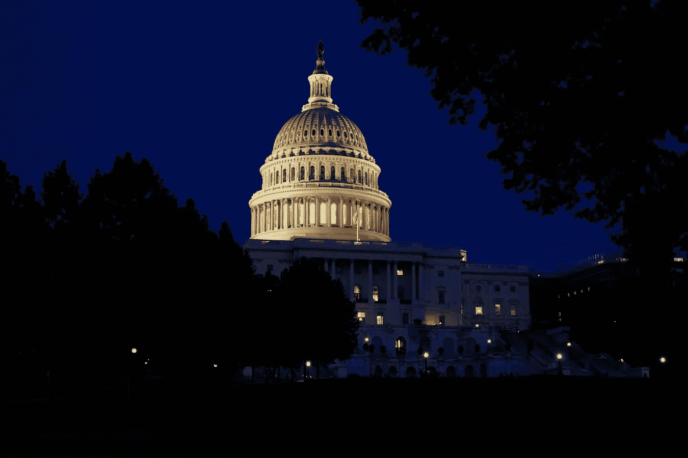

Unsplash 的 Darren Halstead

## 使用机器学习来预测国会投票

使用国会投票记录，我们将尝试预测国会议员对某些国会问题的投票，并可视化投票。

# 数据

数据集可以在 Kaggle [这里](http://ttps//www.kaggle.com/devvret/congressional-voting-records/tasks?taskId=435)找到。

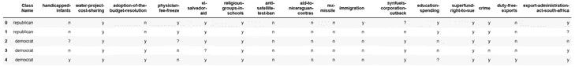

这些栏目是:"班级名称"、"残疾人-婴儿"、"水项目-费用分摊"、"通过预算-决议"、"医生-费用-冻结"、"萨尔瓦多-援助"、"宗教团体-学校"、"反卫星-禁试"、"援助-尼加拉瓜-contras "、" MX-导弹"、"移民"、"合成燃料-公司-削减"、"教育-支出"、"超级基金-起诉权"、"犯罪"、"免税-出口"、"出口-管理-法案-南非"。

第一栏“班级名称”不是“共和党”就是“民主党”。其他几栏代表国会的决定，或者是‘n’代表‘不’，或者是‘y’代表‘是’，或者是“？”缺少值。

# 清理数据

为了将数据传递到机器学习模型中，所有数据都必须是数字。用 Python 的。map()函数，我们可以将数据转换成数值形式。

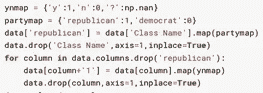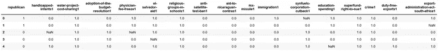

当前数据为 435 行 17 列。理想情况下，我们会删除所有 NaN 值以保持最高的数据质量，而不必猜测丢失的值是什么。但是，在删除所有具有 NaN 值的行之后，得到的数据是 232 行乘 17 列，大约减少了一半。

相反，我们将选择估算，或计算每个 NaN 值的最可能值。一些估算方法包括众数、中位数和平均数，但在这种情况下，没有一种方法有效，因为我们无法根据最流行或最平均的观点来确定政治家在某个问题上的立场。

# KNN 估算

相反，我们将使用 K-最近邻(KNN)来计算缺失值。

KNN 是如何工作的？

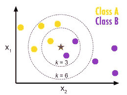

首先，所有的数据点都绘制在多维空间中，这取决于数据有多少个特征(列)。我们的数据有 16 个维度，因为每个国会成员投票表决了 16 个不同的国会决定。

其次，KNN 计算了 *k* 个最近的数据点(使用欧几里德距离)。需要指定 *k* 的值。然后，数据点是 *k* 邻居值的平均值(或模式，如果指定的话)。

应用 KNN 估算后，数据如下所示:

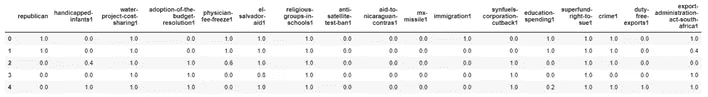

在 65–35 训练测试分割上训练逻辑回归模型后，该模型的平均绝对误差(MAE)值约为 0.006。

在尝试了所有的*k*-值之后，MAE 似乎没有什么变化:

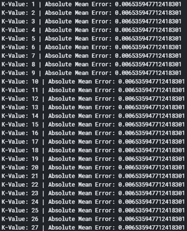

因此，我们现在将坚持使用值为 5 的 *k-* 。

# 系数分析

逻辑回归模型的系数可用于分析:

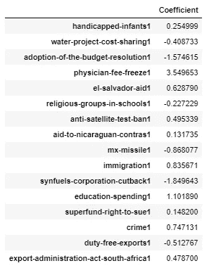

具有正系数的要素增加了选民是共和党人的概率，具有负系数的要素减去了选民是共和党人的概率(增加了选民是民主党人的概率)。这些系数如下所示:

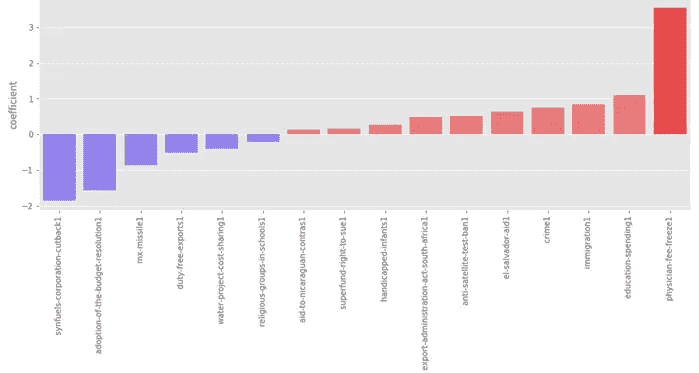

下面是一个 SHAP (SHapley 附加解释)图，它分析了特征对于确定分类的重要性。这形象化了党派间最大的分歧——也就是说，立法机关冻结了医生医疗保险费用，削减了合成燃料公司。底部的功能，如向萨尔瓦多提供援助或反卫星测试禁令，是有争议的，这意味着许多共和党人和民主党人都投了赞成票和反对票，无法根据支持度合理预测政党。

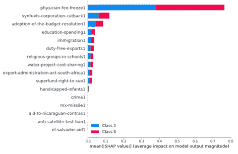

排列重要性是评估特征重要性的另一种方法。通过打乱每一列并观察随之而来的准确性下降，排列重要性可以看出哪些列对准确性最重要。绿色的列是那些更多地被党派界线划分的列，红色的列是更多的混合。

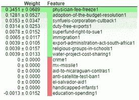

SHAP 价值观也可以用其他方式来形象化。

这张 SHAP 力量图显示了哪些因素增加或减少了选民是共和党人的可能性。不支持冻结医生费用或批准采用预算决议等因素增加了可能性，而缺乏对水项目成本的支持则降低了可能性。这个力图是根据一个单独的案例绘制的。

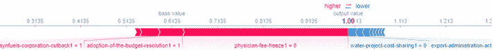

# 结论

*   医生医疗费用冻结几乎完全是由政党路线投票决定的。
*   不支持免费医疗保险是共和党的一个非常重要的特征。
*   对尼加拉瓜反政府组织和萨尔瓦多的援助是最有争议的，这意味着共和党人和民主党人都投票赞成和反对一项提议。