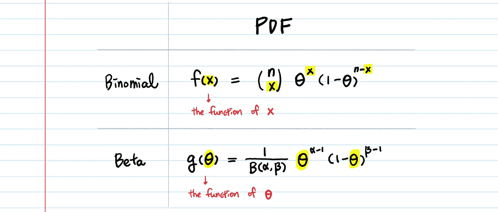
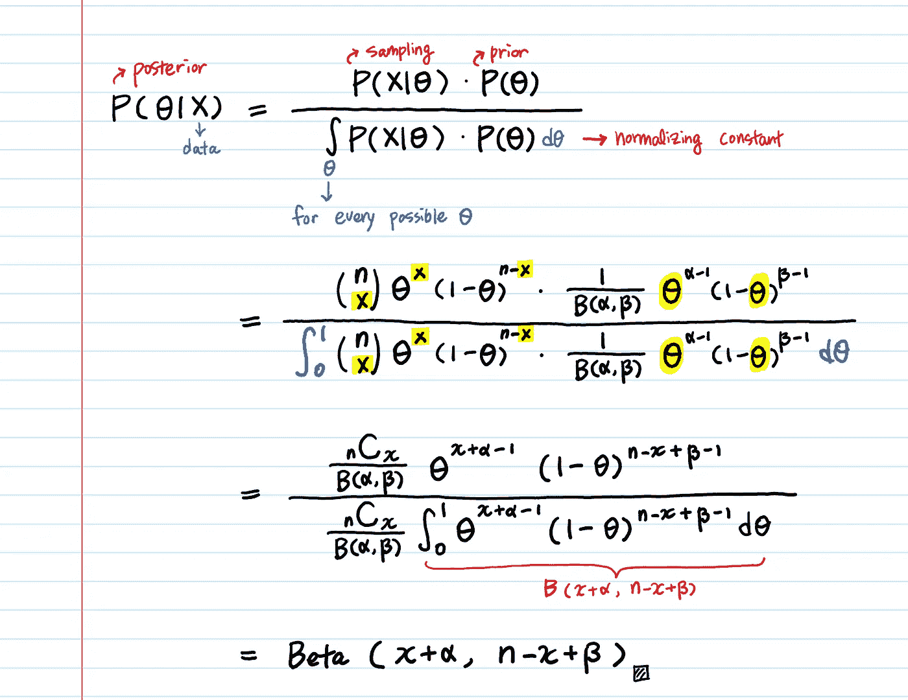
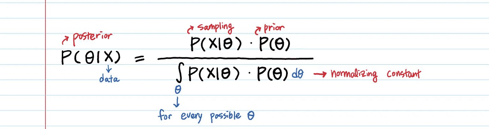

# 共轭先验解释

> 原文：<https://towardsdatascience.com/conjugate-prior-explained-75957dc80bfb?source=collection_archive---------2----------------------->

## 有例子和证据

# 1.什么是先验？

先验概率是在我们看到数据之前某个事件的概率**。
[在贝叶斯推断](https://medium.com/@aerinykim/bayesian-inference-intuition-and-example-148fd8fb95d6)中，先验是我们在新数据可用之前，基于我们现在所知的对概率的猜测。**

# **2.什么是共轭先验？**

**不知道贝叶斯推理就无法理解共轭先验。**

**[](https://medium.com/@aerinykim/bayesian-inference-intuition-and-example-148fd8fb95d6) [## 贝叶斯推理——直觉和实现

### 贝叶斯推理的艺术在于你如何实现它...](https://medium.com/@aerinykim/bayesian-inference-intuition-and-example-148fd8fb95d6) 

对于博客的其余部分，我假设你知道先验、抽样和后验的概念。** 

## ****本质上共轭先验****

****对于一些似然函数，如果选择某个先验，**后验最终与先验处于相同的分布。这样的先验称为共轭先验。**

**通过例子来理解总是最好的。下面是**计算二项式概率的后验概率的代码。θ** 是成功的概率，我们的目标是选择最大化后验概率的 **θ。****

**问你一个问题:在上面的代码块中有什么让你担心的吗？**

**有两件事使得后验计算很昂贵。**

****首先，我们计算每个θ** 的后验概率。**

**为什么我们要计算成千上万个 thetas 的后验概率？因为你正在使后部正常化(第 21 行)。即使选择不归一化后验概率，最终目标也是找到后验概率的**最大值**([最大后验概率](https://en.wikipedia.org/wiki/Maximum_a_posteriori_estimation))。为了以简单的方式找到最大值，我们需要考虑每个候选者——对于每个 **θ的可能性 **P(X|θ)** 。****

****第二，如果没有后验分布的闭合形式公式，我们就得通过数值优化来求最大值，比如** [**梯度下降**](/difference-between-batch-gradient-descent-and-stochastic-gradient-descent-1187f1291aa1) **或者牛顿法。****

# **3.共轭先验有什么帮助？**

**当你知道你的先验是共轭先验时，你可以跳过`posterior = likelihood * prior`的计算。此外，如果你的先验分布有一个封闭形式的表达式，你已经知道最大后验概率是多少。**

**在上面的例子中，贝塔分布在二项式可能性之前是共轭的。这是什么意思？这意味着**在建模阶段，我们已经知道后验也将是贝塔分布。**因此，在进行更多的实验后，**你可以简单地将接受和拒绝的次数分别加到现有的参数α，β**上来计算后验概率，而不是将似然性乘以先验分布**。**这个很方便！(下一节证明。)**

**作为一名数据/ML 科学家，你的模型永远不会完整。随着更多数据的到来，你必须更新你的模型(这就是为什么我们使用贝叶斯推理)。如你所见，贝叶斯推理中的计算可能很繁重，有时甚至难以处理。然而，如果我们可以使用共轭先验的封闭形式公式，计算变得非常轻。**

# **4.证明——为什么贝塔分布是二项式可能性之前的共轭分布？**

**当我们使用贝塔分布作为先验时，二项似然的后验也将遵循贝塔分布。**

## **显示贝塔产生贝塔。**

**二项式和 Beta 的 pdf 是什么样子的？**

****

**让我们把它们代入著名的贝叶斯公式。**

****θ** 是成功的概率。**

****x** 是成功次数。**

****n** 是试验的总次数，因此 **n-x** 是失败的次数。**

****

**为什么最后一个积分变成 **B(x+α，n-x+β)** ？→[https://bit.ly/2t1i2KT](https://bit.ly/2t1i2KT)**

**先验分布 **P(θ)** 为**β(α，β)** ，从实验中得到 **x** 个成功和 **n-x** 个失败后，后验也变成参数为 **(x+α，n-x+β)的β分布。****

**这里的好处是，你不用做计算，就可以通过分析知道这个。**

# **5.共轭先验分布**

**贝塔分布是**伯努利分布、二项式分布、负二项式分布**和**几何分布**的共轭先验分布(看起来这些分布涉及成功&失败)。**

```
**<Beta posterior>**
Beta prior * **Bernoulli** likelihood → Beta posterior
Beta prior * **Binomial** likelihood → Beta posterior
Beta prior * **Negative Binomial** likelihood → Beta posterior
Beta prior * **Geometric** likelihood → Beta posterior **<Gamma posterior>**
Gamma prior * **Poisson** likelihood → Gamma posterior
Gamma prior * **Exponential** likelihood → Gamma posterior**<Normal posterior>** 
Normal prior * Normal likelihood (mean) → Normal posterior
```

**这就是为什么这三种分布(**β**、**γ**和**正态**)被大量用作先验分布的原因。**

**一种有趣的说法是，即使你做了所有这些实验，并将你的可能性乘以先验，你最初选择的先验分布**如此之好，以至于最终分布与先验分布**相同。**

**等式中的共轭先验 **P(θ)** :**

```
**P(θ) such that P(θ|D) = P(θ)**
```

> **共轭先验=方便先验**

**需要注意一些事情:**

1.  **当我们使用共轭先验时，顺序估计(每次观察后更新计数)给出的结果与批量估计相同。**
2.  **为了**找到最大后验**、**，你不必归一化**似然(抽样)和先验(分母中每个可能的 **θ** 的积分)的乘积。**

****

**不用归一化还是能找到最大值。然而，如果你想比较不同模型的后验概率，或者计算点估计，你需要归一化。**