# 将 BigQuery 连接到 Google Sheets

> 原文：<https://towardsdatascience.com/connect-bigquery-to-google-sheets-e3c4f1377659?source=collection_archive---------10----------------------->

## 在这篇[谷歌博客文章](https://cloud.google.com/blog/products/gcp/how-to-crunch-your-business-data-from-sheets-in-bigquery)之后。

由 [Linus Mimietz](https://unsplash.com/@linusmimietz?utm_source=unsplash&utm_medium=referral&utm_content=creditCopyText) 在 [Unsplash](https://unsplash.com/s/photos/flags?utm_source=unsplash&utm_medium=referral&utm_content=creditCopyText) 上拍摄的照片

# **你为什么会这样做？为什么不是 SQL 数据库？**

我的一个朋友是一家非营利机构的总裁，这家机构(谢天谢地)正经历着成长的烦恼。一群 20 岁出头的电气和机械工程师策划了一项为乌干达的学校安装太阳能电池板的计划，辛勤的工作和慷慨的捐赠推动了更大计划的成功。但是，可惜的是，他们的数据以 Google Sheets 的形式分散在不同的驱动帐户中，以当前的数据状态理解他们的影响或可视化他们的未来是不可能的。我很幸运地通过我的朋友加入了这个组织，他抱怨说他们的数据收集很糟糕，他们试图将所有的信息收集到一个数据库中。作为一名正在攻读公共政策硕士学位的学术数据科学家，我无法相信他们有如此宝贵的数据，如乌干达农村学校安装太阳能电池板前后的学生健康和教育的学校级数据，并请求伸出援手。

在一间公寓的会议室里，一边吃着甜甜圈和喝着咖啡，我亲眼目睹了可以想象的最不整洁的数据集。生产和太阳能电池板零件表在一个人的驱动中，学校调查和安装程序在另一个人的驱动中。他们甚至不知道所有的数据在哪里。

第一步是在一个地方收集所有的数据。我们同意在两周内会面，将所有数据放在一个地方，我来处理云集成。他们想要的非常简单:使用 SQL 语法查询多个工作表。我做了一个巧妙的演示，展示了一个 dash 网站的原型，该网站使用 SQL 数据库来生成报告，但是当我问“数据将如何更新？”时，这个演示就消失了他们回答说，“我们将复制并粘贴到谷歌的工作表中。”我立即意识到，我是房间里唯一一个具有 SQL 或云工程知识的人，但这不是一个优势，而是非营利组织的一个负债，因为它不能因为我的缺席或退出而失去对数据库的访问权。

# BigQuery 太神奇了

由于数据库将通过 Google Sheets 随机访问和更新，我决定推迟我最初为这个数据库项目准备的 Airflow + SQL + Flask 应用程序。由于预算限制和组织不愿意建立一个复杂的云流程，我需要在谷歌上建立一些便宜又简单的东西。BigQuery 和 Data Studio 立刻跃入我的眼帘。

在下一次会议之前，我想有一个 BigQuery 可以为他们的组织做什么的原型，并决定使用[联合国人类发展报告——次国家指数](https://globaldatalab.org/shdi/)来建立一个模拟数据库。

# 创建项目

在 Google 云平台中，创建一个新项目。我选择了“HDR-SubnatIndex”作为我的项目名称。

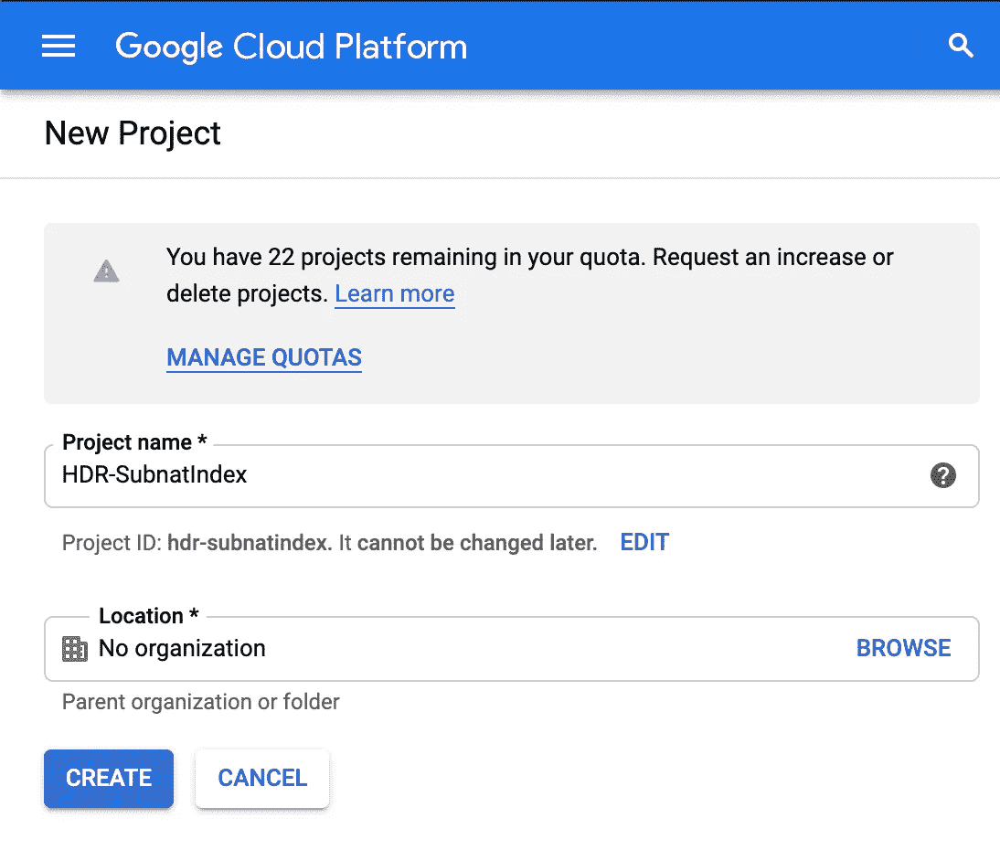

创建新项目。

## 启用 API

接下来，为您的新项目启用 Sheets API。请注意，我在顶部的项目是 HDR-SubnatIndex。

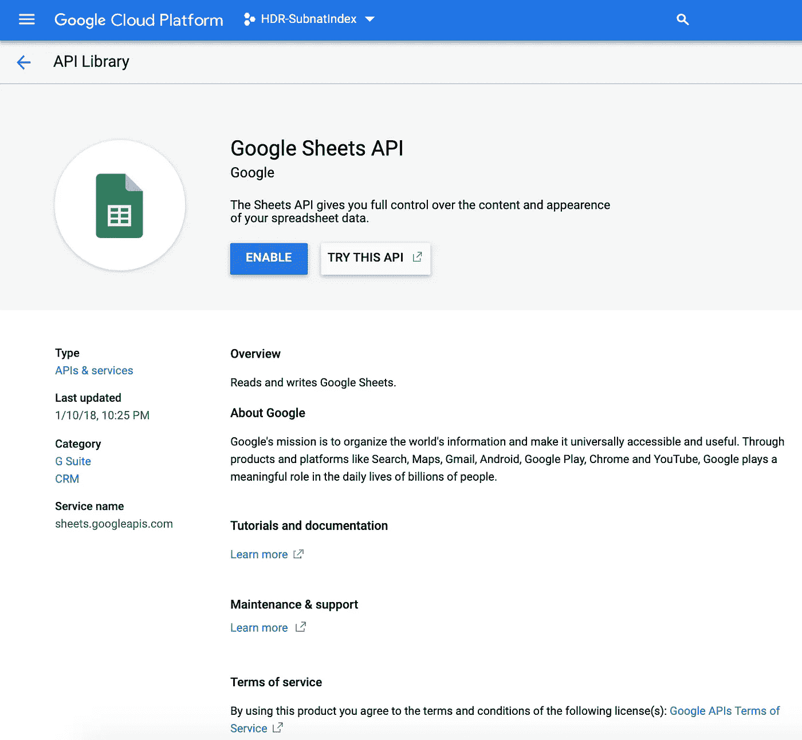

启用工作表 api。

## 创建数据集

导航到 BigQuery 控制台并选择创建数据集。

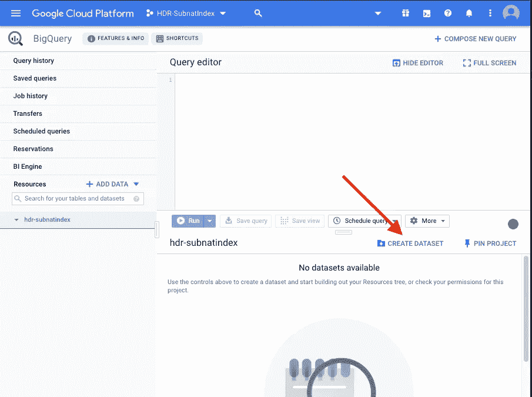

为数据集命名，并配置到期和加密。单击创建数据集。

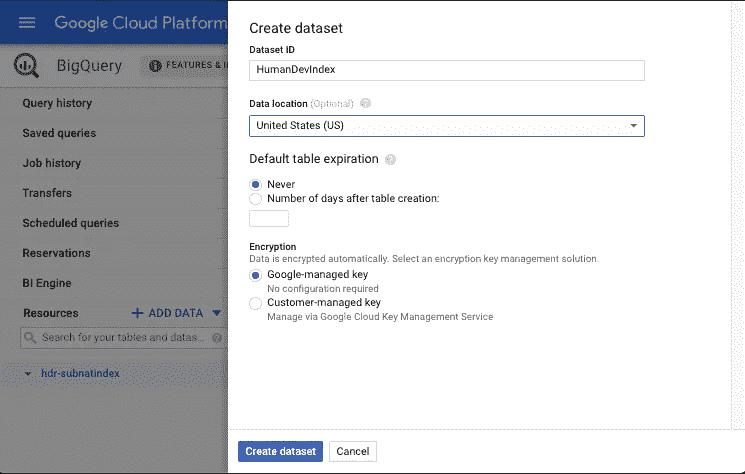

## 创建表格

找到您想要连接到 BigQuery 的工作表，并复制它的可共享链接。

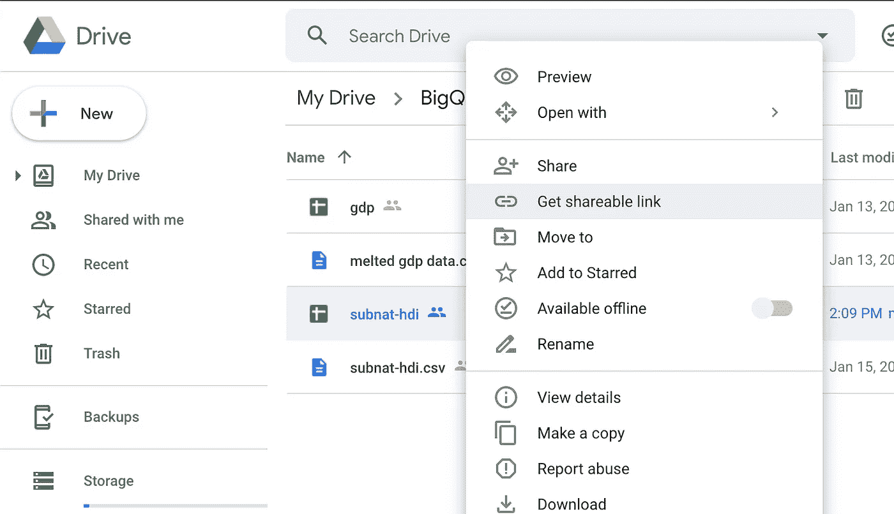

在左下角的项目下选择新的数据集，然后选择 CREATE TABLE。

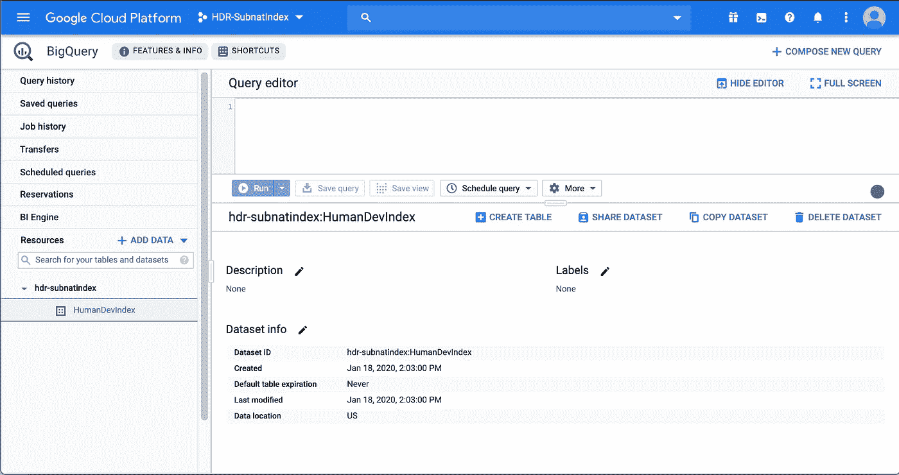

选择 Create table from: Drive，将整个工作表 URI 粘贴到 Select Drive URI 中，选择 CSV(我注意到选择 Google 工作表时出现了一些问题，它无法识别列名)，输入表名，在这种情况下，我们可以自动检测模式和参数。

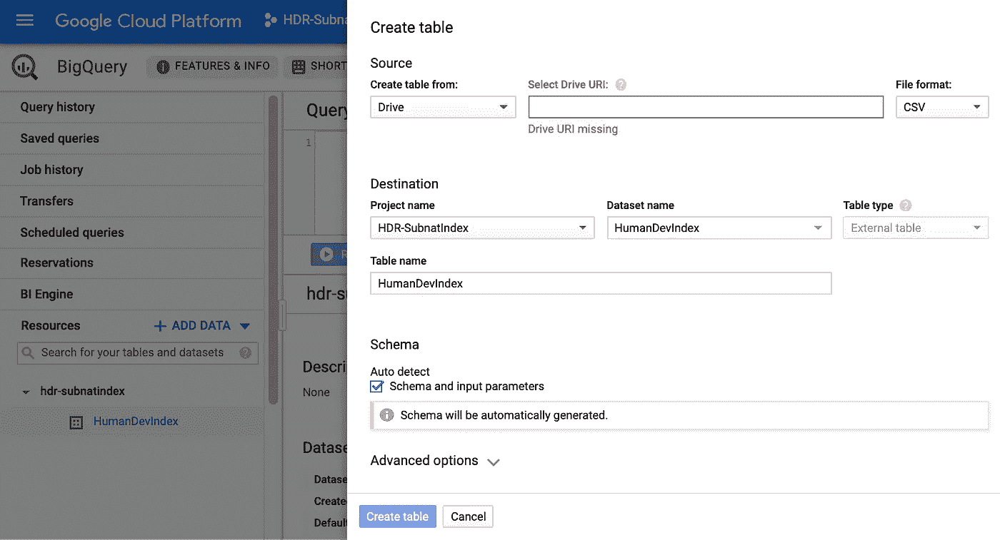

## 运行测试查询

BigQuery 的美妙之处在于它能够对任何东西执行 SQL 查询。若要确保正确允许与工作表的连接，请运行测试查询。这里我选择了数据集的前 10 行。

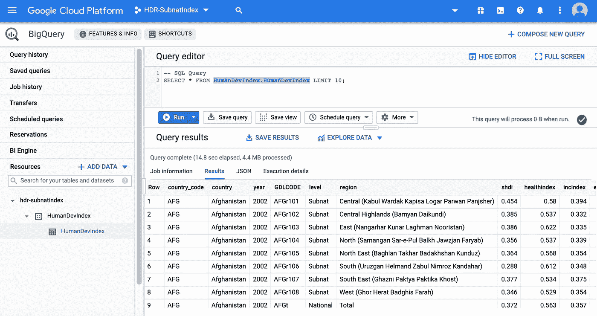

现在让我们运行一个稍微高级一点的查询，只提取乌干达的地区、年份、健康指数、收入指数和教育指数的国家以下级别的数据。

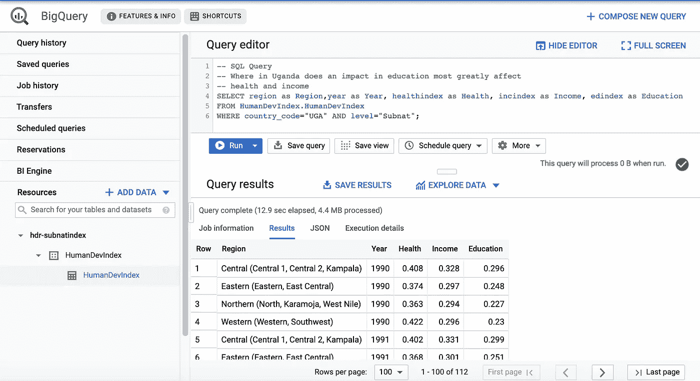

但是这些信息都可以很容易地从应用于 Google Sheets 的过滤器中收集到，对吗？这种方法的好处是，您现在有了一个可以随时保存和运行的查询，而不必复制数据集和重新创建筛选步骤。然而，BigQuery 真正突出的地方在于它在多个表之间执行连接的能力。

## SQL 连接

我按照上面相同的步骤，从我的 google drive 中的 google sheet 添加了第二个 BigQuery 表，其中包含来自世界银行的 [GDP 数据。如果没有 BigQuery 和 SQL JOINS 的帮助，使用 Google Sheets 组合这两个数据集并链接它们会困难得多。在这里，我查询了这两个表，以创建每个国家的年度国家人类发展指数和 GDP 的报告。](https://data.worldbank.org/indicator/NY.GDP.MKTP.CD)

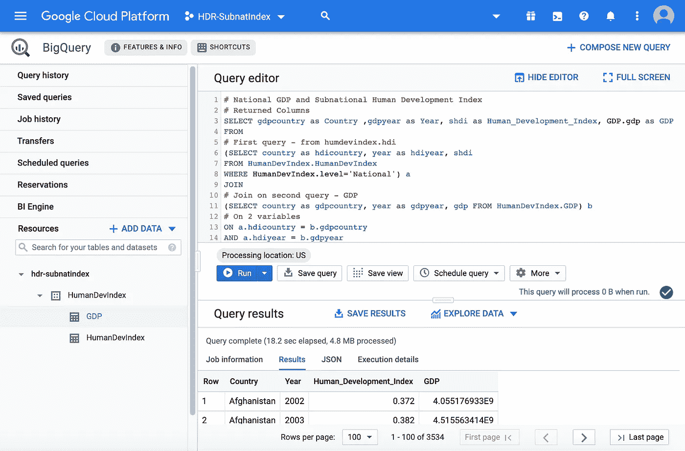

在分析多维贫困时，这是一个重要的比较，因为国内生产总值(GDP)并不能说明全部情况。《联合国人类发展报告》建立了人类发展指数，将健康、教育、预期寿命、平均受教育年限、预期受教育年限和人口等变量考虑在内，从而对特定国家的需求或所经历的贫困类型有了更加动态的了解。

# 结论

BigQuery 数据集本质上是表之上的抽象，它允许您对动态表中的多个数据源运行 SQL 查询。现在您有了一个查询，您可以在需要时保存并运行它，或者通过单击 Explore Data 导出到 Data Studio。此外，从 Data Studio 中，您可以创建一个报告，并在您的 BigQuery 数据集上使用相同的查询作为报告的数据源。

# 奖励:BI 引擎

现在您已经看到了 BigQuery 从 google sheets 收集数据和标准化报告的强大功能，让我们试着加快查询速度，好吗？Google BI Engine 本质上是为一个项目购买加速计算资源。

在 BigQuery 控制台的左侧，选择 BI 引擎。如果需要，启用它。选择创建预订。选择资源将位于的区域。我们的小查询将使用不到 1 GB 的存储空间。

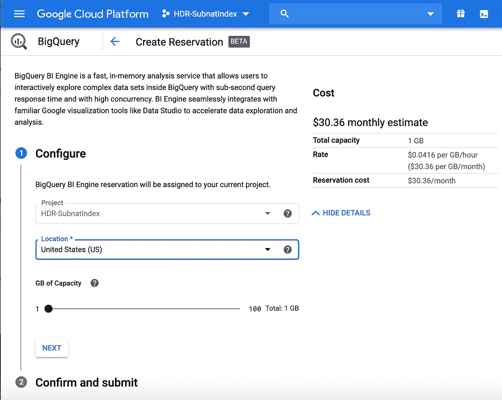

现在，您将看到您的新 BI 引擎列在 BI 引擎下。运行相同的查询后，我们只看到时间减少了 2.3 秒。但是 BI Engine 真正的亮点是在 Google Data Studio 中，当你玩图表来寻找可视化分析的最佳方式时，它的更新速度明显更快。

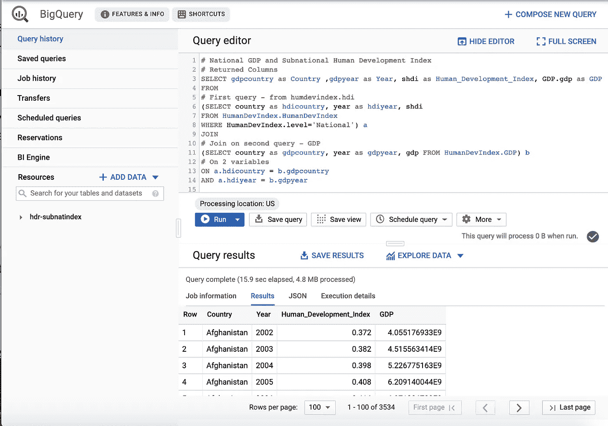

感谢您的阅读！