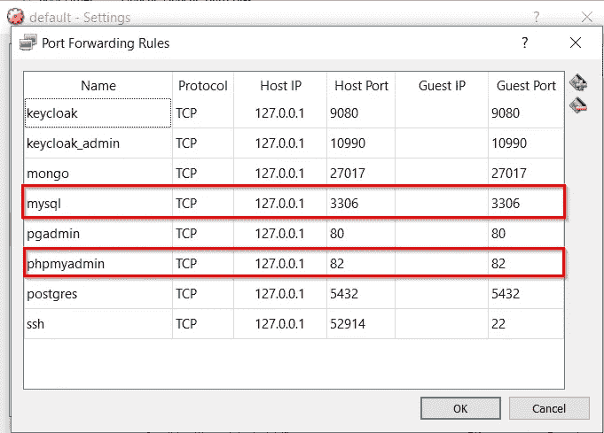
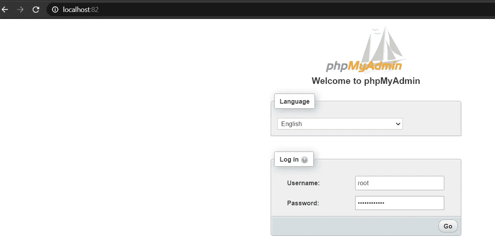
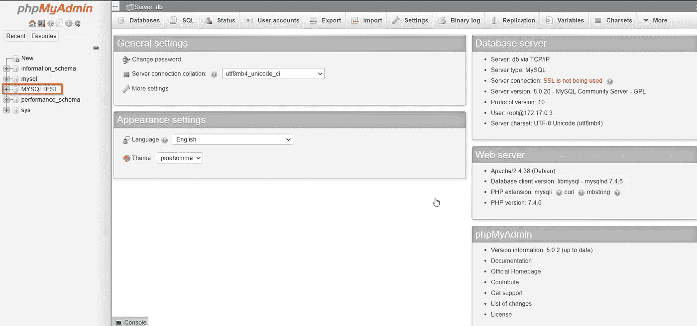

# 从本地机器连接到 Docker 容器中运行的 MySQL

> 原文：<https://towardsdatascience.com/connect-to-mysql-running-in-docker-container-from-a-local-machine-6d996c574e55?source=collection_archive---------0----------------------->

## 在 Docker 容器中部署带有持久存储的 MySQL 数据库并连接 Docker 化的 MySQL 数据库的分步指南


来自[皮萨贝](https://pixabay.com/?utm_source=link-attribution&utm_medium=referral&utm_campaign=image&utm_content=5215108)的帕帕萨恰里亚斯

如果你在软件工程行业工作，或者如果你打算在软件工程领域工作，你可能听说过**码头工人**。

> 2013 年， [**Docker**](https://www.docker.com) 引入容器概念，永远改变了软件工程版图。

容器是一个标准化的软件单元，它允许开发者将他们的应用从环境中分离出来，**解决了“它在我的机器上工作”的头痛问题**。码头工人仍然是集装箱化的“事实上的”标准。

Docker 的另一个重要用途是，开发人员可以下载并运行任何容器化的应用程序，而无需直接将其安装在本地机器上。由于几乎所有必需的应用程序都有 Docker 版本，Docker 有助于尝试和运行应用程序，同时保持您的操作系统简洁明了。

**MySQL** 是最流行的开源数据库之一，也是“**四大**”关系数据库之一。它被工业界、学术界和社区广泛使用。在一篇博文中，我对业界十大数据库做了详细的分析和排名，MySQL 拔得头筹。如果您想进一步了解 MySQL 为什么是第一大数据库，包括它的主要特性、使用案例、托管 MySQL 服务和替代方案，您可以阅读我的文章:

[](/top-10-databases-to-use-in-2021-d7e6a85402ba) [## 2021 年将使用的 10 大数据库

### MySQL，Oracle，PostgreSQL，微软 SQL Server，MongoDB，Redis，Elasticsearch，Cassandra，MariaDB，IBM Db2

towardsdatascience.com](/top-10-databases-to-use-in-2021-d7e6a85402ba) 

在这里，我将展示如何运行一个 Dockerized MySQL 数据库，然后从您的本地机器连接它。

# 安装 Docker

你可以在几乎所有的主要操作系统中安装 Docker，无论是 Linux、Windows 还是 macOS。请按照 docker 官方网站上的说明在你的本地机器上安装 Docker:[**https://docs.docker.com/engine/install/**](https://docs.docker.com/engine/install/)

# 安装并启动 Dockerized MySQL

Docker 容器是无状态的。所以，如果你使用一个容器化的 MySQL，那么一旦重启容器，你将会丢失所有保存的数据。避免这个问题的一个方法是创建一个 docker 卷，并将其附加到 MySQL 容器中。以下是在本地机器上创建一个包含附加卷的 MySQL 容器的命令:

以下命令将在您的本地计算机上创建卷，您可以稍后用 MySQL 容器连接该卷:

```
*λ* **docker volume create mysql-volume**
mysql-volume
```

以下命令将从 Docker 注册表中提取 MySQL server 8 . 0 . 20 版，然后实例化一个名为“mk-mysql”的 Docker 容器。它还会将之前创建的卷“mysql-volume”与数据库连接起来，并公开端口 3306，以便您可以访问容器外部的 mysql 数据库:

```
*λ* **docker run --name=mk-mysql -p3306:3306 -v mysql-volume:/var/lib/mysql -e MYSQL_ROOT_PASSWORD=my-secret-pw -d mysql/mysql-server:8.0.20**
Unable to find image ‘mysql/mysql-server:8.0.20’ locally
8.0.20: Pulling from mysql/mysql-server
```

您可以通过列出正在运行的容器来检查容器是否正在运行:

```
*λ* **docker ps**
CONTAINER ID IMAGE COMMAND CREATED STATUS PORTS NAMES
d54e7992094b mysql/mysql-server:8.0.20 "/entrypoint.sh mysq…" Less than a second ago Up 4 seconds (health: starting) 0.0.0.0:3306->3306/tcp, 33060/tcp mk-mysql
```

您还可以使用以下命令检查正在运行的 MySQL 容器的日志文件:

```
*λ* **docker logs mk-mysql**
```

现在，您可以使用以下命令连接到容器的交互式 bash shell:

```
*λ* **docker exec -it mk-mysql bash**
bash-4.2#
```

一旦进入容器，就可以连接到 MySQL 服务器并创建一个新的数据库，如下所示:

```
bash-4.2# mysql -u root -p
Enter password:
...mysql> CREATE DATABASE MYSQLTEST;
Query OK, 1 row affected (0.00 sec)
```

请注意，您必须给出与我们定义的相同的密码来运行容器( **my-secret-pw** )。

默认情况下，出于安全原因，MySQL 限制除本地机器(这里是 Docker 容器)之外的连接。因此，要从本地机器连接，您必须更改连接限制:

```
mysql> update mysql.user set host = ‘%’ where user=’root’;
Query OK, 1 row affected (0.02 sec)
```

尽管出于安全原因，最好创建一个新的非管理员用户，并只授予该用户访问权限。

# 安装 Dockerized phpMyAdmin

您可以使用任何 MySQL 客户端程序来连接 MySQL 服务器。我个人最喜欢的是 phpMyAdmin，这是一个简单而强大的 Web MySQL 客户端。此外，与其在我的机器上安装 phpMyAdmin，我更喜欢使用 Dockerized phpMyAdmin。

您可以从 docker 注册表中提取 phpMyAdmin 映像，并使用以下命令运行容器:

```
**λ docker volume create phpmyadmin-volume**
phpmyadmin-volume
**λ docker run --name mk-phpmyadmin -v phpmyadmin-volume:/etc/phpmyadmin/config.user.inc.php --link mk-mysql:db -p 82:80 -d phpmyadmin/phpmyadmin**
ef21905790dc42bc2e20d449b853d675d4922cb1249131513fdee885fc1088f8
```

您可以通过列出所有正在运行的容器或检查日志文件来检查 phpMyAdmin 是否正在运行:

```
λ **docker ps -f "name=mk-phpmyadmin"**
CONTAINER ID IMAGE COMMAND CREATED STATUS PORTS NAMES
ef21905790dc phpmyadmin/phpmyadmin "/docker-entrypoint.…" Less than a second ago   Up 10 minutes 0.0.0.0:82->80/tcp mk-phpmyadmin**λ docker logs mk-phpmyadmin**
```

## Mac/Windows 的注意事项:

基于你的操作系统，你的 DOCKER_HOST 是不同的。在 Linux 上，它将是您的本地主机。对于 Mac/Windows，您可以使用以下命令获取 DOCKER_HOST:

```
λ **docker-machine ip default**
```

对于 Windows/Mac，您可以连接 DOCKER_HOST IP 地址。另一个选项是端口转发。在 Windows 中，Docker 机器是在主机中的 VirtualBox 下运行的虚拟机。

要为 MySQL 和 phpMyAdmin 启用端口转发，请执行以下步骤:

*   打开“Oracle 虚拟机虚拟箱”
*   选择您的 Docker 机器 VirtualBox 映像(例如，默认)
*   打开设置->网络->高级->端口转发
*   添加应用程序名称、所需的主机端口和来宾端口，如下所示:



# 通过 phpMyAdmin 访问 MySQL

打开浏览器，访问[*http://localhost:82*](http://localhost:82)进入 phpMyAdmin UI:



一旦您使用之前配置的密码(my-secret-pw)登录，您应该能够查看 phpMyAdmin 管理视图，如下所示:



在左侧面板中，您可以看到之前创建的数据库(MYSQLTEST)。现在，您应该能够管理您的数据库(创建/删除表，运行 SQL 查询，等等。).

如果您已经如上所述配置了 Docker 卷，那么即使您重新启动 MySQL 容器，您的数据库更改也将保持不变。否则，您在数据库中所做的所有更改都将丢失。

# 类似文章:

[](/top-10-databases-to-use-in-2021-d7e6a85402ba) [## 2021 年将使用的 10 大数据库

### MySQL，Oracle，PostgreSQL，微软 SQL Server，MongoDB，Redis，Elasticsearch，Cassandra，MariaDB，IBM Db2

towardsdatascience.com](/top-10-databases-to-use-in-2021-d7e6a85402ba) [](/5-best-public-cloud-database-to-use-in-2021-5fca5780f4ef) [## 2021 年使用的 5 个最佳公共云数据库

### 亚马逊 DynamoDB，谷歌 BigQuery，Azure SQL Server，Azure Cosmos DB，亚马逊红移

towardsdatascience.com](/5-best-public-cloud-database-to-use-in-2021-5fca5780f4ef) [](/effective-microservices-10-best-practices-c6e4ba0c6ee2) [## 有效的微服务:10 个最佳实践

### 正确实施微服务架构的 10 个技巧

towardsdatascience.com](/effective-microservices-10-best-practices-c6e4ba0c6ee2)