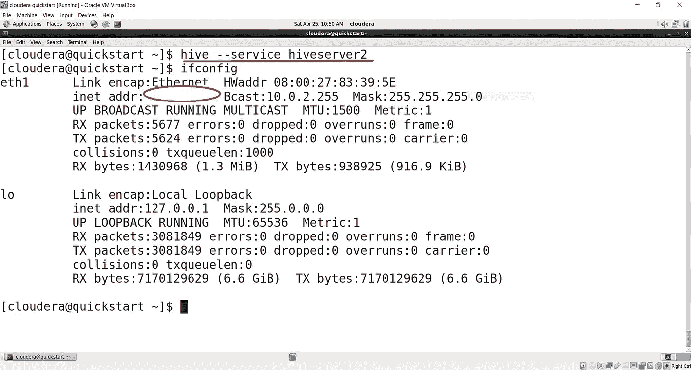
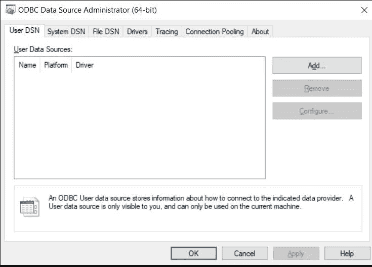
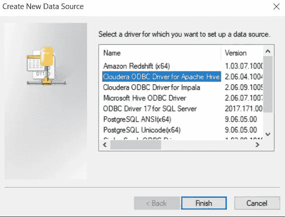
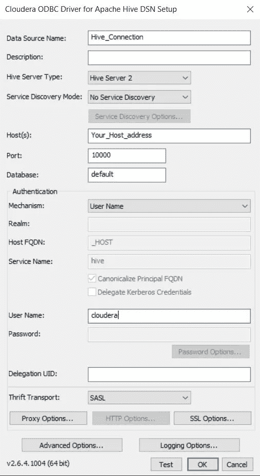

# 将 Apache Hive 连接到 Microsoft Power BI

> 原文：<https://towardsdatascience.com/connecting-apache-hive-to-microsoft-power-bi-d460e2278720?source=collection_archive---------16----------------------->

## 逐步连接法。


埃德加·恰帕罗在 [Unsplash](https://unsplash.com?utm_source=medium&utm_medium=referral) 上拍摄的照片

在这篇博文中，我们提到了执行所需连接的步骤。Hive 数据库基于 cloud era & Power BI 桌面安装在 Windows 上。这种连接也可以通过其他 BI 工具实现，如 Tableau &等。因为 Hive 可以与许多 BI 工具集成，但这个过程可能很有挑战性。**让我们期待采取连接所需的步骤。**

# 1.下载和安装 ODBC 驱动程序

最初，我们需要从 Cloudera 社区下载 ODBC 驱动程序。有两个版本一个是 **64 位**另一个是 **32 位**版本。这取决于您使用的 PC/笔记本电脑的版本。您可以通过点击**窗口**按钮和**暂停/中断**按钮来检查您的 PC 版本。将打开一个面板，显示系统的技术特征。然后，您可以根据您的系统安装 Hive ODBC 驱动程序。另外，下面给出了 Power BI 桌面下载的链接！

> [Power BI 桌面下载链接](https://powerbi.microsoft.com/en-us/downloads/)
> 
> [HIVE ODBC 驱动下载链接](https://www.cloudera.com/downloads/connectors/hive/odbc/2-5-12.html)

# 2.在 Cloudera 上启动 Hive Thrift 服务器



拉胡尔·帕塔克

*   这里，我们使用命令启动了 Hive Thrift 服务器

```
hive --service hiveserver2
```

*   键入 **ifconfig** 以获取 inet 地址，该地址将成为您的连接的主机。

```
ifconfig
```

# 3.ODBC 驱动程序的配置

*   首先同时按下 **Windows + R** 并键入 **odbcad32。一个窗口会出现。**



拉胡尔·帕塔克

*   在**用户 DSN** 选项卡中点击**添加**按钮



拉胡尔·帕塔克

*   点击**用于 Apache Hive 的 Cloudera ODBC 驱动**并点击**完成**
*   一扇新的窗户将会打开



拉胡尔·帕塔克

1.  键入所需的数据源名称(DSN)。在这种情况下它的**蜂巢 _ 连接。**
2.  描述是可选的
3.  选择 **Hive Server 2** 作为您的服务器类型
4.  使用 **ifconfig** 输入您从 Cloudera 终端获得的**主机地址**
5.  端口是 **10000**
6.  数据库部分是可选的
7.  选择机制为**用户名**
8.  这个连接的用户名是 **Cloudera**
9.  选择 **SASL** 在节俭运
10.  点击**测试**
11.  检查**测试是否成功**。成功完成后，点击**确定**

# 4.电源 BI 的配置

*   点击**获取数据= >更多**
*   在搜索栏中键入 **ODBC** 并点击**连接**
*   选择 **Cloudera Hive DSN** 并点击**确定**
*   在 Power BI 的**导航器**栏中，可以看到来自 Hive 数据库的表格

# 5.可视化数据

一旦连接，我们可以将从配置单元表导入的数据可视化到 Power BI。


由[卢克·切瑟](https://unsplash.com/@lukechesser?utm_source=medium&utm_medium=referral)在 [Unsplash](https://unsplash.com?utm_source=medium&utm_medium=referral) 上拍摄的照片

感谢您从头到尾阅读本文。我希望我们能够帮助您连接这些工具。快乐学习🤗。