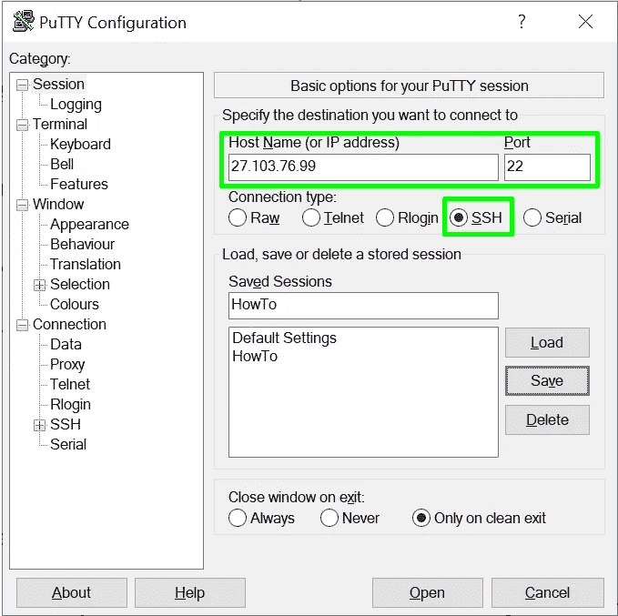
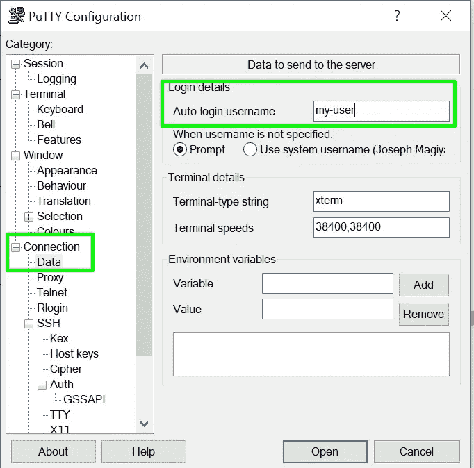
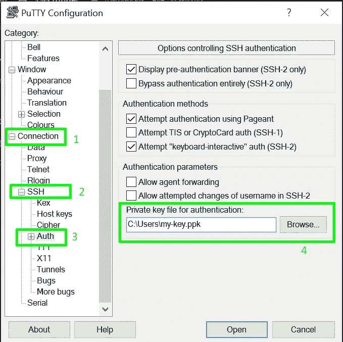
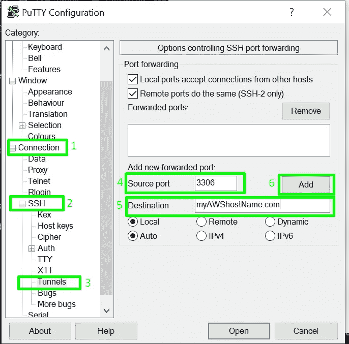
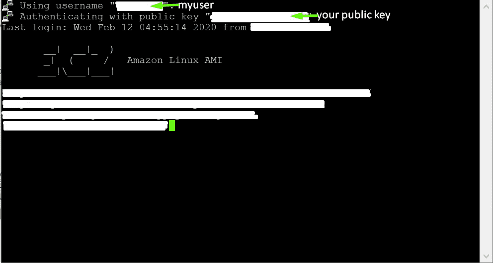
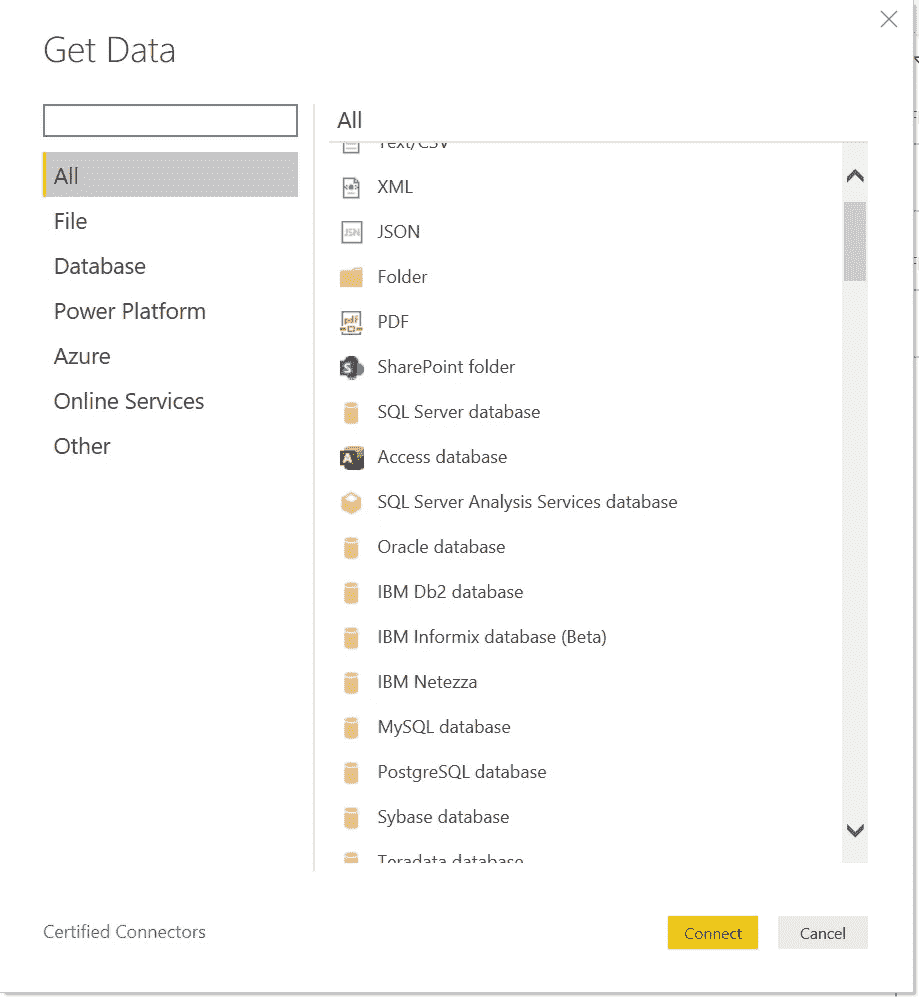
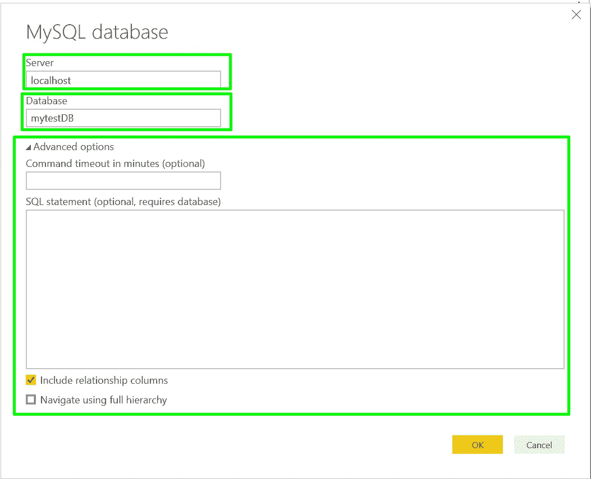
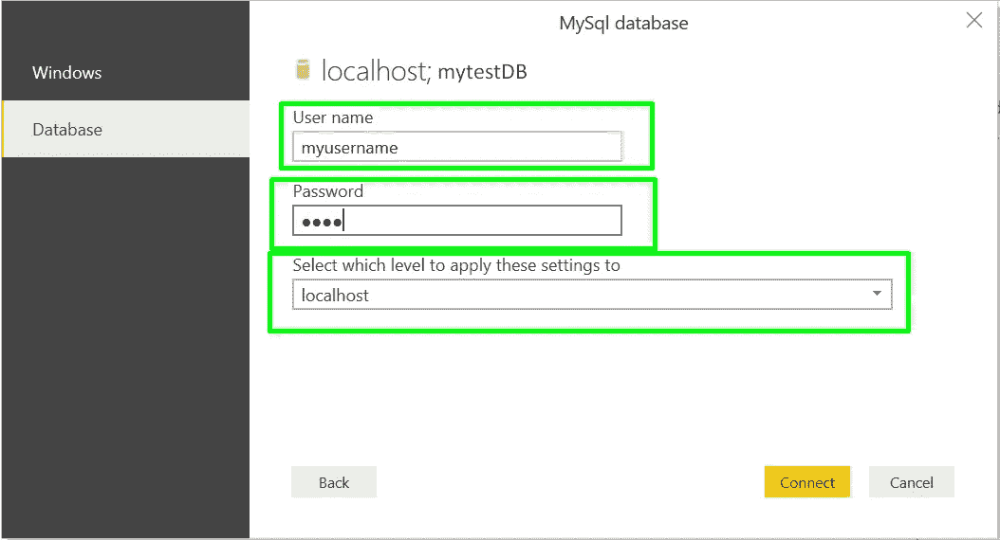

# 通过 SSH 隧道连接到 AWS 远程 MySQL 服务器

> 原文：<https://towardsdatascience.com/connecting-to-aws-remote-mysql-server-via-an-ssh-tunnel-6669a84cee91?source=collection_archive---------11----------------------->

图片来自 u[n flash](https://unsplash.com/photos/0ujNS9PMFhM)

这是一个瓶颈，我觉得我碰到了路障。特别是因为我想在不支持 SSH 连接的 Microsoft PowerBI 上访问数据库。我正在想办法解决这个问题，但是找到了其他的解决方案，中途就放弃了。

什么是宋承宪？SSH 协议(也称为安全 Shell)是一种从一台计算机安全远程登录到另一台计算机的方法。

顾名思义，隧道是通过 SSH 的隧道，我们将在其上转发特定的端口。该端口在您的本地机器上是可访问的，但是会被自动转发到远程机器，所以看起来好像您的远程服务(在本例中是 MySQL)实际上是本地的。SSH 端口转发是 [**SSH**](https://www.ssh.com/ssh/) 中的一种机制，用于将应用程序端口从客户端机器隧道传输到服务器机器，反之亦然。

你需要什么:

*   [油灰](https://www.putty.org/)

怎么做

1.  打开 PuTTY 并输入服务器主机名或 IP 地址。—这里需要注意的一件重要事情是，主机名(或 IP 地址)是 SSH 主机+端口

主机名、端口和连接类型

2.如果您有用户名(如果没有，可以跳过这一步)

2.如果您有用户名(如果没有，可以跳过这一步)

3.接下来，我们需要 Putty 来定位您的私钥文件。

找到您的 PPK 文件

4.接下来，我们需要设置隧道。在类别页面上，选择连接-> SSH ->隧道。**输入源端口为 3306。**输入目的地作为您的 AWS 主机名，如下所示。单击添加。

建立隧道

单击 Open，您应该会看到这个终端指示连接成功。

连接成功

# 好处:将 SSH 隧道连接到 PowerBI

1.  选择您的数据源，我将使用 **MySQL 数据库**进行说明

1.选择您的数据源，我将使用 **MySQL 数据库**进行说明

2.输入服务器和数据库。如果愿意，您还可以选择传递一个查询。

2.输入服务器和数据库。如果愿意，您还可以选择传递一个查询。

3.选择数据库，输入你的用户名和密码。

3.选择数据库，输入你的用户名和密码。

4.您应该可以看到所有的表(如果没有指定查询的话)或者数据库中的表

> 让我知道它是如何工作的！