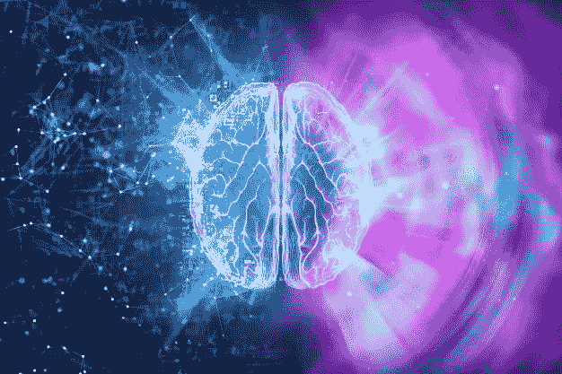
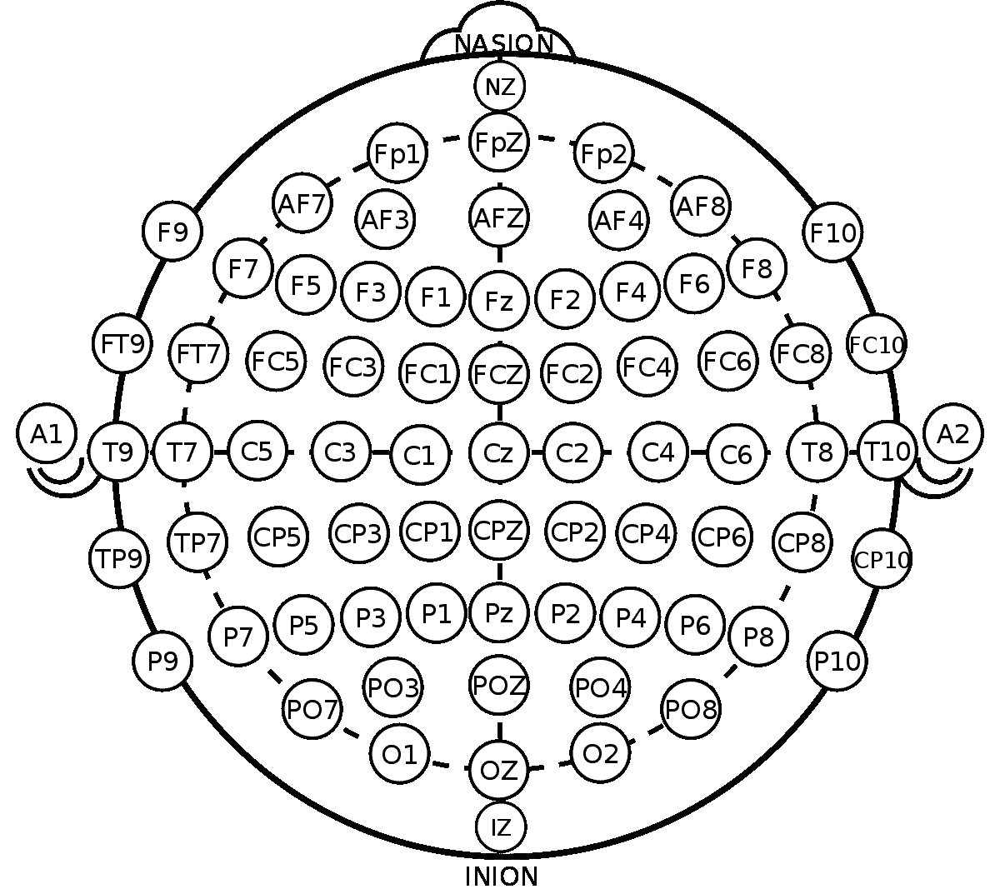
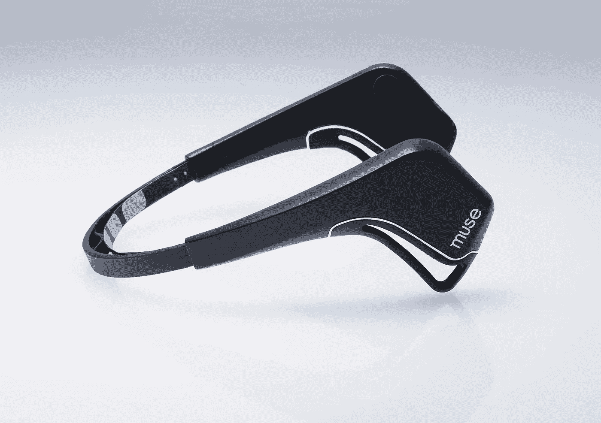
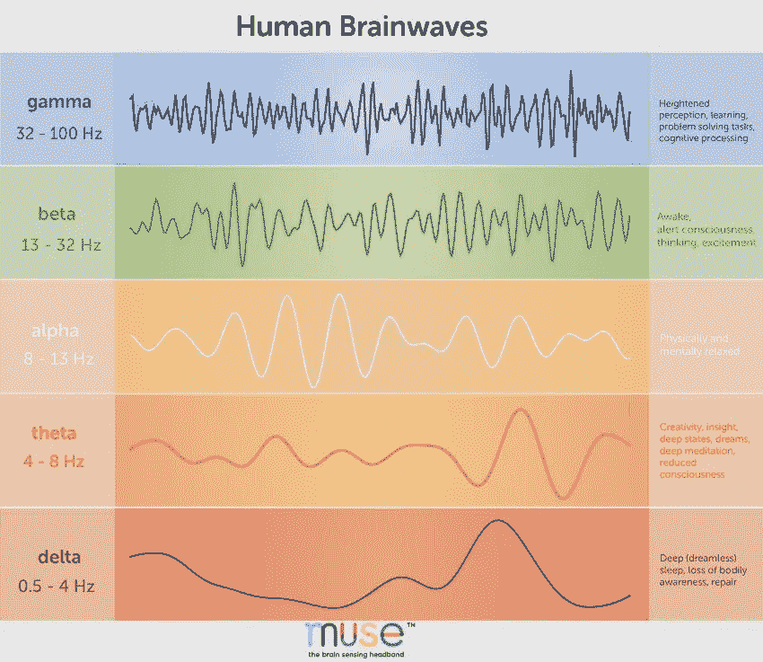
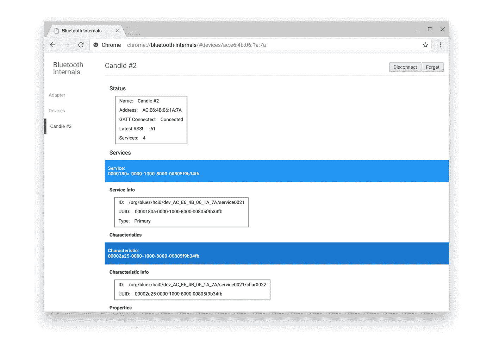
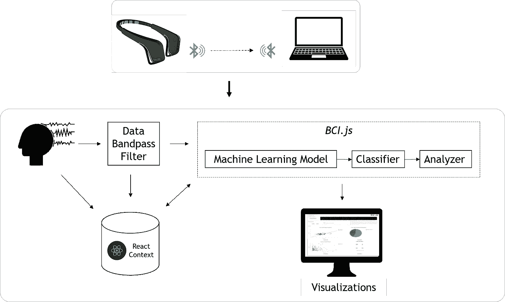

# 连接你的思想

> 原文：<https://towardsdatascience.com/connecting-your-thoughts-9ebb24b4c68d?source=collection_archive---------63----------------------->

## 皮质

## 第 1 部分:大脑-计算机接口之旅的开始

图片来自 [FreePikCompany](https://www.freepik.com/free-photos-vectors/brain)

理论物理学家加来道雄曾经说过，人脑有 1000 亿个神经元，每个神经元连接到 10000 个其他神经元，是已知宇宙中最复杂的物体。虽然大脑已经困扰了我们许多世纪，但我们现在终于开始了解它是如何工作的，但更重要的是，我们如何从根本上提取信号，并找到修复神经退行性异常的模式，并实现高级生理功能。现在，随着机器智能、深度学习和电极硬件的进步，我们可以分离和分析大脑信号，让科学家和研究人员在基础层面上理解思想和感知，这为使用计算机进行神经调节开辟了可能性。

这个系列试图让一个在脑机接口(BCI)领域没有专业知识的人了解他们是什么，以及我们如何使用机器学习以独特的方式分析脑电波。本系列探索的项目是与阿拉巴马大学人类技术交互实验室的[克里斯·克劳福德](http://www.chrissmithcrawford.com/)博士合作的。这也证明了业余科学家可以使用基本的脑电图(EEG)设备来提取和分析脑电波，进而可以部署大规模的开源平台，以便公众可以用自己的大脑数据进行实验。

## 这个系列讲的是什么？

> 本系列旨在通过下述项目提供脑机接口的综合指南。这个系列将有四个部分:第一部分是对 Muse 和数据存储的介绍，第二部分建立了实验所需的机器学习，第三部分讲述了用于提高准确性的复杂机器学习算法，第四部分是对该领域的总体评估，并对 BCI 的未来进行了评论。

## 是什么项目？

> HTIL 开发的项目是一个脑电图分析平台，使用 Muse 消费级脑电图耳机和基于网络的应用程序来运行简单快速的运动想象和情绪分类实验。它包含实时数据流、提供高精度分类的强大集成机器学习算法，以及用户友好界面中的交互式可视化。

在这里，我们将介绍项目和本系列背后的基础知识，从以下内容开始:

1.  **BCI 简介**:我们将过一遍什么是脑机接口，电极放置的重要性，以及电信号的不同频率。
2.  **Muse、蓝牙和架构**:Muse[EEG 是一种非常有用的设备，用于通过电极收集大脑信号。我们将介绍它是如何工作的，以及它如何连接到 React web 应用程序和 Chrome 的 web 蓝牙系统。](https://choosemuse.com/muse-2/)
3.  **数据管理**:管理跨多个通道和试验的数据是困难的，因此我们将探索如何使用 React 状态和上下文来做到这一点。

为了实现本文中描述的项目部分，您将需要以下内容:

*   对 JavaScript/React 以及如何使用 React 组件创建组件树的工作理解。这是 React [文档](https://reactjs.org/docs/getting-started.html)。
*   Chrome 浏览器，了解并访问网络蓝牙 API，以及 Muse EEG 版本 2。

# 什么是脑机接口？

脑机接口(BCI)是直接与大脑活动连接的设备，由一种能够读取大脑活动的设备测量，称为脑电图(EEG)。EEG 设备通过有创或无创的电极放置来记录电活动。侵袭性 BCI 通常需要手术，这带来了感染或脑损伤的风险；然而，收集到的信号要强得多。无创 BCI 侵入性较小，允许更大范围的大脑活动，但收集的信号有噪声，模式不容易找到。虽然侵入式 BCI 设备是许多有趣的研究论文和突破性技术的主题，但本系列的重点将放在非侵入式 BCI 设备上，因为它对业余研究人员和公众来说更实用。

如前所述，电极的放置对于从大脑的特定区域获得不间断、清晰的信号非常重要。国际上进行了大量研究来确定电极放置的通用系统，最终产生了国际 10–20 系统。10–20 系统是国际公认的用于脑电图数据收集的头皮电极放置系统。

图 1:国际 10-20 系统([维基百科](https://en.wikipedia.org/wiki/10%E2%80%9320_system_(EEG)))

“10”和“20”指的是相邻电极之间的实际距离，其为相对于鼻根和枕骨突(分别为头部的前部和后部)的纵向和横向头骨距离的 10%或 20%。许多非侵入性 BCI 设备采用这种电极放置系统来收集脑数据流。例如，InteraXon 公司在 2014 年设计的 [Muse](https://choosemuse.com/muse-2/) ，是一款消费级可穿戴脑电图头带，旨在收集脑电波数据，用于冥想。研究人员已经研究了将 Muse 设备重新用于其他用例，因为研究结果表明，其电极的放置提供了运动想象和情绪分类功能。例如， [Munawar Riyadi 等人](https://ieeexplore.ieee.org/abstract/document/8984565)使用支持向量机(SVM)算法和 Muse 设备开发了一个运动想象分类模型，在识别运动状态方面达到了 86.6%的训练准确度和 100%的测试准确度。此外，、、和朱等人利用公共空间模式(CSP)和算法，利用 Muse 设备开发了一个运动想象分类模型，达到了 95.1%的准确率。这些进步允许研究人员在运动想象中使用来自 Muse 的脑波数据，而无需直接或侵入性的运动皮层交互。

图 2: [InteraXon Muse 脑电图](https://choosemuse.com/muse-2/)

虽然 BCI 设备使用电极来收集数据，但收集的究竟是什么类型的数据呢？当人们执行任何认知功能时，无论是身体的还是精神的，大脑都会产生电信号(数据)，这些电信号可以被电极检测到。脑电波不是这些大脑状态的来源或原因，而是这些复杂过程的可观察的反映。脑电波是根据它们的振幅和频率来分类的。例如，*低活动度*脑电波具有低频率和高振幅，而*高活动度*脑电波具有高频率和低振幅。在这两个范围内，研究人员根据其特定的认知相关性确定了这些电信号的五个不同频率范围: *delta、theta、alpha、beta、*和 *gamma* 如下所示。

图 3: [脑波分类](https://choosemuse.com/blog/a-deep-dive-into-brainwaves-brainwave-frequencies-explained-2/)

与运动想象和情绪分类相关的认知功能通过*α*和*β*波进行检测，并通过一种被称为事件相关去同步化(ERD)和同步化(ERS)的[现象](https://oxfordmedicine.com/view/10.1093/med/9780190228484.001.0001/med-9780190228484-chapter-40)进行最佳表达。我们可以使用像 Muse 这样的设备来检测这种感觉运动活动。

# 缪斯、蓝牙和建筑

当你第一次使用 Muse 设备时，你会注意到该公司已经为 iOS 平台开发了一个内置的连接系统，允许用户将数据从他们的 Muse 传输到他们各自的 Muse 移动应用程序。在 HTIL 的一个项目中，我注意到 Muse 没有提供流数据的 web 界面解决方案，但是我的实验室已经开发出了一种在 Chrome 浏览器中从 Muse 中提取数据的方法。在我们进入如何与 Muse 建立蓝牙连接的细节之前，了解 Chrome 的网络蓝牙 API 是很重要的。

图 4: Chrome 的网络蓝牙 API

上图显示了 Chrome 的网络蓝牙 API 的基本接口，它允许用户在本地应用程序和网络浏览器中连接蓝牙设备。它利用 Chrome 远程接口将 Muse 蓝牙系统与 Chrome 的蓝牙系统连接起来。

> HTIL 已经为这个问题开发了一个解决方案，但是代码是专有信息，如果您的应用程序是公开部署的，就必须和它的源代码一起使用。[联系我](mailto:3dshah3@gmail.com)获取有关访问这些文件的更多信息。

当使用该桥运行 web 应用程序时，Chrome 中的蓝牙系统将寻找准备配对的 Muse 设备，主机将显示它识别的设备。这个蓝牙桥系统有很多功能，但最主要的是，你现在可以将 Muse EEG 与网络浏览器配对，并开始使用网络应用程序传输数据。

图 5:应用程序架构图

现在我们的蓝牙系统已经就绪，让我们来看看应用程序的整体架构。在*图 5* 中，图的第一部分显示了 Muse 和 Chrome 的蓝牙系统之间的连接。在 React web 应用程序中可视化结果之前，会发生多个步骤:数据从 Muse 设备直接传输到应用程序，并存储在 React 上下文中，数据通过数据带通滤波器进行预处理， [*BCI.js*](https://bci.js.org/) 用于实现基于机器学习的分析和分类，结果通过 web 应用程序实验仪表板中的 web 组件进行可视化。这看起来很多，本文只关注数据存储和蓝牙，但是在以后的文章中，我们将会详细介绍这个过程的每一步。请随意使用这个架构图作为本系列和您自己项目的指南。

# 电极和反应状态管理

一旦你的 Muse EEG 连接到 Chrome 的蓝牙系统，该设备就会自动开始将数据从四个电极直接传输到 React web 应用程序。然而，如果没有合适的存储系统，代表来自这些电极的信号的数据点就会被丢弃。为了建立电极管理的行话，我将用国际 10–20 系统中的电极名称来指代电极:AF7、AF8、TP9 和 TP10。在 *BCIDevice.build.js* 中建立的 MuseClient 系统已经有了一个仅用于 AF7 的连接和数据提取系统，但它可以很容易地推断出覆盖所有四个。下面的代码显示了 *startMuse* 函数，它利用了所有四个电极的 map 数据类型。

图 6: Muse 连接功能

你可以在图 6 的*中看到，我们将采样率设置为 256，这是每秒收集的数据点的数量，将缓冲区大小设置为 2000，这是包含大脑数据的数组中任何时候存储的数据点的最大数量。我们对每次存储的数据点数量设置了限制，以便我们的机器学习模型不需要超过几秒钟的时间来训练，从而实现更实时的体验。该函数遍历*电极图*中的每个电极，并对其运行*过程更新*函数，该函数包含两个参数，来自*电极图*的电极和数据有效载荷本身；该功能对于存储极其关键，因为它管理数据流，以允许机器学习模型正确地训练和测试。*

在我们进入 *processUpdate* 函数实际做什么之前，必须先了解一下 React 状态。React 使用两种类型的普通 JavaScript 对象在组件之间和组件内部进行通信:props 和 state。Prop 是 properties 的缩写，它被传递给组件(从父组件传递给子组件)，而 state 包含私有信息，只能由初始化它的组件编辑和使用。本质上，状态是组件类在所有后续函数和渲染中使用的全局变量。因为我们不需要跨多个组件的通信，所以 states 非常适合存储在这个组件中。有两种能力我们希望被状态控制:*正在运行*和*计数器*。

图 7:数据存储功能

*isRunning* 是一个布尔值，它告诉我们 Muse 是否正在为训练或测试集传输重要数据，而*计数器*则让我们知道我们正处于实验的哪个阶段。例如，在图 7 中*的 switch 语句中，如果*正在运行*为真，并且*计数器*为 1，则正在进行第一次训练。更多的内容将会在下一篇关于机器学习的文章中介绍。 *processUpdate* 函数检查 Muse 是否正在将数据传输到重要的数据集，如果是，它将决定将其分配给哪个试验，如果不是，数据将被转移到存储阵列并被转储。然后，该函数使用 FIFO(先进先出)存储技术将数组的最大大小保持在 2000 个数据点；机器学习模型不能很好地处理数据量不同的数据集，因此每个电极的同时更新功能可以保持所有电极阵列的数据点数量标准化。总之，这个函数检查正在进行的实验，并将数据点放入适当的数据集中。启动和停止实验的特性调用了 *processUpdate* 函数，这将在下一篇文章的实验流程部分进一步探讨。在 *processUpdate* 中，状态系统与电极图和数据管理系统的使用相结合，实现了端到端的存储系统，可以使用 React 上下文在多个实验中复制。*

# 反应上下文存储

前面，我们讨论了道具和状态的区别；如果我们希望组件树能够访问某些变量，每个组件都必须将 props 传递给下一个组件。然而，React 有一个名为 Contexts 的内置 API，它提供了一种通过组件树传递数据的方式，而无需手动通过每个组件传递属性。最后一节建立了用于存储 AF7、AF8、TP9 和 TP10 电极的单独会话数据的系统，但是上下文将用于管理多个会话和数据集，以用作机器学习模型的训练和测试数据。

图 8:多个试验存储的反应上下文

[React 上下文文档](https://reactjs.org/docs/context.html)提供了一种设置上下文的简单方法，但我们需要添加两个主要功能:设置函数和组件返回值(如图*图 8* )。对于我们的实验流程，正确分类需要两个训练集和一个测试集；因此，我们必须为所有三个数据集设置带有存储的上下文。上下文本身也包含状态，但是它们允许我们通过上下文提供者在不同的组件之间传递状态。在代码中，您可以看到状态包含用于训练 1、训练 2 和测试数据集的数组。下一步是建立我们的集合函数，这些函数将状态设置为参数中定义的属性。例如，如果我们有一个包含第一个训练集数据的数组，我们可以使用 set 函数将第一个训练集数据存储在特定的上下文位置。在这个项目的环境中，有三组函数用于训练和测试数据集；这些功能现在需要在所有组件中都可用。这就是上下文提供者的用武之地。在 render 部分，有一个称为 Provider 的包装器，它向组件“提供”值和函数；在这里，我们将状态和设置功能传递给子组件。上下文架构看起来很简单，但是对于跨组件存储来说，React 实现它的方式非常强大。

图 9:上下文建立和数据访问

既然已经建立了上下文，我们如何跨组件访问这些数据呢？有两个简单的步骤:在子组件中建立上下文和使用集合函数。为了在组件中使用上下文数据，您必须使用下面显示的命令，该命令允许组件访问使用和更改上下文中的数据。此外，在组件中，有一个 *updateData* 函数，它使用 set 函数将训练或测试集存储到上下文中的适当位置，允许机器学习组件访问它。例如，对于 *updateData* 函数中的情况 3，下面显示的命令将数组(该期间来自四个电极的数据)设置为上下文中训练集 2 的特定点(如图*图 9* 所示)。该数据然后被用于机器学习组件，并且在绘图组件中创建视觉效果。从使用状态存储单个电极阵列到为多次试验创建环境，整个系统允许对运动和情绪分类进行端到端的实验。

# 结论

在本文中，我们介绍了脑机接口的基础知识，如何将 Muse EEG 连接到 Chrome 的网络蓝牙系统，以及如何管理不同电极和多次试验的数据。现在，您可以实现上述解决方案，开始提取和存储多个参与者的大脑数据。以下是一些有用的提示:

*   记得检查你的 Muse 上的版本，并充满电以获得最佳性能。有时不同版本的 Muse 需要修改源代码中的 MuseClient 配置。
*   尝试创建一个计时器，以确保在进入机器学习之前存储阵列已满，以便数据集保持一致。

在本系列的第 2 部分中，将建立一个机器学习基础，以允许开发人员在我们继续开发该平台的过程中从脑电波中提取模式。

> 如前所述， [HTIL](https://htil.cs.ua.edu/) 开发的代码是实验室的专有信息，只有在确认来源的情况下才能使用。请[联系我](mailto:3dshah3@gmail.com)了解更多详情，以便您可以使用这些文件将 Muse 连接到网络应用程序。

请继续关注第 2 部分！