# 具有 NP 完全性的连接艺术

> 原文：<https://towardsdatascience.com/connective-art-with-np-completeness-557963b2fc39?source=collection_archive---------35----------------------->

## 玩数学艺术可能会上瘾

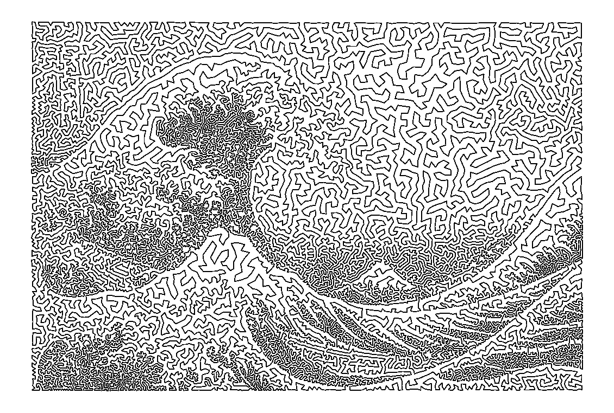

原始图像:神奈川外的巨浪，由 Hokusai 拍摄(约 1829 年)，TSP 图像由 Tumas Rackaitis 拍摄(2020 年)

我们总是着迷于将点点滴滴联系起来。纵观整个世界，各种文化都观察过天空，发现过星座。数学家们长期以来一直试图形式化在任意一组位置中寻找最短路径的最佳方式。这导致了旅行推销员问题(TSP)。

你以前遇到过这个问题，例如，通过问:我应该按什么顺序做我的差事，这样他们能最快地完成？我们可以把这个问题简化成一个图:每个任务是一个点，一个顶点，完成这个任务需要多长时间，这个点到另一个点的距离就是它们之间的距离。寻找最短的路径将是最快的差事序列。

点画是一种艺术技巧，它用一组点来表现一幅画，给人以色调的印象。我们可以用它来连接点状图像，其中的点根据图像的暗程度聚集在一起。这样做，我们可以创建一个 TSP 问题和一些数学上有趣的艺术。

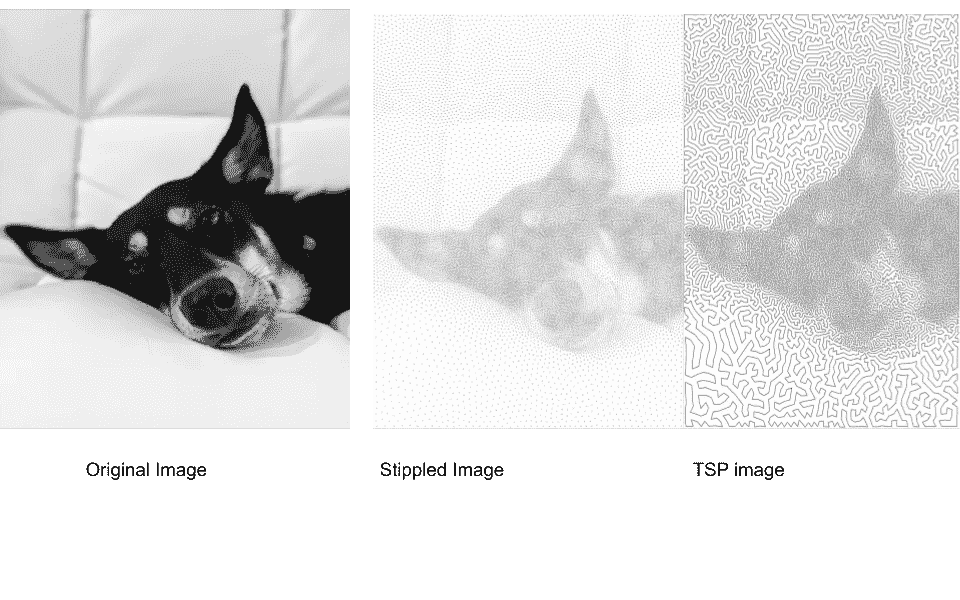

原始的，点画的，TSP 的我的狗狗的图像。您可以在这里单独查看图片

如果你想自己尝试一下，我在 Github 上做了一个简单易用的 python 库！[自己试试](https://github.com/RoboTums/PyTSPArt)。

这种艺术的算法在高层次上看似简单:

1.  从图像中生成点。(点画)
2.  连接这些点来解决 TSP 问题。(求解)

为了演示如何制作 TSP 艺术，让我们首先选择一个图像。我将改变这个企鹅形象。

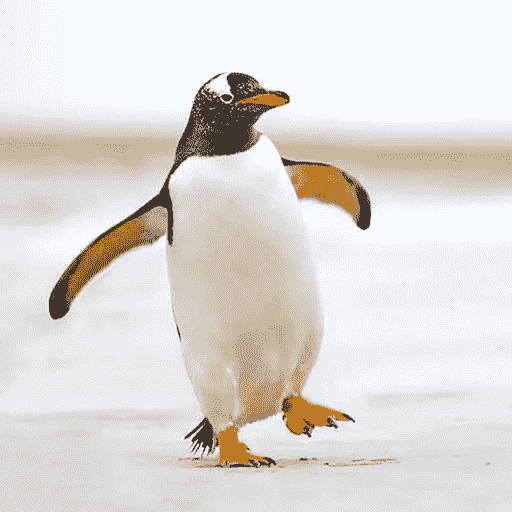

企鹅被点画和茶匙

让我们从生成一些点开始。在我的[回购](https://github.com/RoboTums/PyTSPArt)中使用的技术被称为*加权 Vornoi 点画*，由 Adrian Secord 首先介绍，[在此为](https://www.cs.ubc.ca/labs/imager/tr/2002/secord2002b/secord.2002b.pdf) *。*

您可以复制我的 repo，并按照自述文件中的[设置说明进行操作。](https://github.com/RoboTums/PyTSPArt/blob/master/README.md)

要生成点画图像，需要在调用 python 文件后指定图像的路径。

```
python3 stippler.py <image path> --n_point 20000 --force --save --display
```

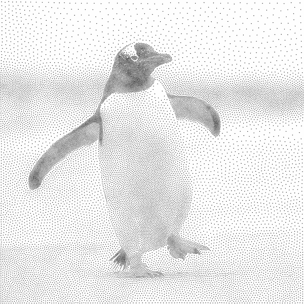

企鹅点画后加权 Voronoi 点画。

这将绘制一个 20k 点的图像，强制重新计算，保存输出，并显示在屏幕上。

在一小段时间后，文件将被生成，它将输出 3 个文件:一个 PDF，一个 PNG 和一个 NPY 文件。PNG 很有趣，但是 stippler.py 文件中真正重要的是它创建的。npy 文件，它包含图像中每个点的 X 和 Y 坐标。我们可以把它直接输入 TSP 求解器。

为此，我们指定。TSP 求解器脚本中的 npy 文件:

```
python3 tsp.py <.npy_file_path> #produces TSP solution. 
```

这将产生一个 TSP 图像！

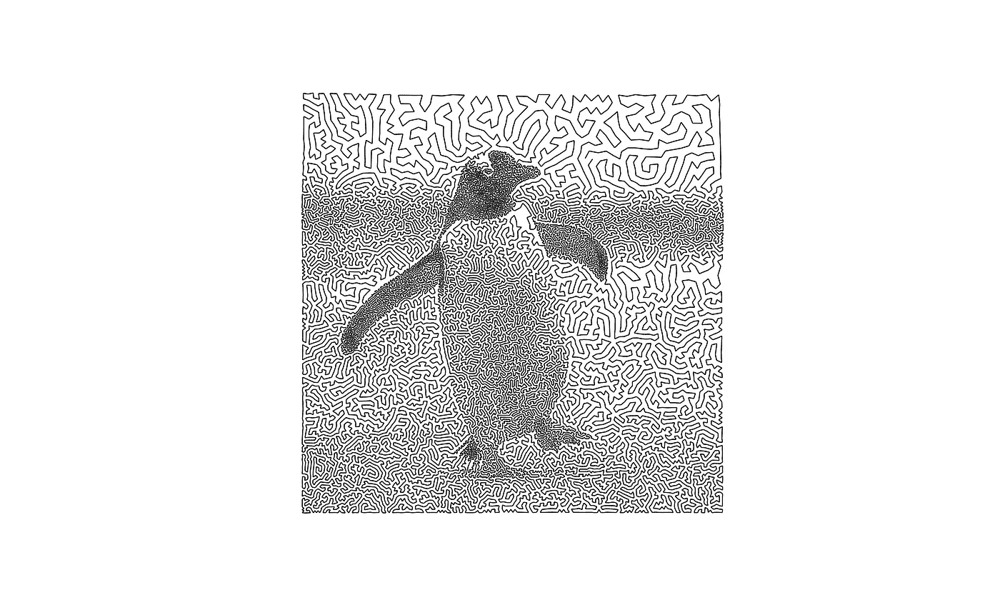

企鹅的 TSP 表示

您可以配置这些，并在下面的存储库中找到更多配置。

我从我的数学专业导师博施博士那里学到了这种艺术。他写了一本关于优化艺术领域的书。这本书通俗易懂，读起来很有意思，有很多漂亮的图片。

你可以在这里查阅他的书:

> 罗伯特·博施。 *Opt Art:从数学优化到视觉设计*。普林斯顿大学出版社，2019。

以下是我做过的一些我最喜欢的 TSP 图片:

我在这里使用的 Psyduck 作为我的缩放背景。我试图将它转换成 TSP 表示，结果好坏参半。我对它的点画非常满意，但作为 TSP 它看起来非常奇怪。

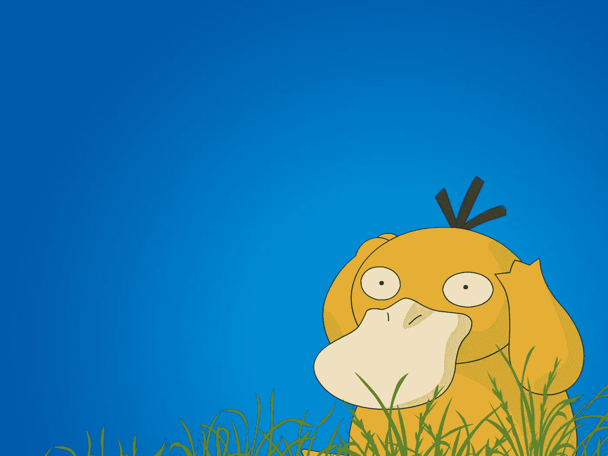

Psyduck，原始图像

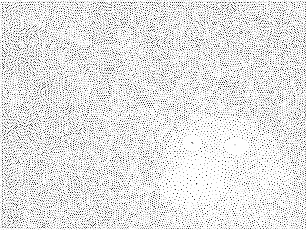

Psyduck 在加权 Voronoi 点画后点画

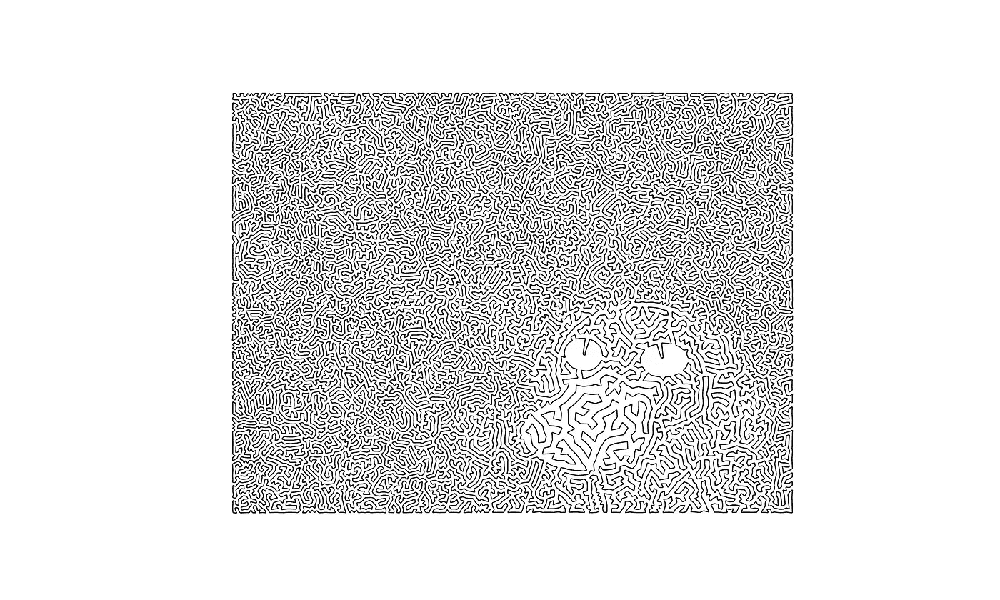

Psyduck TSP:模糊。我喜欢眼睛的表现方式。前景中细节的缺乏使得点稀疏分布，这意味着 TSP 表示看起来很怪异。

另一个我最喜欢的是北斋的《女性浪潮》(约 1830)。日本木刻画往往点画得非常好，这是由于如何通过媒介处理色调，这是我越来越欣赏的东西。

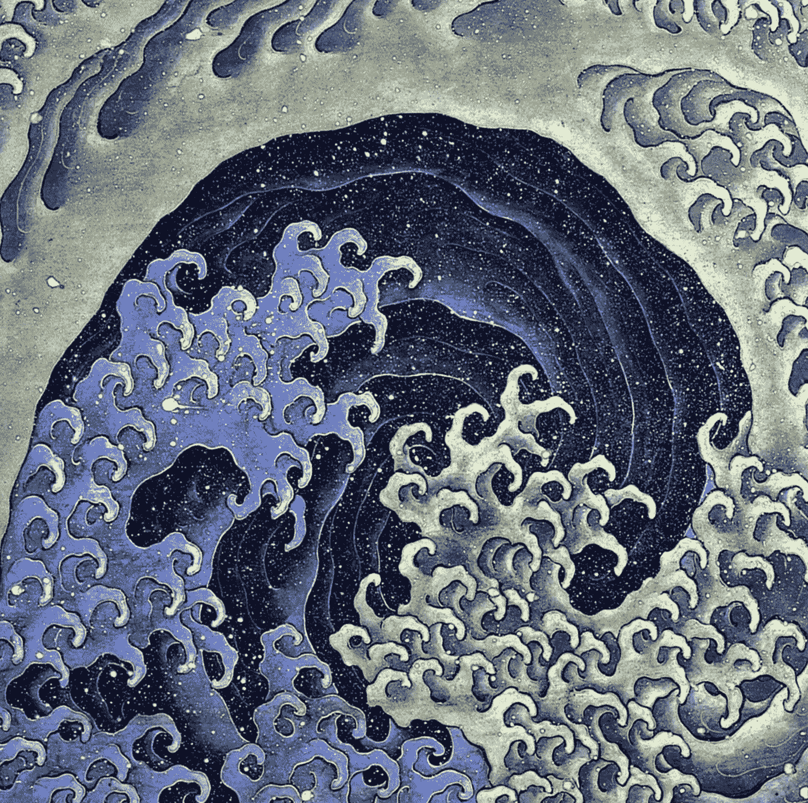

《女性的浪潮》，作者北斋(~1829)

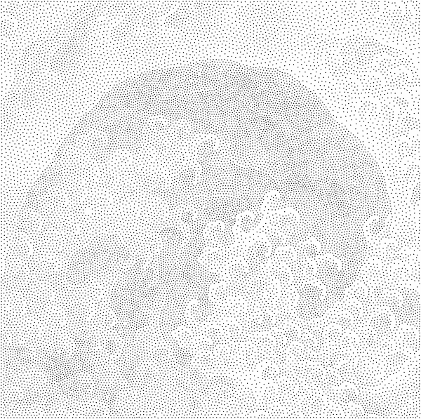

女性波，由北斋，点画加权 Voronoi 点画。两万个点。

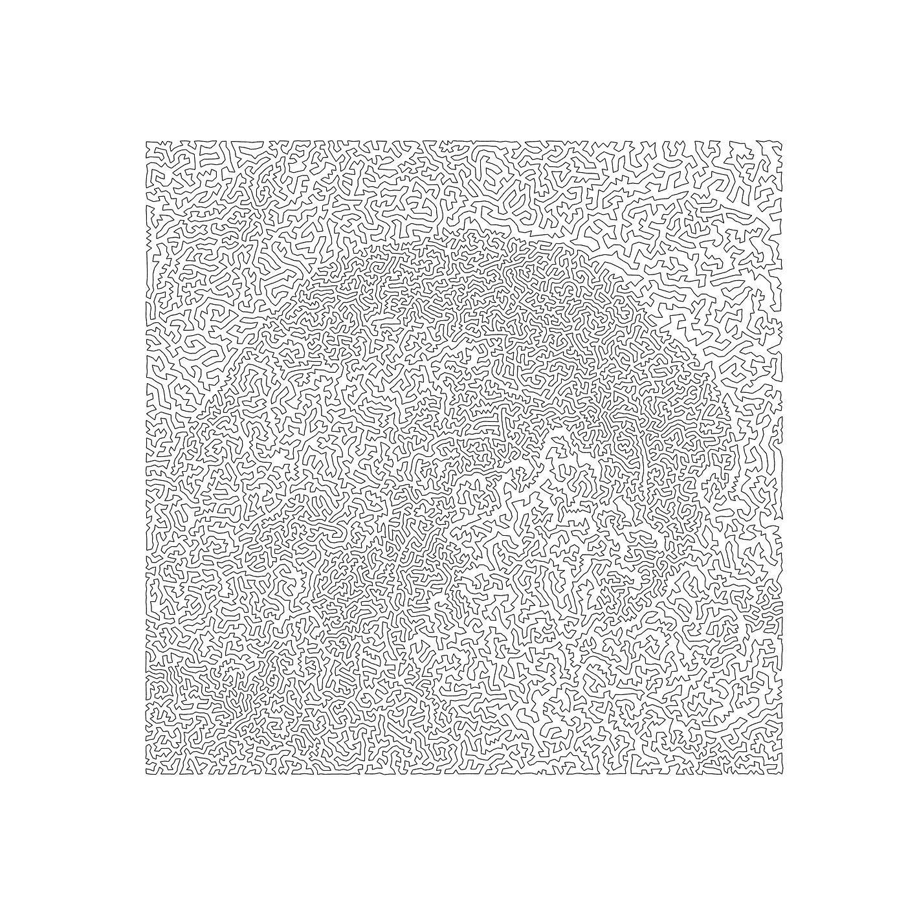

20，000 点 TSP 代表女性波由 Hokusai。

如果你想看更多我的作品，你可以看看[我的作品集网站。](http://tumasr.ai)

下面这篇文章的代码就在这里的这个[库中](https://github.com/RoboTums/PyTSPArt/)。

试试吧，在下面的评论里分享你的作品吧！