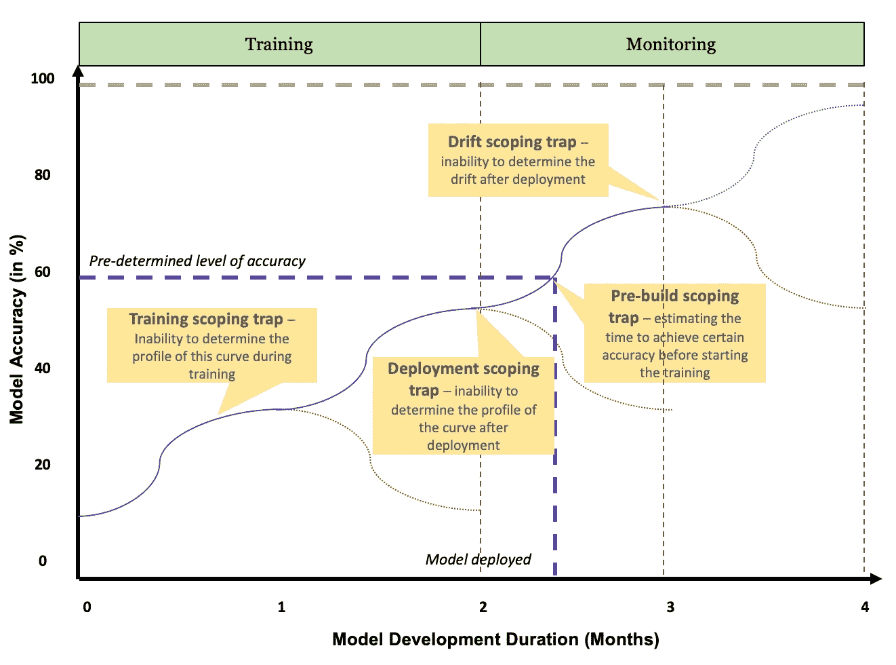
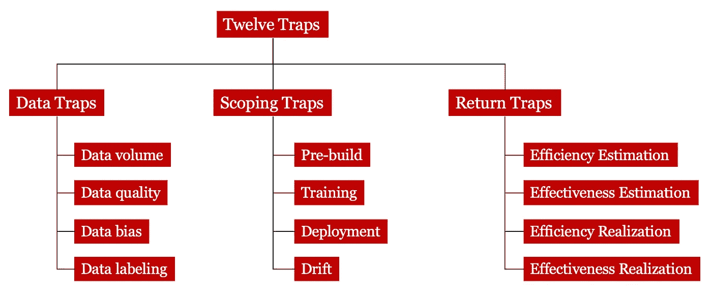

# 将模型误认为软件的后果(第二部分)

> 原文：<https://towardsdatascience.com/consequences-of-mistaking-models-for-software-94d813f115f5?source=collection_archive---------44----------------------->

## [数据科学家来自火星，软件工程师来自金星(下)](https://towardsdatascience.com/tagged/modeling)

## 构建和部署模型时要避免的十二个陷阱

编辑自[饥饿的金星捕蝇草咬住一群不幸的苍蝇](https://www.youtube.com/watch?v=O7eQKSf0LmY)

在[数据系列的第一部分](/data-scientists-are-from-mars-and-software-developers-are-from-venus-part-1-8dde19fb2eef)中，科学家来自火星，软件工程师来自金星，我们研究了软件和模型之间差异的五个关键维度。接下来自然要问的问题是— **那又怎样？如果模型与软件混为一谈，数据科学家被视为软件工程师，这真的有关系吗？毕竟，对于大多数人来说，更重要的是对于商业世界来说，他们之间的相似之处要比不同之处明显得多。事实上，Andrej Karpathy 将这种使用模型解决问题的新方法称为[软件 2.0](https://medium.com/@karpathy/software-2-0-a64152b37c35) 。如果它们真的是软件的下一个迭代，那么这些差异真的重要吗？**

当我们将模型和软件融合在一起时，构建模型的挑战就变得更加严峻了。在这篇博客中，我们描述了当我们将两者合并时所面临的 12 个“陷阱”,并认为我们需要认识到它们的差异并相应地解决它们。

## 数据陷阱

正如我们在之前的博客中所讨论的，模型是正式的数学表示，可以应用于或校准以适应数据。因此，数据是构建模型的起点。虽然测试数据对于构建软件至关重要，但是在收集或准备测试数据之前，可以从给定的规范开始构建算法。

然而，当涉及到构建模型时，数据必须是高质量的(即，垃圾输入，垃圾输出)，足够数量的可用数据，并且对于监督学习模型也是有标签的(即，标签是模型预测的响应变量)。数据也需要符合目的。这方面的一个例子是，当模型被部署到生产中时，数据应该代表我们将使用的人群。最近面部识别模型的[皮肤类型和性别偏见](https://news.mit.edu/2018/study-finds-gender-skin-type-bias-artificial-intelligence-systems-0212)的例子强调了拥有一个有代表性的(和有统计学意义的)数据集对于建立模型的重要性。这种数据偏差在实践中出奇的普遍。

我们已经看到，未能解决收集、管理和标记构建模型所需的必要数据的挑战，是将模型误认为类似于软件的重要陷阱之一。许多渴望推出人工智能或人工智能项目的公司很少关注这一方面，并开始用很少的数据建立模型。例如，一家公司最近想要构建一个 NLP(自然语言处理)模型，从只有八个 PDF 文档的文档中提取结构化信息。所需的成本和时间(尤其是来自领域专家(例如法律专家或临床医生)的成本和时间)使得标记成为一项重大挑战。虽然技术正在发展，以从更少的数据中学习，并帮助专家将标记数据作为他们正常工作的一部分，但拥有足够的、良好的标记数据仍然与构建模型的方式和传统的软件开发方式有很大的不同。

综上所述，**数据陷阱**可以进一步分为**数据量陷阱**、**数据质量陷阱**、**数据偏差陷阱**和**数据标签陷阱**。一家公司可能会遭遇一个或多个这样的陷阱。对数据陷阱有一个现实的感觉是至关重要的，以确保您不会走上错误的道路，在建模工作上花费数百万，而没有实现预期的回报。此外，了解这些陷阱还可以改变您处理建模工作的方式，首先收集更多的标记数据或寻找基于规则的替代方法来解决问题。

## 范围陷阱

有了三四十年的软件工程实践和方法，软件开发人员和系统分析人员在估计构建和测试软件所需的时间方面已经变得相当不错(或者至少比模型开发人员好得多)。使用[敏捷软件开发](https://medium.com/zenkit/agile-methodology-an-overview-7c7e3b398c3d)方法，软件可以在固定的时间周期内增量和迭代地开发——通常在两周或四周的冲刺阶段。

假设我们希望我们的模型满足某些性能标准(例如，准确度、精确度、召回率等)，那么很难估计实现这些结果所需要的努力和持续时间。更糟糕的是，我们可能无法先验地告诉*我们实际上是否能够成功地满足性能标准。此外，满足性能标准的难度可能是非线性的。例如，在我们最近的一个客户项目中，我们能够在几周内用决策树模型达到 90%的准确率。然而，客户的目标是 99%的准确率。经过几个月的时间，神经网络模型的准确率不会超过 93%。*

[Lukas Biewald](https://medium.com/@l2k/why-are-machine-learning-projects-so-hard-to-manage-8e9b9cf49641) 给出了另一个经典的例子，在 Kaggle 的一次比赛中，全球数千人参加了一场比赛，旨在在短短一周内将模型的准确性从基线的 35%提高到 65%。然而，随后，即使在几个月和几千人试图改善这一结果后，他们所能做到的最好结果是 68%的准确率——仅仅提高了 3%。

我们称之为**范围陷阱**，在这种情况下，数据科学家无法确定实现特定性能标准(例如，准确性)所需的工作量和持续时间(或时间)、所需的数据以及所需的计算资源。这个范围陷阱可能发生在模型的不同阶段。在构建模型之前，可能很难确定模型的范围以实现某种性能——我们称之为**预构建范围陷阱**。**训练范围陷阱**是指数据科学家无法判断他们应该继续训练模型多长时间——使用新数据、新技术、额外资源等——以便在训练阶段达到性能标准*。*

当谈到在传统软件中嵌入模型或交付数据科学项目时，这两个陷阱会让产品经理、scrum master 或项目经理抓狂。在大型软件开发工作中，我们经常看到数据科学家的“声音”被忽略，由于紧张和固定的截止日期，迫使数据科学家执行简单的描述性分析，并且不能从模型中产生任何见解。或者，他们可能开发基于规则的模型，而不是脆弱的真正的 ML 模型。我们认为，这是许多 AI/ML 项目无法实现其声明的 ROI(投资回报)的重要问题之一。

当一个人构建能够持续学习的模型时，我们面临着一个额外的挑战。假设业务部门为模型部署确定的目标准确度是 90%,而经过训练的模型已经达到了 86%。业务和数据科学家可以一起做出部署模型的决定，让模型不断学习，并希望准确性超过 90%的阈值。同样，数据科学家将无法确定模型是否、何时以及在什么条件下会跨越这个阈值。我们将这种变体称为**部署范围陷阱**。

最后，模型可能遭受[模型漂移](/concept-drift-can-ruin-your-model-performance-and-how-to-address-it-dff08f97e29b)，因为底层条件的改变，生产模型的性能下降。这种模型漂移可能突然发生，也可能连续发生。同样，数据科学家将无法确定模型准确性的性质、时间和恶化程度。我们称之为**漂移范围陷阱**。因此，需要建立模型监控实践来测量和处理这种模型漂移。

总之，**作用域陷阱**可以进一步分为**预构建作用域**、**培训作用域**、**部署作用域**和**漂移作用域陷阱**。下图通过一个示例强调了这些不同类型的作用域陷阱。

范围陷阱及其在构建前、培训期间和部署后的表现

## 回收凝汽阀

在着手构建任何大型软件之前，业务发起人和项目经理通常必须展示预期的 ROI。随着数据科学项目在企业中变得越来越普遍，企业领导者在进行投资或确定投资优先级之前，自然希望了解预期的投资回报。虽然估计一个新软件的回报并不容易，但当涉及到模型的预期 ROI 时，这项任务变得更加复杂。

从概念上讲，ROI 是一个相对简单的计算方法——它是相对于成本的净收益

ROI =(模型收益-模型成本)/模型成本

AI/ML 模型在公司中的好处通常分为两大类——效率*和效率*。当公司自动执行重复性的手动或认知任务时，他们可以提高流程的效率，减少执行这些任务所需的时间，并提高劳动力的生产率。当公司使用模型来制定更好的决策，以增强人类的决策能力时，他们就提高了决策的有效性。换句话说，好处来自于更快的*和更好的*。我们需要问的问题是——相对于什么基准*更快更好*？正是在估算这一基线时，公司常常做不到。****

*当自动化一项任务时，我们需要有一个基线*人类完成这项任务需要多长时间？*不幸的是，估计一个人完成一项任务需要多长时间——尤其是当它是一项认知任务(例如评估客户的风险)或非重复性任务(例如处理费用审批中的异常)时，并不容易。具有不同技能、背景和任期的人可能需要不同的时间来完成任务。对所有这些因素进行适当的分析以确定一项任务的真实持续时间是一项重要的工作，而且在一个服务组织或知识型组织中也是不切实际的，因为这些组织的任务种类繁多，复杂程度各异。*

*在推导效率基线时的另一个常见问题是，可能很难将给定任务的评估与所有其他任务区分开来。以采购经理为例，她在一天的不同活动中检查系统中的采购订单，与包装单和供应商发票进行交叉检查，以确定交易是否准确。假设我们已经构建了一个 NLP 模型来从发票中提取关键字段，以便它们可以与采购订单相一致。即使对于这一个人来说，估计他们在发票处理上花费的总时间也可能是难以计算的，因为这项任务与其他任务相结合，例如参加会议、检查货物等。并且取决于采购订单、发票和包装单的复杂性(例如，如果装运是跨多个采购订单或多个发票的交付，则复杂性和时间会增加)。*

*当谈到获得有效性的基线时，我们进入了一个更具挑战性的努力。效率是针对*任务*计算的，这些离散的活动可以用持续时间来衡量。然而，说到有效性，我们正在评估*的决策*和*的行动。我们如何确定一个动作是否比另一个动作更好？一个行动的结果是多维的，可能是不确定的，并且在效果上是滞后的。假设你正在驾驶你的汽车，当你接近一个信号灯时，绿灯变成了琥珀色。你会利用刹车来阻止后面紧跟的车有可能撞上你的危险吗？或者你会闯红灯(仍然合法)？哪种行动更好，以什么方式——对你后面的车辆更好，在油耗方面更好，在更严格地遵守法律方面更好。虽然这是一个简单的操作，但是估计决策的基线甚至更加复杂。**

*到目前为止，我们刚刚检查了效率和有效性基线的估计。这必须在我们开始构建模型之前发生，以便我们对我们的模型需要什么性能有一个好的想法。我们称此为 ***收益估计陷阱*** 。还有另一种类型的回报陷阱，当我们已经构建并部署了我们的模型，现在正试图实现其好处时，就会出现这种情况。我们称之为 ***返回实现陷阱*** 。*

*在计算回报时，我们再次遇到问题。在效率收益的情况下，我们可以明确地表明自动化能够减少完成任务所需的时间。假设您的自动化发票处理模型将处理发票的平均时间从 30 分钟减少到了 15 分钟。如果这个人一天处理四张发票，他一天可以节省一个小时，一周可以节省五个小时。现在让我们假设这个人一天工作十个小时或者一周工作五十个小时。时间上的节约是 10%。然而，这可能不会给公司带来切实的经济利益。这可能是由多种原因造成的。员工已经每周工作 50 小时，节省了 5 小时，他们可能只是减少了工作时间。就员工满意度和保留率而言，这可能仍然是组织的总体收益——但我们可能没有将这一点纳入我们的收益估算。即使他们每周只工作所需的 40 个小时，而我们由于自动化节省了他们 5 个小时，他们可能会找到其他事情来填补这一缺口，而不是让组织能够将节省的时间转化为金钱。这是 RPA(机器人流程自动化)和 IPA(智能流程自动化)面临的最大挑战之一，在 RPA 和 IPA 中，为个人节省了时间，因此 FTE(相当于全职)有所减少，但这种节省并没有转化为员工数量的减少，在这种情况下，您可以清楚地展示自动化带来的回报。*

*当谈到实现决策或行动有效性的好处时，我们也会遇到类似的问题。在这些案例中，最大的挑战是归属的挑战。当一个行动可以被证明比一个备选方案好得多时，并不总是有可能隔离出执行这个行动的整个环境。例如，在停止车辆或穿过琥珀色的十字路口的情况下，当天气干燥和晴朗时，突然停止的行为可能更好，而在潮湿、湿滑、下雪天，这可能是错误的选择。在这种情况下，你不能把在干燥晴朗的日子停下来的好处完全归功于*你的行动*——部分功劳归于大自然母亲为你的行动提供了合适的环境。在评估决策和行动时，这种归因挑战太常见了，因为竞争对手、客户、供应商、法规和许多其他利益相关者可能会参与将行动或决策变得“更好”或“更坏”。*

*与软件相比，模型的回报陷阱更严重的原因是因为我们将这些模型的表现与人的表现进行比较。如果人类无法以自动化模型的速度执行某些任务(例如，算法交易)，或者模型可以评估人类无法做出的选择并做出正确的决定(例如，玩围棋或象棋)，模型的价值将相当明显。然而，在大多数情况下，当模型自动化任务或增加人类决策或行动时，价值陷阱是一个需要应对的重大挑战。*

*综上所述，我们最终得到四种不同类型的**回报陷阱** — **回报效率估算**、**回报效率估算**、**回报效率实现**、**回报效率** **实现**陷阱。*

## *摘要*

*我们已经了解了陷阱的三大类别以及总共十二个不同的子类别，如下所示。*

**

*跨越三个不同类别的十二个模型陷阱*

*在第 1 部分[中，我们检查了模型和软件之间差异的五个方面。上面讨论的数据陷阱很大程度上源于构建模型以拟合数据的基本方式。此外，输出的不确定性和归纳推理机制也造成了不同的数据陷阱。范围陷阱源于在训练模型时需要科学(即，测试学习或实验方法)。同样的范围陷阱在制药行业也很常见，科学家无法估计找到治愈某种疾病的药物所需的时间，也无法估计药物是否能成功通过不同的临床试验。同样，即使药物上市后，其疗效也会下降(例如，抗生素耐药细菌)。漂移范围陷阱是决策空间演化的动态方式的结果。最后，由于模型的实验和科学思维以及决策空间的动态性质，会出现返回陷阱。](/data-scientists-are-from-mars-and-software-developers-are-from-venus-part-1-8dde19fb2eef)*

*在随后的博客中，我们将会看到一些最佳实践来解决这些陷阱以及界定、构建和交付模型的挑战。*

*作者: [Anand S. Rao](https://www.linkedin.com/in/anandsrao/) 和 [Joseph Voyles](https://www.linkedin.com/in/joseph-voyles/)*