# 是否在我的模型中考虑多重共线性？

> 原文：<https://towardsdatascience.com/consider-multicollinearity-in-my-model-or-not-7aca16e74773?source=collection_archive---------31----------------------->

## 机器学习

## 简要讨论是否有必要修复特征空间中的多重共线性。希望对你设计下一个计算实验有帮助。

马丁·桑切斯在 [Unsplash](https://unsplash.com?utm_source=medium&utm_medium=referral) 上的照片

作为一个超级篮球迷，我曾经写过一篇博客，讲述如何使用线性回归模型根据一名 NBA 球员的场均数据来预测他的工资。我被我的一个粉丝挑战了。

他坚持认为我的管道是错误的，因为独立变量之间的多重共线性在将它们汇集到回归模型之前没有得到解决。

我会说，他一定是一个好学生，记得统计课程中所教的内容。但是无论何时建模，我们真的应该关心我们的特征空间中的多重共线性吗？

看情况。

我想通过一个小而有趣的实验来讨论这个话题。在这个例子中，我不会从理论统计的角度来评论任何事情。让我们只阅读代码并检查结果。

## 问题。

谁是 NBA 2019-2020 赛季的年度最佳新秀(罗伊)？

## 特征空间。

NBA 新秀从 1990 年*到 2019 年*的基本数据，包括新秀赛季的比赛(' G ')、场均上场时间(' MP ')、场均得分(' PTS ')、场均篮板总数(' AST ')、场均助攻数(' STL ')、场均盖帽数(' BLK ')、投篮命中率(' FG% ')、三分球命中率(' 3P% ')和罚球命中率(' FT% ')。

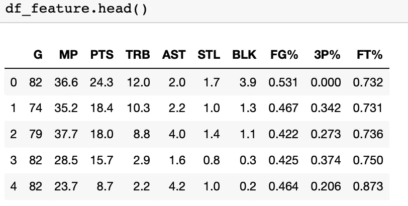

玩具数据的头

## 因变量。

我用**罗伊投票份额**作为因变量，范围从 0 到 1。投票份额越高，成为**罗伊**的几率就越高。我没有把它框架到一个分类问题上，为了避免一个不平衡的训练集。对如何从头到尾生成一个 ML 项目的细节感兴趣的可以参考[我的另一个帖子](/whos-the-mvp-of-nba-this-season-3e347c66a40a)。

## 回归模型。

我尝试了两个机器学习回归模型(**弹性网**和**随机森林**)和一个经典线性回归模型。

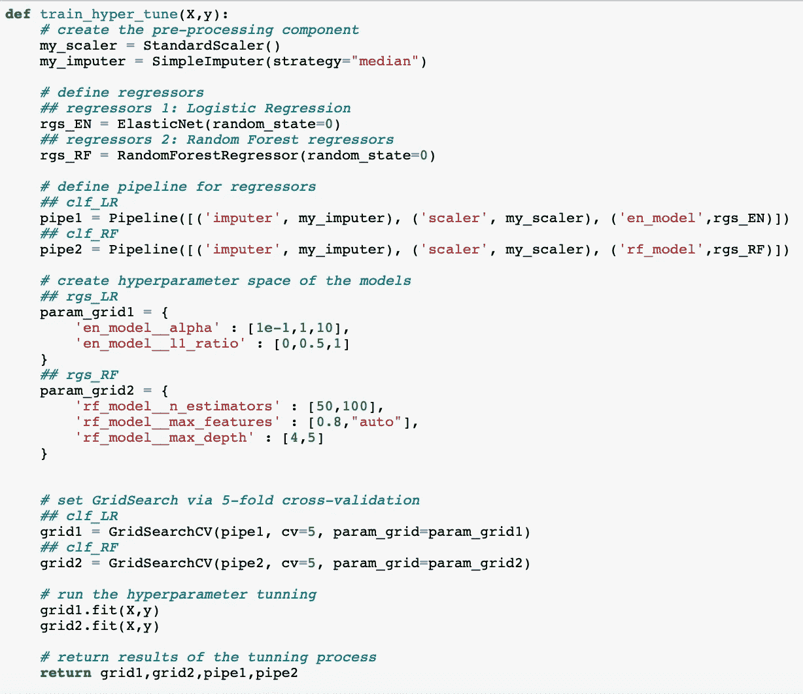

超参数调谐功能。

上面的函数显示了超参数调整函数，其中我可以使用交叉验证来确定每个模型的超参数。调整后的超参数将用于最终的模型训练。

基本线性回归在管道内定义如下。

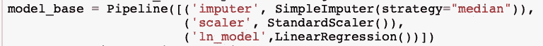

基本线性回归模型

## 超参数调整和模型训练。

我使用分割数据集训练上述模型。数据分割和超参数调整代码如下所示。

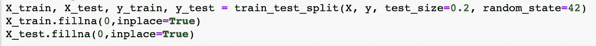

数据分割代码。

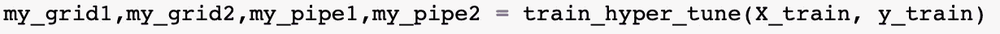

调谐过程。

上面代码中调整过的超参数然后用于训练最终的模型。

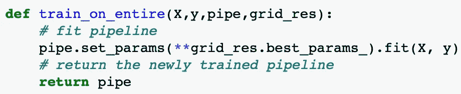

最终模型训练函数。

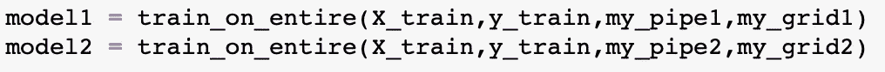

训练最终模型。

我也训练了基本的线性回归模型如下。

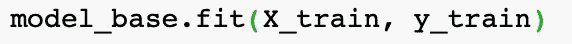

拟合基本线性回归模型。

## 绩效评估。

我在测试数据上评估了三个模型的性能。我计算回归模型的 MSE。

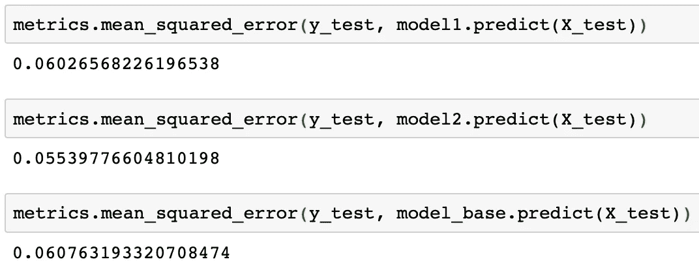

具有所有特征的三个模型的 MSE。

我发现模型 2(随机森林回归)是所有三个模型中最好的，测试数据 MSE 等于 0.055。

整个建模过程已经完成。

## 从特征空间中移除相关变量。

现在，让我们处理数据，以便排除彼此相关的特征。我简单地检查了下面的相关性。

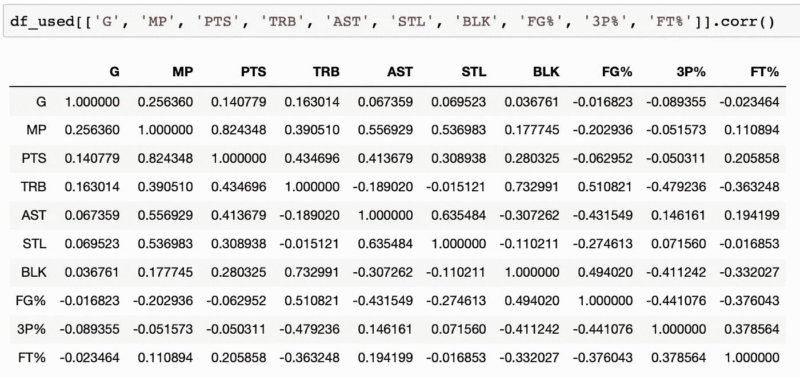

数据集相关性。

似乎每场比赛的得分(PTS)和上场时间(MP)与皮尔森的相关系数等于 82%高度相关。因此，我首先从数据集中删除 MP，然后再次重复整个建模过程。以下是测试数据 MSE:

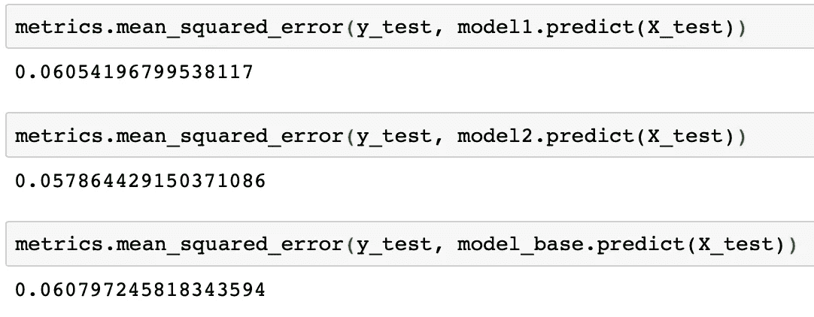

从特征集中移除 MP 后三个模型的 MSE。

我还从整个特征空间中移除 PTS，并重复整个建模过程。这是测试数据的 MSE 结果:

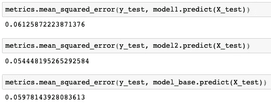

从特征集中移除 PTS 后三个模型的 MSE。

如上图所示，在解决了特征集中的共线性后，三个模型的性能几乎与完整模型相同。

这些结果表明，从特征空间中移除共线性对我们数据集中的**罗伊**的**预测**没有帮助。

顺便说一句，所有的模型对我们的问题给出了相同的答案。预测 [**Ja 莫兰特**](https://en.wikipedia.org/wiki/Ja_Morant) 将是 NBA 2019–2020 赛季的**罗伊**。

## 何时考虑多重共线性？

然而，为什么人们强调解决回归模型中多重共线性的重要性，而它对预测没有影响呢？这与模型的解释有关。

假设我们感兴趣的是检测球员的哪些基本数据对预测贡献最大。然后，我们需要小心多重共线性。

高度相关的变量可以相互竞争来解释模型中因变量的方差。具体来说，这种竞争将体现在弹性净回归和线性回归中的系数上，或者体现在随机森林回归中的特征重要性上。

由于第二个模型(随机森林回归器)是我实验中最好的模型，我将用它作为例子来解释。

我分别画出了随机森林模型 *1)* 具有所有特征、 *2)* 具有除 MP 之外的所有特征和 *3)* 具有除 PTS 之外的所有特征的特征重要性。

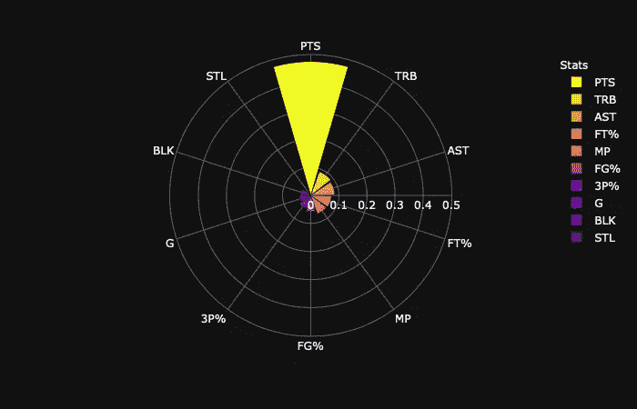

所有变量的特征重要性。

当我使用所有特征时，我发现 PTS 是模型中最重要的变量，而 MP 看起来一点也不重要。

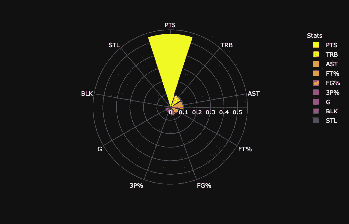

没有 MP 的特性重要性。

如果我从特征空间中移除 MP，模型仍然给出 PTS 作为最重要的变量。

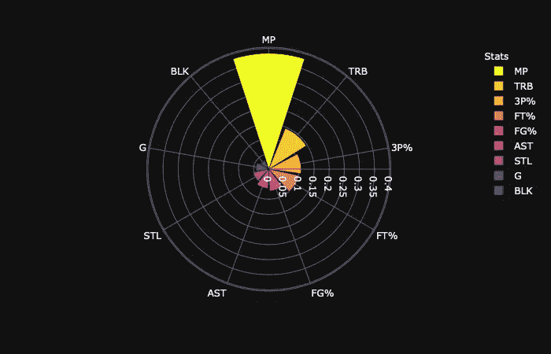

不含 PTS 的特征重要性。

但是，如果我把 PTS 从特征空间中去掉，如上图所示，MP 就成了最重要的变量。

从这些结果中我们可以看出，MP 和 PTS 对于预测都是重要的，但是如果将它们作为独立变量一起放入模型中，它们在特征重要性上是相互竞争的。

## 结论

我们需要修复回归模型中的多重共线性吗？

看情况。

如果回归器的目的是**纯粹的预测**，数据集**中存在的多重共线性根本没有害处**。它的预测能力不受相关变量的影响。

如果回归变量的目的是**了解自变量和因变量之间的关系**，则需要解决**多重共线性问题**，因为相关变量会在解释因变量时相互竞争。

希望这篇文章能对你的机器学习项目有所帮助。如果你喜欢读这篇文章，请在媒体上 [**跟随我**](https://medium.com/@jianan.jay.lin) 。如果您对数据科学文章感兴趣，这些帖子可能会对您有所帮助:

 [## Pheatmap 绘制了漂亮的热图

### 一个关于如何在 r 中用 pheatmap 生成漂亮的热图的教程。

towardsdatascience.com](/pheatmap-draws-pretty-heatmaps-483dab9a3cc)  [## 给出了随机森林分类器的特征重要性

### 如何建立一个随机森林分类器，提取特征重要性，并漂亮地呈现出来。

towardsdatascience.com](/present-the-feature-importance-of-the-random-forest-classifier-99bb042be4cc)  [## 线性回归中的一个实用建议

### 从弹性网开始，记得调好定义 l1 范数之比的超参数。

towardsdatascience.com](/a-practical-suggestion-in-linear-regression-cb639fd5ccdb) 

内森·杜姆劳在 [Unsplash](https://unsplash.com?utm_source=medium&utm_medium=referral) 上拍摄的照片