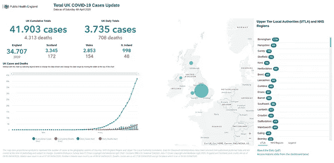
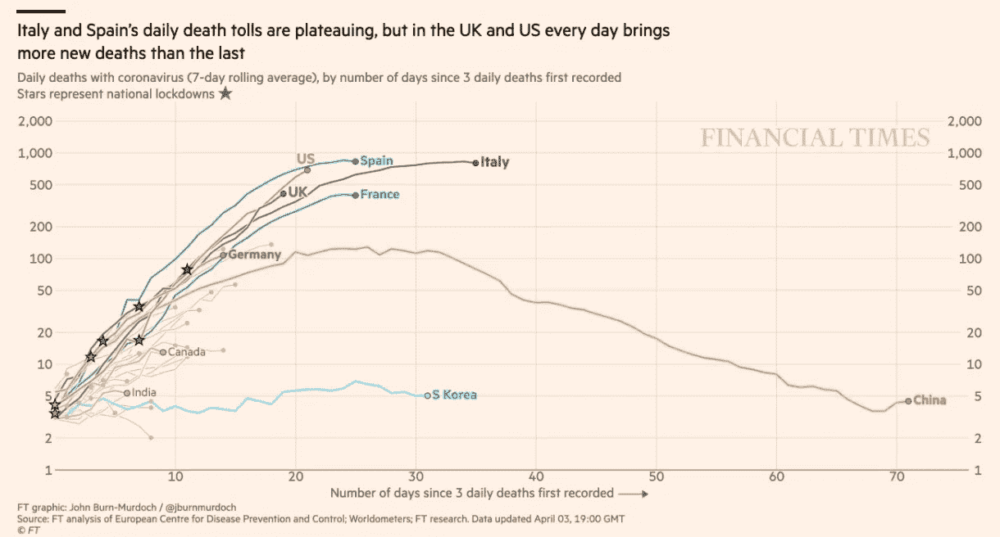

# 关于数据和科学在数据科学中重要性的思考

> 原文：<https://towardsdatascience.com/considerations-on-the-importance-of-data-and-science-in-data-science-b19f5155fd9c?source=collection_archive---------51----------------------->

又一个新冠肺炎仪表板。这可能不是很有见地，但我喜欢它，因为它是我的

我必须承认:在封锁的这些天里，我一直在摆弄关于新冠肺炎疫情的仪表盘和信息图表，就像其他人一样。我已经制作了一个交互式仪表盘，有漂亮的图表，一些格式化的表格，甚至一些(基本的)地图。它闪亮而漂亮，你可以花一些时间玩它打开和关闭图层，悬停，缩放…而且，老实说，我必须承认，我为我取得的一些成果感到自豪。**然而，它有缺陷。就像其他人的**(或者差不多)。然而，我会继续改进它，即使我担心它会一直有缺陷，即使我承认它永远不会有助于提高这方面的知识。

那么，如果我知道我不能改变它的命运，为什么我还要坚持不懈地努力呢？诚然，在某些时候，我问过自己这个问题，我甚至考虑过辞职。我不仅不想浪费时间(即使在我们被锁在家里的这些日子里，我们也有很多事情可以做)，而且我不想制造噪音、错误信息，甚至对一部已经很重要的戏剧进行更多的渲染。因为有缺陷的图形就是这样。但最终，我意识到**在这样的仪表盘上工作是一个边做边学的好机会。**

从中可以学到许多类型的课程，比如与技术技能相关的课程，或者与如何收集、可视化和分析数据相关的课程。**今天，当新冠肺炎的数据和数字到处都是时，我想分享一些关于数据科学中的科学(或缺乏科学)的思考。**

# 1.获得(正确的)数据。

听起来很明显，没有数据来可视化或分析，就没有数据可视化或数据科学。因此，任何想要进行任何类型的数据可视化或数据分析的人首先要做的就是获取数据。第二:我们不能使用任何类型的数据。我们需要使用*好的数据*，我说的*好的*是指*可靠的*、*可用的*(就许可证、格式和结构而言)、最新的和频繁更新的*，并且希望*官方的*数据，即*代表性的*足以解释我们正在研究的现象。虽然这通常不是小事，但如果我们要解释一个全新的现象，就在我们说话的时候，它正在发生，而且像新冠肺炎一样在全球范围内发生，这就更重要了。*

*通常情况下，只有两种可能的选择:要么自己收集数据，要么依赖他人的数据。虽然收集我们自己的数据可能是某些情况下的最佳选择，但在新冠肺炎的情况下，我们不太可能收集到对我们有用的数据(事实上，正如我们将看到的那样，甚至政府也在努力这样做)。因此，我们只有一个选择。当然，我们不能依赖某个随机的人或机构，我们需要依赖我们可以信任的人，比如大学(因为他们倾向于提供严格的数据)、政府(因为他们提供官方数据)或组织(比如世界卫生组织)。但是我们从哪里得到数据呢？*

**

*世卫组织的新冠肺炎仪表盘(截图自 2020 年 4 月 2 日)*

*虽然大多数政府以开放许可证的形式提供数据，允许出于任何目的使用和重新使用数据，但它们通常未能解决另一个重要问题:文件格式和数据结构。因此，在英国或西班牙等国家，如果没有手动操作，数据无法直接消费。其他公司，如世卫组织，提供了很好的数据仪表板，但他们不提供供第三方使用的原始数据。好消息是，有些人和机构正致力于使用开放许可证发布干净的数据，例如西班牙的[data dista](https://github.com/datadista/datasets/tree/master/COVID%2019)、约翰·霍普斯金的[大学](https://github.com/CSSEGISandData/COVID-19)收集来自不同政府和世卫组织的数据，甚至还有像 R 这样的[包，它从 UJH 获取数据，并为开发人员和数据科学家在他们的项目中使用提供一个很好的数据框架。](https://github.com/RamiKrispin/coronavirus)*

*因此，难怪全球大多数信息图和仪表板依赖于相同的数据源。这似乎是一个明智的决定:我们不仅得到现成可用的数据，而且我们是从可信的来源得到这些数据的。然而，正如我要说的，正是因为这个原因，他们中的大多数人都错了。但是有什么可能出错呢？*

# *2.不要把数据看得太重*

*既然我们知道从哪里获取数据，我们必须意识到:通过依赖他人生成的数据，我们没有解决数据收集的(主要)问题，我们只是将责任转移给了其他人，但有人仍然必须处理我们一直试图避免的事情。令人惊讶的是，并非每个国家都以相同的方式收集数据。*

*就拿最基本最关键的问题来说:**确诊病例数是怎么定义的**。因为新冠肺炎的症状与流感非常相似，而知道某人是否被感染的唯一方法是通过测试呈阳性。这似乎是一个很好的定义:我们有一个对每个人都一样的客观测试，所有国家似乎都使用相同的标准。不幸的是，这些测试需要稀缺的设备(与当前全球需求相比)，只能在医院进行，并且需要两天才能得到结果。因此，有许多其他场景没有在本测试中考虑，如图 2a 所示。**所以，是的，每个政府都提供了这个数字，然而他们都比真实数字低得多。低多少？没有办法知道。***

**

*确认数字≠实际数字。案例比官方的多很多。还有多少？我们不可能知道*

*让我们关注另一个例子:**死亡人数由 COVID 19** 。显然，这应该更容易。每个国家都有每天死亡人数和死亡原因的记录，所以应该很容易从所有可能的原因中筛选出死于新冠肺炎的人。嗯，不。正如我们所看到的，如果我们不能准确地定义感染新冠肺炎病毒的人数，我们就无法知道因此而死亡的人数。*

*但是，如果我们考虑到每个国家对如何统计检测呈阳性的死亡人数有不同的标准，情况可能会更加棘手。以英国的定义为例:*

> *死亡数字几乎在所有情况下都与死于医院且新冠肺炎检测呈阳性的患者有关。[……]这些数字不包括院外死亡，如护理院内的死亡，除非上文另有说明。( [*来源*](https://www.gov.uk/guidance/coronavirus-covid-19-information-for-the-public ↩︎) *)**

*所以，再一次:无论哪个国家进行测量，真实数字都比报道的要高得多。他们都错了。一些人认为，政府不想提供真实的数字，以免引起更多的社会恐慌，失去选民的支持，甚至比其他国家更好看。然而，通常更简单的答案是最有可能的答案:不是政府想对我们隐瞒信息，只是没有一个国家有能力面对这场疫情，更不用说采取准确的衡量标准了。新冠肺炎的另一出戏剧超越了个人悲剧:世界上没有一个国家准备好应对新冠肺炎所代表的压力测试。*

**

*这并不是说政府在密谋隐藏信息，只是他们没有办法获得更好的数据。戏剧就在这里！*

*但是让我们回到我们的道路:数据和数字的道路。在这一点上，我们不得不承认所有的数据都是有缺陷的，我们无法从中获得真实情况的完美画面。如果我们想这样做，我们需要使用其他数据来源，比如将每日死亡总数的记录与去年同期进行比较。当然，这将需要更多的时间，反过来，这也有其他影响和问题(例如，它不会给出新冠肺炎死亡的准确数字，因为没有办法知道他们的死因，但不同时期之间的显著差异可能是一个很好的代理)。*

*因此，我们现在有两个选择，要么对所有新冠肺炎信息图表和指标完全失去信心，要么承认它们的局限性，并假设它们只是对现实的粗略近似。*

**

*我们有两个选择:要么对所有新冠肺炎的信息图表完全失去信心，要么假设它们只不过是对现实的粗略近似*

# *3.选择正确的图形和图像*

*太好了！如果你正在读这篇文章，这意味着你可以假设现实(一如既往)远比漂亮的仪表盘所能显示的更复杂，不管它们有多花哨。说到这里:**当心花哨的视觉效果！***

******************

*我敢肯定，在这一点上，你可能已经看到了许多任何类型的整洁的信息图，就像上面的那些:其中一些使用箱线图，其他线条，其他散点图…其中一些有平滑的边缘，其他的有对数刻度的轴。甚至有一些想要引入地理空间分析并呈现不同种类的地图(choropleths，bubbles，sizes 如果你像我一样，你可以享受观看它们并与它们互动数小时的乐趣。但是它们真的能有效显示有用的数据吗？可惜大部分都不是(甚至包括我自己的一些)。*

*最基本也是最常见的一种方法是显示一个国家内的大部分病例。**大数字确实很吸引人，也很容易理解，但它们通常缺乏一些上下文，使它们真正有意义**。当然，谁都能理解一个 7 位数的数字是个大数字，但要知道它到底有多大真的很难。我们需要将它与其他东西进行比较，以全面掌握它的真正重要性。此外，由于我们处理的是一个累积数字，因此必须了解所分析的时间跨度，因为在一天、一周、一个月或一年内达到某个数字是不一样的。*

**

*大数字很容易记，也很容易理解，但单独使用时并不真正有意义。这是我试图通过添加一些背景来解决的问题。来源:[卡洛斯·卡马拉](https://ccamara.github.io/covid_spain/)*

*一种常见的变化是提供累积案例的折线图，X 轴表示日期，Y 轴表示案例总数。有几种变化:显示相对数据(例如:病例数/人口数)，用对数标度(以便更容易看到第一天与最近几天相比的变化)，显示几个类别，代表不同地区或不同类型的病例&mldr;虽然它们真的很有效，而且从技术角度来看大多数都是正确的(特别是考虑到其中一些变化会产生很大的差异)，但数字本身的表示可能很少或没有用处。真的能代表什么吗？通过提供一个根据定义将会一直增长的数字，我们可以回答什么样的问题？*

**

*显示累积案例的折线图。真的有意义吗？来源:世卫组织*

*正是出于这个原因，一些人决定使用其他指标来评估疫情的发展情况，例如每天新增病例的数量，因为这些指标使我们能够很容易地确定数字是好还是坏于前一天。同样，可以对前面的图进行同样的变化，以使其更有洞察力，例如下面的条形图，它显示了按类型分组的每日病例变化。我们不仅可以看到它们开始下降，而且，与死亡或活动病例相比，康复病例的数量正在增加。*

**

*每日案例，按类型。来源:[卡洛斯·卡马拉](https://ccamara.github.io/covid_spain/)*

*这确实比累积案例更有用，尽管它有些不稳定并可能导致混乱。以下图为例:*

**

*你能看到那种奇怪的意想不到的变化吗？就是周末效应！(这就是为什么在下一个仪表板版本中，我将突出周末)。来源:[卡洛斯·卡马拉](https://ccamara.github.io/covid_spain/)*

*你能看到 3 月 29 日和 30 日的所有数据在第二天再次达到峰值之前是如何急剧下降的吗？这确实是一种意想不到的行为，也很难解释。除非我们意识到这两天是周六和周日，并且由于在医院工作的人较少，数据不会像往常一样快，因此会在周一累积。这种现象被称为“周末效应”(我提到过你不应该把数据看得太重吗？😉)*

*正因为如此，其他一些人，如《金融时报》的约翰·伯恩-默多克(John Burn-Murdoch)更喜欢使用固定期限(如 3 天或 5 天)的滚动平均值，这是一个更稳定的数字，如下图所示。*

**

*来源:[金融时报](https://www.ft.com/coronavirus-latest)*

*其他用于修复这些异常值和显示趋势的技术是使用基于实际数据的平滑线图，就像下面由 [Pablo Rey](https://twitter.com/numeroteca) 制作的图。*

**

*基于实际数据的平滑线。来源:[蒙特拉 34](https://lab.montera34.com/covid19/)*

# *4.不要仓促比较*

*当然，最常见的视觉类型是比较新冠肺炎是如何影响不同地区的，无论是在一个国家内还是在不同国家之间(通常以中国或武汉为参照——毕竟，这是一切开始的地方)。虽然这种图表可以回答一些问题，比如一个特定地区如何对待另一个地区(因此，例如，复制或避免他们针对新冠肺炎的措施)，但这些比较确实存在问题。首先，人口或规模差异巨大的事实使得任何绝对比较都是无效的。*

*但是，即使在使用相对值(例如:每个居民的病例数)时，还有其他对疾病演变有直接影响的关键因素，其影响被认为是相同的，而实际上可能有几个数量级的差异，例如人口统计、地理、城市住区或卫生系统(就人力和财政资源而言)，等等。*

**

*按年龄和国家分列的病例和死亡率柱状图。意大利的大多数病例发生在 70-90 岁之间，而韩国的病例发生在 20-30 岁之间，因此死亡总数存在巨大差异。来源: [Diario.es](https://www.eldiario.es/sociedad/coronavirus-Italia-Espana-Corea-Sur_0_1007200429.html)*

***然而，在所有这些差异中，最相关的可能是检测新冠肺炎病毒的测试次数，这个数字不仅不同，而且通常是未知的**。这绝不是微不足道的，因为我们已经看到案例的数量是使用这个参数定义的。因此，如果一个国家进行的检测数量非常少，那么它的病例数量也将非常少。眼不见心不烦。*

*因此，这里最大的问题是，如果不考虑这些因素，比较可能会得出大量与现实无关的有偏见的结论，例如，一些国家可能会避开新冠肺炎，或者具有某种免疫力，或者新冠肺炎只会影响卫生系统糟糕的国家，无组织的政府或不发达国家。因此，就像一些政客为了自身利益已经开始做的那样，一种建立在完全错误的基础上的道德优越感的叙事存在风险。*

**

*不要像 Wopke Hoekstra 那样做草率的比较，否则你可能会像他一样得出令人反感的结论。图片:[维基共享资源](https://commons.wikimedia.org/wiki/File:WopkeHoekstra2018.jpg)*

# *5.更不要把预测当回事*

*最后一组图，也是最复杂的一组图，是那些进行预测的图。虽然它们真的很吸引人，而且显然为我们的一个主要担忧提供了答案(*)“这什么时候会结束？”/“这种情况还会持续下去吗？”*)用一种非常可以理解的方式来说，他们真的很狡猾。有几种方法可以进行预测，例如使用线性回归或模型。虽然模型可以像我们希望的那样简单或复杂(因此，它们的准确性会有很大差异)，但它们主要依赖于拥有一组良好的历史数据或了解它们想要描述的现象的逻辑。不幸的是，由于新冠肺炎是一个新现象，我们两者都缺乏，因此，现阶段的预测容易出错。一些预测是基于以前爆发疫情的其他地方发生的情况，但我们已经看到这可能会产生多大的问题。*

**

*如果我们看不到(也不理解)预测背后的模型，它可以像算命师一样有用和可靠。图片:*算命先生，由* 阿尔伯特·安克尔([维基共享资源](https://commons.wikimedia.org/wiki/File:Fortune_teller,_Albert_Anker,_1880.png))*

*最后，但同样重要的是，我们不应该忘记，它们需要特定领域的大量知识，就像大多数做这些漂亮可视化的人(包括我自己)所缺乏的一样。因此，既然我已经公开承认这超出了我的知识范围，在这一点上，我只能建议对任何不是由该领域权威人士作出的预测持怀疑态度。即使在这种情况下(如果我能理解的话)，我也会建议谨慎行事。或者更好的是:如果预测是由流行病学家做出的，而你是其中一员，那就依靠预测。*

# *包扎*

*如前所述，如果数据可视化从来都不容易，那么对于像新冠肺炎这样的新现象就更不容易了。因此，当面对任何类型的视觉效果时，我们都应该谨慎行事。如果你正在做(或计划做)任何类型的可视化，问问你自己你想回答什么问题，最好的方法是什么，考虑前面提到的注意事项，并让它们对你的读者显而易见。此外，让你的分析具有可重复性，这样任何人都可以告诉你是否做错了什么，甚至可以自己解决。如果你只是简单地看着它们，去寻找所有那些解释，如果你找不到，去寻求它们，帮助作者或者干脆忽略它，去寻找一个替代方案。但无论如何，你要时刻记住，不要把数据看得太重，也不要太盲目。数据本身并不重要，重要的是我们用它做什么，以及如何做才能获得真正重要的知识。这就是科学发挥作用的时候了。*

**原载于*[*https://www . carloscamara . es*](https://www.carloscamara.es/en/blog/2020/04/05/considerations-on-the-importance-of-data-and-science-in-data-science/)*2020 年 4 月 4 日。**

****编者按:*** [*走向数据科学*](http://towardsdatascience.com) *是一份以数据科学和机器学习研究为主的中型刊物。我们不是健康专家或流行病学家，本文的观点不应被解释为专业建议。想了解更多关于疫情冠状病毒的信息，可以点击* [*这里*](https://www.who.int/emergencies/diseases/novel-coronavirus-2019/situation-reports) *。**