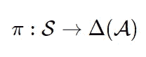
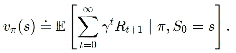
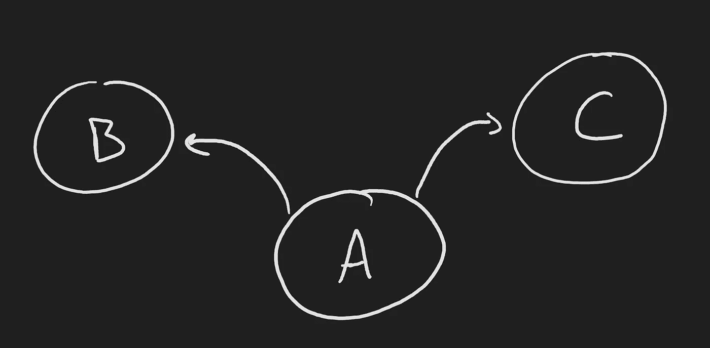
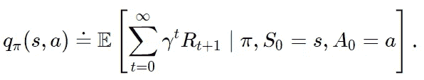
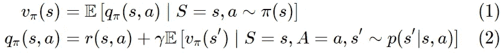
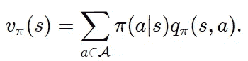
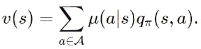
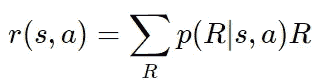
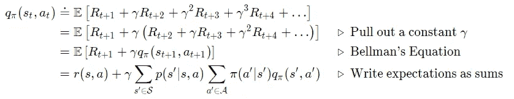
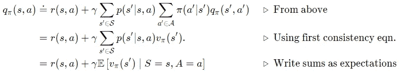

# 一致值函数定义

> 原文：<https://towardsdatascience.com/consistent-value-function-definitions-e685a191c5de?source=collection_archive---------71----------------------->

## 从数学上定义价值函数和策略，以及这些定义的一些涌现属性。

安托万·道特里在 [Unsplash](https://unsplash.com?utm_source=medium&utm_medium=referral) 上拍摄的照片

在这篇文章中，我将定义强化学习中使用的标准*γ*-贴现值函数。从这些定义出发，我将讨论值函数的两个重要涌现性质，它们证明了定义的自洽性。我将从数学上构建这些概念，重点是写出推导中的每一步，并讨论每一步的含义。这些方程是 RL 中许多重要数学证明的基础，完全理解它们对于建立 RL 的理论理解是重要的。

# 价值函数

价值函数是强化学习的核心。对于任何给定的状态，代理可以查询值函数来确定与处于该状态相关联的“值”。我们传统上将“价值”定义为未来获得的回报的总和。因为它依赖于代理人在未来会看到什么样的回报，所以必须为给定的行为策略定义一个价值函数；一项政策。也就是说，状态的值取决于代理在访问该状态后的行为；一个独立于行为的“价值”的讨论是没有意义的。

我们将策略定义为将状态映射到动作概率分布的函数。形式上，

其中𝒮表示代理可以访问的所有可能状态的集合(通常称为“状态空间”)，𝒜表示所有可能动作的集合(通常称为“动作空间”)，δ(𝒜表示动作集合上的标准单形。标准单纯形只是在动作空间上书写概率分布的一种形式方法。简而言之，策略接受一个状态，并返回代理在该状态下应该采取哪些操作的权重。大的权重导致选择该动作的频率，小的权重导致低的频率。

有了价值函数的直观定义和策略的正式定义，我们可以写出价值函数的正式定义:

请注意，在偶发性问题设置中，我们可以假设终止后所有转换的γ=0，因此这些转换对总和仅贡献一系列零，可以忽略不计。

值得注意的是，上面给出的定义只是价值函数的*一个*可能的定义。强化学习的大部分理论是围绕上面定义的γ-折扣奖励值函数发展的，这也是我们将使用的定义。然而，也考虑了其他替代方法，尤其是最近，包括平均奖励值函数。

一个简单的三态 MDP。图片作者。

上面定义的价值函数提出了这样一个问题:“假设我们处于某个状态，我们可以期望在未来看到多少回报？”为了使用这个值函数来做出决策，代理可以查询可能的下一个状态的值。例如，假设一个代理处于状态 A，有两个动作分别指向状态 B 和 C，代理可以问 *v(B)* :“在状态 B 我会看到多少奖励？”或者 *v(C)* :“在 C 国我会看到多少奖励？”

使用状态值函数来选择动作的困难在于它(a)要求代理提前知道动作的结果(例如，采取“向左”动作导致进入状态 B ),以及(B)要求动作每次都确定性地导致相同的状态。强化学习框架旨在处理非常一般的问题设置，其中(a)和(b)不一定都为真。

为了克服这些挑战，我们引入了状态-动作值函数(一般简称为“动作值函数”)；但是我不喜欢这种命名约定)。状态-动作值函数定义为

首先注意(顾名思义)这现在是一个状态*和*动作的函数，并返回未来奖励的平均值。这个和状态值函数的区别只在于(S，A，R，S，A，R，…)序列的第一个动作。在状态值函数的情况下，第一个动作是根据π(S₀分布的随机变量)；然而，在状态-动作值函数的情况下，第一个动作是非随机的并且是给定的。

通过访问状态-动作值函数，代理不需要知道其环境的状态动态。它不需要知道在状态 A 中采取“左”的动作会导致状态 B，状态 B 具有值 *v(B)* 。相反，代理可以查询其状态-动作值函数，以获得在状态 A 中采取“向左”动作的值， *q(A，left)* 。正如我们将在下一节中看到的，代理人不再需要访问环境模型来做出决策这一事实是状态-动作值函数的一个定义性特征。直观地，状态-动作值函数隐含地学习环境动态的模型。

# 贝尔曼一致性方程

*v* 和 *q* 都满足一组所谓的贝尔曼一致性方程。也就是说，对于我们的任何状态和行为

其中 *r(s，a)* 是返回平均一步奖励给定状态 *s* 和动作 *a* 的函数。这有点复杂，所以让我们一点一点地来看。

等式(1)简单地说:如果对动作求平均，则状态 *s* 的状态值函数等于状态 *s* 的状态-动作值函数。将期望值写成一个和，我们得到

即:在 *s* 处的状态值函数是状态-动作值函数的所有可能动作的总和，由采取每个动作的概率加权。这是有道理的。两个价值函数对未来奖励有相同的定义，遵循政策π，并对γ折扣奖励进行求和。价值函数仅在第一步有所不同，无论行动是给我们的(状态-行动价值函数)，还是我们根据π(状态价值函数)对行动取平均值。

通过访问状态-动作值函数，我们可以通过考虑序列中第一个动作的备选策略来构建任意多个可能的状态值函数。例如，假设代理想要考虑这样一个场景，其中(S，A~μ，R，S，A~π，R，S，A~π，R，…)第一个动作是从策略μ中选择的，所有未来的动作都是根据策略π选择的。这种策略组合的价值函数可以写成

这种情况发生在策略改进设置中，代理一次只能在一个状态下改进其策略。代理为第一个状态寻找更好的策略，假设它为所有未来状态遵循π，那么根据策略改进定理，我们可以证明这个新的联合策略至少与π一样好，如果不是更好的话。

等式(2)更复杂。让我们从简单的部分开始，这个新函数的定义 *r(s，a)* ，

这就是我在下一次从状态 *s* 开始并采取行动*a*的转变中看到的平均回报

为了理解等式(2)的第二部分，我们先回忆一下价值函数的定义。

其中期望是以 *s* 和 *a、*为条件的，但是为了空间和清晰起见，我省略了这个细节。我还将第一次奖励的期望值替换为我们上面计算的平均奖励函数。

现在利用我们从第一个一致性方程(方程 1)中学到的知识，我们可以写出

我们恢复第二个一致性方程，方程(2)。

这个第二一致性方程给了我们一些关于状态-动作值函数和状态值函数之间的区别的直觉。特别是，国家行为价值函数的不同之处仅在于序列的第一个奖励。在状态-行动的情况下，我们考虑由确定性行动 *a* 选择的奖励，而不管该行动可能来自哪里(它可能被策略π采样，它可能被其他策略采样，等等)。).在状态值案例中，我们考虑平均奖励，其中根据策略π对所有行为取平均值。我们不能考虑作用的其他分布，也不能考虑特定的单个作用(这当然是作用分布的一个特例，所有的概率质量都在一个作用上)。

理解价值函数和策略的定义，以及它们的一些核心涌现性质，对于 RL 证明中更严格的构造是至关重要的。拥有直觉有助于阅读证明和获得“基本想法”，但直觉本身不足以抓住 RL 中的一些微妙之处；因此经常导致不一致的误解或代码中的错误。例如，一个常见的误解是，访问一个国家行动价值函数意味着一个人可以通过对该国家行动价值函数的行动进行预期来计算*任何*其他政策的值。然而，很明显(希望如此),这种期望仅仅改变了轨迹中的第一步，但是所有以后的步骤都是关于原始策略π的。