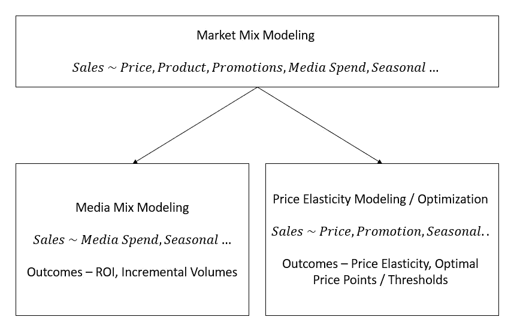
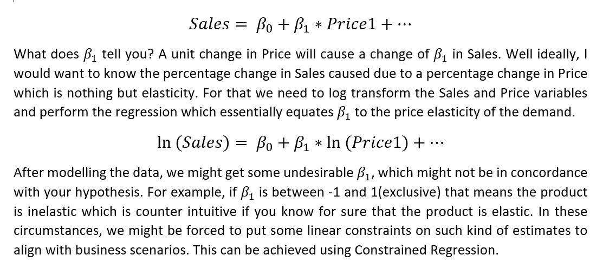
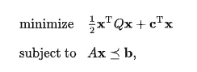
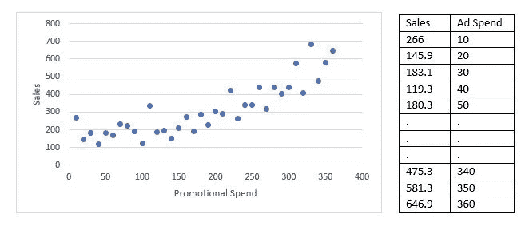
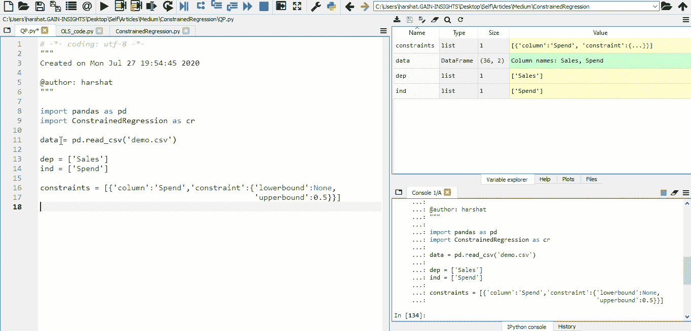
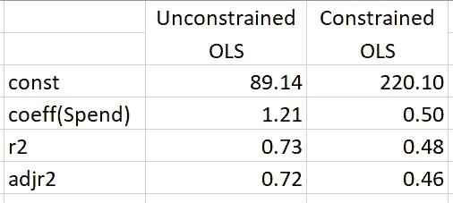

# 约束线性回归

> 原文：<https://towardsdatascience.com/constrained-linear-regression-aaf488296d93?source=collection_archive---------27----------------------->

## 市场组合建模和价格促销优化

里卡多·戈麦斯·安吉尔在 [Unsplash](https://unsplash.com/s/photos/mesh?utm_source=unsplash&utm_medium=referral&utm_content=creditCopyText) 上的照片

当我第一次听说“约束回归”的时候，我很困惑，为什么有人想要约束为你的数据提供最优估计的系数？事实证明，这是市场组合建模和价格促销优化的一个重要方面，尤其是在零售和 CPG 行业。我把这篇文章分成两个部分，这样容易理解。

1.为什么我们需要约束回归？

2.执行约束回归的方法

## 为什么我们需要约束回归？

对于实际应用，我们转向一个叫做市场组合建模(MMM)的概念。它有助于量化各种营销因素对销售额或销量份额的影响。这些营销因素主要是营销的 4p，即价格、促销、产品和地点。

如果我提高一种产品的价格，我的销售额会有什么变化？如果我开展特定的促销活动，我的销售额会有怎样的变化？事实证明，“价格”和“促销”(持续)很容易量化，而“产品”和“地点”(分类)可能需要混合模型。

以销售为因变量，营销因素为自变量，进行多元线性回归，可以很容易地找到量化各因素影响的系数。

注:在行业中，专业人士喜欢交替使用市场组合模型、媒体组合模型、价格弹性模型等。在所有三个模块中工作过之后，我认为市场组合建模是母模块，媒体组合建模和价格弹性建模是子模块。

如果我们将销售量作为因变量，在将其他因素对销售的影响隔离后，只有营销支出作为自变量，我们通过模型系数估计 ROI，如果我们将销售量作为因变量，将价格作为自变量，在将其他因素对销售的影响隔离后，我们通过模型系数估计价格弹性。

假设我们正在对一些零售数据进行建模，将销售额作为因变量，将其中一种产品的价格作为其他几个变量中的一个自变量。该等式将如下所示，

来源:https://medium.com/@harsha.ft194029 @[作者](https://medium.com/@harsha.ft194029)

## 约束回归的不同方法

> **二次规划:**

[https://en.wikipedia.org/wiki/Quadratic_programming](https://en.wikipedia.org/wiki/Quadratic_programming)

OLS 的成本函数可以很容易地转换成上述方程，因此 QP 可以应用于解决线性等式和不等式约束。

> **贝叶斯线性回归:**

如果我们约束一些系数，这意味着我们对估计有一些先验知识，这就是贝叶斯统计所处理的。我们可以指定估计值的先验分布，并执行贝叶斯回归来获得期望的结果。

上面提到的并不是一个详尽的列表，请在评论区随意添加任何其他方法。

让我们考虑一些假设的销售和促销支出数据，如下所示。

来源:[https://www . ka ggle . com/djokester/三年洗发水销售额](https://www.kaggle.com/djokester/sales-of-shampoo-over-a-three-year-period)(已修改)

我们将执行普通的最小二乘法，看看结果是什么。

来源:作者@[https://medium.com/@harsha.ft194029](https://medium.com/@harsha.ft194029)

***让我们把“花”的系数约束到一个任意的上界，比如说 0.5？***

来源:作者@ https://medium.com/@harsha.ft194029

比较以下表格格式的结果，

来源:作者@[https://medium.com/@harsha.ft194029](https://medium.com/@harsha.ft194029)

就 r2 而言，约束系数让我们付出了太多。上面用于约束回归的包是为[营销组合模型工具](https://gain-insights.com/solutions/consumer-packaged-goods/marketing-mix-model/)定制的库。

如果您有任何疑问/反馈或者您想在数据科学项目上合作，请通过 LinkedIn 联系我