# 去神秘化的约束优化，用 Python 实现。

> 原文：<https://towardsdatascience.com/constrained-optimization-demystified-with-implementation-in-python-235639546fa9?source=collection_archive---------6----------------------->

## *设计一种新的鲁棒约束优化算法。*

[src](http://unsplash.com)

*非线性约束优化问题是一类重要的问题，具有广泛的工程和科学应用。在本文中，我们将看到简单无约束优化技术的改造如何导致约束优化问题的混合算法。稍后，我们将通过对一个问题集的详细分析来观察算法的健壮性，并通过将结果与 python 中的一些内置函数进行比较来监控 optima 的性能。*

**关键词** —约束优化、多变量优化、单变量优化。

许多工程设计和决策问题的目标是优化功能，同时要求满足由于空间、强度或稳定性考虑而产生的一些约束。因此，**约束优化是指在某些变量存在约束的情况下，针对这些变量优化目标函数的过程。**

具有 N 个变量的约束优化问题由下式给出:

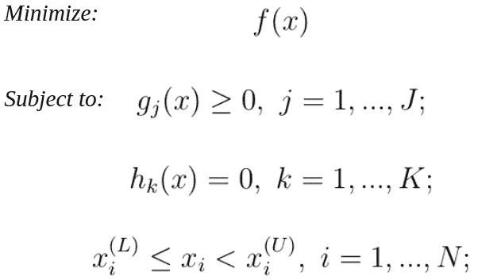

——其中***gⱼ(x)****为 j 个不等式约束，***【hₖ(x)***为 k 个等式约束， ***f(x)*** 为待优化的目标函数。让我们了解一些优化中常用的术语。*

# *理论*

*用数学最优化的说法，有两条途径可以找到最优值(数值上):*

***1。使用直接搜索法:**这里只使用给定点的函数值来寻找最优。它的工作原理是比较一个点的邻域中的函数值，然后向导致函数值减少的方向移动(对于最小化问题)。当函数是**不连续的，**因此导数在该点不可用时，通常使用直接搜索方法。*

***2。使用基于梯度的方法:**这里，我们使用一阶和二阶导数来定位最优值。这些方法考虑了梯度信息，因此具有更快地**收敛到最优值的优点。***

***如何用数值求特定点的导数？**我们使用中心差分法，数学上给出为{limit h - > 0}:*

**

*我们提出的约束优化算法采用了两种单变量优化方法和一种多变量优化方法。我们的主要目的是将这个多变量约束优化问题转化为一个无约束的多变量优化问题，然后这个无约束问题可以用单变量优化方法来解决。*

## *单变量优化*

*同样，有两种途径可以找到单个变量的线性或非线性函数的最优解，一种是使用直接搜索方法，另一种是通过基于梯度的技术。人们可以单独使用这两种方法中的任何一种来找到最优解。我们的约束优化算法使用了这两种方法。使用直接搜索方法，我们将包围最优值，一旦我们有了最优值的特定界限，我们就可以使用基于梯度的方法(对于单变量函数)找到精确的最优值。*

*有许多直接搜索和基于梯度的方法来获得单变量函数的最优值。我们的方法使用边界相位法和割线法。*

*注意:所有描述的优化方法都是迭代的。经过一系列迭代，我们逐渐收敛到最优值。*

***边界相位法:**一种直接搜索法，用于寻找单变量无约束优化中最小值的上下界。算法给出为(***f’***指 1ˢᵗ阶在一点的导数):*

1.  *选择初始猜测 **x⁽⁰⁾，**一个增量**δ(~ 0)**，设置迭代计数器 **k=0** 。*
2.  *若**f(x⁽⁰⁾-δ)**>**f(x⁽⁰⁾+δ)**，则δ为**正**。否则如果，**f(x⁽⁰⁾-δ)**<**f(x⁽⁰⁾+δ)**，那么，δ就是**负**。否则转到**步骤 1** 。*
3.  *设定**x⁽ᵏ⁺⁾=x⁽ᵏ⁾+**2ᵏδ.**(指数扰动)。***
4.  ***如果 **f(x⁽ᵏ⁺ ⁾) < f(x⁽ᵏ⁾)** ，设置 **k = k+1** 并转到 **step_3** 。否则，最小值出现在 **(x⁽ᵏ⁻ ⁾，x⁽ᵏ⁺ ⁾)** 和**终止**。***

*****割线法:**一种非常流行的基于梯度的单变量优化方法。终止条件是当函数在一点的梯度很小(~0)时。该方法如下:***

1.  ***选择两点 **a，b** 使得**f’(a)**和**f’(b)**符号相反。换句话说，**f’(a)。f'(b) < 0。**选择 **ε{epsilon}** 一个小数字，又名终止因子。设定 **x₁= a** 和 **x₂ = b** 。***
2.  ***计算一个新的点**z = x₂-(f'(x₂)*(x₂-x₁))/(f'(x₂)-f'(x₁))**并找到**f’(z)**。***
3.  ***如果 **|f'(z)| ≤ ε** ，**终止。** 否则如果 **f'(z) < 0，**置位 **x₁= z** 并转到 **step_2** ，
    否则如果 **f'(z) ≥ 0，**置位 **x₂ = z** 并转到 **step_2** 。***

***其他流行的基于梯度的单变量优化方法有[二分法](https://en.wikipedia.org/wiki/Bisection_method)、[牛顿-拉普森法](https://en.wikipedia.org/wiki/Newton%27s_method)等。***

*****单向搜索:**这里的目标是找到在特定方向上函数值将最小的地方。数学上，我们需要找到标量**α**(α)使得， **f(α) = f(x⁽ᵗ⁾+α.s⁽ᵗ⁾)** 被最小化，这是使用单变量优化方法实现的。{s⁽ᵗ⁾ =搜索方向}。***

***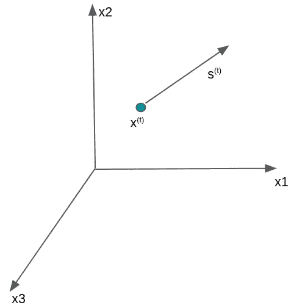***

***注意:许多多变量优化技术不过是连续的单向搜索，沿着特定方向寻找最小点。***

## ***可变度量方法(大卫顿-弗莱彻-鲍威尔方法):***

***DFP 方法是一种基于梯度的**多变量优化**算法。它通过不考虑用于创建搜索方向的 **hessian** 而更快地收敛到最优值，从而克服了其他几种多变量优化算法的局限性。搜索方向由下式给出:***

******

***其中矩阵 A 由下式给出:***

***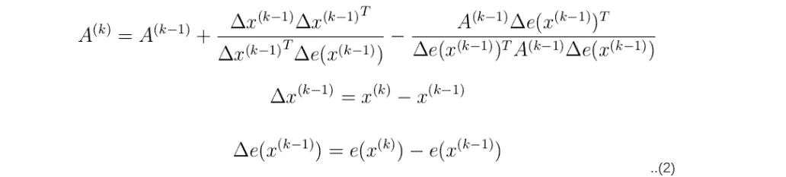***

****e(x* ⁽ᵏ⁾ *)* 代表函数在点 *x* ⁽ᵏ⁾.的梯度单向搜索涉及割线方法和边界相位方法，以在搜索空间中找到 **α** 的值。单向搜索后获得的新的点是:***

***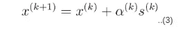***

1.  ***选择初始猜测 **x⁽⁰⁾** 和终止参数 **ε₁、ε₂** 。(注意，这里的 **x⁽⁰⁾** 是矢量)。***
2.  ***在 **x⁽⁰⁾** 找到∇**f(x⁽⁰⁾)**{梯度**ft5 }并设置**s⁽⁰⁾=-**∇**f(x⁽⁰⁾)**{初始搜索方向}。*****
3.  ***找到**α**(α)使得 **f(x⁽⁰⁾ + α。s⁽⁰⁾)** 最小，终止参数 **ε₁** 。用 **α*表示。**设定 **x⁽ ⁾ = x⁽⁰⁾ + α*s⁽⁰⁾** 且 k=1。算算∇**f(x⁽⁾**。{f(x⁽⁰⁾ + α。s⁽⁰⁾)是 **α，**的函数，我们将通过单变量优化方法找到这个 **α*** 。***
4.  ***使用*eq****【1】****和 eq****【2】中的公式找到 **s⁽ᵏ⁾** 。******
5.  ***找到λ⁽ᵏ⁾，让 f(x⁽ᵏ⁾ +λ⁽ᵏ⁾.s⁽ᵏ⁾) 最小，终止因子 **ε₁** 。套， **x⁽ᵏ⁺ ⁾ = x⁽ᵏ⁾ +λ⁽ᵏ⁾.s⁽ᵏ⁾** 。***
6.  ***检查终止条件。||x⁽ᵏ⁺ ⁾ -x⁽ᵏ⁾||/||x⁽ᵏ⁾|| ≤ ε₂吗？
    {||。||表示向量的范数}。***
7.  ***如果是，**终止；**否则设置 k = k+1，转到 **step_4。*****

## ***罚函数法:***

***一个**罚值**(正则项)是我们添加到目标函数中的附加项，它有助于控制目标函数的过度波动。通过添加这些惩罚项，我们将约束问题转化为无约束问题，其结构使得最小化有利于满足约束，如下图所示。***

***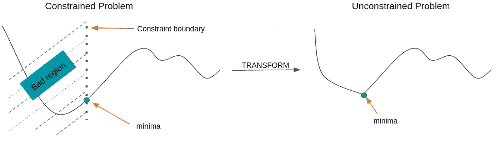***

***简而言之，这种技术是在目标函数中增加一项，使得违反约束会产生很高的代价。这就是所谓的**罚函数法**。数学上，***

***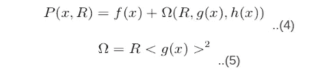***

***其中 R 是罚参数，P(x，R)是罚函数，ω是罚项。根据约束的可行性和类型，有各种类型的惩罚条款。这一项被称为**括号操作符罚**项。在哪里，***

******

***该方法给出如下:***

1.  ***选择初始解 **x⁽⁰⁾** 和终止参数 **ε₁，**惩罚参数 **R⁽⁰⁾，**和一个更新因子 **c** 。***
2.  ***形成罚函数**p(x⁽ᵗ⁾,r⁽ᵗ⁾)=f(x⁽ᵗ⁾)+ω(r⁽ᵗ⁾，g(x⁽ᵗ⁾)，h(x⁽ᵗ⁾))** 。***
3.  ***使用 **DFP** 方法找到 r⁽ᵗ⁾).p(x⁽ᵗ⁾**的最小值**设解为 **x⁽ᵗ⁺ ⁾** 。{这个特殊的步骤是一个无约束优化问题}。对于 DFP，我们最初的猜测是 **x⁽ᵗ⁾.*****
4.  ***检查终止条件:
    是 **|P(x⁽ᵗ⁺ ⁾，R⁽ᵗ⁾) - P(x⁽ᵗ⁾，R⁽ᵗ⁻ ⁾)|** ≤ **ε₂** ？{|.|是 mod 函数}。
    如果是，设置 **xᵀ= x⁽ᵗ⁺ ⁾** 和**终止**，否则
    转到 **step_5。*****
5.  ***更新 **R⁽ᵗ⁺ ⁾= c*R⁽ᵗ⁾** 。设置，t=t+1，转到 **step_2** 。***

***注意:所有描述的优化方法都是迭代的。经过一系列迭代，我们逐渐收敛到最优值。我们在每次迭代中更新这个 R 值。***

***使用罚函数法有几个限制。首先，它导致轮廓的变形，由于这种变形，算法需要更长的时间来收敛。而且，这导致了人为的局部最优值的存在。***

***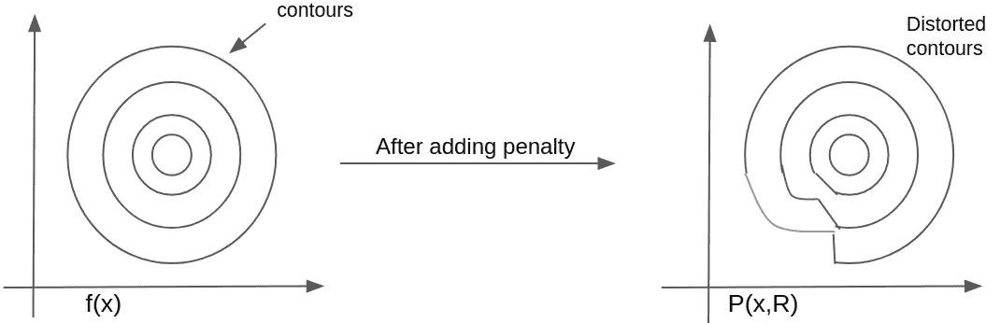***

***为了实现的目的，我们将只坚持罚函数法。还有另一种方法称为 [**乘数法**](https://en.wikipedia.org/wiki/Lagrange_multiplier)**用来克服失真的局限性。它基本上是对罚函数法的一个微小修改。该方法不会扭曲轮廓，而是具有将轮廓移向约束最佳点的效果。所以，这里人为的局部最优值为零。*****

*****乘数的**方法和**罚函数方法**都将约束优化问题转化为无约束问题，进而可以用任何多变量优化方法求解。*******

***嗯，就这样吧！！！如果你已经走了这么远，太好了！现在，让我们看看我们的方法的流程图，然后去实现。为了便于实现，我们将只讨论罚函数法。***

***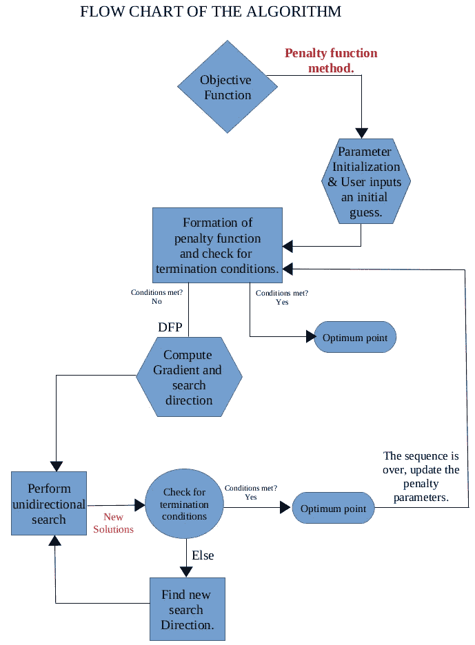***

## ***Himmelblau 函数:***

***为了说明我们的方法，我们将使用著名的 Himmelblau 函数(见图)，给出为 *f(x，y)=(x+y11)+(x+y7)*。***

***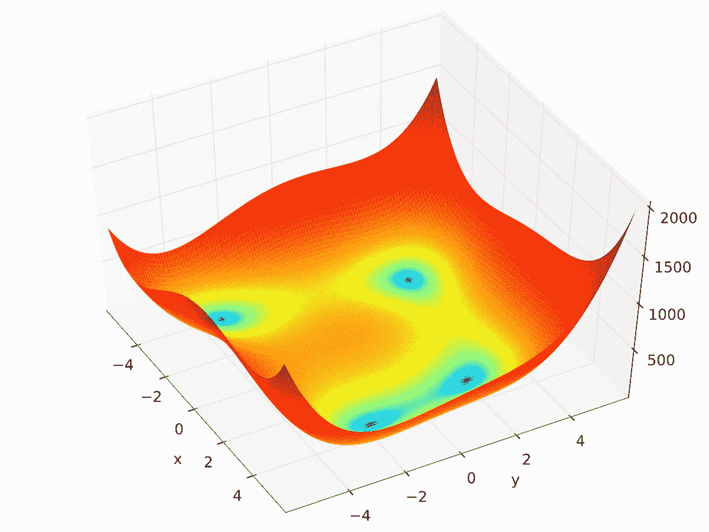***

***[src](http://Wikimedia.org)***

***让我们使用我们提出的算法来解决下面的约束优化问题。***

***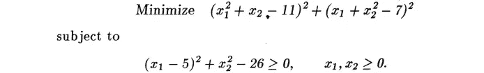***

# ***履行***

*****DFP** 方法用于多变量优化，结合**边界相位**和**割线方法**用于获得单向搜索。代码用 python 实现，托管在我的 GitHub [repo](https://github.com/aakash2016/Optimization_) 中。我们现在简要演示所使用的每个函数:***

******multi_f:*** 该函数取一个**输入向量 x** (搜索空间中的一个点)并返回该点的函数值(惩罚函数值)。***

******grad _ multi _ f:***该函数使用**中心差分**方法计算搜索空间中特定点的梯度向量。***

******包围 _:*** 该函数实现了用于包围 **α*** (通过执行单向搜索获得的最小值)的边界相位方法。它取一个矢量 **x** 和矢量 **s** (搜索方向)并输出一个区间，基于该区间可以对 **α** 进行评估。***

******f _dash:*** 该函数用于使用中心差分法得到单变量函数的一阶微分。(代表***f’***)。***

******割线 _ 最小值:*** 该函数将从边界相位方法中找到的边界、一个点 **x** 和一个搜索方向 **s** 作为输入，并评估 alphastar。***

******compute_z:*** 该函数用于计算割线法中使用的公式:***

***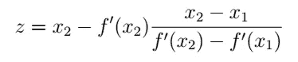***

******DFP:*** 它只取输入向量 ***x*** 作为自变量，返回解向量。在*主*函数内调用该函数，直到满足罚函数法的终止条件。***

***它首先从输入向量***【x，*** 中找到一个搜索方向 **s** ，然后通过调用边界相位和割线方法执行单向搜索，以找到最优的 **α** 。然后，它通过评估等式(1)和(2)找到新的搜索方向*。该过程继续进行，直到满足 DFP 的终止条件，并且我们已经为该特定序列找到了该无约束问题的最优解。****

## ***结果***

***完整的代码在我的 Github [repo](https://github.com/aakash2016/Optimization_) 上。注意，我们的方法是一般化的，并且适用于人们想要工作的任何数量的维度。
我们算法的参数设置是:
*** m = 2**{指定我们正在处理的总尺寸}，
*** R=0.1** {panalty 参数}，
*** c = 1.55**{用于更新 r 的因子}，
*** x_ip** (初始猜测)= **(0.11，0.1)ᵀ** 。***

***我建议读者尝试使用不同的初始猜测，并使用这些参数值。因此，我们的算法在 **14 个序列后收敛。我们得到了约束优化问题的最优解。*****

***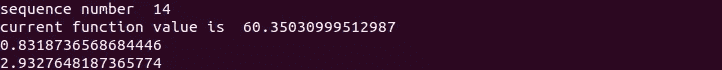***

***让我们将我们的结果与从 ***python*** 中 ***scipy*** 库的 ***优化*** 模块中找到的结果进行比较。{使用相同的初始猜测}:***

***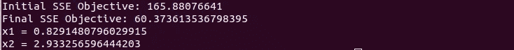***

***结果非常接近，为了得到更接近的结果，我们可以尝试非常小的终止因子。我还尝试了一系列不同的初始猜测。是的，它们都融合了！！***

***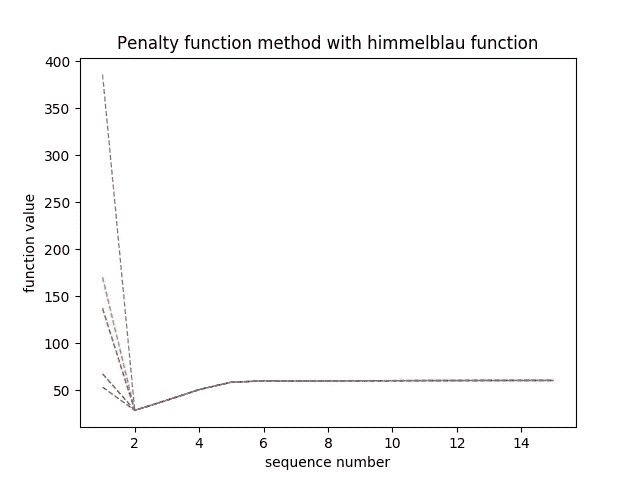***

> *****“过早优化是万恶之源”** —唐纳德·克努特(Donald Knuth)。***

***我希望你和我一起享受约束优化的过程。我很想知道任何阅读这篇文章的人的反馈(鼓掌👏🏼也会得到很好的反馈😇).我很乐意回答对上述任何概念的疑问/问题。你可以通过 Linkedin 联系我。***

***最后，特别感谢迪帕克·夏尔马教授，IIT·古瓦哈蒂，他教了我优化课程，作为我课程的一部分。***

***谢谢大家！！***