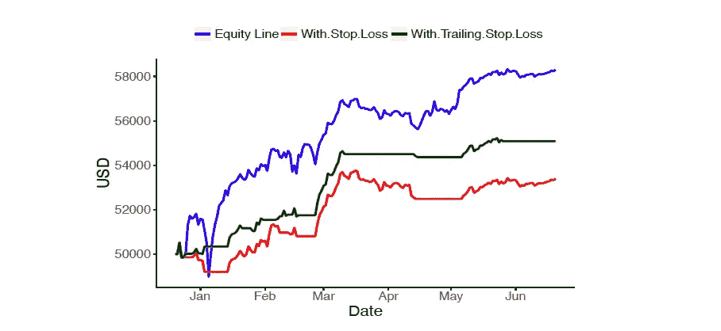

# 构建协整的加密货币投资组合

> 原文：<https://towardsdatascience.com/constructing-cointegrated-cryptocurrency-portfolios-d0a27922891e?source=collection_archive---------19----------------------->

## 加密货币

## 利用协整检验构建加密投资组合

像水一样，隐花倾向于一起移动，但要小心湍流！里奥·霍奇斯在 [Unsplash](https://unsplash.com/s/photos/waterfall?utm_source=unsplash&utm_medium=referral&utm_content=creditCopyText) 上的照片

***来自《走向数据科学》编辑的提示:*** *虽然我们允许独立作者根据我们的* [*规则和指导方针*](/questions-96667b06af5) *发表文章，但我们并不认可每个作者的贡献。你不应该在没有寻求专业建议的情况下依赖一个作者的作品。详见我们的* [*读者术语*](/readers-terms-b5d780a700a4) *。*

2009 年，比特币(BTC)问世，成为第一种去中心化的数字货币。从那时起，比特币已经被成千上万的商家和供应商接受，加密货币市场也出现了巨大的增长。如今，除了比特币之外，还有一千多种加密货币，如以太坊(ETH)、莱特币(LTC)、比特币现金(BCH)，以及更多正在国际主要加密货币交易所交易的货币。

多年来，由于各种原因，比特币的许多替代品被发明出来。例如，以太坊是一个运行智能合约的去中心化平台，它的创建是为了解决应用程序开发缺乏比特币脚本语言的问题。作为另一个例子，比特币现金是为了解决比特币的可扩展性问题而发明的，因为它的块大小限制了比特币网络在给定时间框架内可以处理的交易量，等等。这种创新导致了许多替代硬币的快速增长，以及加密货币市场规模的上升。尽管如此，比特币在交易量、价格和市值方面一直名列前茅。

比特币和许多替代币的兴起为投资者和投机者创造了交易机会。事实上，研究表明，加密货币指数(CRIX)和传统资产之间的相关性非常低。此外，实证结果表明，将 CRIX 纳入仅包含传统资产的初始投资组合可以扩大有效边界，并为投资者提供额外的效用。

回想一下，标准普尔 500 在 2017 年的回报率约为 21%，但比特币在一年内的回报率达到了惊人的 1318%。2017 年 12 月中旬，比特币价格达到历史最高水平，超过 1.9 万美元，24 小时交易量约为 230 亿美元。然而，随着价格在 2 月初跌至 6000 美元的低点。比特币曾被认为是最大的泡沫之一，在新冠肺炎疫情期间飙升，并像黄金一样被更广泛地接受为通胀对冲工具。

许多加密交易所允许投资者直接从他们的银行账户购买硬币，然后将硬币转移到不同的数字钱包和交易所进行交易。一些交易所甚至允许卖空加密货币。

与传统股票市场不同，大多数加密货币高度相关。例如，4 种数字货币(即 BTC、瑞士法郎、长期货币和 BCH)之间的日收益率相关性超过 75%。加密货币的高波动性要求开发市场中性的交易策略，它们的高相关性促使我们研究协整或均值回归策略。

密码之间日收益率的相关性。

寻求从价差的均值回复特性理解不同资产价格和套利的长期共同运动的学术研究者和实践者已经广泛地研究和学习了均值回复交易策略。

传统金融的许多领域都制定了策略，但对交易对或一篮子加密货币的研究却很少。事实上，大多数关于交易加密货币的研究都是基于技术分析，或者从交易所之间的价格差异中套利。

> 通过一系列统计测试，我们创建了一个可交易的投资组合，包括比特币(BTC)、以太坊(ETH)、比特币现金(BCH)和莱特币(LTC)，具有快速的均值回复价格运动。

在我们最近的研究( [Nguyen 和 Leung，2019](https://ssrn.com/abstract=3235890) )中，我们分析了构建一组共同整合的加密货币的过程。这个过程涉及一系列的统计检验，包括(i) Johansen 协整检验，和(ii)Engle 和 Granger 开发的经典两步方法。

在我们的结果中，我们构建了涉及四种加密货币的协整投资组合:比特币(BTC)、以太坊(ETH)、比特币现金(BCH)和莱特币(LTC)。协整检验给出了一个可交易的投资组合，因为快速均值回复利差会经常跨越进场和出场水平。该策略基于交易的价差形式:

**利差= BTC- a*ETH- b*LTC- c*BCH，**

有趣的是，这两个协整检验实际上产生了不同的均值回复投资组合。

价差由两种方法构成:(左)Johansen 方法，(右)Engle-Granger 方法

从上图可以看出，很难看出哪个利差看起来更稳定或均值回复。然而，从**交易的角度来看**，导致*频繁* *从两个方向跨越*均衡水平的周期性运动或波动是可取的，特别是考虑到进入和退出规则是基于对平均价格的偏离。

由于这个原因，恩格尔-格兰杰方法在这个例子中更适合交易，因此被用来对我们的交易系统进行回溯测试。我们还设置了进出价格阈值，以均值的标准差来衡量。为了减轻更高提款的影响，我们还增加了 5%的止损单。

交易系统有 5%的止损，设置进场/出场水平为均值的负/正 1 个标准差。从上到下，我们绘制了价差、位置(-1，0，+1；蓝色)、累积 PnL(绿色)和下降(红色)。

我们发现设置更高的进场和出场水平会带来更高的利润(见下表)。与带止损出场或跟踪止损的交易系统相比，不带止损出场或跟踪止损的交易系统利润最高，但亏损也最大。除了建立这种新的加密投资组合，我们的方法可以更广泛地应用于使用其他加密货币创建新的共同整合投资组合。

测试期间跟踪止损 5%的交易策略统计。贸易统计词汇如下。

净值曲线:(上)没有止损/跟踪止损，(中)有 5%的跟踪止损，(下)有 5%的止损。

随着加密货币市场随着新硬币和新交易所的不断增长，个人投资者、加密基金经理和监管机构了解所有加密货币及其衍生品之间的价格依赖性非常重要。未来的研究有很多方向。我们的一个项目涉及开发一种机器学习方法，从大量加密货币中自动选择一个小的投资组合。

点击[此处](https://ssrn.com/abstract=3235890)对上述综合加密组合的全面分析(免费 pdf)。

贸易统计解释

# 参考

H.Nguyen 和 T. Leung (2019)，**构建用于统计套利的协整加密货币投资组合，**经济学和金融学研究，第 36 卷第 3 期，第 581–599 页

T.Leung T .和 X. Li (2016)，**最优均值回复交易:数学分析和实际应用**，世界科学图书[，](https://www.worldscientific.com/worldscibooks/10.1142/9839)

J.张，A. Aravkin，和 T. Leung (2020)，**通过惩罚似然优化的稀疏均值回复投资组合**，自动化，第 111 卷，108651。https://doi.org/10.1016/j.automatica.2019.108651

T.Leung T .和 X. Li (2015)，【有交易费用的最优均值回复交易&止损退出，国际理论杂志&应用金融，第 18 卷，第 3 期，第 1550020 页。

[谷歌学术](https://scholar.google.com/citations?user=P40aOHIAAAAJ&hl=en) // [领英页面](https://www.linkedin.com/in/timstleung/) // [首页](https://sites.google.com/site/timleungresearch/research)

了解更多关于华盛顿大学的 [**计算金融&风险管理**](http://depts.washington.edu/compfin/) **项目**