# 利用数字信号处理和机器学习构建、操作、分类和生成音频

> 原文：<https://towardsdatascience.com/constructing-manipulating-classifying-and-generating-audio-with-digital-signal-processing-and-2c5a252dbab9?source=collection_archive---------26----------------------->

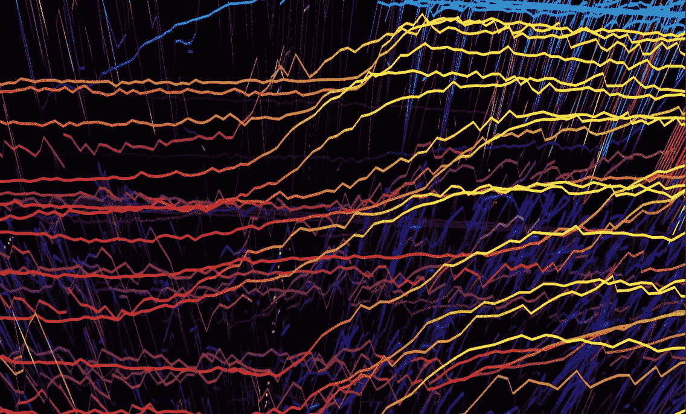

作者图片

> "我们生活在一个信息越来越多，而意义越来越少的世界里."

> “所以艺术无处不在，因为技巧是现实的核心。所以艺术死了，不仅因为它的批判性超越性消失了，还因为现实本身，完全被一种与其自身结构不可分割的美学所浸透，已经与它自己的形象混淆了。现实不再有时间呈现现实的外表。它甚至不再超越小说:它捕捉了每一个梦，甚至在它呈现出梦的外观之前。”

写于 1981 年，这两段引文都来自让·波德里亚的*模拟和拟像*。相邻的是*超现实的观念；*定义为:

> **超现实**，在符号学和后现代主义中，是意识无法区分现实和对现实的模拟，尤其是在技术先进的后现代社会中

如果你在谷歌上搜索什么是音频？— 你会得到几个结果。

1.  它源于拉丁语:' *audire '。*意思是:*听到*
2.  直到 19 世纪末 20 世纪初，这个词才在英语语料库中广泛使用。在 1880 年之前开始有一个轻微的上升趋势，然后在 1900 年到 1910 年之间突然上升。

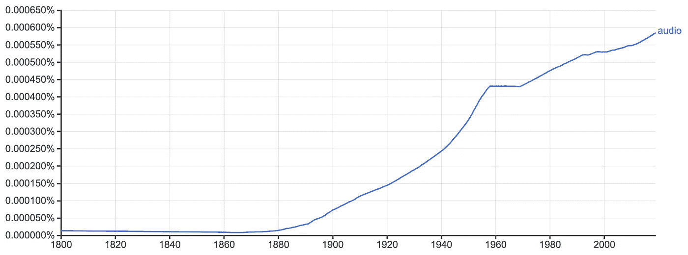

谷歌图书 ngram 浏览器，word: **音频**1800–2019

1857 年 3 月，爱德华·莱昂·斯科特·德·马丁维尔在法国首次为唱机签名申请专利。这是已知的最早的录音设备。它将声波描绘成被烟熏黑的纸张或玻璃上的线条。这种表现是声波在空气中传播的物理现象的直接反应。最初用于研究声学，它不是一种将声音作为媒介传播的方法，但在某些情况下，它被用于检测音乐音高，方法是记录一个人演奏乐器或唱歌的音高，然后将该转录与另一个音叉转录进行比较。使用表示对表示进行分类。

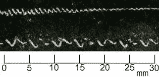

É.-L. Scott，1857 年 3 月 25 日的“第 31470 号专利申请”。6 页，包括证书和一张亲笔签名| [来源](http://webistem.com/acoustics2008/acoustics2008/cd1/data/articles/001974.pdf)

下面是 1860 年 4 月 9 日用留声机录制的一段录音。据信是斯科特本人在唱一首法国民歌:“ *Au clair de la lune*

1860 年 4 月 9 日的录音

一个有趣的提示:当斯科特录制这些录音时，据说他并不想让任何人听到，而只是想做一个分析工具。直到 1877 年，有人认为声音可以通过再现来再现。

在 2008 年之前，Scott 的录音还没有被听到，最古老的录音是 Edison 的**留声机——黄色石蜡缸**在 1888 年 6 月 29 日的音乐会上，4000 个声音在英国伦敦的 Handel Festival 上表演了 *Israel in Egypt* 。

然而，第一个入耳式耳机是在 19 世纪 50 年代发明的。医用**听诊器**。第一个听诊器于 1816 年问世。那时候它还不是我们现在知道的入耳式设备。这是一种放大胸腔声音的工具。1816 年的听诊器不是用电，而是医生放在病人胸部的纸漏斗。1850 年的听诊器没有太大的不同，但作为双耳装置变得更加精致；允许来自病人胸腔的声音直接进入医生的双耳。

1895 年，我们首次使用无线电信号进行传输。虽然，第一次传输是字母“S”的电报。所以，不是真的处理声音。但是在 1910 年，纳撒尼尔·鲍德温发明了我们现在所知的现代**耳机**。最初是为了海军作为一种通信方式使用，它被设计成包含一英里长的连接到操作员头带的铜线。这允许模拟信号通过电在铜中传播。

当你搜索*“什么是音频”*时，你会发现第三个结果是这个定义:

> 音频信号是声音的表示，通常使用电压电平表示模拟信号，使用一系列二进制数表示数字信号。音频信号具有大约 20 到 20，000 Hz 的音频范围内的频率，这对应于人类听觉的下限和上限。

就本文而言，让我们来探索数字音频和机器用来表现声音的方法。

## 如何用数字信号处理模拟声音？

像模拟信号一样，数字信号也是声音的表现形式。允许机器再现的数字信号有两个主要方面。这两个方面可以认为是 X 和 Y；时间和幅度分别为:**采样率**和**位深。**

## 抽样率

如果您曾经打开过数字音频工作区(DAW ),或者检查过音频文件，您会对数字 44100 很熟悉。如果您还没有，44100Hz 是音频数字渲染的标准采样率。有不同的费率，如 88200，96000 和 196000，以及。但是 44100 是一个特定的数字，是信号采样的最低阈值。

采样率是指机器在录音时每秒钟分析输入声音或模拟信号的次数。网上定义为:*空间***频率 T5*数字* ***采样*** *。相邻像素间中心距的倒数*。这意味着，对于每个样本 *(1/44100 秒)*，机器记录信号，并以一个数字表示每个箱。音频也可以用这些原则来构建。**

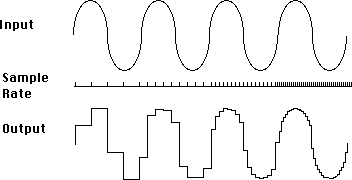

低到高(从左到右)采样率对呈现数字表示的影响的图示| [来源](http://monicandreatic.blogspot.com/2016/05/digital-sound.html)

在上图中，您可以看到，在低采样速率下，这种表示会丢失信号中的许多信息；并且随着采样率的增加，产生更精确的表示。将其分解:*将声音或模拟信号转换为数字信号的任务是获取连续信号并将其转换为离散值，当随着时间的推移将这些离散值放在一起时，呈现连续信号的表示，然后可以转换回来*。基本上，采样率越高，机器可以渲染得越准确和精确。但是为什么是 44100Hz 呢？

奈奎斯特采样定理陈述:*要达到最准确呈现某一频率信号的采样率，采样率必须是频率的两倍*。

```
Sampling_Rate_Needed = frequency * 2
```

因此，如果频率为 440Hz，那么最精确地呈现频率的数字表示所需的采样速率应为 880Hz。据此推断，人类的听觉范围上限约为 20，000 赫兹。因此，为了准确地呈现人类可以听到的任何声音的数字表示，我们至少需要 40，000Hz 的采样率。似乎为了安全起见，增加了 4100 赫兹。额外的采样速率用于特定情况，如环绕声、电影音频、音乐制作和其他需要更精确处理渲染信号的高保真体验。但是为了准确地表现人类能听到的任何东西，44100 赫兹是必要的频率。

## **钻头深度**

位深度类似于采样率，因为它是一种分辨率。但是它不是沿着时间渲染，而是沿着振幅渲染。低分辨率位深度 1 只能将振幅渲染为两种动态:开或关。声音或寂静。类似于黑白图像。

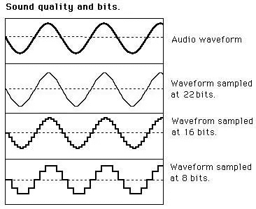

不同位深度量化对呈现数字表示的影响的图示| [来源](http://monicandreatic.blogspot.com/2016/05/digital-sound.html)

您可以看到，随着位深度的增加，机器可以使用更多的离散值来呈现幅度。我们可以用以下公式计算每比特深度的离散值数量:

```
2^bit_depth
```

对于 8 位的深度，有 256 个离散值的范围*(0–255)*。对于 16 位，有 65536 个离散值的范围。对于 24 位，有 16777216 个离散值的范围。概念化该离散值范围的另一种方式是:机器渲染给定样本体积可用的振幅的可能动态范围。使用下面的公式，我们可以理解以分贝为单位的比特深度的动态范围。

```
n = bit_depth
20 * log10(2^n) = db
```

位深度为 8 时，动态范围为 48db。然而，比特深度为 16 时，我们有 96db 当我们考虑抖动因素时，我们可以达到 115db。对于一个人来说，140 分贝是我们的耳朵受到痛苦伤害之前的极限。因此，在渲染声音时，115db 的动态范围足以满足大多数制作需求。

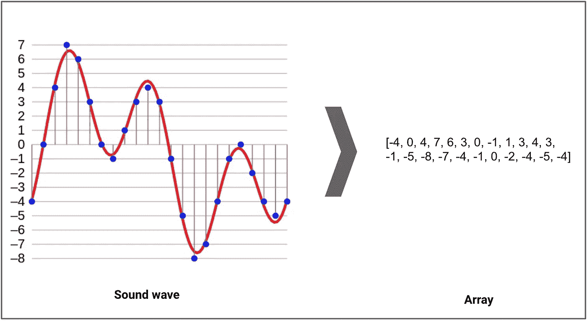

声音信号被表示成离散数字数组的基本概述|原始 Aquegg |维基共享

上图显示信号为一条红线，由机器用蓝点进行分析，并用数字渲染模拟为右边的阵列。假设该图为一秒钟，则采样率为 21Hz，位深度为 4 位。不确定这听起来会不会太好。

我们听的大多数音乐都是 44.1KHz，16 位深度。因此，下一次您收听来自数字源的音频时，请尝试想象频率*(每秒 44100 个样本)*和振幅 *(65536 级动态范围)*上的所有离散值，这些值紧密地呈现在一个复合信号中，模拟了收听连续声波的体验。

# 构建数字音频

## 工程频率

在我的上一篇文章[发音 PI](/sonifying-π-c453c20a7acd) 中，我构建了一个基于频率 3.14Hz 的泛音序列，并从该序列生成音频文件。在这里，我将更深入地介绍我为实现这一目标而构建的模块的功能。此外，我将解释如何构建西方音乐体系以及更复杂、独特的音乐体系。

当我们思考什么是音高时，我们经常会想到它们的字母名称。A，A#，G，G#' …等等。但这些只是帮助我们理解音乐作为一种语言，并象征性地通过声波景观导航的抽象表示。“a”代表一类频率。为了引用“A”的更具体的实例，我们可以调用音高以及与其在序列中的位置相关联的八度音程数。这叫做科学记数法。“A”最常见的例子是“A4”。这个特定实例表示频率 440Hz，并且位于第四个八度音阶的位置。目前的调谐标准是基于 440 赫兹。每个八度音程位置正好是它上面八度音程的 1/2 和它下面八度音程的两倍。例如，“A5”代表频率 880 赫兹，“A3”代表频率 220 赫兹。在每个八度之间，有一个西方体系中所有十二个音符的实例。两个频率之间的最小间隔称为小秒。小秒针也是一种象征性的抽象概念，在西方语境中具有质量和定义的内涵；而仅仅是两个频率之间的数值距离的表示。有很多方法可以评估这个距离。

在下面的笔记本中有一些例子，它们是发展西方十二平均律音乐体系中使用的八度音阶所必需的数学关系。

分解西方音乐体系中音程的数学因素的笔记本

这本笔记本的目的是揭露一些简单的事实。

1.  八度音程是 1 和 2 之间的空间的表示。
2.  分八度就是把 1 和 2 之间的空间分成相等的音程。
3.  等同于这些划分的音程由抽象的特征表示，并且对于它们所属的八度音阶是唯一的，但是共享共同的因子分解。

但是让我们用这个逻辑，调查一些另类的音乐系统。

笔记本打破另类音乐系统的发展

对于那些不熟悉西方音乐体系的人来说，本笔记本的目的是展示一个练习，这个练习描述了采用离散值的符号结构、解构它并将其整体嵌套在每个离散值的空间内的数学过程。在上部结构的空间内嵌入镜像下部结构。

## 建造 Wav

从这里开始，让我们使用这些系统的频率来制作它们音调的数字表示。

下面的笔记本简要概述了从一个数字开始构建音调，然后基于这些音调构建系统，并分析几个文件以验证它们是否被准确渲染的过程。

笔记本调查的建设和检查一个数字化建设的音频

## 用音调的数字表示构建功能音乐

图 1 是根据上述代码渲染的音调构建的三个音阶。

1.  半音四分之一音阶从 440 赫兹移动到 880 赫兹
2.  半音半音音阶从 880 赫兹移动到 440 赫兹
3.  全音阶半音音阶从 440 赫兹移动到 880 赫兹

音频图 1

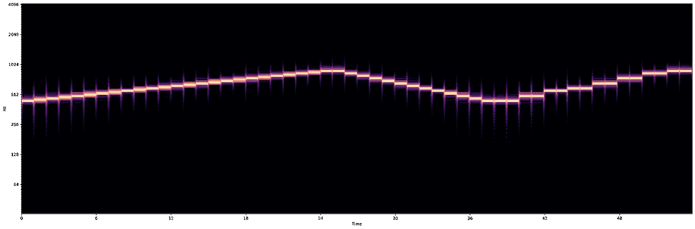

图表图 1 |由作者代码生成的图像

根据我们掌握的音调，我们可以做出任何音阶。我使用这三个只是为了证明概念。除了音阶，我们还可以构建和弦和级数。图 2 是从渲染音调构建的一个进程。

1.  这个过程从一个第二代第六代开始
2.  然后进入微音和弦，利用全音阶和微音系统的音调以混合和弦结束

音频图 2

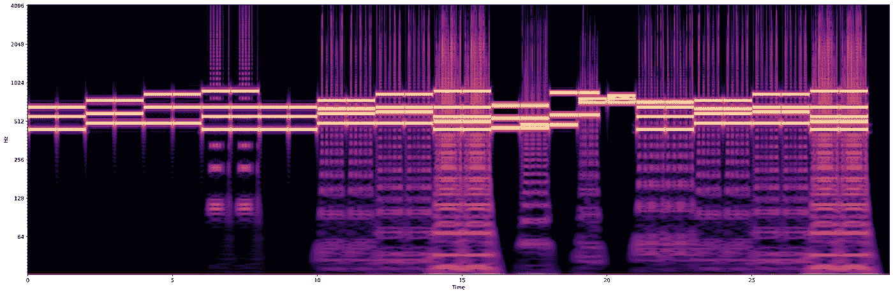

图 2 |由作者代码生成的图像

## 数字音频的新结构

下面是我几年前画的一幅铅笔画的扫描图。下面是转换成数字音频并通过摄谱仪显示的同一幅图像。每个像素中的数据用于构建音频信息的频率和振幅。在未来的博客中，我可以详细说明这个过程是如何工作的，但现在，我只是想展示这个来进一步阐述数字音频是一种表现，而不是声音本身。

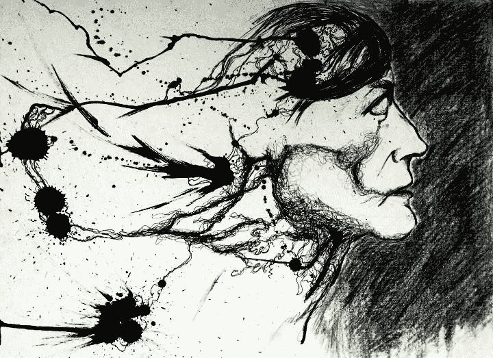

作者的墨水和铅笔画扫描|作者的图像

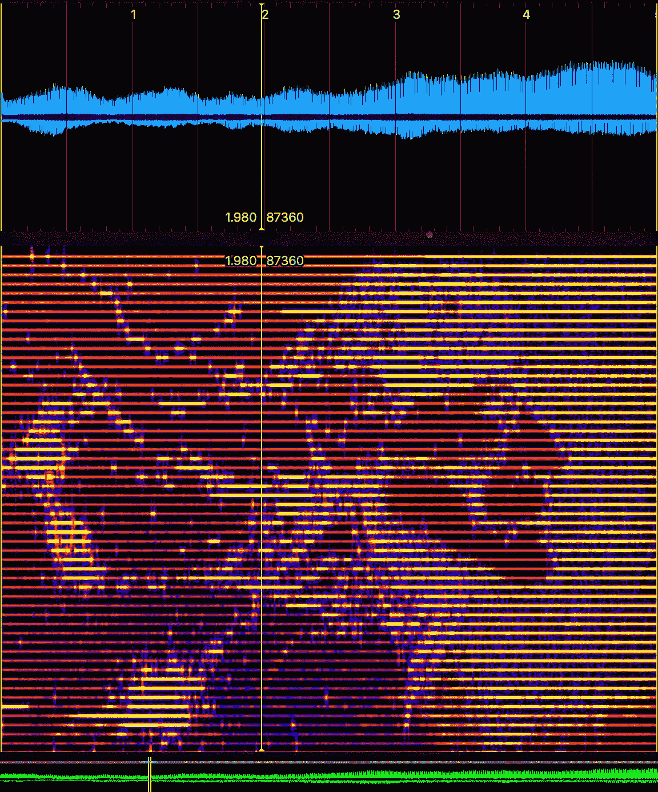

一段时间内以一系列频率呈现的图像|作者提供的图像

*ps。当通过扬声器播放时，它发出的实际声音令人难以忍受*

# 操纵数字音频

开发模拟音乐数学关系的数字渲染是一回事。很高兴知道机器可以实例化音调。但是当机器使用纯数学精度时，对声音的感知是熟悉的，但缺乏我们在物理世界中听到声音时所期望的品质。

让我们探索模块的更多功能，并使用录制的音频。在这一部分，我们将使用 20 世纪 70 年代公共领域购物中心 muzak 的舒缓声音。

70 年代的公共领域音乐

操作音频类似于 python 中的基本字符串和数组操作。

```
#to know how many elements are in an given array of audionum_of_ele = seconds*sample_rate
```

每个元素都是包含音频数据快照的样本。

下面是一个笔记本，它通过对音频阵列的一系列单个操作，并以一个将效果按顺序链接并传递音频的操作结束。所有产生的例子都可以在笔记本下面找到。

笔记本经历一系列操作

# 音频处理的结果

## 反向音频

python 中有几种反转音频的方法，但主要原理是将音频数据提取到一个数组中，反转数组，然后将其转换回音频文件。一个简单的方法是:

```
sr, y = read(wav)
reverse_y = y[::-1]
write(outfile, sr, reverse_y)
```

## 时间拉伸音频

这里有三个时间拉伸算法的例子，可以减缓音频的速度。根据您如何考虑采样率的变化，您可以获得不同的探测范围。

将采样速率乘以一个大于 1 的因子来减慢的算法

将采样速率除以小于 1 的因子以降低速度的算法

使用 scipy 的算法，当读入 wav 时，在 scipy 的数据输出中广播一个倍增因子

基本的想法是，你想让采样率更长，以便在更长的时间间隔上伸展音乐内容。为了加速音频，你做相反的事情。

下面是两个加速音频的例子。

将采样速率乘以小于 1 的因子来加速的算法

将采样速率除以一个大于 1 的因子来加速的算法

## 音高移位音频

音高上移 100 赫兹

找到音高移位方法的关键是改变采样速率的速度，而不导致 wav 时间拉伸。为了实现这一点，我将我想改变音高的赫兹数除以采样率，然后将文件分成左右声道。一旦我这样做了，我就对每个通道中的每个样本使用*快速傅立叶变换*并调换频率，然后反转该过程并将两个通道缝合在一起。

## 延迟音频

延迟设置为 1000 毫秒，因子为 0.5，重复次数为 3 次

如果您查看绘制该文件音频的摄谱仪，可以看到延迟如何模糊了文件的中间，但在开头和结尾有明显的三次重复，信号的重叠迭代明显较少。为了延迟数字音频，您必须通过生成偏移来处理字节。这样做的逻辑如下:

```
**def** delay(bytes,params,offset_ms):
    # generate offset
    offset= params.sampwidth*offset_ms*int(params.framerate/1000)

    # add silence in the beginning
    beginning= b'**\0**'*offset *#remove space from the end*
    end= bytes[:-offset] # concat bytes with both beginning and end with sample width
    **return** add(bytes, beginning+end, params.sampwidth)
```

## 使用代码块，如链式效果踏板

在序列中构建算法后:

*反向- >延迟- >拉伸- >延迟半速- >层反向*

并通过数字信号，下面的音频结果。

顺序算法效果

# 数字音频分类

到目前为止，一切都是在干扰呈现数字音频的数学机制。实质上是在玩音频阵列。在本文的其余部分，我们将更深入地研究使用特征提取的音频分析，以及机器如何使用这些特征来模拟音频。

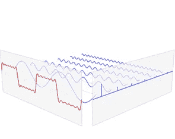

可视化的 FFT | [来源](https://www.ritchievink.com/blog/2017/04/23/understanding-the-fourier-transform-by-example/)

为了提取这些特征，我们将使用傅立叶分析中的方法；主要是:快速傅立叶变换。FFT 是一种提取复杂波形并将其解析为后续简单波形的方法。它允许我们访问基于频域的特征。在下面的笔记本中，我们将探索:

1.  光谱质心
2.  光谱带宽
3.  梅尔频率倒谱系数
4.  色度特征

简单解释一下:

## 光谱质心

频谱质心可以被认为是测量给定声音的'*亮度*。它计算给定样本中频率的加权平均值。

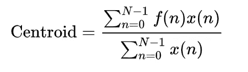

其中 *x(n)* 表示仓号 *n* 的加权频率值或幅度， *f(n)* 表示该仓的中心频率。

## 光谱带宽

频谱带宽与声音的频谱分辨率相关。它被定义为*每个样本最大峰值频率一半处的频带宽度*。

**梅尔频率倒谱系数**

梅尔频率倒谱是从功率倒谱构建的，是声音的短期功率谱的表示。系数是通过 FFT 检查样本，然后将功率映射到 mel 标度上而得到的。然后记录每个 mel 频率。之后，执行离散余弦变换，就好像对数梅尔功率列表是一个孤立的信号。*即*信号的合成振幅就是系数。这些系数精确地描述了给定样本的频谱包络的形状。

**色度**

色度提取沿着 0-11 的向量显示强度。该向量表示音高类别集，并揭示存在的每个音高类别的数量。换句话说，它告诉我们信号中存在哪些谐波频率。

这只是信号中存在的一小部分特性，但有了这些特性以及本笔记本中显示的其他一些特性，我们就可以开始对信号进行建模了。

显示信号建模特征提取示例的笔记本

有趣的是，对数字音频信号进行建模就是提取已有表征的特征的表征。

## 建模

使用 G. Tzanetakis 的集合，让我们使用这些特征提取来模拟音乐流派。该合集由 1000 首音轨组成，每首音轨时长 30 秒。它包含 10 个流派，每个流派代表 100 首曲目。轨道都是 22050 赫兹单声道 16 位 wav 文件。一旦我们从集合中提取了所有的数据，让我们从我们简单但很好的朋友开始，人工深度神经网络。

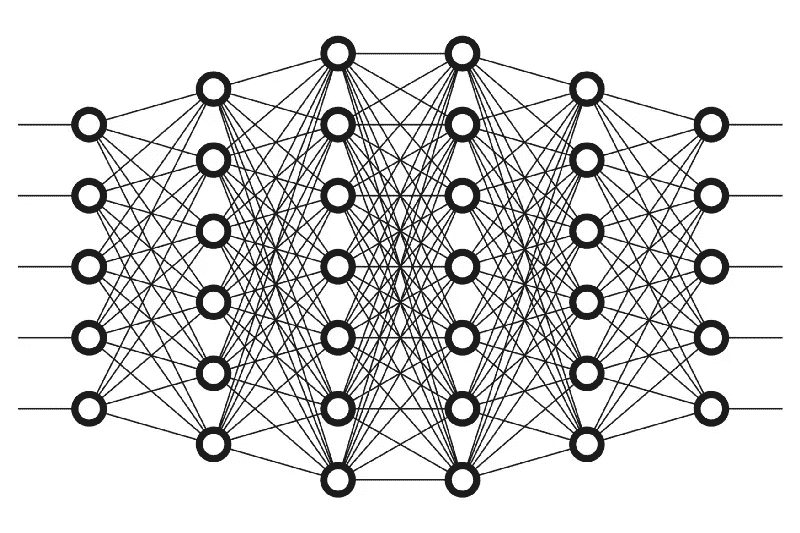

DeepANN 分类器| [来源](https://www.shutterstock.com/image-vector/neural-net-neuron-network-deep-learning-484275199)

笔记本构建和实现一个简单的 DeepANN

该模型达到了 69.50%的准确率。

考虑到建模是信号工程表示的一种方法，让我们看看我们可以对数据建模的其他方式。让我们使用数字音频的图像，而不是提取代表样本中不同值的特征。为此，我们可以获取每个 wav 文件并生成一个摄谱仪。然后我们可以在光谱图上使用卷积神经网络(CNN)。

这是一个我们将用来训练 CNN 的光谱仪的例子。

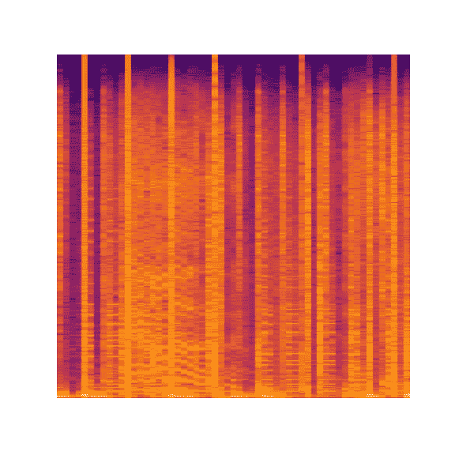

gtzan collection 的 10 秒 wav 文件的摄谱仪，流派:hip hop |由作者代码生成的图像

CNN 将学习文件的视觉印象来理解一个流派的特征，而不是对提取的特征本身进行训练来理解一个流派的特征。

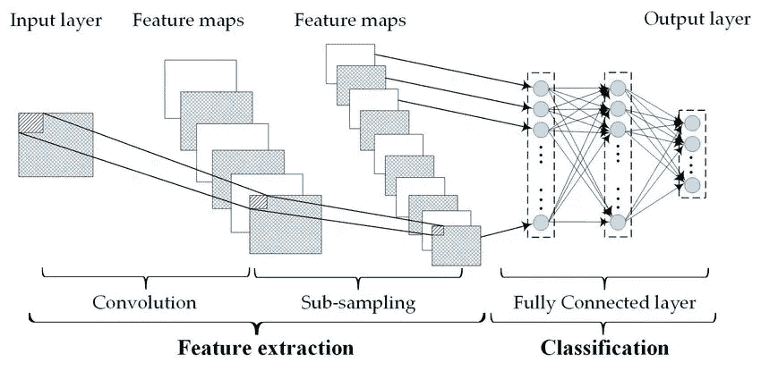

CNN 分类器| [来源](https://www.researchgate.net/figure/Convolutional-neural-networks-structure_fig3_326884617)

笔记本电脑建设和实施有线电视新闻网

虽然使用摄谱仪来表示音频的想法很有趣，但使用它来训练分类器似乎不是最有效的方法。更不用说 CNN 的训练时间在记忆和时间上要昂贵得多。

说到记忆和时间，让我们回到使用原始音频的特征提取，并尝试一个长短期记忆(LSTM)模型。

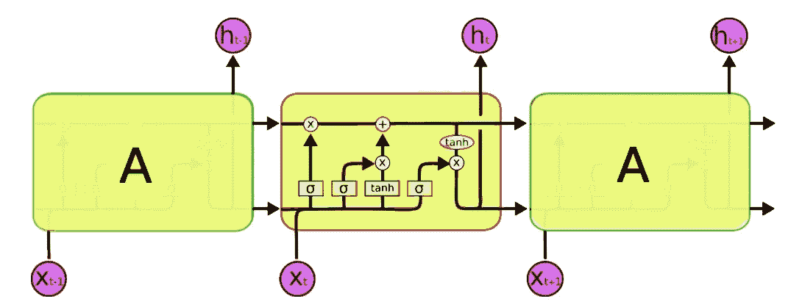

LSTM | [来源](http://colah.github.io/posts/2015-08-Understanding-LSTMs/)

笔记本电脑建设和实施 LSTM

我们达到了 66.66%的准确率——比我们在本节开始时使用的原始神经网络模型的准确率略低 3%。在这里，LSTM 是有效的，但对于分类问题，我仍然会选择人工神经网络。但是让我们看看 LSTMs 还能做什么。

# 生成数字音频

在我的文章[生成性人工智能:故障、缺陷、非理性和表达](https://medium.com/swlh/generative-ai-malfunctions-imperfections-irrationality-and-expression-9f50c81a6291)中，我讨论了一些关于人工智能是否以及如何能够’*生成*的观点。简而言之，总的来说，我认为 AI *可以*产生，从而创造，在某些情况下。在我们尝试让人工智能生成音乐之前，让我们使用预测功能来看看它复制音乐的能力有多强。

在这个笔记本里，我取了三个音频文件。

1.  *《魔法咒语》水晶城堡*
2.  *《两个人就能赢》J·迪拉*
3.  *《十二声部音乐第三部》，菲利普·格拉斯乐团(1975 年现场演出)*

这里的任务是使用更高维度的音频数据，即我们在处理数字音频时使用的幅度阵列，来看看 LSTM 是否可以预测每个样本的正确幅度序列。

用于音频生成的笔记本构建和实现 LSTM

正如我们所看到的，LSTM 可以被训练得相当精确。下面生成的音频:

拼接在一起的三个音轨的真实音频

表演中的模型

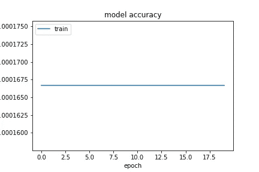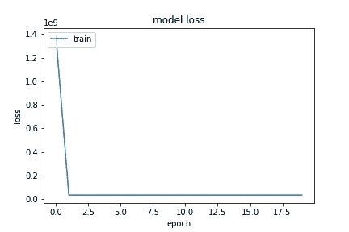

第一个模型的训练性能|由作者代码生成的图像

模型学习但不太理解卷

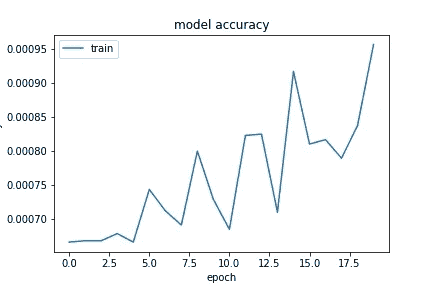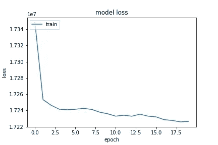

第二模型的训练性能|由作者代码生成的图像

模型学习准确预测振幅并重现音频

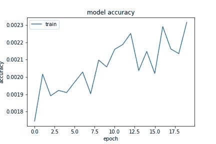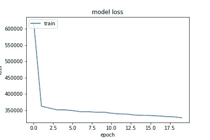

第三模型的训练性能|由作者代码生成的图像

对于下一个生成音频的实验，我不会展示笔记本电脑，因为每个模型都需要几天甚至更长时间来训练(一个模型用 GPU 花费了近一周的时间！).但是对于那些有兴趣阅读模型代码的人来说，这里是最终模型的架构。根据我预处理数据的方式，这个模型最终产生了一些有趣的结果。

最终 LSTM 建筑

除了众多添加的层之外，该模型的主要区别之一是时间分布的密集分层，所有内容都构建在其中。这允许 LSTM 在训练时一致地返回层内和层间每一步的完整序列。它还产生一个完整序列的输出，而不是一次一个样本。

在这个实验中，我不想停留在振幅的表面水平，而是想在通过傅立叶分析提取的低维光谱特征上训练模型。我不是在一个复杂的音频文件上训练，而是在一个艺术家的完整专辑和现场表演上训练。我继续使用水晶城堡，J 迪拉和菲利普·格拉斯合奏。最初，我把整张专辑分成 10 秒钟的音频片段，最终在完整的音轨上训练了一个模型。

在训练过程中，我保存了不同模型开发的不同阶段，并从每个艺术家提取的特征数据中构建了一个随机序列生成器。然后，我让每个模型在不同的学习阶段尽可能地产生声音。下面是不同阶段的输出。音频不会以任何方式改变，而是按照模型学习阶段的时间顺序排列。

**警告:开始时有点吵*

隔离后，你可能会发现这个 LSTM 在杰弗逊南部的约翰逊大街&法拉盛附近的布什维克闲逛

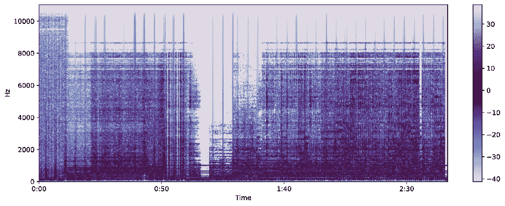

AI _ LSTM _ 生成 _ 水晶城堡的摄谱仪|图片由作者代码生成

** 50 秒到 1:40 秒之间发生了一些美丽而不完美的事情*

隔离后，你可能会发现这个 LSTM 每天都在伍德布里奇的盟友那里闲逛

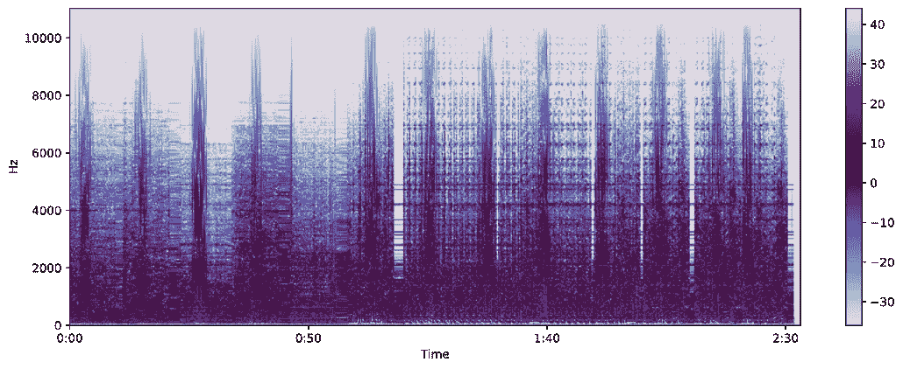

AI_LSTM_Generated_J Dilla |图片由作者代码生成的摄谱仪

真正让我惊讶的是:在给定数据的情况下，模型首先学习音频的哪些部分，以及它从看似只是音调和声音到对节奏的明确理解有多快。这个输出让我想起了开车去北部时，通过调频广播信号调谐，寻找正确的电台。

现在，在这两个例子中，有一些严重的过度拟合，以及一些细微差别。事实上，在 J Dilla 赛道上，有趣的是这个模型不停地吐出循环。我想知道这是否与 J Dilla 使用样本有关。而在水晶城堡的音乐中，有重复，但它是人们重复的话，节奏和旋律，而 J Dilla 的轨道是录音和磁带的逐字取样重复。我还发现令人着迷的是，在 J Dilla 的音轨中，人声清晰，可以听到明确的词语——你可以在摄谱仪的后半部分看到人声的弦外之音；而在水晶城堡的音轨中，声音是存在的，但看起来是一个模糊的单词轮廓，与乐器天衣无缝地融合在一起，而不是明确的话语。

最后，让我们听听菲利普·格拉斯系综模型。有趣的事情正在这里发生。我不想听从白噪音到智能模拟的演变，我想放大来听这里发生的音乐选择，以及音色。在 Crystal Castles 和 J Dilla 中，每一个成熟的 AI 都会在逐字模拟和误差边缘之间振荡，误差边缘允许一些令人想起决策的故障缺陷。不过，在谷歌眼镜模式下，所有的输出都是现场录音中找不到的音乐片段。

艾 LSTM 菲利普·格拉斯合奏

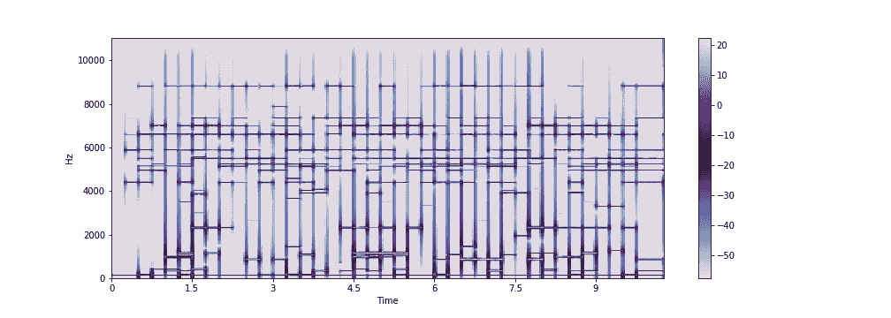

AI _ LSTM _ 玻璃 _2_1_6 |图像的摄谱仪由作者代码生成

下面是一些我觉得很漂亮的光谱图。人工智能正在理解频率和节奏，并产生信号，这些信号在它接受训练的实际记录中并不存在。然而，它缺乏音色，听起来像一个模拟合成器；但对我来说，感觉奇怪的真实，有菲利普·格拉斯的幽灵般的影响，但却是增强的，创造性的和独特的。

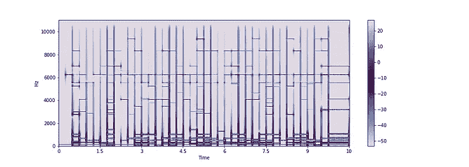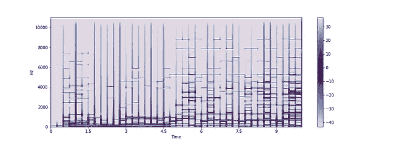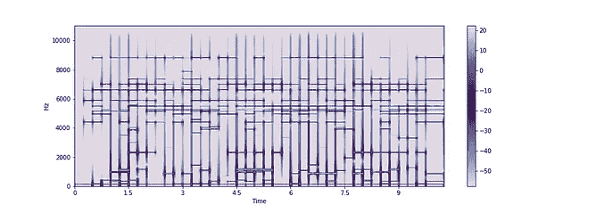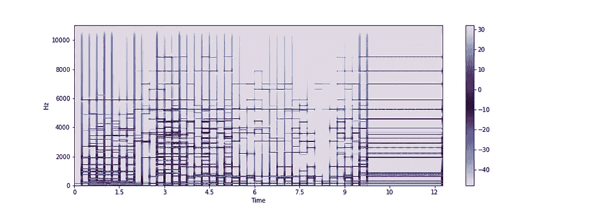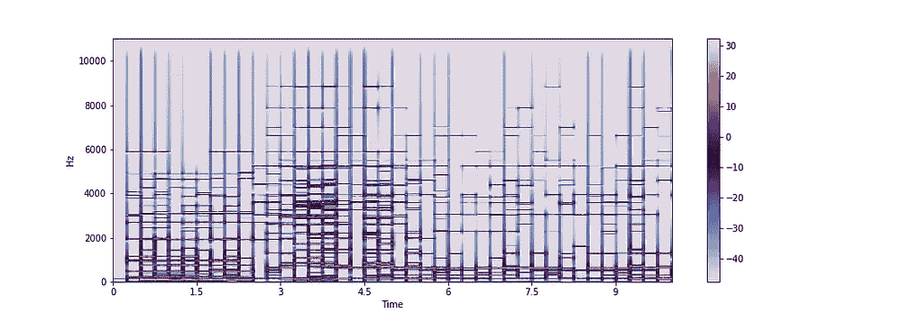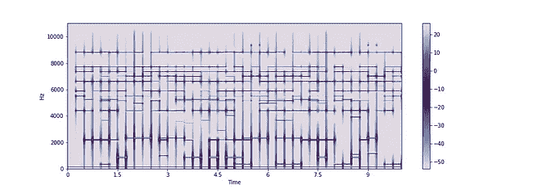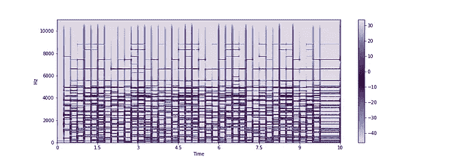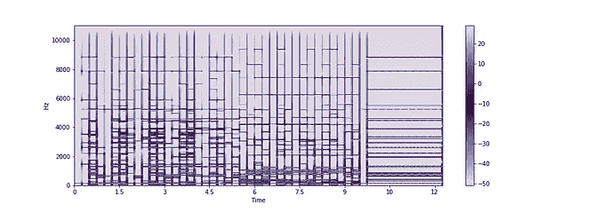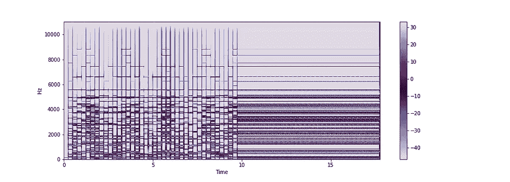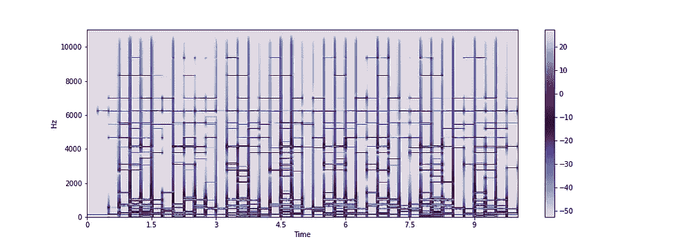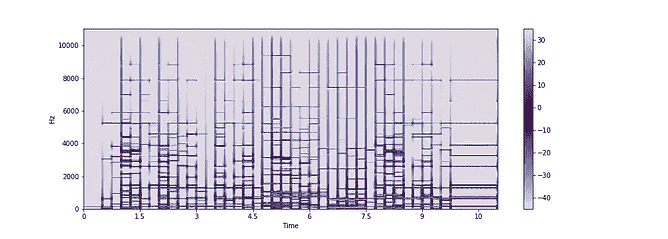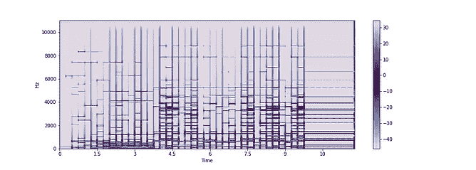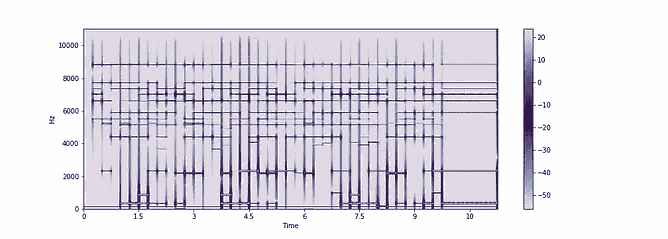

由作者代码生成的所有光谱图

下面是我觉得有趣的输出汇编。音频没有改变。

GlassAI 汇编

# 结论

> “所以艺术无处不在，因为技巧是现实的核心。所以艺术死了，不仅因为它的批判性超越性消失了，还因为现实本身，完全被一种与其自身结构不可分割的美学所浸透，已经与它自己的形象混淆了。现实不再有时间呈现现实的外表。它甚至不再超越小说:它捕捉了每一个梦，甚至在它呈现出梦的外观之前。”

这一点，连同 ***超现实*** 的概念，一直贯穿在我的脑海深处。虽然我知道鲍德里亚指的是作为一个对象系统的现实的理论讨论，但当我开始探索 DSP 时，这方面的一些东西引起了我的共鸣。我认为数字音频是一种表现，一种声音的模拟。无法与自然产生的声音区分开来的声音。技术上来说，是的。但以玻璃为结尾，让我觉得通过模拟和复制媒介的有意开发，我们可能会发现一个没有技术桥梁我们根本无法达到的创造力维度。回到人工智能可以成为一种创造性和协作性工具的想法。我以这本笔记本作为结束。

通过顺序算法发送玻璃信号的笔记本

通过顺序算法从玻璃信号输出