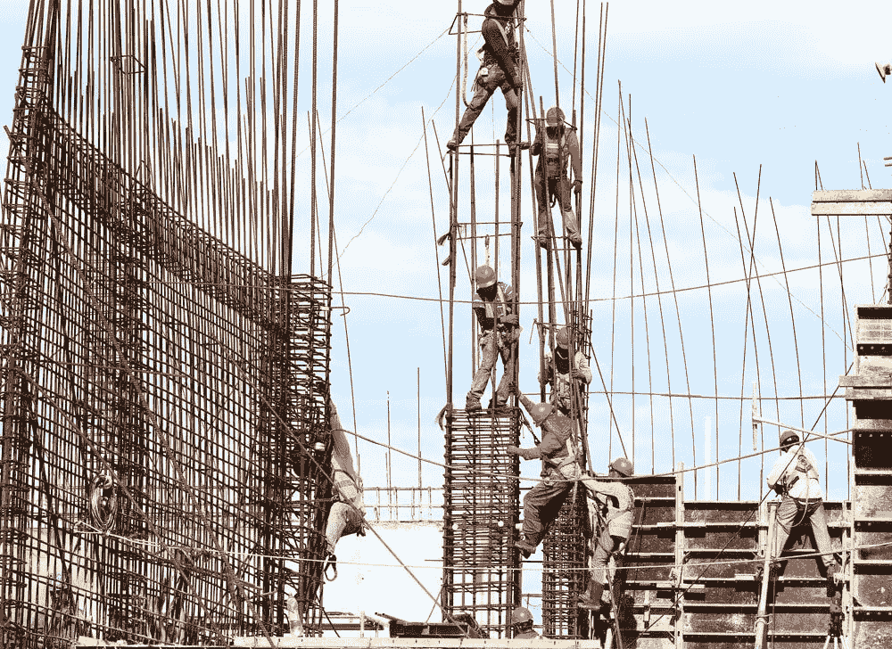
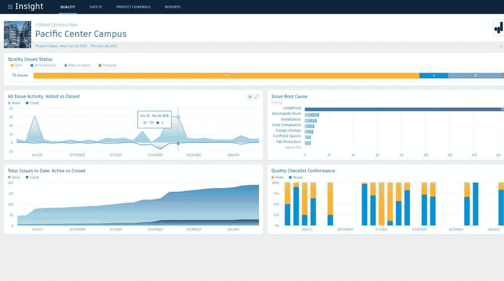
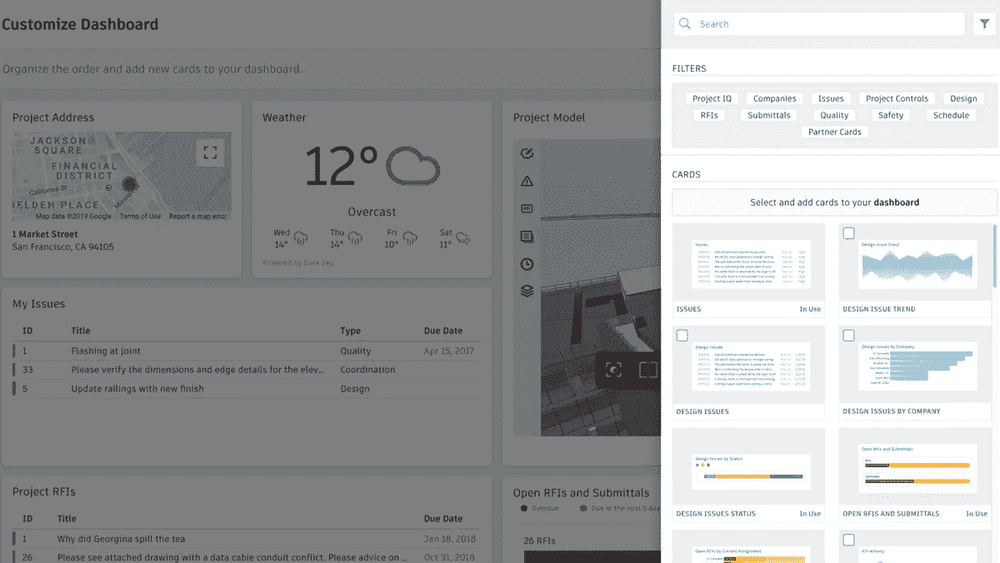
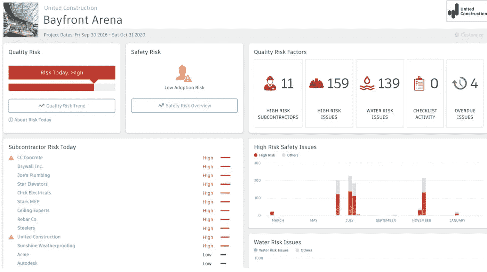
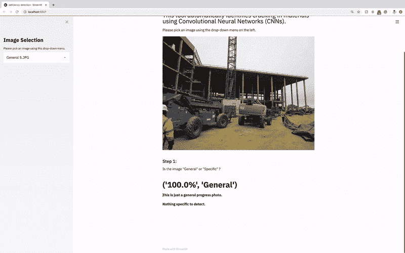

# 建筑和机器学习

> 原文：<https://towardsdatascience.com/construction-machine-learning-2cfb45f75ead?source=collection_archive---------39----------------------->

## Autodesk BIM 360 + Construction IQ 为施工现场带来了预测和分析能力。

来源:Franki Chamaki 通过 [Unsplash。](https://unsplash.com/photos/1K6IQsQbizI)

# 介绍

承包商的工作性质是反动的。他们不断地在现场扑灭一场又一场大火，以确保施工尽可能顺利地进行。**但是，如果通过机器学习，我们可以改变这种被动的工作流程，变得积极主动呢？**机器学习可以消化承包商必须处理的大量项目数据，并可以将承包商每天需要关注的最关键问题浮出水面，以避免挫折。

要了解数据分析和预测如何帮助建筑行业，站在承包商的角度很重要。从承包商的角度来看，一个虚构的情况可以帮助我们。

# 承包商的生活

## 1.故事

想象一下:你是一个大型建筑工地的总承包商主管。你从头到尾监督现场的所有操作。您负责安排日常工作，监督所有正在进行的活动和任务，并确保现场每个人的安全。您的角色对于项目的成功和他人的安全至关重要。

你工作的建筑公司负责为一家大牌科技公司建造下一个主要总部(假设是亚马逊 HQ3)。建筑师完成了所有的图纸，加快了建筑许可过程，并将批准的计划发送给您，以便开始施工。施工时间表非常紧迫，您马上开始匆忙确保您的施工团队按时将建筑交付给客户。有数亿美元悬而未决，你开始感到压力。你知道亚马逊想要一个完美的建筑，而且他们希望尽快得到它。

作为施工主管或项目经理，需要管理很多很多的团队。这只是众多参与建设的人之间紧密合作的一个例子。资料来源:Josue Isai Ramos Figueroa。

## 2.压力是存在的

施工几个月后，齿轮正全速运转。混凝土地基已经浇筑完毕，大楼开始上升。现场有多个分包商(subs ),每个都在做自己的工作。作为总承包商，你要协调分包商工作的时间，评估他们工作的质量，并确保他们遵守现场安全措施。最重要的是，代课老师不停地问你问题:

> 防水部分:基础墙的防水是水泥防水还是液体防水？
> 
> 钢接头:一些钢柱刚刚到达现场，它们看起来有点生锈了。他们应该是工厂准备好的吗？
> 
> 混凝土分包商:结构工程师有没有回复我们，每层楼的混凝土桥面允许多少粉煤灰？

主管必须确保现场的每个人都遵守安全协议，以保证现场每个人的安全。来源:Josue Isai Ramos Figueroavia[un splash。](https://unsplash.com/photos/Pj4je7OjrME)

一天中没有足够的时间让你监视每个人并及时解决问题。结果，分包商问的几个问题被漏掉了，你没有定期与每个分包商联系，工作继续进行。

## 3.问题

一个月后，你注意到混凝土接头只完成了 2 层，而他们现在应该已经完成了 4 层。混凝土是施工关键路径的一部分——在混凝土完成之前，其他人员无法开始工作。

混凝土小组说他们不知道混凝土中允许有多少粉煤灰。他们几周前就问你了，但是因为你有太多其他的事情要做，你从来没有回答过。因此，他们没有永远等待你的回答，而是比平时更多地使用混音来省钱。这种混凝土比含有较少粉煤灰的混凝土需要更长的时间来固化——因此会延迟。**现在你要么想办法补上一个月，要么向客户要求更多时间，失去信誉，并承受巨大损失。**

你感到压力了吗？

承包商要管理的东西很多，可能会让人不堪重负。[来源:](https://unsplash.com/photos/mlVbMbxfWI4) [路易斯·比利亚斯米尔](https://unsplash.com/@villxsmil)转自 [Unsplash。](https://unsplash.com/photos/mlVbMbxfWI4)

# 施工文件

好了，现在我们理解了承包商的一些潜在压力和挫折，我们可以同情他们的处境了。如果听之任之，很容易忽略一个小细节而造成严重后果。如果文档和数据没有组织好，就更难掌握细节。这句来自 BIM 360 博客的话完美地抓住了这一点:

> “建设因为没有记录事情而受到很多批评，但我认为这是错误的。我们非常擅长记录。我们只是不善于把它放在可以被发现和分享的地方。”-杰夫样本，Contechcrew

在匆忙中，有时承包商文件的组织会变得有点混乱。(但我敢肯定，在这个问题上，他们并不孤单。来源:托马斯·耶茨通过 [Unsplash](https://unsplash.com/photos/TQHDStvFi60) 。

这句话揭示了承包商有时很难保持他们的信息有条理，以便它有用——这并不奇怪，因为有太多的因素会使施工过程变得混乱。在整个施工过程中，图纸、产品、系统、规范和分包商都可以修改和变更。行动项目可能存在于贴在墙上的便利贴上，要提取的标记可能存在于分散在桌子上的打印纸上，数字文件可能保存在内部文件夹结构中的任何地方(或在您的桌面上)。

Autodesk 知道这一点，他们为文档和数据创建了一个单一的数字环境，与承包商使用的其他建筑信息建模(BIM)软件共存。这个环境就是 **Autodesk BIM 360。**

# BIM 360

为了避免多个流程和不同软件处理管理文档的复杂性，Autodesk BIM 360 允许承包商在一个地方管理所有文档和数据。

[可以在此发送、接收、跟踪和组织 RFI 和提交文件](https://www.autodesk.com/bim-360/construction-management-software/project-management/)。可以在这里管理、更新和共享图纸和规格。不同行业的三维模型可以在这里进行协调和分析。这里可以记录安全规则和观察结果。可以在这里管理检查表、问题列表和竣工查核事项表，以确保项目的质量。带有注释和标记的设计评审也在这里完成。

除了有助于保持承包商信息有序的明显优势，BIM 360 还允许承包商通过可定制的报告和仪表板受益于数据分析。BIM 360 还通过 [**建筑智商**](https://www.autodesk.com/bim-360/construction-management-software/construction-data-analytics-reporting/construction-reports-dashboards/reporting-features/#constructionIQ) 提供来自机器学习模型的预测能力。

BIM 360 中的示例分析仪表板显示了正在建设的项目的数据。[来源:Autodesk 截屏转载，由 Autodesk，Inc .提供](https://www.autodesk.com/bim-360/construction-management-software/construction-data-analytics-reporting/construction-reports-dashboards/reporting-features/#dashboards)

# 建筑智商

现在，我们开始了解 Autodesk BIM 360 激动人心的高科技功能。由于 BIM 360 是存储信息的单一位置，因此 Construction IQ 从这些数据中提取信息，利用机器学习来识别施工期间的风险。但是为什么预测“风险”很重要呢？

让我们回到我们虚构的故事，关于我们的主管管理亚马逊 HQ3 项目的建设。负责人发现太多的粉煤灰在混凝土混合物中使用得太晚，这导致了代价高昂的延误。但是如果我们能够预测像这样的潜在风险会怎么样呢？

如果有一个分包商经常出错，并且这些错误被记录在 BIM 360 中，Construction IQ 会分析这些数据并为每个分包商生成预测。它提供了一种“分包商预测”,告诉我们某个分包商今天是处于低风险还是高风险。这可以帮助我们防止“危险倾向”的潜艇犯错误。使用风险预测，总承包商可以更关注需要更多监督的分包商。

Construction IQ 还引起了我们对其他风险的关注，例如安全风险和设计风险。在仪表盘的帮助下，这一切都以干净、快速、直观、易读的快照呈现给忙碌的承包商。我们可以拖放“卡片”来获取我们想看的信息。

在右侧，有一些“卡片”,可以选择这些卡片向仪表板添加不同类别的项目信息，如设计、质量、安全、进度和问题。[来源:Autodesk 屏幕截图，由 Autodesk，Inc .提供转载](https://www.autodesk.com/bim-360/construction-management-software/construction-data-analytics-reporting/machine-learning-construction-management/features-supporting-machine-learning/#designRisk)

# 引擎盖下的建筑智商

Construction IQ 从记录的项目问题、现场观察、清单、分包商任务、历史数据和其他元数据中提取用于风险预测的数据，以预测日常风险。

了解允许 Autodesk 预测分包商是否具有高风险的独特算法组合将是一件有趣的事情。从承包商那里收集的许多数据可能是文本——观察、问题、清单、任务，都是文本。这是除了图纸和标记的 pdf 之外，还有记录在 BIM 360 中的现场图像，机器学习算法可以使用这些图像来预测风险。

**为了确定分包商的质量和安全风险，**在幕后，可能正在对分包商工作的每个文本观察进行自然语言处理，以提取情感，然后通过分类模型(如逻辑回归、朴素贝叶斯或支持向量机(SVM))将其分为“好”或“坏”类别。如果有更多的“坏”观察，那么该潜艇的风险可能会更高。“高风险”和“低风险”观察的最终分类也可以通过查看现场拍摄的质量检查照片的 CNN 来增强。像 LSTMs 这样的时间序列建模可以对更近期的分包商观察进行更重要的加权，以更准确地预测分包商的风险。

**为了确定设计风险，**计算机视觉可用于检测图纸和标记 pdf 中的设计风险——搜索代码合规性问题和图纸中的任何错误。

展示 Construction IQ 的风险预测的示例建筑项目仪表板。[来源:Autodesk 截屏转载，由 Autodesk，Inc .提供](https://www.autodesk.com/bim-360/construction-management-software/construction-data-analytics-reporting/machine-learning-construction-management/features-supporting-machine-learning/#designRisk)

# 下一步是什么？

机器学习只有在数据存在的情况下才有可能。没有数据就意味着没有机器学习。因此，只有通过将所有建筑信息数字化到我们的计算机中，并将这些信息集中在一个平台上(如 BIM 360)，建筑中机器学习的出现才有可能。通过将信息组织、整理并存放在一个地方，文档很容易找到。

那么下一步是什么？在工作现场，机器学习还能帮助我们做什么？除了风险，[这篇 BIM 360 博客](https://connect.bim360.autodesk.com/what-is-machine-learning-in-construction)提出，通过计算机视觉对不遵守安全标准的建筑工人进行**图像标记**有助于确保现场人员的安全。像 [**SmartVid.io**](https://www.smartvid.io/) 这样的公司处于这一努力的最前沿。

计算机视觉也可能有助于检测有缺陷的建筑，如开裂的混凝土、瓷砖、干墙和其他材料。查看我创建的这个 [**web-app 演示**](https://www.youtube.com/watch?v=rFzwX8IaSnM) ，它使用卷积神经网络(CNN)来检测建筑材料中的缺陷，并查看我的 [**GitHub 库**](https://github.com/alexwcheng/crack-detection) 以了解开发该工具的详细信息。

我构建的这个网络应用程序使用了三个卷积神经网络(CNN ),可以帮助检测建筑工地上有裂缝的材料。它首先分类照片是“一般”还是“特定”。如果它是“特定的”,那么它会检测照片中材料的类型。最后，它决定了材料是“开裂”还是“未开裂”。[来源:作者。](https://github.com/alexwcheng/crack-detection)

此外，机器学习可能有潜力为与承包商合作的建筑师和工程师提供进一步的设计帮助，例如当我们在 Autodesk Revit 模型中进行设计时，使用 AI 插件来确定代码合规性。 [**看看我的博客上与此相关的升级代码。**](/upcodes-36f724b81d42)

# 结论

机器学习有可能改变建筑工地上解决问题的方式，只要承包商将他们的数据数字化、组织化并全部放在一个地方。由于 Autodesk 的 BIM 360 环境中的[**Construction IQ**](https://www.autodesk.com/bim-360/construction-management-software/construction-data-analytics-reporting/construction-reports-dashboards/reporting-features/#constructionIQ)**等工具，承包商将能够在潜在风险变成重大问题之前对其做出反应。**

**机器学习在建筑、工程和施工方面还有许多应用有待开发。我们必须深入了解行业的努力和斗争，以便将机器学习最有意义的应用带到他们的工作中。**