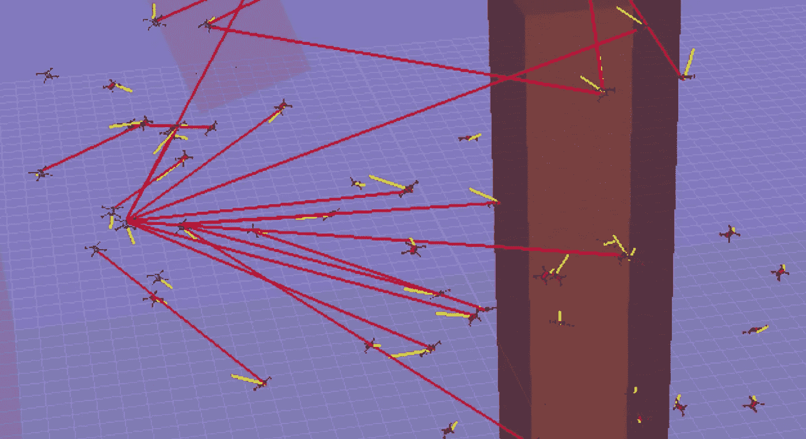

# AI +消费级无人机技术将改变国防部

> 原文：<https://towardsdatascience.com/consumer-drone-technology-will-change-the-defense-department-885921ffb68b?source=collection_archive---------84----------------------->

## 无人驾驶飞机，成群结队，无人驾驶飞机的风暴。

这最初出现在我的时事通讯《民主化自动化》上。 没有我想遇到来历不明的无人机的情况，而在未来，我们将会看到数百架。

2016 年消费级无人机购买量为 240 万架；高于 2015 年的 110 万辆[ [来源](https://www.vox.com/2017/4/14/14690576/drone-market-share-growth-charts-dji-forecast)，[来源](https://www.bcg.com/publications/2017/engineered-products-infrastructure-machinery-components-drones-go-work.aspx) ]。继续这一趋势(悲观地说), 2020 年将有大约 1000-2000 万架无人机售出。小型无人机的消费化为稳定社会和战争的未来带来了大问题。

*不相信我？点击下面的快速介绍。*

无人机便宜、用途广泛，而且难以追踪。如果你认为，“嗯，也许人们不会利用它们，”这是美国军方释放微型飞行器(MAV)群的实践。分类内容肯定是比较极端的。

最重要的是，[土耳其有可以出口的自杀式无人驾驶飞机](https://www.thedrive.com/the-war-zone/34204/turkey-now-has-a-swarming-quadcopter-suicide-drone-that-it-could-export)(在以色列设计)。这款名为 Kargu 的无人机是以土耳其语中的 hawk 命名的。阅读一些技术规范:

> 15 磅重的 Kargu-2 能以每小时 90 英里的速度飞行，并能在空中停留长达 30 分钟。它有一个视距控制链路，范围约为 6 英里。
> 
> 无人机可以携带三种不同类型的弹头中的一种，包括一种用于在户外攻击人员和其他无装甲目标的高爆炸碎片弹头，一种适用于建筑物或洞穴等封闭空间目标的温压型弹头，以及一种用于攻击轻装甲威胁的聚能装药。【 [*来源*](https://www.thedrive.com/the-war-zone/34204/turkey-now-has-a-swarming-quadcopter-suicide-drone-that-it-could-export)

*鹰的命名现在应该非常清楚了——它有能力消灭任何可见的目标。卖家声称这款无人机是为了反无人机和非对称，**现代战争**。这些技术落入更具争议的手中只是时间问题。[美军中央司令部司令已经宣布](https://taskandpurpose-com.cdn.ampproject.org/c/s/taskandpurpose.com/.amp/news/drone-swarms-middle-east-centcom):*

***“美军跟不上廉价无人机的洪流。”***

*这是我正在写的无人机风暴。10 架、100 架或 1000 架无人机攻击我们在国外的军队或国内的领导人。我们如何防御这种情况？*

**

*来源-作者的研究。*

*无人机和蜂群的定义并不总是很清楚——尤其是蜂群。*

# *嗡嗡声*

*[谷歌](https://www.google.com/search?ei=2yAfX5zNBeWl_Qa0mLToCA&q=define+drone&oq=define+drone&gs_lcp=CgZwc3ktYWIQAzIECAAQDTIGCAAQBxAeMgQIABANMgYIABAHEB4yBAgAEA0yBggAEAcQHjIGCAAQBxAeMgQIABANMgYIABAHEB4yBggAEAcQHjoECAAQR1DcD1jEFGC9FWgAcAF4AIABtAKIAcgGkgEHMC4yLjEuMZgBAKABAaoBB2d3cy13aXrAAQE&sclient=psy-ab&ved=0ahUKEwjcptzYi-7qAhXlUt8KHTQMDY0Q4dUDCAw&uact=5)默认定义(经过一些噪音和蜜蜂):*

> **遥控无人驾驶飞机或导弹。**

*我认为谷歌的定义将很快过时，因为无人机是机载/本地控制的。*

# *蜂群*

*谷歌的默认定义实际上并不太糟糕(比我遇到的许多使用这个词的研究人员要好):*

> *一大群或密集的昆虫，尤指会飞的昆虫*

*我认为祈使的词是 ***密*** 。一个群体是一个密集的物体，在那里不同地控制一个成员可能完全不会被注意到。最后，一个群体由 a)涌现行为或 b)中央控制来管理。*

*一群机器人会变成 10 个、50 个、100 个或 1000 个代理人的群体吗？2000 年代的群体控制研究主要集中在 10 个机器人的最优控制上。这项研究集中在几个机器人上，每个个体仍然是至关重要的。在我的圈子里，我们不认为这是一个群体，但我们喜欢思考边界在哪里。我的导师克里斯·皮斯特对群体定义的评论:*

> **人们如何做【群体控制】？不知何故，当通信中断或动态的时间常数短于通信/决策等待时间时，我们在所有级别上集中分层规划和分布式决策。军事行动是一个常见的例子(一窝蜂)，但管理一个家庭也类似——通常你不会喝完咖啡，通常两个人不会同时买咖啡。(根据内森的定义，家庭不是群体，但军队是，公共卫生也是)。**

*[我们对成群结队的微型机器人](https://bamlab.berkeley.edu/)感兴趣，它们可以协助应急响应、农业、分布式传感等领域。区别在于微型机器人可以大规模制造(1000 个)，所以我们有完全不同的关注点。*

**我们如何对付一群真正好斗的蜂群？**

# *反无人机*

*以下是我在反无人机工作领域的发现(和所做的)。*

# *无人机粉碎机？*

*这是在一系列关于国防工业无人机的电子邮件中。这架无人机(配备了一个旨在撞击其他无人机并破坏转子和马达的表面)被命名为 **Anduril** (也被称为西方的火焰)，令人印象深刻，但我不确定它对预期目标的效果如何。*

**点击下面观看一个* [*反无人机无人机*](https://www.theverge.com/2019/10/4/20898931/anduril-anvil-drone-footage-palmer-luckey-quadcopter) *如何表现的演示。**

# *更智能的反无人机无人机？*

*我不喜欢这个，因为用来提高防守者的技术显然可以提高进攻者。我们正在研究一队防御性无人机如何试图阻止许多攻击者进入突出显示的区域。需要学习的是*如何相对于攻击者*定位每架无人机，以便它可以在空中向攻击者发射网(摧毁它)。我怀疑我们可能有无人机在机场和许多其他关键的公共区域做这件事。*

**点击下面的视频，展示了一个防御性的蜂群(红色)抵御来自基地区域的入侵无人机(蓝色)。这是基于* [*的 Boids 群集算法*](https://en.wikipedia.org/wiki/Boids) *，也是一个活跃的研究领域。**

*头脑风暴反无人机技术得出了一些常见的答案:*

*   ***无人机本身**:一架装备了网的无人机可以轻松放倒另一架无人机。无人机也可以撞击目标来摧毁易碎的飞行部件(见下文，无人机击碎器)。一个军用物品与一个消费级无人机的一对一交易是非常昂贵的(我估计是 1000 倍)。*
*   ***电磁脉冲**:电磁脉冲受到欢迎，因为它会破坏电子设备，使电动汽车(及其控制电子设备)无法使用。问题是 EMP 脉冲通常对目标之外的东西有严重的影响，而移动/手持 EMP 的开发既昂贵又缓慢。*
*   ***激光/其他地面防御**:我不确定这些有多大用处，但是有些军用车辆装备了高功率激光，可以融化迎面而来的无人机。问题还是在于，这种防御比进攻(潜在的消费级无人机)成本更高。*

*反无人机技术工作的道德底线是什么？*

*我们在我的研究小组模拟“无人机斗狗”，我想知道我们是否应该这样做。尚不清楚如何控制作品的传播，但如何在不使世界变得更加危险的情况下，各国在技术上缩小从进攻到防御的差距([见军备竞赛](https://en.wikipedia.org/wiki/Arms_race))。历史表明，这是难以避免的。*

**我有一个未来的帖子，关于加速技术进步的问题以及进攻和防守能力之间的差异。我认为我们需要条约和积极的网络意识。无人机很难研究，因为消费者喜欢无人机！人们希望无人机能够稳健地交付披萨。如果消费者驱动市场，我们如何阻止进步和可用性？我们没有。**

# *其他风暴正在酝酿*

*   *[夜间，成群的无人机在科罗拉多和内布拉斯加大草原上空形成并移动](https://www.nytimes.com/2020/01/01/us/drones-FAA-colorado-nebraska.html)。几乎无法追踪，侵犯了隐私，并引起了一些州级反应。*
*   *[美国空军测试并利用无人驾驶飞机执行秘密任务](https://www.thedrive.com/the-war-zone/3889/the-alarming-case-of-the-usafs-mysteriously-missing-unmanned-combat-air-vehicles)。这并不奇怪。*
*   *美国空军测试无人驾驶战斗机。他们希望持续 g 力的优势会有所帮助，但老实说，现代自主系统的处理速度仍然落后几年。几年后，是的，这将成为现实。*

*[你们中有多少人真的听过一群四旋翼无人机在附近飞行？](https://youtu.be/2la4pIyXOEQ)烂透了。很多。以至于甚至考虑广泛使用四旋翼飞机进行本地运输对我来说听起来都很荒谬。*

*在我的研究小组中，我们正在开发一种静音无人机，但它距离实用还有很多步，所以我们不担心军事化(是的，我们讨论它的伦理)。可以看下面的视频。*

* [## 自动化大众化

### 一个关于机器人和人工智能的博客，让它们对每个人都有益，以及即将到来的自动化浪潮…

robotic.substack.com](https://robotic.substack.com/)*