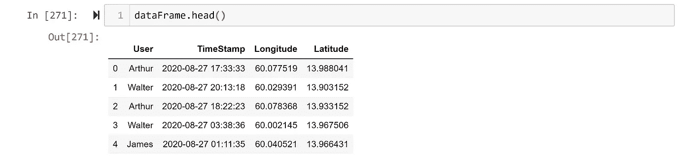
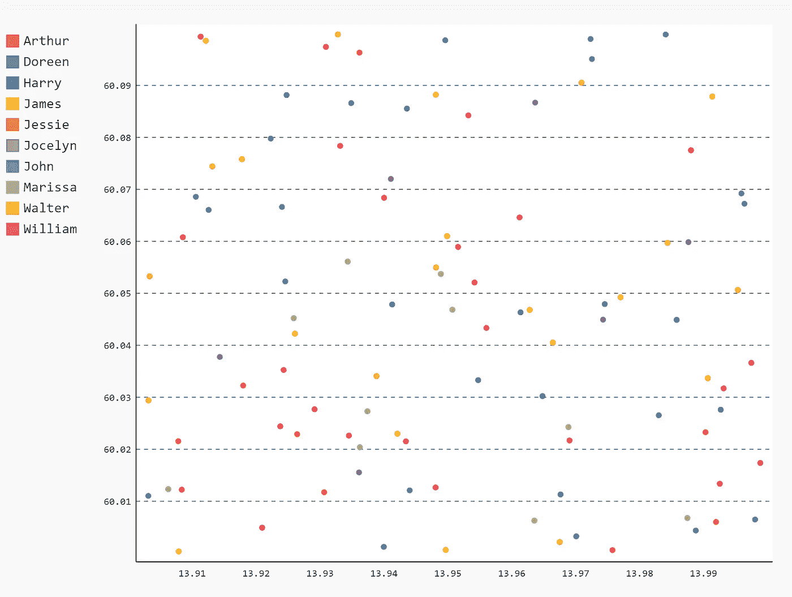
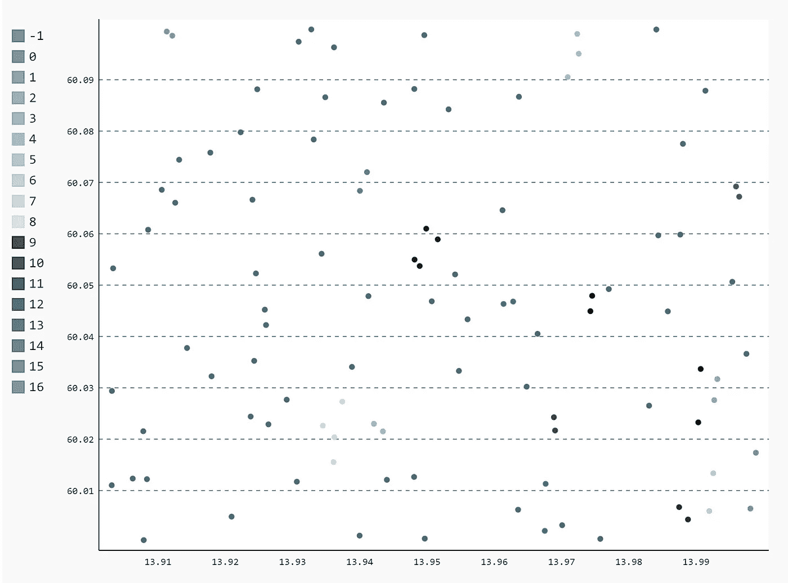

# 使用不到 30 行 Python 代码追踪联系人

> 原文：<https://towardsdatascience.com/contact-tracing-using-less-than-30-lines-of-python-code-6c5175f5385f?source=collection_archive---------13----------------------->

## 机器学习如何帮助应对流行病？


图片由作者提供(使用 [Canva](https://www.canva.com/) 制作)

接触追踪是用于识别那些与传染病检测呈阳性的人接触的人的过程的名称，例如麻疹、艾滋病毒和新冠肺炎病毒。在疫情期间，正确追踪接触者有助于减少感染人数或加快感染者的治疗过程。这样做有助于拯救许多生命。

技术可以帮助实现接触追踪过程的自动化，产生比手动操作更有效、更准确的结果。一项可以帮助这一过程的技术是*机器学习*。更准确地说，*集群*。**聚类**是机器学习算法的一个子类，用于根据这些特征将共享某些特征的数据划分到不同的聚类中。

[](/5-data-mining-techniques-every-data-scientist-should-know-be06426a4ed9) [## 每个数据科学家都应该知道的 5 种数据挖掘技术

### 如何在混乱中找到模式？

towardsdatascience.com](/5-data-mining-techniques-every-data-scientist-should-know-be06426a4ed9) 

有各种类型的聚类算法，如 K-means、Mean-Shift、谱聚类、BIRCH、DBSCAN 等等。这些不同的算法可以分为*三类:*

1.  ***基于密度的聚类:**基于区域的密度形成聚类——这种类型的例子有: ***DBSCAN*** (基于密度的有噪声应用的空间聚类)和 ***OPTICS*** (对点进行排序以识别聚类结构)。*
2.  ***基于等级的聚类:**使用树型结构形成聚类。一些聚类是预定义的，然后用于创建新的聚类—这种类型的示例: ***CURE*** (使用代表的聚类)、 ***BIRCH*** (平衡迭代减少聚类，并使用层次)。*
3.  ***基于划分的聚类:**通过将输入数据划分为 K 个聚类来形成聚类——这种类型的示例: **K-means** ， **CLARANS** (基于随机搜索对大型应用进行聚类)。*

*对于接触追踪，我们需要使用基于密度的聚类算法。原因是，当感染者与他人接触时，疾病就会传播。因此，更加拥挤——密集——的地区会比不那么拥挤的地区有更多的病例。*

*为了追踪受感染者的活动，科学家们经常使用 GPS 数据集，这些数据集包含一个人在任何给定时间范围内的时间和位置信息。位置数据通常表示为经度和纬度坐标。*

# *接触追踪算法*

*为了建立一个接触追踪算法，我们需要做三个步骤:*

1.  *获取特定时间和地点内不同用户的位置数据。*
2.  *对数据应用基于密度的聚类算法。*
3.  *使用分类来预测受感染的人。*

*那么，让我们开始吧…*

*我们将编写一个 Python 代码，它使用 DBSCAN 聚类算法来预测谁可能会因为与感染者接触而被感染。*

## *步骤№1:获取数据。*

*不幸的是，我们无法从 GPS 位置获得真实生活的数据。因此，我们将构建一个模拟数据集来应用我们的算法。对于本文，我使用了一个[模拟数据生成器](https://www.mockaroo.com/)来生成一个 [JSON 数据集](https://drive.google.com/file/d/1fYkBwXmDHLmRk_MCtiAOrcYwwyIqERbF/view?usp=sharing)，其中包含 10 个用户的 100 个位置条目。如果要尝试另一个数据集，请确保满足以下条件:*

1.  *每个用户有多个条目。*
2.  *用户彼此之间的距离很近，并且在一个时间范围内(例如，一天或特定的小时数)。*

*首先，让我们导入我们将使用的所有库。我们将需要`Pandas`和`Sklearn`来处理数据和`Pygal`来显示数据。*

```
*import pandas as pd
import pygal
from sklearn.cluster import DBSCAN*
```

***注意:**如果您没有这些库，您可以使用`pip`从命令行安装它们。此外，如果你正在使用 **Jupyter 笔记本**，你需要添加这个单元格来显示`Pygal`图:*

```
*from IPython.display import display, HTML
base_html = """
<!DOCTYPE html>
<html>
  <head>
  <script type="text/javascript" src="[http://kozea.github.com/pygal.js/javascripts/svg.jquery.js](http://kozea.github.com/pygal.js/javascripts/svg.jquery.js)"></script>
  <script type="text/javascript" src="[https://kozea.github.io/pygal.js/2.0.x/pygal-tooltips.min.js](https://kozea.github.io/pygal.js/2.0.x/pygal-tooltips.min.js)""></script>
  </head>
  <body>
    <figure>
      {rendered_chart}
    </figure>
  </body>
</html>
"""*
```

*现在，我们可以加载数据集并显示前 5 行，以了解它是如何构建的。*

```
*dataFrame = pd.read_json(r"Location_Of_Your_Dataset\MOCK_DATA.json")
dataFrame.head()*
```

**

*为了更好地理解数据，我们将使用 Pygal 散点图来绘制它。我们可以提取每个用户的不同位置，并将其存储在一个字典中，然后使用这个字典来绘制数据。*

```
*disp_dict = {}
for index, row in dataFram.iterrows():
    if row['User'] not in disp_dict.keys():
        disp_dict[row['User']] = [(row['Latitude'], row['Longitude'])]
    else:
        disp_dict[row['User']].append((row['Latitude'], row['Longitude']))
xy_chart = pygal.XY(stroke=False)
[xy_chart.add(k,v) for k,v in sorted(disp_dict.items())]
display(HTML(base_html.format(rendered_chart=xy_chart.render(is_unicode=True))))*
```

*运行这段代码，我们得到…*

**

*原始数据散点图。*

## *步骤№2:应用 DBSCAN 算法。*

*太棒了。现在我们有了数据集，我们可以对其应用聚类算法，然后使用它来预测潜在的感染。为此，我们将使用 DBSCAN 算法。*

***DBSCAN** 算法将聚类视为由低密度区域分隔的高密度区域。因此，与 k-means 相反，DBSCAN 发现的聚类可以是任何形状，k-means 假设所有的聚类都是凸形的。*

*Sklearn 有一个预定义的 DBSCAN 算法；要使用它，您只需知道三个参数:*

1.  ***eps:** 该因子表示同一聚类中不同点之间的距离。在我们的例子中，我们将使用 CDC 推荐的距离，即 6 英尺(或 0.0018288 公里)。*
2.  ***min_samples:** 聚类中的最小样本数。如果数据集较大且有噪声，请增加该数值。*
3.  ***度量:**设置数据点之间的距离度量。Sklearn 有很多距离度量，比如欧几里德，曼哈顿，闵可夫斯基。然而，对于我们的例子，我们需要一个距离度量来描述一个密码(地球)上的距离。这个度量叫做 ***哈弗辛。****

*我们现在可以将我们的模型应用到数据集。*

```
*safe_distance = 0.0018288 # a radial distance of 6 feet in kilometers
model = DBSCAN(eps=safe_distance, min_samples=2, metric='haversine').fit(dataFram[['Latitude', 'Longitude']])
core_samples_mask = np.zeros_like(model.labels_, dtype=bool)
core_samples_mask[model.core_sample_indices_] = True
labels = model.labels_
dataFram['Cluster'] = model.labels_.tolist()*
```

*应用具有这些参数的模型导致 18 个聚类。我们可以使用这段代码显示这些集群…*

```
*disp_dict_clust = {}
for index, row in dataFram.iterrows():
    if row['Cluster'] not in disp_dict_clust.keys():
        disp_dict_clust[row['Cluster']] = [(row['Latitude'], row['Longitude'])]
    else:
        disp_dict_clust[row['Cluster']].append((row['Latitude'], row['Longitude']))
print(len(disp_dict_clust.keys()))
from pygal.style import LightenStyle
dark_lighten_style = LightenStyle('#F35548')
xy_chart = pygal.XY(stroke=False, style=dark_lighten_style)
[xy_chart.add(str(k),v) for k,v in disp_dict_clust.items()]
display(HTML(base_html.format(rendered_chart=xy_chart.render(is_unicode=True))))*
```

**

*聚类散点图*

*在算法完成之后，如果有任何没有聚类的数据点，它们将被聚类为噪声或聚类-1。通常，您会发现这个数据集中的所有用户都是-1 集群以及其他集群的一部分。*

## *步骤№3:预测感染者。*

*如果我们有一个被感染的人的名字，我们就可以用它来得到这个人所属的所有集群。从那里，我们可以看到这些集群中的其他人。这些人被感染的概率会比没有被感染的人高。*

*   ***获取特定人所属的所有聚类***

*给定一个名字`inputName`例如， *William* ，我们希望得到 *William* 所属的所有集群。*

```
*inputName = "William"
inputNameClusters = set()
    for i in range(len(dataFrame)):
        if dataFrame['User'][i] == inputName:
            inputNameClusters.add(dataFrame['Cluster'][i])*
```

*执行完这段代码后，`inputNameCluster`将变成{2，4，5，-1}。*

*   *将人们聚集在一个特定的群体中。*

*现在，我们想要属于这个特定集群集合的其他人。*

```
*infected = set()
    for cluster in inputNameClusters:
        if cluster != -1:
            namesInCluster = dataFrame.loc[dataFrame['Cluster'] == cluster, 'User']
            for i in range(len(namesInCluster)):
                name = namesInCluster.iloc[i]
                if name != inputName:
                    infected.add(name)*
```

*在这两个部分中，当`inputName`在每个集群的名称列表中时，我使用集合来避免额外的 if-else 语句。*

**Voilà* ，代码会返回{'Doreen '，' James '，' John'}，也就是说，那三个人有可能被感染，因为他们在某个时间某个地点接触过 William。*

*我将核心代码放入一个函数中，该函数获取数据帧和用户名，并对该用户进行接触追踪，最后打印出潜在的感染者。该函数将首先检查`inputName`是否有效；否则，它将引发一个断言错误。最重要的是，它只有不到 30 行代码！！*

*联系人追踪功能的完整代码:*

# *结论*

*接触追踪是我们可以利用技术挽救人们的生命并尽快为他们提供治疗的方法之一。政府和医务人员经常可以访问一些患者的 GPS 位置。我们在这篇文章中走过的过程，基本上与他们获取潜在感染的过程相同。幸运的是，感谢像 Sklearn 这样的库，我们可以在我们的数据集上使用预定义的模型，并通过几行代码获得结果。*

# *参考*

*[1]“在带有噪声的大型空间数据库中发现聚类的基于密度的算法”，Ester，m .，H. P. Kriegel，J. Sander 和 X. Xu，载于第二届知识发现和数据挖掘国际会议论文集，俄勒冈州波特兰，出版社，第 226-231 页。1996*

*[2]“DBSCAN 再访，再访:为什么以及如何应该(仍然)使用 DBS can。舒伯特，e，桑德，j，埃斯特，m，克里格尔，H. P .，，徐，X. (2017)。《美国计算机学会数据库系统学报》(TODS)，42(3)，19。*

*[3] [Sklearn 文档。](https://scikit-learn.org/stable/modules/clustering.html#optics)*