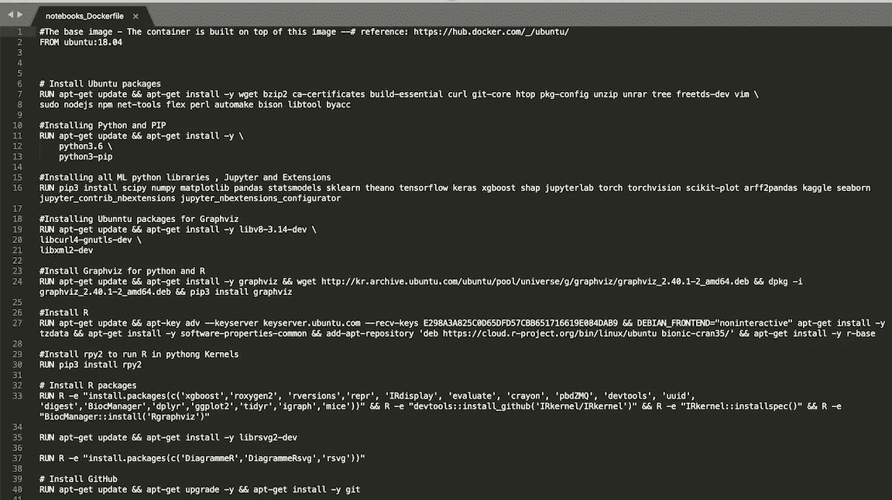
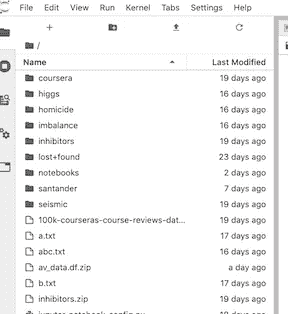
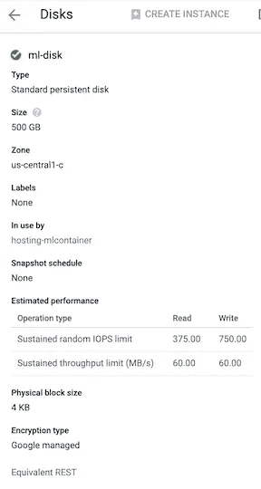
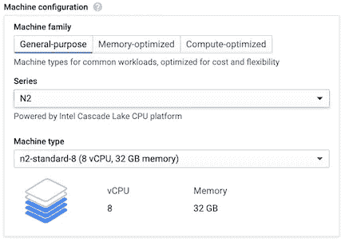
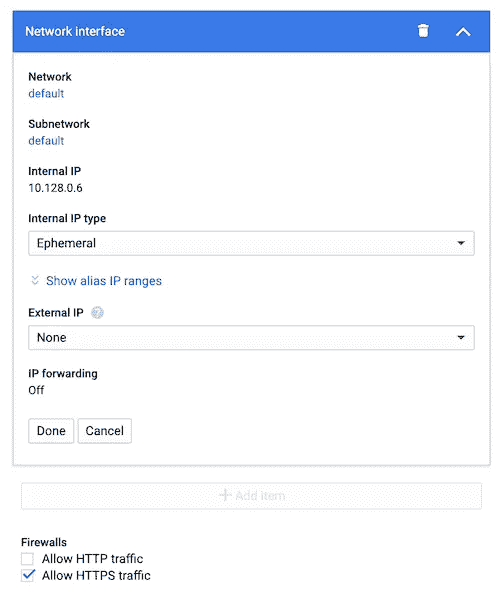
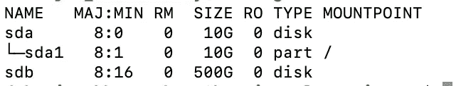
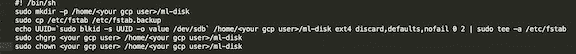
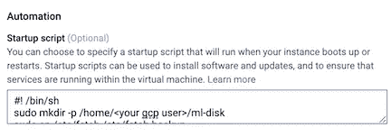

# 适用于大多数 ML 用例的一个容器

> 原文：<https://towardsdatascience.com/container-for-almost-all-ml-use-cases-de-mystifying-xgboost-iii-434310b782e8?source=collection_archive---------25----------------------->

## 揭开 XgBoost 的神秘面纱

设置 Docker 和远程 Jupyter 服务器(在 GCP 上)

# 序幕

这是去神秘化 XGBoost [第一部分](https://medium.com/@b.debanjan/de-mystifying-xgboost-part-i-f37c5e64ec8e)和[第二部分](https://medium.com/@b.debanjan/de-mystifying-xgboost-part-ii-175252dcdbc5)的延续。不过你可以单独阅读。如果您正在使用 XgBoost 进行您的机器学习项目，并且想要深入了解内部工作方式和超级参数，请查看[第一部分](https://medium.com/@b.debanjan/de-mystifying-xgboost-part-i-f37c5e64ec8e)和[第二部分](https://medium.com/@b.debanjan/de-mystifying-xgboost-part-ii-175252dcdbc5)。

在这篇博客中，我将深入构建一个 docker 容器，它可以用于几乎所有的 ML 用例。集装箱内还将设置 Jupyter 笔记本和 Jupyter 实验室。我们将能够在 notebook 的 python 内核中同时使用 Python 和 R 进行编码！(R 有我喜欢使用的非常酷的绘图库，包括 XGBoost 的 plot_tree 的树可视化实现)。我们还将能够在本地浏览器上，通过 ssh 隧道和分别到容器主机和容器的端口转发，远程连接到 Jupyter 实验室服务器。

因为我最近在 GCP 上这么做了，所以我还将添加特定于 GCP 的指令，以便在 GCP 的 VM 上托管和运行这个容器，以及将持久磁盘映射到容器的指令。我们走吧！

# 安装步骤

## 安装 Docker

第一步，显然是安装 Docker。对我来说，我在 Debian 上，在 GCP 的一个虚拟机中。我跟着下面的[链接](https://www.digitalocean.com/community/tutorials/how-to-install-and-use-docker-on-debian-9)，去安装 docker。或者可以关注 Docker 官方[链接](https://docs.docker.com/install/linux/docker-ce/debian/)。

无论你的操作系统是什么，找出正确的安装步骤。谷歌。冰！

## 文档文件

下面是 docker 文件。我选择了 Ubuntu 18.04 作为基础映像，因为我喜欢 Ubuntu😀。您可以选择 Centos 或其他 linux 版本。不幸的是，所有的运行命令都依赖于操作系统，或者至少选择 Linux。



请从[https://github . com/run 2/demystify-xgboost/blob/master/docker file](https://github.com/run2/demystify-xgboost/blob/master/Dockerfile)下载该文件

从上面的链接获取文件。

我将运行分割成逻辑单元，这样容器可以一层一层地构建。在层中包含这些(单次运行命令)可以帮助您构建其他这样的 other 文件，在使用上述缓存层时(在您从该 other 文件构建映像之后)，为您的用例构建更具体的层。

首先，我有所需的 Ubuntu 包，然后是 python 和 pip，然后是所有常见的 ML 库，然后是安装 graphviz 所需的库(我们需要它进行可视化)，然后安装 graphviz 和 R，接着是 rpy2，它基本上允许我们在 python 内核中运行 R，然后是 R 包，然后是 github，最后是可选的 gcloud sdk 和一些清理工作。

它还安装了许多实用程序包，如 Kaggle、Shap、Jupyter extensions、Seaborn、arff2pandas，它们广泛用于 ML 项目。

接下来，Dockefile 创建一个本地目录来映射主机卷。创建一个名为 ml-user 的用户(无密码)。建立了朱庇特和朱庇特实验室。我没有遇到使用密码作为参数的麻烦，但是有一个注释部分显示了如何做。不过我不建议你这么做，因为你真的不需要那个密码。永远不会。

最后，Dockerfile 从主机复制三个文件。一个 jupyter 配置文件，一个允许我们通过 https 运行 Jupyter 服务器的证书文件，以及一个在容器启动时启动 Jupyter 服务器的入口点文件。

## 主持人

容器主机可以是物理机或虚拟机。从 GitHub 下载 Dockerfile，并将其作为“Dockerfile”保存在您主机上的一个目录中。

要构建这个 docker 容器，您还需要三个文件。一个 Jupyter 配置文件 jupyter_notebook_config.py .一个 ssl 证书文件 mysert.pem 和一个名为 entryPoint.sh 的 entrypoint 文件。

让我们过一遍。

## Jupyter 的证书和配置文件

这两个文件没什么内容。如果您遵循 [Jupyter 设置中给出的程序，](https://jupyter-notebook.readthedocs.io/en/stable/public_server.html)我们基本上需要

1.  使用 Openssl 创建一个证书文件。我没有上传这个文件，很明显:)
2.  为安全访问 Jupyter 实验室创建散列密码
3.  生成 Jupyter 配置，并使用 a)证书文件位置，b)密码哈希 c)Jupyter 为笔记本提供服务的文件夹位置 d)以及允许从所有 IP 访问服务器的一些更改 e)默认端口(8888)等更新配置文件。

您可以在 github 链接上使用配置文件(没有密码散列)。

记得修改配置文件中的<you hash="" password="" here="">部分(参见 [Jupyter 设置](https://jupyter-notebook.readthedocs.io/en/stable/public_server.html)链接以了解如何生成散列)</you>

您将需要 config 和 cert 文件(我将其命名为 mycert.pem。如果您想命名为其他名称，您将需要在 config 文件中更改名称)，位于您启动 docker build 命令的相同位置。

## 入口点

最后，让我们谈谈入口点。这个脚本以 root 用户的身份从容器的/root 目录运行(参见 docker 文件的最后一行)。但是我们需要在用户 ml-user 的许可下在后台启动 Jupyter lab(不想暴露在 root 下运行的 Jupyter lab)，然后确保容器启动并运行，并将 std 和 error 通过管道返回到一个可以从主机访问的文件中。

下面是执行该操作的命令

```
#!/bin/bash
echo "$1"
sudo -H -u ml-user -- sh -c '. /home/ml-user/.bashrc ; \
cd ; pwd ; chown -R ml-user /ml-disk ; chgrp -R ml-user /ml-disk ; \
PATH=$PATH:/home/ml-user/.local/bin:/home/ml-user:/usr/local/sbin:/usr/local/bin:/usr/sbin:/usr/bin:/sbin; 
export PATH; nohup jupyter lab 2>&1 > /ml-disk/lab.log &'
bash
```

H 转到-u ml-user 的主目录。注意用户 ml-用户是在 docker 文件中创建的。然后运行 ml-user 的 bashrc 来设置本地环境变量。接下来移动到 ml-user 的主目录，并将所有需要的路径添加到 path 变量中(记住我们是在 root 用户的身份下运行的)。

最后，我们使用 nohup 在后台运行 Jupyter，并在一个目录中的文件中捕获标准错误和标准输出，该目录是专门创建的(再次在 Dockerfile 文件中),用于映射来自主机的卷。最后的 bash 命令确保容器在运行时不会退出，并保持对交互式会话可用。

用于存储 jupyter 日志文件的/ml-disk 目录是容器中的目录，当运行 docker run 命令时，它将被映射到主机上的一个卷，如下所示。

你可以从[https://github . com/run 2/demystify-xgboost/blob/master/entryPoint.sh](https://github.com/run2/demystify-xgboost/blob/master/entryPoint.sh)下载 entry point . sh

## 建造它

让我们将这个容器命名并标记为 de-神秘化/rnpython:1.0。

我们可以使用下面的命令来构建它

docker build -t 去神秘化/rnpython:1.0。(不要忘记点号或合适的目标路径)

这将需要一些时间，你完成了！！🥳🥳🥳

此时，如果您在 gcp 上，您可以标记它，并将其推入 GCP 容器注册。或者使用自己的容器注册中心。甚至是 dockerhub。

注意，如果您在运行 docker 命令时遇到权限问题，您需要将您的用户添加到 sudo 组。见上面提到的 docker 的官方链接。

## 标记并推送到容器注册表

首先发射命令 *docker 图像*

获取刚刚创建的 de-mystic/rn python:1.0 docker 图像的图像 id

为了 GCP

标记一下:docker tag【gcr.io/*<你的 gcp 项目名>*/demystify-rnpython:1.0
Push:docker Push gcr.io/*<你的 gcp 项目名>*/dr-神秘化-rn python:1.0

对 Dockerhub 或您自己的回购使用类似的标记和推送。

搞定了。！

# 运行它

您现在已经准备好运行容器了。

先拉一下。

码头工人拉 gcr.io/<your project="" name="">/去神秘化-rnpython:1.0</your>

那就运行它。

docker run-v/home/<your user="" on="" the="" host="">/ml-disk:/ml-disk-p 8888:8888-it-d gcr.io/<your gcp="" project="" name="">/de-神秘化-rnpython:1.0</your></your>

它使您的容器在伪 tty 上交互，而-d 分离它，这样交互 shell 就不会启动。

这里的-v 命令将/home/ <your user="" on="" the="" host="">/ml-disk 目录(可以在主机硬盘上创建，也可以是外部持久性磁盘的挂载目录)映射到容器上的/ml-disk 目录。</your>

-p 命令设置从主机端口 8888 到容器端口 8888 的端口转发(Jupyter 服务器将监听的默认端口，在配置文件中有提及)

就是这样。此时，您应该能够在主机上直接打开 [https://localhost](https://localhost) 。或者，如果您的主机是一台 VM 或服务器，并且您想从您的本地机器访问 Jupyter，您可以从您的本地主机使用 ssh 隧道，如下所示。

```
ssh -N -f -L localhost:8888:localhost:8888 [ml-user@host](mailto:dbhatt@addawser.engba.symantec.com)
```

或者如果你在 GCP，你可以从你的本地主机使用 ssh 隧道

```
gcloud compute ssh --project <your gcp project id> --zone <zone of your hosting vm> <name of your hosting vm> -- -L 8888:localhost:8888
```

现在，您应该能够从本地浏览器启动 [https://localhost](https://localhost) 。它会将本地主机上的 8888 通过隧道传输到 VM 主机或服务器的 8888。从那里，端口转发将负责与容器的端口 8888 交换数据包。

## 你看到了什么？

一旦你启动了浏览器，它应该像下面这样



在左侧，您应该能够看到您的主机上的卷的所有内容(例如/home/ <user>/ml-disk，它被挂载到容器的/ml-disk)。</user>

父目录是容器上的/ml-disk，该目录映射到主机的/home/ <user>/ml-disk 目录。开始吧！</user>

# GCP 持久磁盘

这一部分只给在 GCP 做这个的人。并且想要在主机 VM 上安装永久磁盘。

## 在暴露 IAP 隧道和 Https 的情况下，在主机虚拟机上装载磁盘

在 GCP 拥有共享持久磁盘的最佳方式是通过云文件存储。它就像一个 NFS，如果您在由不同用户运行的许多容器实例上使用训练数据集，那么 CFS 是最佳选择，因为它允许在多个实例上进行读写共享。然而，这有点贵，所以我打算用一个普通的磁盘。

但是请记住，对于普通磁盘，您将无法选择多租户读写。它将被锁定，供主机虚拟机独占使用。

下面是我如何创建一个 500GB 的普通磁盘(SSD 很贵)，将其命名为 *ml-disk* (你可以命名为任何东西)并启动我的主机 VM(命名为 hosting-mlcontainer)，这个磁盘连接到它。



创建永久磁盘


在创建虚拟机时将其添加到虚拟机中

此外，记住，你的虚拟机需要比你想给容器的更多的内存，所以，相应地分配，比如下面



选择虚拟机体系结构、虚拟 CPU、内存

我通常还会确保不能通过互联网访问启动虚拟机。因此，关闭短暂的外部 ip 地址。而且要确定！您已经打开了 https 访问——因为我们将通过 https 从本地主机进入我们在容器上的 Jupyter 服务器，以便我们可以在本地运行它！！



将外部 ip 设置为无并允许 https 流量

现在，这不是一个 GCP 的博客，所以我不会进入细节，但要访问没有外部 ip 的虚拟机，你可能需要启用 IAP 转发权限。无论如何，一旦虚拟机启动并运行，登录并启动 lbsck 命令。您应该会看到类似这样的内容



sdb 是外部磁盘卷

最后一行是我们刚刚创建的名为 *ml-disk* 的外部磁盘的卷。现在我们需要装入这个卷。首先，我们需要使用如下命令格式化驱动器

sudo mkfs . ext 4-m 0-F-E lazy _ ritable _ init = 0，lazy_journal_init=0，discard /dev/sdb

然后，我们需要创建一个目录，并将磁盘装入该目录。但是我们每次都需要这样做，对吗？就像每次我们使用相同的外部磁盘创建或启动虚拟机一样，我们需要挂载该磁盘。所以我们最好在虚拟机上(或者在虚拟机模板上)有一个启动脚本。脚本如下所示。



将/dev/sdb 加载到~/ml-disk 目录并允许它对 ml-user 进行写访问的脚本。这个脚本保存了 fstab 文件的副本，该文件将磁盘挂载到分区中，并修改它以在上述目录中挂载/dev/sdb 卷。你可以在[https://github . com/run 2/demystify-xgboost/blob/master/VM-startup](https://github.com/run2/demystify-xgboost/blob/master/vm-startup)找到这个脚本

我们需要将该启动脚本放在虚拟机或虚拟机模板的“管理”选项卡下。



将外部磁盘装入指定文件夹的虚拟机启动脚本

搞定了。

改进 docker 有很多方法和细节可以做。请评论并告诉我你们是如何改进它的。

在本系列的下一部分，我将展示如何通过 Jupyter Lab 内核在这个容器上使用 R 和 Python，并在解开 XGBoost 之谜中使用真实的例子。

# 参考

[](https://medium.com/@b.debanjan/de-mystifying-xgboost-part-ii-175252dcdbc5) [## 揭开 XGBoost 第二部分的神秘面纱

### 序幕

medium.com](https://medium.com/@b.debanjan/de-mystifying-xgboost-part-ii-175252dcdbc5) [](https://medium.com/@b.debanjan/de-mystifying-xgboost-part-i-f37c5e64ec8e) [## 揭开 XGBoost 第一部分的神秘面纱

### 为什么为什么？

medium.com](https://medium.com/@b.debanjan/de-mystifying-xgboost-part-i-f37c5e64ec8e)  [## 运行笔记本服务器- Jupyter 笔记本 6.0.3 文档

### Jupyter notebook web 应用程序基于服务器-客户机结构。笔记本电脑服务器使用两个进程…

jupyter-notebook . readthedocs . io](https://jupyter-notebook.readthedocs.io/en/stable/public_server.html)