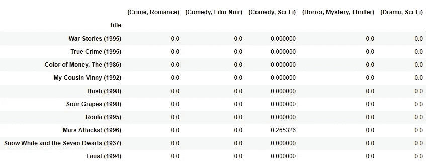
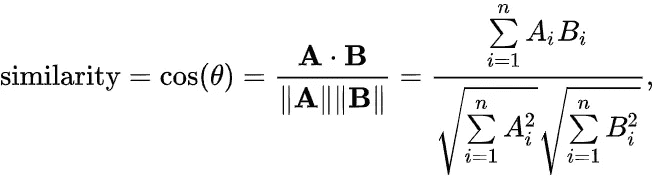
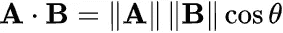
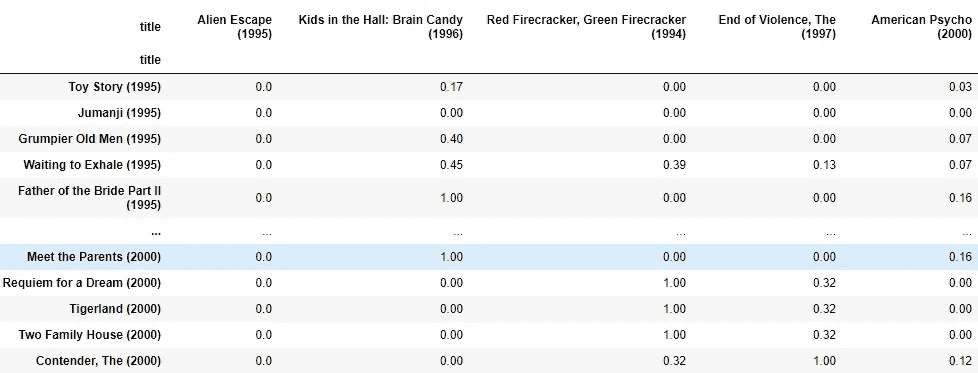
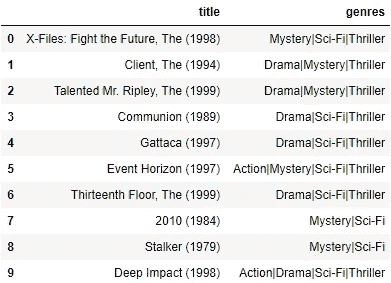
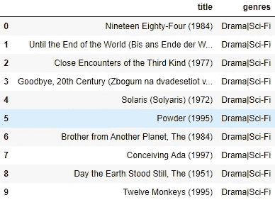
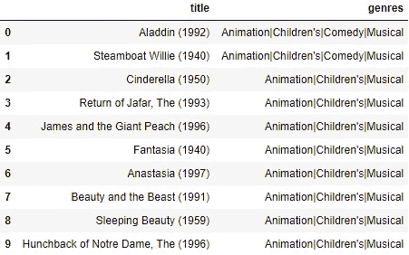
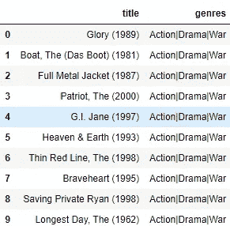

# 使用 tf-idf 构建基于电影内容的推荐系统

> 原文：<https://towardsdatascience.com/content-based-recommender-systems-28a1dbd858f5?source=collection_archive---------9----------------------->

## 基于内容的电影推荐方法


[吕山德元](https://unsplash.com/@lysanderyuen?utm_source=unsplash&utm_medium=referral&utm_content=creditCopyText)在 [Unsplash](https://unsplash.com/s/photos/books-prague?utm_source=unsplash&utm_medium=referral&utm_content=creditCopyText) 上拍照

# 介绍

随着时间的推移，我们越来越依赖在线平台和应用程序，如网飞、亚马逊、Spotify 等。我们发现自己不得不不断地从广泛的选项中进行选择。

有人可能会认为，与选择很少相比，选择多是件好事，但选择过多会导致所谓的“决策瘫痪”。正如巴里·施瓦茨在《选择的悖论》中写道:

> “大量的选择可能会使消费者泄气，因为这迫使他们在做决定时付出更多的努力。所以消费者决定不决定，不买产品。或者，如果他们这样做了，做决定所需要的努力会降低从结果中获得的快乐。”

这也导致了另一个更微妙的负面影响:

> “大量的选项可能会降低人们实际选择的吸引力，原因是考虑一些未选择的选项的吸引力会降低从选择的选项中获得的快乐。”

一个显而易见的结果是，除非对我们来说变得更容易，否则我们最终不会在多种选择中做任何努力；换句话说，除非这些是根据我们的喜好过滤掉的。

这就是为什么推荐系统已经成为上述平台中的关键组件，在这些平台中，用户有无数的选择。他们的成功将在很大程度上取决于他们缩小选择范围的能力，让我们更容易做出选择。

该领域的一个主要推动力是网飞，它通过研究不断推进最先进的技术，并在 2006 年至 2009 年间赞助了 Netflix 奖，极大地推动了该领域的研究。

此外，网飞的推荐者在平台中有巨大的存在。当我们搜索一部电影时，我们会立即得到一系列我们可能也会喜欢的相似电影:


网飞-个人账户

## 概述

这篇文章从揭示推荐系统中的不同范例开始，并通过一个基于内容的推荐系统的实践方法。我将使用众所周知的 [MovieLens 数据集](https://grouplens.org/datasets/movielens/)，并展示我们如何根据它们的特点推荐新电影。

这是关于推荐系统的两篇系列文章(可能更多)中的第一篇，下一篇将是关于**协同过滤**。

**在这里** **找到这篇帖子的 jupyter 笔记本版，里面有所有代码** [**。**](https://github.com/AlexanderNixon/Machine-learning-reads/blob/master/Movie-content-based-recommender-using-tf-idf.ipynb)

# 推荐系统的类型

大多数推荐系统利用协同过滤和基于内容的过滤中的一种或两种。尽管当前的推荐系统通常将几种方法组合成一个混合系统。以下是这些方法的概述:

*   **协同过滤**:这些方法背后的主要思想是利用其他用户的偏好和*品味*向用户推荐新的项目。通常的程序是找到相似的用户(或项目)来推荐那些用户喜欢的新项目，并且被推荐的用户可能也会喜欢。
*   **基于内容:**基于内容的推荐器将使用关于项目的专有数据。为此，我们需要对用户的偏好有一个最低限度的了解，这样我们就可以推荐与用户指定(或推断)的标签/关键词相似的新项目。
*   **混合方法:**，顾名思义，包括结合协同过滤、基于内容和其他可能方法的技术。现在大多数推荐系统是混合的，如因式分解机的情况。

# 电影镜头数据集

测试推荐系统最常用的数据集之一是[movie lens 数据集](https://grouplens.org/datasets/movielens/)，它包含来自 [MovieLens 网站](http://movielens.org)的评级数据集。对于这篇博客，我将使用一个数据集，其中包含 6000 名 MovieLens 用户制作的大约 4000 部电影的 100 万匿名评级，这些电影于 2003 年 2 月上映。

让我们看一下这个数据集中包含的数据。我们有三个。csv 文件:**收视率**、**用户**、**电影**。这些文件将作为熊猫数据帧加载。我们有一个评级文件，看起来像:

```
ratings.sample(5)
        user_id  movie_id  rating
376907     2201      2115       5
254402     1546      2329       5
520079     3208      3300       3
534583     3300      2248       5
325635     1926      1207       4
```

`movies`数据集如下:

```
movies.sample(5)
      movie_id                           title          genres
948        960     Angel on My Shoulder (1946)     Crime|Drama
645        651           Superweib, Das (1996)          Comedy
3638      3707           Nine 1/2 Weeks (1986)           Drama
511        515  Remains of the Day, The (1993)           Drama
2144      2213      Waltzes from Vienna (1933)  Comedy|Musical
```

既有一个`movie_id`、`title`又有一个字符串，所有的`genres`都由字符`|`分隔。

和用户数据集，包含用户的基本信息:

```
users.head()
   user_id gender zipcode  age_desc              occ_desc
0        1      F   48067  Under 18          K-12 student
1        2      M   70072       56+         self-employed
2        3      M   55117     25-34             scientist
3        4      M   02460     45-49  executive/managerial
4        5      M   55455     25-34                writer
```

## 电影类型

正如我们将在下一节中探讨的，类型本身可以用来提供一个相当好的基于内容的推荐。但在此之前，我们需要分析一些重要的方面。

*   *最受欢迎的流派有哪些？*

这将是在构建基于内容的推荐器时要考虑的相关方面。我们想了解在定义用户的*品味时，哪些类型是真正相关的。*一个合理的假设是，恰恰是那些不受欢迎的类型更符合用户的口味。

最相关的类型有:

```
genre_popularity = (movies.genres.str.split('|')
                      .explode()
                      .value_counts()
                      .sort_values(ascending=False))
genre_popularity.head(10)Drama         1603
Comedy        1200
Action         503
Thriller       492
Romance        471
Horror         343
Adventure      283
Sci-Fi         276
Children's     251
Crime          211
Name: genres, dtype: int64
```

或者，为了更直观地展示，我们可以绘制一个带有流派的词云:

```
genre_wc = WordCloud(width=1000,height=400,background_color='white')
genre_wc.generate_from_frequencies(genre_popularity.to_dict())plt.figure(figsize=(16, 8))
plt.imshow(genre_wc, interpolation="bilinear")
plt.axis('off')
```


生成体裁词云

如你所见，最常见的类型是戏剧、喜剧和动作片。然后，我们有一些不太常见的其他类型，如西部片、奇幻片或科幻片。正如我之前指出的，后者是我们在推荐时想要给予最大重视的。但是，这是为什么呢？

作为一个例子，让我们考虑一个用户想要找到一部类似于“ ***【善、恶、丑*** ”的电影，它是西部片、动作片和冒险片的混合体。你认为哪种类型更适合向用户推荐电影？大概是西方的，因为将会有许多非西方的动作或冒险电影，这可能会导致推荐许多非西方电影。

# 构建基于内容的推荐器

在这篇文章中，我们将基于**电影类型建立一个非常简单的推荐器。**解决这个问题的一个相当常见的方法是使用一个 [**tf-idf**](https://en.wikipedia.org/wiki/Tf%E2%80%93idf) 矢量器。

虽然这种方法更常用于文本语料库，但是它拥有一些有趣的属性，这些属性对于获得数据的 [**向量表示**](https://en.wikipedia.org/wiki/Vector_space) 是有用的。该表达式定义如下:


这里我们有术语频率的乘积，即给定术语(类型)在文档(电影的类型)中出现的次数乘以右侧术语，这基本上根据给定术语在所有文档(电影)中出现的次数来衡量术语频率。

包含给定流派( *df_i)* 的电影越少，得到的权重越高。对数基本上是为了平滑除法的结果，即避免由于右手项而导致的巨大差异。

那么，为什么这对我们有用呢？

正如已经提到的，tf-idf 将通过给予不太频繁的类型更高的权重来帮助捕捉每部电影的重要类型，这是我们用`CountVectorizer`无法获得的。

## tf-idf

为了获得 tf-idf 向量，我将使用 sklearn 的`TfidfVectorizer`。然而，我们必须考虑这个问题的一些特殊方面。在处理文本数据时，通常的设置是设置一个`word`分析器和一个`ngram_range`，它也将包括指定范围内的 n 元语法。一个例子是:

```
from sklearn.feature_extraction.text import TfidfVectorizers = "Animation Children's Comedy"
tf_wrong = TfidfVectorizer(analyzer='word', ngram_range=(1,2))
tf_wrong.fit([s])
tf_wrong.get_feature_names()
# ['animation', 'animation children', 'children', 'children comedy', 'comedy']
```

然而，在这种情况下，这实际上没有意义，因为类型的顺序是不相关的，我们想要考虑给定电影的类型的**组合**，而不考虑顺序。对于上面的例子，我们想要:

```
from itertools import combinations
[c for i in range(1,4) for c in combinations(s.split(), r=i)]

[('Animation',),  ("Children's",),  ('Comedy',),  ('Animation', "Children's"),  ('Animation', 'Comedy'),  ("Children's", 'Comedy'),  ('Animation', "Children's", 'Comedy')]
```

在这里，我们找到了直到`k`(这里是 4)的流派组合集，或者用数学术语来说，就是[超集](https://en.wikipedia.org/wiki/Subset)。包括类型的`n>1`组合，将意味着 tf-idf 矢量器也将考虑这些组合在所有电影中出现的频率，给出现最少的那些分配较高的分数。

我们可以使用`analyser`参数应用上面的逻辑，我们可以使用这个参数从原始输入中获得特征序列，使用一个可调用的:

```
tf = TfidfVectorizer(analyzer=lambda s: (c for i in range(1,4)
                     for c in combinations(s.split('|'), r=i)))
tfidf_matrix = tf.fit_transform(movies['genres'])
tfidf_matrix.shape
# (3883, 353)
```

这将产生以下 tf-idf 向量(注意，只对列和行的子集进行采样):

```
pd.DataFrame(tfidf_matrix.todense(), columns=tf.get_feature_names(),   index=movies.title).sample(5, axis=1).sample(10, axis=0)
```



## 向量间的相似性

下一步将寻找类似的 tf-idf 向量(电影)。回想一下，我们已经*将*每部电影的类型编码到一个 tf-idf 表示中，现在我们想要定义一个*接近度度量。*一个常用的度量是[余弦相似度](https://en.wikipedia.org/wiki/Cosine_similarity)。

这种相似性度量因其等于被比较的两个向量之间角度的余弦值而得名。两个向量之间的角度越小，余弦值就越高，从而产生更高的相似性因子。它表示如下:



图片[来源](https://en.wikipedia.org/wiki/Cosine_similarity)

其中，由于内积可以表示为幅度乘以两个向量之间角度的余弦的乘积，因此很明显，上述内容可以表示为余弦:



图像[来源](https://en.wikipedia.org/wiki/Cosine_similarity)

因此，通过取两个向量之间的内积，并根据它们各自的幅度进行归一化，得到两个向量之间的*余弦* 。

为了计算所有 tf-idf 向量之间的余弦相似性，我们可以再次使用 scikit-learn。`[sklearn.metrics.pairwise](https://scikit-learn.org/stable/modules/generated/sklearn.metrics.pairwise_distances.html)`包含许多成对的距离度量，其中有`[cosine_similarity](https://scikit-learn.org/stable/modules/generated/sklearn.metrics.pairwise.cosine_similarity.html)` [](https://scikit-learn.org/stable/modules/generated/sklearn.metrics.pairwise.cosine_similarity.html)，它将计算所有输入行之间的余弦相似性，在本例中为 tf-idf 向量:

```
from sklearn.metrics.pairwise import cosine_similarity
cosine_sim = cosine_similarity(tfidf_matrix)
```



现在我们必须定义一些逻辑来找到给定电影的最高权重或 tf-idf 分数。为此，我定义了以下函数，该函数将一部给定的电影`i`、相似度矩阵`M`、项目数据帧作为输入，并返回多达`k`的推荐:

通过使用`argpartition`，我们在给定的索引(电影)`i`上取`M`(相似矩阵)中的`k`最高值。然后，我们对`M`中的列进行索引，并进一步从最高权重到最低权重进行切片(排除最高权重，这将是同一项，因为矩阵是对称的，因此第二行中有`2s`)。

## 测试推荐器

我们用几个例子来测试一下推荐器。由于`movies`数据集包含了 2000 年以前的电影，我们将不得不使用一些经典电影。

`'2001: A Space Odyssey'`怎么样？

```
movies[movies.title.eq('2001: A Space Odyssey (1968)')]
    movie_id                              title              genres
912      924       2001: A Space Odyssey (1968)  Drama|Mystery|Sci-Fi|Thriller
```


2001:太空漫游

我们可以看到它的流派是`Drama|Mystery|Sci-Fi|Thriller`。看看有什么推荐吧！:)

```
genre_recommendations('2001: A Space Odyssey (1968)', cosine_sim_df, movies[['title', 'genres']])
```



正如所料，最相似的电影是那些分享最多类型的电影。有趣的是，我们看到大部分都是`Sci-Fi`电影。请注意，这很可能受到以下事实的影响:在上面出现的流派中，`Sci-Fi`通常具有较高的分数，因为它出现的频率最低，因此具有较高的权重。

让我们看看我最喜欢的科幻电影《T2 》:

```
movies[movies.title.eq(‘Contact (1997)’)]
      movie_id           title        genres
1543      1584  Contact (1997)  Drama|Sci-Fi
```


接触

在这种情况下，我们会得到:

```
genre_recommendations('Contact (1997)', cosine_sim_df, movies[['title', 'genres']])
```



似乎有许多电影分享相同的类型，因此我们得到了所有`Drama|Sci-fi`电影的推荐。

现在让我们来看一部像《T4》这样的动画电影:

```
movies[movies.title.eq('Jungle Book, The (1967)')]
      movie_id                    title                             
2009      2078  Jungle Book, The (1967) 
                             genres
Animation|Children's|Comedy|Musical
```

我们得到以下建议:

```
genre_recommendations('Jungle Book, The (1967)', cosine_sim_df, movies[['title', 'genres']])
```



似乎有两部电影分享了完全相同的类型组合，其余的也类似，但没有`Comedy`类型。

或者让我们试试最后一个，`'Saving private Ryan'`:

```
print(movies[movies.title.eq('Saving Private Ryan (1998)')])
      movie_id                       title            genres
1959      2028  Saving Private Ryan (1998)  Action|Drama|Wargenre_recommendations('Saving Private Ryan (1998)', cosine_sim_df, movies)
```



# 结束的

总的来说，我们已经看到，一个相当幼稚的基于内容的推荐器可以提供相当好的结果。

基于内容的推荐器的一个明显优势是，它们不会遭受 [**冷启动**](https://en.wikipedia.org/wiki/Cold_start_(recommender_systems)) 问题，因为我们只需要关于用户的基本信息(在这种情况下是单部电影)来基于项目提供类似的推荐。另一个有趣的优势是，我们能够向具有**独特品味的用户推荐**，这对于协同过滤方法来说可能更具挑战性。

然而**的一个重要缺点**是它倾向于向用户推荐相同类型的项目。为了能够推荐不同类型的项目，用户必须已经对新类型的项目进行了评级或者已经表现出了兴趣。这是协同过滤方法没有的问题，因为这里的匹配是在具有相似品味但不同项目评级的相邻用户之间进行的。

非常感谢你花时间阅读这篇文章，希望你喜欢:)