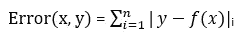
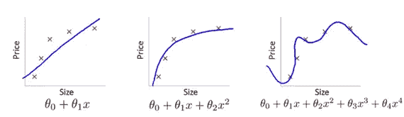
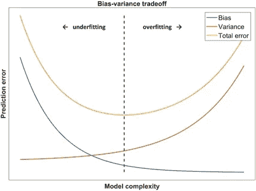
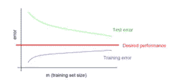
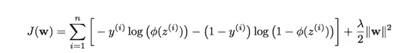
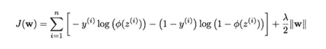
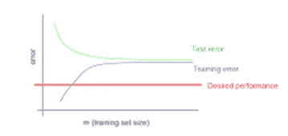

# 处理高偏差和方差

> 原文：<https://towardsdatascience.com/contents-9b2e49f49fe9?source=collection_archive---------10----------------------->

## 通过方程解释正则化

# 内容

在本帖中，我们将了解:

(I)评估机器学习模型性能的方法

㈡适配不足和适配过度的问题

(三)偏差-方差权衡

㈣解决高偏差和高差异问题

在[之前的](https://medium.com/analytics-vidhya/machine-learning-ii-logistic-regression-explained-data-pre-processing-hands-on-kaggle-728e6a9d4bbf)帖子中，我们研究了逻辑回归、数据预处理，并在 Kaggle 上的 titanic 数据集上进行了实际操作，获得了不错的结果。在到目前为止的两篇帖子中，你一定已经注意到我在这里和那里抛出了过度拟合这个术语，并且还提到它会导致机器学习模型的性能不佳。现在，我们将详细了解机器学习模型可能遇到的问题，以及它们可能的解决方案。在这篇文章中，我们不会亲自动手，但是在接下来的文章中，我们将应用我们在这篇文章中学到的概念。

# 评估模型的性能

在直接进入机器学习模型中出现的问题之前，我们如何知道我们的模型有问题？为此，我们需要一个模型的评估指标。我们已经看过一些了。我们使用决定系数(r 分数)来评估线性回归模型，使用精确度来评估逻辑回归模型。这两个指标都是由我们通过它们各自的成本函数得到的潜在误差计算出来的。为了解决机器学习模型的问题，我们将使用这个**错误**来做决定。

线性回归和逻辑回归的误差计算方式不同。为了让事情更容易理解和发展直觉，我们将从线性回归的角度来看待事情，但我们将定义的术语和它们扮演的角色将与任何其他机器学习模型完全相同。

一个错误就是一个“错误”,这个错误的程度可以量化为真实值和估计值之间的绝对差值。对于“n”个数量，它可以表示为:

在训练和测试集上计算模型性能的误差有助于我们识别模型所面临的问题。考虑以下场景:

(I)低训练集误差，低测试集误差

(ii)低训练集误差，高测试集误差

(iii)高训练集误差，高测试集误差

(iv)高训练集误差，低测试集误差

让我们一个一个地看看这些场景。

如果训练集误差和测试集误差都很低，这意味着模型在训练集上很好地学习了输入-输出映射，并且也能够很好地将其推广到测试集。这是一个好的机器学习模型的期望输出。我们在上一篇文章中训练的逻辑回归模型就是这种情况。

当训练集误差较低但测试集误差较高时，我们说模型过度拟合了训练集。这意味着在训练集上训练机器学习模型后，它对训练集的输入输出映射学习得非常好，但不能将这些映射推广到测试集。让我们试着理解为什么会发生这种情况。为任何任务收集的数据都不可能没有错误，不管过程有多仔细。一个好的机器学习模型应该总是对噪声进行采样，并且只生成那些排除了噪声数据点的输入-输出映射，即一个好的机器模型对噪声是鲁棒的。考虑一场音乐会的情况，艺术家的旋律和人群的噪音都有，但我们只关注艺术家的旋律(输入)，因为它使我们愉快(输出)，忽略了人群的所有*噪音*。如果我们注意所有的声音(艺术家+噪音)，我们可能不会那么快乐。过度拟合是指机器学习模型关注每一个声音(艺术家+噪音)，而实际上我们只需要专注于旋律。对训练数据过度拟合的机器学习模型据说会遭受**高方差。**在这篇文章的后面，我们将看到如何处理过度拟合。

如果训练集和测试集的误差都很高，则表明机器学习模型没有正确地学习训练集上的输入-输出映射，并且也不能在测试集上进行推广。换句话说，我们可以说我们的机器学习模型处于原始状态。据说这种模型在训练和测试数据集上都存在不足，并且存在**高偏差**。

具有高训练集误差和低测试集误差的机器学习模型很少出现，但是当训练和测试数据没有被适当地采样时(例如，在分类问题中每个类的样本数量几乎相等)会出现这种情况，这导致测试集的统计特性的显著差异。考虑一个二元分类问题，其中对 A 类的预测给出 10%的训练误差，而对 B 类的预测给出 40%的训练误差。平均分类精度在整个数据集上给我们 25%的误差。但这不是一个好的措施。在现实生活的测试集中，A 类的出现次数很可能多于 B 类。这意味着现实生活数据集中的实际预测误差将大大低于 25%。发生这种情况的另一种情况是，当测试集明显小于训练集时，尽管与训练集相似，但我们在测试集上得到的错误较少，因为与训练集相比，它没有那么多噪声。除了在对数据应用任何机器学习算法之前研究和采样数据之外，没有什么可以避免这种情况。

高偏差、完美拟合和高方差的直观表示([来源](https://www.pinterest.com/pin/52706258122128665/)

# 偏差和方差的定义

对于熟悉统计学的读者来说，偏差和方差这两个术语一定不陌生。标准差衡量的是数据点离中心位置有多近或多远，从数学上来说，方差就是标准差的平方。因此，方差衡量的是一组数据分布的范围。用于机器学习任务的数据没有特定的输入-输出映射，这些模型的任务是找到足够好的映射来概括结果。一个机器学习模型，它(过)适合所有的数据点，包括有噪声的数据点，或者换句话说，适合所有的数据点，不管它们分布得有多广，都被称为遭受高方差。

在统计学中，估计量(这里是机器学习模型)的偏差(或偏差函数)是估计量的期望值和给定输入的真实值之间的差异。零偏差的估计量或决策规则称为无偏的。机器学习模型的高偏差是机器学习模型的输出与实际输出相差甚远的情况。这是因为模型简单。我们之前看到，具有高偏差的模型在训练集和测试集上都具有高误差。

# 偏差-方差权衡

偏差-方差权衡是监督机器学习算法的核心属性。理想情况下，我们需要一个机器学习模型，它考虑所有模式以及训练数据中的异常值，并将它们推广到测试(看不见的真实世界)数据，以便实现非常小的误差和非常高的准确性。我们之前看到，高方差模型非常复杂，可以很好地表示训练集的所有特征，从而使训练集的误差最小，但无法推广到看不见的数据。相比之下，高偏差模型表示极其简单的映射，并且可以将一些特征推广到看不见的数据，但是这些模型的简单性导致对训练集的欠拟合，并且当应用于训练集之外的数据时，生成具有较低方差(高偏差)的预测。特定机器学习模型应该具有的偏差和方差的理想量取决于误差(包括偏差误差、方差误差和噪声)的最小化。

偏差-方差权衡([来源](https://www.ncbi.nlm.nih.gov/books/NBK543534/figure/ch8.Fig3/)

# 解决机器学习中的问题

建立机器学习模型是一个迭代的过程。看过数据集后，我们应该总是从简单的模型开始，然后不断增加它们的复杂性，直到我们在看不见的数据上得到想要的结果。极其简单的机器学习模型遭受高偏差，而极其复杂的机器学习模型遭受高方差。由于我们是从简单模型逐步过渡到复杂模型的，因此我们消除了高偏差的问题，但消除高方差并不容易，因为有些情况下，使用给定的一组参数和方法，我们无法获得最佳模型，而高方差模型需要经过处理才能获得最佳模型。所以先讨论几种解决方差大的方法。

## 解决高差异

考虑逻辑回归分类器的例子。如果我们说分类器过拟合训练数据，这意味着等式 y = sigmoid(Wx + b)的输出非常接近实际训练数据值。那么，过度拟合的根本原因是什么呢？显然，是我们在构建分类器时训练的参数值造成了机器学习模型的高方差(过拟合)。调整这些参数值有助于消除过度拟合，这个过程称为正则化。在正式术语中，正则化是添加信息以解决不适定问题或防止过度拟合的过程。正则化使参数值变小，这可以防止过度拟合。在这篇文章的后面，我们会看到为什么会这样。

高方差模型训练和测试误差

## 正规化

因为我们正在修改参数值，所以我们需要更新我们的成本函数，以便看到正则化的效果。 **L2 正则化**最常用于成本函数，并产生相当好的结果。L2 正则化后的成本函数为:

其中 y(i)表示训练示例 I 的实际输出，φ(z(I))是通过逻辑回归对训练示例 I 的预测值， **λ** 是正则化参数，||w||是权重 w 的向量的 **L2 范数**。权重的矢量化只不过是由向量包围的彼此堆叠的所有 Wi。Python 的机器库使用矢量化参数方程来加速计算。

假设向量 W 具有 3 个值 W1、W2、W3，则向量 W 的 L2 范数计算如下:

||W|| = sqrt(W1 + W2 + W3)

请注意，我们没有像在一般逻辑回归分类器中那样正则化参数 b，每个特征都有一个相应的 W 值，因此有多个 W 值和一个偏差 b 值，正则化偏差参数实际上没有任何区别。为了完整起见，我们通过在成本函数的末尾添加( **λ/2)*||b||** 来正则化 b，并对两者使用单独的 **λ** 值。

## 为什么以及如何正规化工作？

现在，在执行梯度下降以更新参数时，更新将如下所示:

W = W — alpha * dJ/dW

b = b—α* dJ/db

dJ/dW 项由由于正则化而产生的附加项组成，并且在数值上是正值，即当代价函数被正则化时，代价函数 wrt W 的偏导数值比没有正则化时更大。因此，在更新参数时，我们从 W 的先前状态中减去一个更大的块，并且我们进行多次迭代，W 的最终值小于我们在没有正则化的情况下获得的值。同样，我们可以通过正则化来计算 dJ/db。

现在我们知道，正则化导致小的参数值，这导致收敛于代价函数的全局最小值。我们将使用带有“n”个例子的逻辑回归来看看为什么正则化有效。我们知道 y = sigmoid(w1x 1+w2x 2+w3x 3+…………+ Wnxn + b)。因为正则化导致比非正则化更小的参数值，所以让我们考虑参数值 Wi 非常小并且非常接近于 0。因此，逻辑回归分类器的输出将简单地为 y = sigmoid(b ),这是一个非常简单且非常差的输出估计。换句话说，这个输出非常简单，以至于它有一个极高的**偏置**。从偏差-方差权衡中，我们知道高偏差和高方差是机器学习模型的两个相反端，理想情况下，我们希望我们的模型处于两者之间。为了实现这一点，我们必须非常明智地选择正则化参数 **λ** 。 **λ** 是使用开发集设置的，其中我们尝试各种 **λ** 值，并选择一个为我们的机器学习模型产生最佳性能的值，然后使用该模型在测试集上进行预测。

像 L2 正则化一样，还有另一种类型的正则化项可以添加到成本函数中。添加此 **L1 正则化**项后的成本函数如下:

其中||w||是矢量 W 的 **L1 范数**，具有 3 个元素的矢量 W 的 L1 范数计算如下:

||W|| = |W1| + |W2| + |W3|其中，|Wi|代表 Wi 的绝对值。

## 添加更多培训数据

处理机器学习模型过度拟合的另一种方式是向训练集添加更多数据。这背后的原因很简单。如果机器学习模型在训练集上过度拟合，它也在学习数据中的噪声输入。添加更多的数据将导致数据中更多的噪声，并且机器学习模型变得难以考虑如此多的噪声，以至于它最终离开有噪声的输入，并且更加关注输入-输出对的一般模式。这导致模型不会过度拟合训练数据，并且没有高方差的问题。要添加到训练集中的数据量取决于机器学习模型的过拟合程度。

## 解决高偏置

机器学习模型中的偏见不是我们前面看到的大问题，并且很容易消除。由于高偏差导致极其简单的机器学习模型，该模型不能捕获所有必要的特征来进行更准确的预测，因此我们可以做以下事情来消除高偏差:

(I)使用比现有模型更复杂的机器学习模型(通过引入多项式特征而不是线性特征，如 y = Wx + b ),因为它可以很好地捕捉训练数据中的所有重要特征和模式。

(ii)我们看到正则化大幅缩小了参数值，这也可能导致高偏差。因此，减小正则化参数有助于消除高偏差。

高偏差模型训练和测试误差

在这篇文章中，我们首先发展了对高偏差和高方差的直觉，然后理解了当其中一个或两个都出现时，机器学习模型可能遇到的问题。后来，我们研究了从机器学习模型中消除高偏差和高方差的方法，并对正则化的工作提出了见解。

在下一篇文章的[中，我们将看看另一种被称为支持向量机的监督机器学习方法，并将使用它来解决 Kaggle 的数据集。](https://medium.com/analytics-vidhya/machine-learning-iv-support-vector-machines-kaggle-dataset-with-svms-57d7c885652a)