# 使用 KDWD 的基于上下文的实体链接

> 原文：<https://towardsdatascience.com/context-based-entity-linking-using-kdwd-69a633f9e4e7?source=collection_archive---------30----------------------->

由蔚茹·陈、迪安·哈索特、大卫·郑、泰勒·柳撰写

*的代码可以在我们的* [*Github*](https://github.com/iacs-capstone-kensho/named-entity-linking) 上找到

**海报可以在这里找到***:***

***我们要感谢*[*ken sho*](https://www.kensho.com/)*的 Gabriel Altay 和 Georg Kucsko，感谢他们在整个项目中与我们分享时间和资源。***

***最后，我们感谢哈佛大学 IACS* *的克里斯·坦纳对我们团队的宝贵指导，以及他在整个* [*顶点*](https://www.capstone.iacs.seas.harvard.edu/) *经历中的领导。***

****简介****

**命名实体链接，也称为命名实体消歧(NED)，是唯一识别文本中提到的实体(如个人、位置、公司或历史事件)的任务。举一个典型的例子，如果给定句子“巴黎是法国的首都”，我们希望能够辨别单词“巴黎”是指法国首都、其他城市、巴黎希尔顿还是许多其他可能性，如下所示。**

**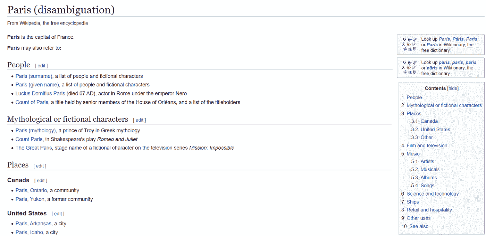**

**图 1:维基百科的“巴黎”消歧页面**

**与命名实体识别(NER)——实际识别文本中提到的这种实体的过程——一起，NED 是自然语言处理(NLP)中最基本的任务之一；能够识别文本谈论的特定事物对于无数的自然语言处理应用来说是必不可少的，包括一般的文本分析、语义搜索系统、构建聊天机器人等等。**

**让我们考虑一个金融市场中有趣的例子来说明这项任务在 NLP 应用中的重要性。假设我们正在构建一个算法股票交易器，它被设计用来根据新闻事件进行交易。一天早上，我们的算法在一个新闻标题中发现了“特斯拉崩溃，吉姆·克莱姆期待反弹”这句话。马上，我们看到了一个我们的算法交易员必须能够解决的问题:“特斯拉”这个词是指上市公司、特斯拉汽车的一个实例，还是(荒谬地)尼古拉·特斯拉？这个问题对我们的投资组合有非常实际的影响；如果“特斯拉”指的是该公司，那么我们知道标题是说特斯拉股票暴跌，鉴于其目前的低价，这可能是购买特斯拉股票的好时机。另一方面，如果“特斯拉”指的是特斯拉汽车，我们知道这对特斯拉来说是一个坏消息(可能是自动驾驶技术的问题导致特斯拉汽车在高速公路上坠毁)，这意味着现在是出售特斯拉股票的好时机。**

**作为人类，我们发现这个问题微不足道——我们可以很容易和自信地从标题其余部分的上下文中推断出，这实际上是指特斯拉股票，因为提到了实体“Jim Cramer”和“Rally”，以及这些实体与金融的关系。**

****

**图 2:维基百科中关于“吉姆·克莱姆”的条目**

**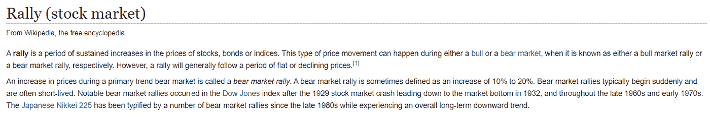**

**图 3:维基百科中“反弹(股票市场)”的条目**

**命名实体消歧的任务旨在对这种基于上下文的推理能力进行建模。**

****知识图和 KDWD****

**对基于上下文的推理能力进行建模的重要的第一步是开发可用于从上下文进行推理的知识的表示(例如，单词“集会”具有与“股票”相关的含义)。我们通过**知识图**来做到这一点，这是一个知识库的图形化表示，节点对应于实体，边对应于实体之间的关系(参见图 4)。**

**这样的表示有什么帮助呢？嗯，在我们上面的例子中，如果我们可以使用我们的知识图表来识别单词“集会”是股票市场运动的一个例子，我们就更接近于推断“特斯拉”指的是特斯拉股票。**

**对于我们的方法，我们使用 Kensho 衍生的维基媒体数据集(KDWD)，这是由 [Kensho](https://www.kensho.com/) 设计的维基数据知识图的结构化、多层呈现，Kensho 是最著名的机器学习和人工智能公司之一，部分专注于 NLP。Kensho 慷慨地向公众提供了 KDWD，为感兴趣的研究人员提供了一种资源来处理 NLP 任务，如消歧。**

**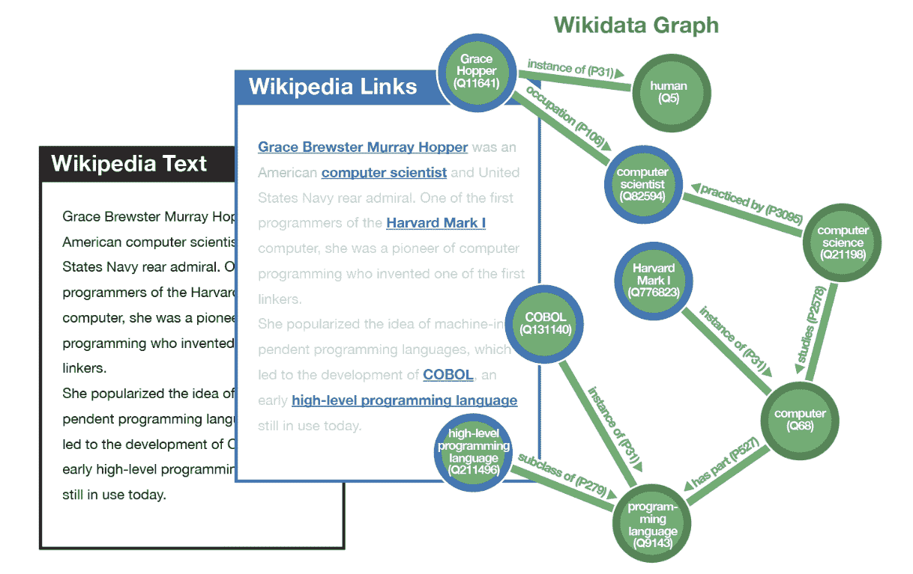**

**图 KDWD1 的鸟瞰图**

**KDWD 由三个数据层组成:维基百科文本、维基百科链接和维基数据图表。第一层，顾名思义，就是来自维基百科大量文章的文本。第二层添加链接标注，第三层是全知识图。KDWD 将图表过滤成 5100 万个条目和 1.4 亿条语句，比如“哈佛马克一号是计算机的一个实例。”我们将参考 KDWD 中包含的文件，这些文件可以在[https://www . ka ggle . com/kenshoresearch/ken sho-derived-wikimedia-data](https://www.kaggle.com/kenshoresearch/kensho-derived-wikimedia-data)上查看和下载**

****探索性数据分析****

**对于 KDWD 数据集，我们有两个主要目标:**

1.  **创建带标签的训练/测试数据集**
2.  **减少查找项目所需的时间**

****标注训练/测试数据集:****

**我们从'*link _ annotated _ text . jsonl*文件中生成了一个带标签的数据集。由于文本简介拥有最多的链接，也就是标签实体，我们创建了两个新的 CSV，一个包含 530 万个简介文本，另一个包含 3500 万个标签实体。这些步骤将大小从 17.7 Gb 减少到 3.7 Gb。**

**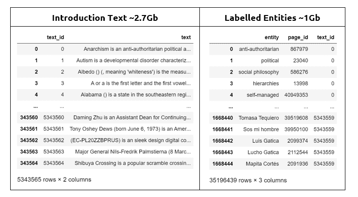**

**图 5:创建了维基百科介绍性文本和标签实体的 CSV 文件。**

****减少访问次数:****

**我们为基线模型使用了' *item.csv* '、 *item_aliases.csv* '和' *page.csv* '文件，如下所述。然而，在 item 和 *item_aliases* 中查找一个“item”的所有实例，然后将*item _ id*与相应的 page _ ids 链接起来，需要大约 1 分钟的时间。这当然太慢了，所以我们采取了以下步骤来大幅提高性能。**

1.  ****减少数据集大小:**我们通过删除在“ *page.csv* ”中不存在的带有 *item_id* 的所有项目，过滤了“ *item.csv* ”和“ *item_aliases.csv* ”数据集。这是因为我们的训练/测试数据集中的实体仅由 *page_id* s 标记。这将组合的 *item* 和 *item_aliases* 数据集大小减少了 88.2%。**

**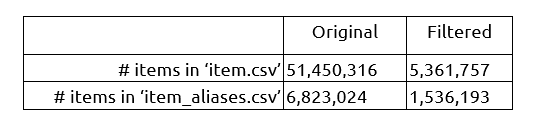**

**图 6:项目过滤**

****2。重构数据以提高性能:**减少数据集将每个实体的查找时间减少到大约 10 秒，但这仍然太慢了。因此，我们将数据结构改为字典，以利用 *O* (1)查找时间:**

**2.1.合并过滤后的' *item.csv* 和' *item_aliases.csv* '，这样我们只有两列: *item_id* 和 *en_label* 。**

**2.2.小写并剥离所有 *en_label* 条目**

**2.3.通过 *en_label* 对数据集进行分组**

**2.4.将与每个 *en_label* 相关联的*item _ id*转换成一个列表，并丢弃重复的*item _ id*。**

**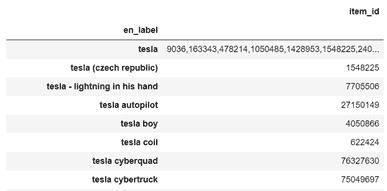**

**图 7:带有 *en_label* 和相应*item _ id*的数据帧**

**2.5.创建一个字典，将 en_label 条目作为键，将相应的 item _ ids 列表作为值。**

**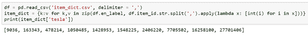**

**图 8:创建 2.5 中描述的字典的代码片段**

**完成上述所有步骤后，我们将项目数据集大小从 4.04Gb 减少到 177Mb。我们现在也有了近乎瞬时的查找时间。**

****基线建模****

**我们现在准备为实体链接开发一些简单的基线模型。**

***人气基线模型***

**第一个基线模型只是选择最流行的实体作为每次提及的实体预测。对于每个提及，我们从 *item_dict* 字典中识别出与之相关的所有 *item_id* 。每个 *item_id* 都唯一地链接到一个 *page_id* ，这是我们对实体的引用。对于每个 *page_id* ，还有一个相关联的页面视图，表明特定实体的受欢迎程度(也就是说，最‘受欢迎’的实体是具有最高维基百科页面视图的实体)。因此，对于每一次提及，我们可以创建一个候选实体列表，并给出它们各自的流行度值。然后，我们的基线模型预测提及的最受欢迎的实体。**

**第二个基线模型与第一个基线模型相同，只是它选择指向它的链接最多的实体作为每次提及的实体预测。**

****基线模型的算法:** 给定一个提及 *w* ，其关联的实体候选 *e_1* ， *e_2* ，…， *e_k* ，以及实体候选 *p_1* ， *p_2* ，…，*的页面浏览量(或第二基线模型中指向它的链接数)***

**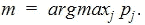**

**并返回 *e_m* 。所以对于提 *w* 的实体的预测是:**

**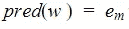**

***带有单词嵌入的基线模型***

**对于给定段落中的任何提及，我们首先使用 spaCy 包来识别上下文窗口中所有相邻的命名实体。然后，我们从 *google2vec* 模型中加载预训练的单词嵌入，并将单词嵌入分配给所有实体。通过计算我们在上下文窗口中识别的相邻命名实体的词嵌入和每个提及的实体候选的词嵌入之间的余弦相似度，这个具有词嵌入的基线模型然后用与相邻实体具有最小余弦距离的实体来标记提及。**

****具有单词嵌入的基线模型的算法:** 给定一个提及 *w* ，其关联的候选实体 *e_1* ， *e_2* ，…， *e_k* ，以及相对于候选实体 *p_1* ， *p_2* ，…， *p_k* 的单词嵌入，识别所有邻近的命名实体 *n 然后，计算每个候选实体的单词嵌入和相邻命名实体的单词嵌入之间的平均余弦距离:***

**********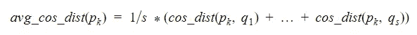**

**查找:**

**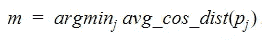**

**并返回 *e_m* 。所以对于提 *w* 的实体的预测是:**

****

****模型评估的标准:**
我们使用总体准确率作为评估所有基线模型的标准。我们从来自 link_annotated_text.jsonl 文件的 combined_entity_df 数据帧中随机抽取 k = 20，000 个项。这些被采样的项目都来自文本数据，它们的实际实体是已知的。因此，对于每个项目 wi，我们从基线模型中获得其预测实体 predi，从组合的 _entity_df 数据框架中获得其实际实体 yi。整体准确率测量为 1 {*pred _ I*= =*y _ I*}/*k .***

****所有基线模型的结果和见解:****

**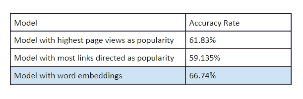**

**图 9:所有基线模型准确性得分**

**基于来自组合 _ 实体 _df 数据帧的采样项目，我们的第一流行度基线模型具有 61.83%的准确率，第二流行度基线模型具有 59.135%的准确率。这表明我们的流行度基线模型表现相对较好，考虑到它完全基于流行度选择，并且项目的上下文信息(在文本数据中提及)被完全丢弃。**

**我们的带有单词嵌入的基线模型表现最好，准确率为 66.74%，略好于前两个基线模型。**

****超越基线:作为组合优化的歧义消除****

**我们对开发一种更复杂的方法感兴趣，这种方法使用 KDWD 图结构中的连通性信息来消除歧义。具体来说，当我们看到一个目标单词 X 及其候选消歧词 *d_1，d_2，…，d_n* 时，我们希望图结构告诉我们候选词集中的哪个 *d_k* 与目标单词的上下文窗口(包含该单词的句子)中的其余单词在语义上最相关。**

**Hulpus 等人提出了一种有趣的用于图形表示的联合消歧方法。这种方法将消除歧义视为一个组合优化问题。因此，给定一个目标单词 *X* 和它的上下文窗口，我们识别上下文窗口中的所有歧义术语。然后，我们考虑所有唯一的歧义消除组合，并选择一个最小化所有歧义术语的所有不同成对行走距离总和的组合。**

**正式地说，对于消歧的唯一组合的集合 D，如果我们将 *w(a，b)* 定义为在图上从节点 *a* 移动到节点 *b* (沿着经由 BFS 找到的最短路径)的行走次数，我们的消歧选择 *D** 被定义如下:**

**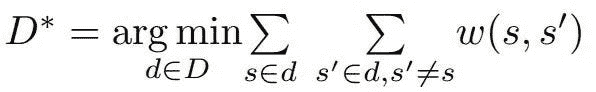**

**作为一个例子，考虑这句话，“本田在电动车行业与捷豹竞争。”三个突出显示的实体及其所指的候选集是:**

**本田:[H1:企业家，H2:汽车品牌]**

**捷豹:[J1:汽车品牌，J2:动物]**

**电动汽车:[E1:电动汽车，E2:期望值]**

**因此，所有这些可能的组合是:**

**(H1，J1，E1)，(H1，J1，E2)，(H1，J2，E1)，(H1，J2，E2)，(H2，J1，E1)，(H2，J1，E2)，(H2，J2，E1)，(H2，J2，E2)**

**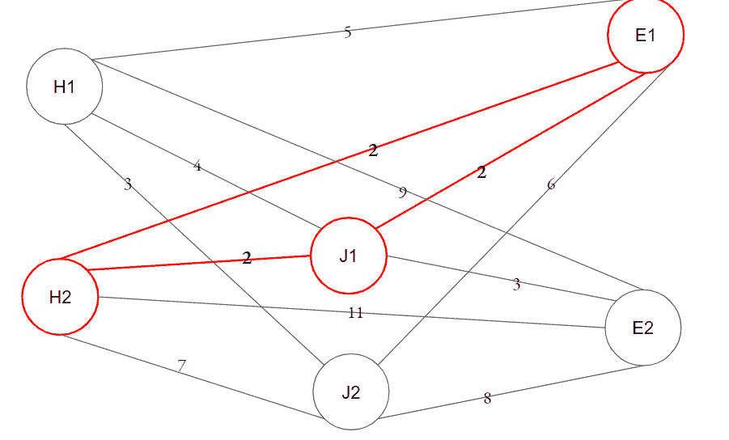**

**图 10:显示示例节点之间语义距离的示例图**

**现在，使用图 10 中显示这些候选的图形部分，我们测量每个组合的成对距离之和，例如，对于第一个组合， *D(H1，J1) + D(H1，E1) + D(E1，J1)* 。然后，我们选择最小化该度量的组合，从而最大化语义相关度。**

****结果和未来可能性****

**在我们测试基线模型的同一数据集上评估该模型，我们实现了 85.5%的准确率，比基线有了显著提高，并且与具有完全不同的高度调整范例的最先进方法相差不远。**

****速度提升****

**为了大规模测试这种方法的可行性，必须提高计算效率。我们看到了通过图嵌入和图截断等技术对预测和评估的图遍历瓶颈的潜在改进。**

****与最先进基线模型的比较****

**有了更高的计算效率，我们可以在不使用上下文窗口预测的高级消歧学习技术和使用我们的上下文方法的类似技术之间进行富有成效的比较。**

****参考文献****

**[1]加布里埃尔·阿勒泰。"介绍 Kensho 衍生的维基媒体数据集."2020 年 2 月 3 日。https://blog . ken sho . com/announcing-the-ken sho-derived-wikimedia-dataset-5d 1197d 72 BCF**

**[2] OpenAI，“发现实体消歧的类型。”2018 年 2 月 7 日。[https://open ai . com/blog/discovering-types-for-entity-diffusion/](https://openai.com/blog/discovering-types-for-entity-disambiguation/)**

**[3] Hulpus，Ioana，Narumol Prangnawarat，Conor Hayes。"基于路径的关联数据语义相关度及其在词和实体消歧中的应用."爱尔兰国立大学高威分校数据分析洞察中心(NUIG)。2015.**