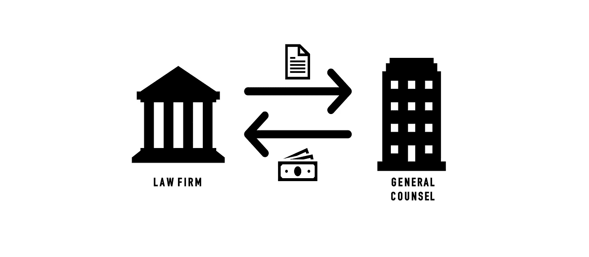

# 法律行业与技术和数据科学的复杂关系

> 原文：<https://towardsdatascience.com/contextualising-the-legal-industry-e5ecb406b6f7?source=collection_archive---------72----------------------->

Giammarco Boscaro 在 [Unsplash](https://unsplash.com?utm_source=medium&utm_medium=referral) 上拍摄的照片

## 法律技术中的数据科学

## 采访阿培尔的斯蒂芬·威尔科克

最近，我们有机会与法律技术公司 Apperio 的首席技术官 Stephen Wilcock 进行了一次交谈。他分享了对整个法律行业的见解；它对创新的立场以及法律技术补充法律的方式。此外，我们还简要讨论了渴望进入法律技术行业的学生应该具备的技能。

为了更好地理解法律技术，最重要的是理解整个法律行业的背景。法律科技是一个新生的新兴行业，仍然比它更著名的兄弟 Fin-Tech(金融科技)落后十年。斯蒂芬将此归因于法律的本质，更具体地说是商法，它构成了英国所有法律支出的绝大部分。商法中的两个主要当事方是律师事务所，另一方是由总法律顾问(“ **GC** ”)领导的内部法律部门。全科医生向律师事务所支付法律工作和咨询费用；它们是成本中心，因此在它们所属的公司中“不太受欢迎”。因此，他们产生的成本往往被认为是表面价值，并受到审查。

作者图片

没有这种外部压力，律所就缺乏创新的动力。除了极少数例外，它们都是以合伙模式运行的；历史上禁止接受可能损害独立性的外部股东的资本。合作伙伴可能对技术创新不感兴趣，原因有几个。首先，创新是昂贵的——这对一个花股东钱的 CEO 来说可能是微不足道的——合伙人花他们自己的钱；虽然合伙人已经赚了很多钱，但是任何投资都是他们的底线。此外，由于个人合伙人已经获得了巨额收入，他们几乎没有独立改变任何事情的权力。此外，法律领域惯用的按小时计费模式会削弱提高效率的内部商业案例。如果一项法律工作花费的时间更长，客户的账单会更多。这就是 Clayton Christensen 描述的经典的“创新者困境”:在其他人破坏它们之前，公司能否让自己进行昂贵的效率投资，在短期内蚕食其收入，以维护公司的长期竞争力。

根据 Stephen 的说法，摆脱这种困境的方法将通过一系列的措施来实现，包括:不断增加的客户压力，新型结构的出现；如进入法律市场的四大咨询公司，以及“在稳固的商业优势下”提供较低成本的公司。这些因素的结合开始施加必要的外部压力，以改变律师事务所合伙人的计算方式，促进法律行业更快速的技术创新。

创新针对法律行业的两个方面；斯蒂芬称他们为:T2 的法律实践和 T4 的法律事务。法律实践处理实际法律工作的机制。这一领域的技术解决方案通常侧重于研究、证据收集、文本处理以及某些情况下的评估和决策。这些解决方案通常以使用人工智能技术自动化重复活动为目标，如自然语言处理或机器学习。另一方面，法律*业务*与法律工作本身关系不大，而是专注于法律领域中资金如何转手的机制，其中涉及工作流程工具和分析。大多数法律科技公司都在这两者之间运营。Apperio 提供法律支出跟踪，专门处理法律事务。

在评估对那些渴望进入该领域的人有益的技能组合时，法律技术中这两个领域的区别也是相关的。在主要处理法律事务时，斯蒂芬承认法律知识并不是他进入这个行业的先决条件。尽管领域知识可能对那些进入法律行业的人更有意义，但对工程师来说，领域知识不如其他部门的员工重要。“当你开始研究数据科学的细节时，你可以在任何领域研究数据科学，同样，图像识别技术可以观察乳房 x 光片或汽车上的凹痕”。评价这两个方面的重要性，斯蒂芬说；“技术位用 60 号字体，法律位用 4 号字体”。

作者图片

技术专家需要的关键领域知识通常是由专家提供给他们的，这些专家是为完成特定任务而请来的。唯一真正需要综合法律和技术知识的团队是创始团队。总的来说，他们需要具备识别和阐明他们打算解决的法律问题的知识，以及看到和理解潜在的技术解决方案。

帮助那些对法律技术感兴趣的人，斯蒂芬发现学术数据科学的区别尤其重要。“当人们去大学[…]时，大部分都围绕着[…]如何围绕数据做出决策；你得到了这个很好的数据集；找出这条路径、相关性或模式。”在像法律技术这样的新兴行业中，情况非常不同，大多数数据结构不良，存储在传统的本地技术中。因此，更大的初始挑战是在进入实际的数据科学之前，对基础数据集进行检索、聚合、清理、规范化和修剪。

现在我们已经有了必要的背景，我们可以更好地理解法律技术公司在法律行业中可以和确实扮演的角色，从 Apperio 开始。本系列的下一篇文章将详细介绍 Apperio 提供的产品以及 Apperio 如何与法律行业互动。

[【1】](#_ftnref1)参见 2007 年《法律服务法》颁布后，法律中出现的替代性企业结构(ABS)

*这篇文章最初发表在 UCL 数据科学协会的数据博客上，现在仍然可以在那里找到，此外还有许多其他有见地的文章讨论数据科学的最新发展。*

 [## 帖子| UCLDSS

### 数据科学可能是人类最有用的发明之一。我们研究和建立共享 DS 系统和博客…

www.ucldss.co.uk](https://www.ucldss.co.uk/blog/)