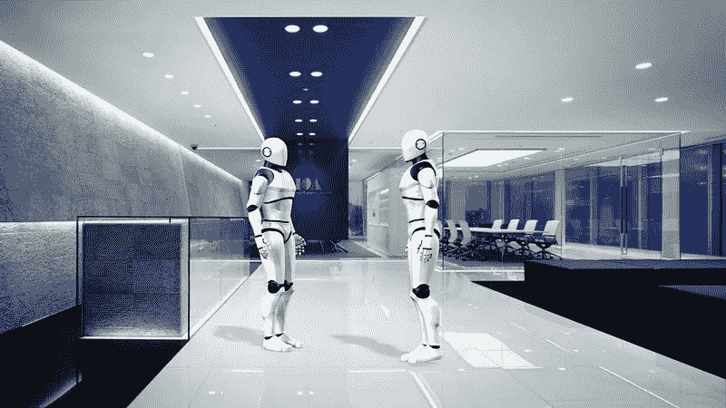
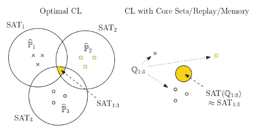
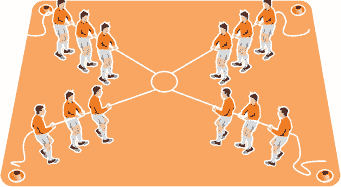
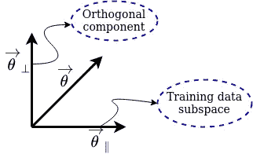
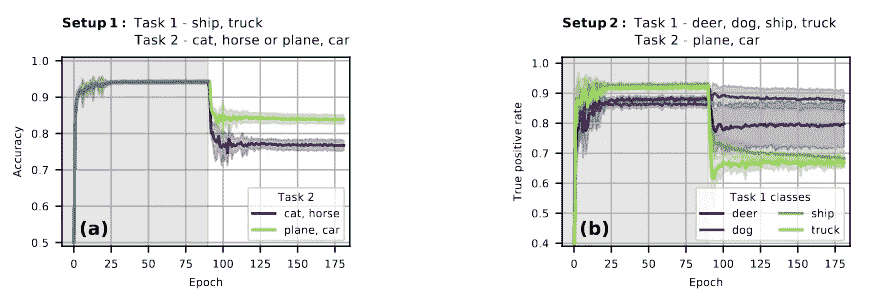

# 持续学习——我们在哪里？

> 原文：<https://towardsdatascience.com/continual-learning-where-are-we-d5706e78a295?source=collection_archive---------15----------------------->

[图像来源](https://www.flickr.com/photos/121186423@N04/50653514297/in/photolist-2kb5v4p-8ojvNz-bvCfkg-dsyg1G-CZ4RY-gNjxWB-6jKCWG-vbQDGZ-7kw7AS-8LyV8g-vbQDtT-ddypn-2kM32gk-ddyoC-65XXyG-6CF9M3-Di42Wr-a7jmSK-7jXxpe-adDot6-4CD1nY-5nPGVA-wXYXi-26gezah-5n8dew-27RDc9C-26ge98Y-29HJU91-2bBVhrQ-Mg4soo-27EEy1b-4JkdF1-25raCX5-25donCP-8JChtr-9SmyuU-5Wu2DC-233jEmg-LysHyW-2jb4WQ9-BP39hB-2kj7NHv-EZ5vvA-8XgBHy-Ur3foH-Cm4Y6C-sQcbEn-E51kaP-F2opLF-6dx5jk)

随着深度学习社区旨在弥合人类和机器智能之间的差距，对能够适应不断发展的环境的代理的需求比以往任何时候都更大。这一点在 ICML 2020 上表现得很明显，该展会举办了两场不同的研讨会，主题分别是[持续学习](https://icml.cc/Conferences/2020/ScheduleMultitrack?event=5743)和[终身学习](https://icml.cc/Conferences/2020/ScheduleMultitrack?event=5735)。作为一名与会者，我收集了我认为将影响该领域即将到来的发展的关键要点，包括两个方面:(a) *体验回放*(无论是真实的还是增强的)对于最佳表现是不可或缺的，以及(b)一个暂时进化的智能体必须意识到*任务语义*。在这篇博文中，我将尝试阐明这些特质对于持续学习(CL)代理人的有效性。

*【虽然有上述术语的背景会有所帮助，但这篇文章是为没有持续学习文献知识的读者准备的。]*

**快速复习:**在任务增量设置中，持续学习代理在时间步长*‘t’*被训练识别任务 *1，..，t-1，t* 而任务 *1，…，t-1* 的数据可能可用也可能不可用。这种学习动力有两个主要障碍需要克服。第一个是*正向迁移(FT)* ，它衡量学习如何递增到任务 *t* 影响代理的知识。就性能而言，一个**正** FT 表明，如果允许代理通过任务 *1、…、t-1* 逐步学习，它应该在任务 *t* 上提供更好的准确性。

另一个令人满意的特性是*反向迁移(BT)* ，它测量学习一项任务 *t* 对先前任务表现的影响。一个**正的** BT 意味着学习一个新的任务 *t* 会提高模型在先前学习的任务 *1，…，t-1* 上的性能。这种在学习新任务的同时保留先前学习任务的知识的折衷被称为**可塑性-稳定性**权衡。

持续学习代理的三个权衡:当计算效率高的代理同样令人满意时，可伸缩性开始发挥作用。

基于增量任务训练时采取的步骤，连续学习文献主要包括两类代理来处理上述权衡:(a) *基于经验重放的*代理通常存储来自先前任务的有限数量的示例(真实的或生成的)并将这些与新任务的训练数据混合在一起，以及(b) *基于正则化的*方法使用额外的损失项来巩固先前的知识。记住这些，现在让我们进入真正的问题！

## 1.为什么基于记忆预演的方法效果更好？

Knoblauch *等人*的工作是 2020 年 ICML 会议上 CL 领域的一个亮点，Knoblauch 等人通过集合论的方法表明，一个最优的连续学习算法需要解决集合相交决策问题的 NP-hard 问题，*即*给定两个任务 A 和 B，它需要辨别 A 和 B (A ∩ B)的学习所共有的参数。然而，确定这一点至少与确定[A∩B 是否为空](https://research.cs.queensu.ca/home/cisc365/2010F/365%20SetIntersectionNPC.pdf)一样困难(并且可能被认为是[击中集合问题](https://en.wikipedia.org/wiki/Exact_cover#Exact_hitting_set)？)并且解决方案需要对以前的任务示例有完美的记忆。

图片来源:Knoblauch *等人(2020)。左图:最优 CL 算法搜索满足所有观察任务的任务分布的参数。右图:基于重放的 CL 算法试图找到满足实际任务分布(SAT1:3)的重构近似值(SAT(Q1:3))的参数。*

这种完美的记忆有助于重建所有观察到的任务上的联合分布的近似，使得算法现在有效地学习求解单个时间分布的任务，*，即，对于时间步长 *t* ，这相当于找到跨越 *1:t* 的任务分布的共同表示。我们在 CL 研讨会上的工作进一步倡导了基于重放的方法在人类活动识别环境中的经验有效性[2]。*

除了集合论之外，还可以通过参数训练的动态性，将持续学习视为一个*学分分配问题*来看待重播的好处。正如我们所知，梯度下降通过迭代更新神经网络的参数来工作，目标是最小化训练集的总损失。因此，训练过程可以被视为拔河游戏，其中目标函数导致每个参数的值增加或减少，较大的正值指示该参数应该被分配更多的信用并且更重要。

图片来源:[足球蔻驰](https://www.soccercoachweekly.net/soccer-drills-and-skills/tug-of-war-soccer-drill-to-build-teamwork/)

因此，在给定的增量时间步长，我们可以将每项任务视为一个团队试图以与训练算法最小化任务损失所需的动量相等的张力来拉动拖船。由此带来的后果是，在每一个增量步骤中，都需要对所有先前和当前的任务进行评估，以平衡这种紧张关系。在给定任务在特定情况下不存在的情况下，模型的参数空间将被更新以被剩余的任务占据。因此，在基于经验重放的方法中，同时存在来自所有先前任务的数据有助于更好地平衡拔河游戏各方之间的紧张关系，同时没有单一任务目标完全支配训练标准。

## 2.任务语义如何影响 CL 代理的性能？

合作学习研讨会的另一个亮点是 Ramesesh *等人* (2020)研究任务之间的相似性如何影响遗忘程度。他们的结论是，当前一个任务和后一个任务之间的表征相似度为中等时，网络具有最大遗忘。

为了理解这一点，我们需要根据模型学习的权重向量的分量来考虑后续任务的 CL。对于不相关的任务，所学习的权重向量保持彼此正交，而对于具有高相似性的任务，权重向量分量具有最小的角度间隔。受梯度下降训练影响的权重向量 *θ* 的唯一分量是位于训练数据子空间中的分量，而受训练影响最小的分量是与训练数据子空间正交的分量(见下图，改编自他们的谈话)。

玩具线性回归模型的权重向量的分量

Ramesesh *等人*提供了两个描述性的 CL 设置来支持他们的假设。在设置 1 中，模型被训练为将船-卡车分类为第一任务，然后将猫-马或飞机-汽车分类为第二任务，我们看到猫-马识别任务遭受更多遗忘。在设置 2 中，首先训练模型来识别鹿-狗-船-卡车，然后是飞机-汽车识别，对于船-卡车，性能降级最大。

*Rama sesh 等人(2019)的两个增量学习设置:(a)设置 1 首先在船-卡车分类问题上训练模型，然后是任务 2，任务 2 可以是猫-马或飞机-汽车分类，(b)设置 2 训练模型首先识别鹿、狗、船和卡车，然后是飞机-汽车识别。*

作者指出，在设置 1 中，模型只为车辆建立其表征，因此在第二个任务中动物(猫-马)越来越不相似的表征导致对先前学习的车辆表征的更多遗忘。然而，设置 2 涉及同时在车辆和动物上训练模型，因此动物的表示现在在潜在空间中占据与车辆不同的区域。结果，当面对后一项任务时，动物的学习表征与飞机和汽车的学习表征是正交的，并且退化较少。

本节的其余部分试图从*传递干扰*的角度对此进行解释。里默尔等人(2019)首先从迁移-干扰权衡的角度来看待持续学习。为了理解这一点，让我们先深入了解一下*稳定性-可塑性*困境的局限性。正如我们之前看到的，困境表明可以通过减少遗忘来提高学习模型的稳定性，*即*到目前为止，它保持检查由于当前任务的学习而导致的权重转移，同时最小化由于共享对先前任务重要的权重而导致的干扰。

然而，由于我们对未来任务可能会是什么样子的了解有限，最小化先前任务的权重共享仅解决了问题的一半——与先前学习的任务之一非常相关的未来任务可能需要进一步共享这些权重，并且模型必须能够在不中断先前任务的性能的情况下这样做。我们注意到，显然需要扩展稳定性-塑性两难问题的时间限制，以便考虑未来任务的不确定性。

迁移-干扰权衡考虑了由于增量任务的学习而产生的反向干扰，同时还检查了权重之间的表示的迁移，使得它们不会损害未来的学习。因此，里默尔等人的研究表明，使用相同权重成分学习的任务很有可能在范例之间产生干扰和迁移，而使用不同成分学习的任务受到的迁移和干扰较少。

记住上述观点，现在让我们看看 Ramasesh *等人*的两个 CL 设置。在设置 1 中，船-卡车分类任务不同于增量猫-马任务，并且由于模型试图使用相同的权重分量来学习它们，高干扰导致对先前任务的更大遗忘。

然而，在设置 2 中，我们看到该模型被迫对鹿狗和轮船卡车采用不同的表示。由于飞机-汽车的表征更类似于轮船-卡车的分类任务，并且要使用相同的权重分量来学习，这催化了它们之间的权重转移，从而导致更大的遗忘。另一方面，鹿和狗的表示具有与平面和汽车的表示正交的分量，因此不受它们之间禁止的重量转移的影响。

**结论:**简而言之，我们看到了一个持续学习的代理如何在每个训练步骤中面临一个学分分配问题，以及经验回放如何增强每个手头任务的可信度。此外，任务的语义在被试的遗忘量中起着重要的作用，这可以从迁移干扰的角度来解释。随着该领域继续向大规模和独立于领域的学习发展，更好地理解这些权衡确实是元学习者等更高级培训策略的关键[3]。

## 参考

1.  Knoblauch、h . husa in 和 t . die the(2020 年)。最优连续学习具有完美的记忆，并且是 NP 难的。 *ArXiv，abs/2006.05188* 。
2.  韩建华，，米，，叶(2020)。人类活动识别中的持续学习:正则化的实证分析。 *ArXiv，abs/2007.03032* 。
3.  m .、Cases、I .、Ajemian、r .、Liu、m .、Rish、I .、Tu、y .、& Tesauro、G. (2019)。通过最大化迁移和最小化干扰来学会学习而不遗忘。 *ArXiv，abs/1810.11910* 。
4.  Ramasesh，v .，Dyer，e .，和 Raghu，M. (2020 年)。灾难性遗忘的剖析:隐藏表征和任务语义学。 *ArXiv，abs/2007.07400* 。