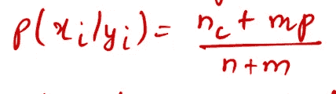

# 朴素贝叶斯分类器中的连续数据和零频率问题

> 原文：<https://towardsdatascience.com/continuous-data-and-zero-frequency-problem-in-naive-bayes-classifier-7784f4066b51?source=collection_archive---------9----------------------->

## 如何从数学和概念上处理它

凯文·Ku 在 [Unsplash](https://unsplash.com/s/photos/machine-learning?utm_source=unsplash&utm_medium=referral&utm_content=creditCopyText) 上的照片

在监督学习(分类)的背景下，[朴素贝叶斯或者更确切地说贝叶斯学习](/understanding-naive-bayes-classifier-46385aca47ec)作为评估其他学习算法的黄金标准，同时作为一种强大的概率建模技术。但是，使用[朴素贝叶斯](/understanding-naive-bayes-classifier-46385aca47ec)会带来一些挑战。

*   与数值数据相比，它在[分类数据的情况下表现良好。](/journey-into-data-mining-3b5ccfa5343)那么，当我们拥有的数据本质上是连续的时，我们如何使用[朴素贝叶斯](/understanding-naive-bayes-classifier-46385aca47ec)进行分类呢？
*   如果测试数据集中的一个实例有一个在训练期间不存在的类别，那么它将赋予它“零”概率，并且不能进行预测。这就是所谓的**零频率问题。**它扭曲了分类的整体性能。作为一个机器学习爱好者，每个人都应该知道如果出现这种情况应该如何应对。

在这篇文章中，我们将讨论[朴素贝叶斯](/understanding-naive-bayes-classifier-46385aca47ec)分类器对数字/连续数据的工作原理和零频率问题，以便它可以在以后应用于现实世界的数据集。

这里有两种方法来估计朴素贝叶斯分类器中连续属性的类条件概率:

*   我们可以将每个连续属性离散化，然后用其对应的离散区间替换连续的[属性](/journey-into-data-mining-3b5ccfa5343)值。这种方法将连续属性转换为有序属性。条件概率 P(X|Y= *y* )，其中 Y 是目标变量，是通过计算属于类别 *y* 的训练记录中落在 X 的相应区间内的部分来估计的

估计误差取决于离散化策略以及离散区间的数量。如果间隔的数量太大，则每个间隔中的训练记录太少，无法为 P(X|Y)提供可靠的估计。另一方面，如果间隔的数量太小，那么一些间隔可能聚集来自不同类的记录，并且我们可能错过正确的决策边界。因此，离散化策略没有经验法则。

*   我们可以假设连续变量的某种形式的概率分布，并使用训练数据来估计分布的参数。通常选择高斯分布来表示连续属性的类条件概率。该分布由两个参数表征，均值和方差。

图片 1

现在，我们已经为如何将高斯分布用于连续属性建立了基础，让我们通过一个示例来看看如何将其用作机器学习中的分类器:

以下是我们将使用的数据集:

威滕、弗兰克和霍尔的数据挖掘

在这个特定的数据集中，我们总共有 5 个属性。其中 4 个是我们将要预测的[自变量](/journey-into-data-mining-3b5ccfa5343)(天气、温度、湿度、风力)，一个是[因变量](/journey-into-data-mining-3b5ccfa5343)(玩耍)。这是一个二元分类问题，因为因变量具有布尔性质，包含“是”或“否”。数据集是序数和数字属性的混合。温度和湿度是数字。Outlook 和 Windy 是序数属性。

由于这是非确定性的或者更确切地说是概率性的方法，因此模型没有[学习](/basics-of-supervised-learning-classification-d26c00d80100)。

我们将对一个实例进行分类

*x* = <前景=晴朗，温度=66，湿度=90，风=真>

为了计算这个，我们需要目标变量 *Play* 的先验概率

实例总数为 14，其中 9 个实例的值为 *yes* ，5 个实例的值为 *no* 。

p(是)= 9/14

p(否)= 5/14

按照目标变量，自变量的分布可以写成:

图片 2

为了对实例 *x，*进行分类，我们需要计算 *play=yes* 和 *play=no* 的最大可能性，如下所示:

*播放的可能性=是*

P(*x*/是)* P(是)= P(晴天/是)* P(温度= 66/是)* P(湿度= 90/是)* P(真/是)* P(是)

*发挥的可能性=否*

P(*x*/否)* P(否)= P(晴/否)* P(温度= 66/否)* P(湿度= 90/否)* P(真/否)* P(否)

由于[天真的独立假设](/understanding-naive-bayes-classifier-46385aca47ec)，属性个体概率成倍增加。

对于温度和湿度属性，可以使用**图像 1** 中的高斯分布公式，通过插入**图像 2** 中属性的平均值和方差值来计算概率。

计算上述等式所需的值为:

p(晴天/是)= 2/9

p(温度= 66/是)= 0.034

p(湿度= 90/是)= 0.0221

p(真/是)= 3/9

和

p(晴/否)= 3/5

p(温度= 66/否)= 0.0279

p(湿度= 90/否)= 0.0381

p(真/否)= 3/5

P(*x*/是)* P(是)=(2/9)* 0.034 * 0.0221 *(3/9)*(9/14)= 0.000036

P(*x*/否)* P(否)=(3/5)* 0.0279 * 0.0381 *(3/5)*(5/14)= 0.008137

> 0.008137*>*0.000036
> 
> ***分类—无***

现在，我们已经在朴素贝叶斯分类器中转移了对连续/数字数据的处理，让我们深入研究如何处理零频率问题。

当在整个可能性乘法中任何一个**概率为零**的条件使得整个可能性为零**时，就会发生这种情况。**在这样的情况下，有一种叫做**的拉普拉斯估计器**被使用。

图 3

在哪里，

NC = Xi = x 和 yi = y 的实例数，

yi = y 的实例数，

p =先验估计，示例:假设属性值 p=1/ *m* 均匀分布，其中 *m* 定义不同(唯一)属性值的数量。

m =该属性的唯一值的数量。

因此，如果假设均匀分布，图像 3 中的公式修改如下:

图 4

T 他对**图 3** 中公式的解释可能有点难以理解。让我们借助一个例子来更好地理解它:

我们将在**图像 1 和图像 2 中使用相同的数据集和分布对实例进行分类。**

*x* = <前景=阴天，温度=66，湿度=90，风=真风>

为了计算这个，我们需要目标变量*发挥*的先验概率

实例总数为 14，其中 9 个实例的值为 *yes* ，5 个实例的值为 *no* 。

p(是)= 9/14

p(否)= 5/14

按照目标变量，自变量的分布可以写成:

为了对实例 *x，*进行分类，我们需要计算*播放=是*和*播放=否*的最大可能性，如下所示:

*播放的可能性=是*

P(*x*/是)* P(是)= P(阴/是)* P(温度= 66/是)* P(湿度= 90/是)* P(真/是)* P(是)

*活动的可能性=否*

P(*x*/否)* P(否)= P(阴/否)* P(温度= 66/否)* P(湿度= 90/否)* P(真/否)* P(否)

计算上述方程所需的新值为:

p(阴/是)= 4/9

和

p(阴/否)= 0/5 = 0

计算可能性所需的其余值取自前面的例子本身。

P(*x*/是)* P(是)=(2/9)* 0.034 * 0.0221 *(3/9)*(9/14)= 0.000036

P(*x*/否)* P(否)= 0 * 0.0279 * 0.0381 *(3/5)*(5/14)= 0

> 0.000036 > 0
> 
> ***分类—是***

这里可以看出，一个条件概率 ***P(阴/否)*** 是分类的驱动因素。现在，让我们看看在均匀分布假设下，如何利用来自**图像 4** 的**拉普拉斯估计器**的公式。

对于**前景=阴天，**新的概率变成

p(阴/是)= (4 + 3 * (1/3)) / (9 + 3)= 5/12

在哪里，

nc = 4，因为 Outlook =阴天& play =是，

n = 9，因为 play = yes 的实例总数，

m = 3，因为属性 Outlook 具有 3 个唯一值(晴天、阴天、雨天)，

p = 1/ *m* = 1/3，因为假设均匀分布

同样的，

p(阴/否)= (0 + 3 * (1/3)) / (5 + 3)= 1/8

在哪里，

nc = 0，因为 Outlook =阴天& play =否的 0 个实例，

n = 5，因为 play = no，

m = 3，因为属性 Outlook 具有 3 个唯一值(晴天、阴天、雨天)，

p = 1/ *m* = 1/3，因为假设均匀分布

> 注意:在应用拉普拉斯估计器时，请确保将其应用于所有有序属性。你不能仅仅将 is 应用于零频率问题发生的属性。

因为在我们的实例中要分类的另一个有序属性是属性 Windy，所以我们也需要在那里应用拉普拉斯估计器。应用修改后的概率为:

对于 **Windy = True，**新的概率变成

p(真/是)= (3 + 2 * (1/2)) / (9 + 2) = 4/11

在哪里，

nc = 3，因为在 3 个例子中 Windy = True & play = yes，

n = 9，因为 play = yes 的实例总数，

m = 2，因为属性 Windy 有 2 个唯一值(真，假)，

p = 1/ *m* = 1/2，因为假设均匀分布

同样的，

p(真/否)= (3 + 2* (1/2)) / (5 + 2)= 4/7

在哪里，

nc = 3，因为 Windy = True & play = no 的 3 个实例，

n = 5，因为 play = no，

m = 2，因为属性 Windy 有 2 个唯一值(真，假)，

p = 1/ *m* = 1/2，因为假设均匀分布

P(*x*/是)* P(是)=(5/12)* 0.034 * 0.0221 *(4/11)*(9/14)= 0.0000731

P(*x*/否)* P(否)= 1/8 * 0.0279 * 0.0381 *(4/7)*(5/14)= 0.0000271

> 0.0000731 > 0.0000271
> 
> ***分类—是***

尽管分类没有改变，但现在我们有了更好的科学推理来支持我们的结论。

如果你喜欢阅读这样的故事，并想支持我成为一名作家，可以考虑[注册成为一名媒体会员](https://tarun-gupta.medium.com/membership)。每月 5 美元，你可以无限制地阅读媒体上的故事。如果你注册使用我的链接，我会赚一小笔佣金，不需要你额外付费。

 [## 加入我的推荐链接-塔伦古普塔

### 作为一个媒体会员，你的会员费的一部分会给你阅读的作家，你可以完全接触到每一个故事…

tarun-gupta.medium.com](https://tarun-gupta.medium.com/membership) 

我将免费赠送一本关于一致性的电子书。在这里获得你的免费电子书。

感谢您的阅读。我希望阅读这篇文章的人能够弄清楚朴素贝叶斯分类器中连续数据和零频率问题的处理。如果你觉得它能帮助别人，就分享吧。你可以在这里阅读我的更多帖子:

 [## 标记故事列表的快速链接—感谢您的访问

### 我也有一份以快节奏出版为目标的出版物。读书成为作家。

tarun-gupta.medium.com](https://tarun-gupta.medium.com/thank-you-for-visiting-my-profile-9f708062c75e)