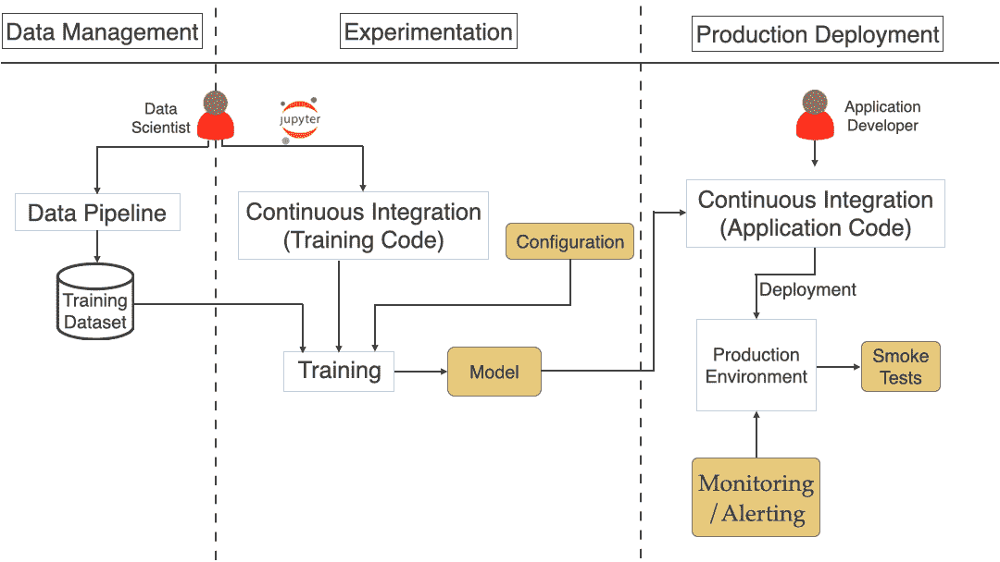
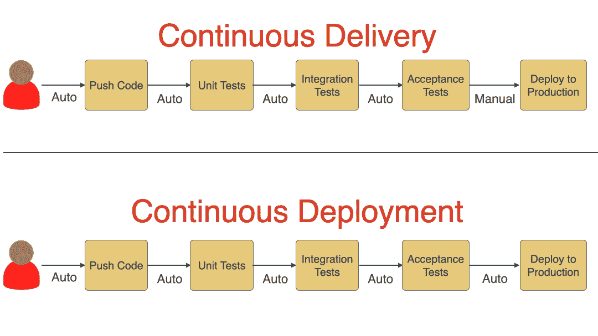
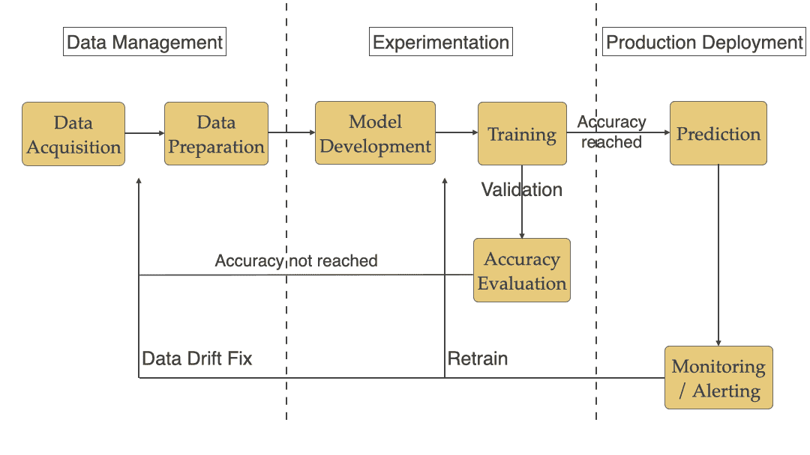
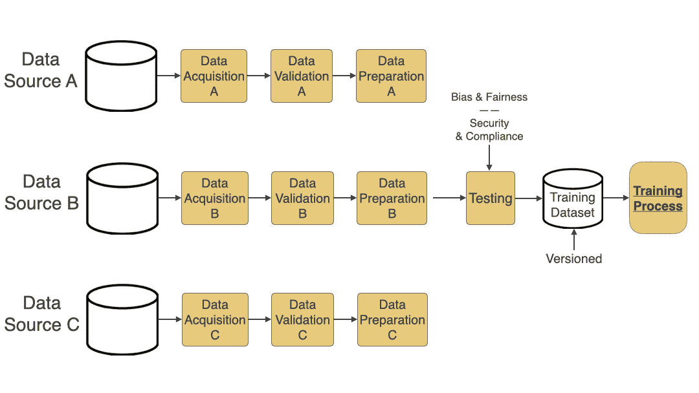
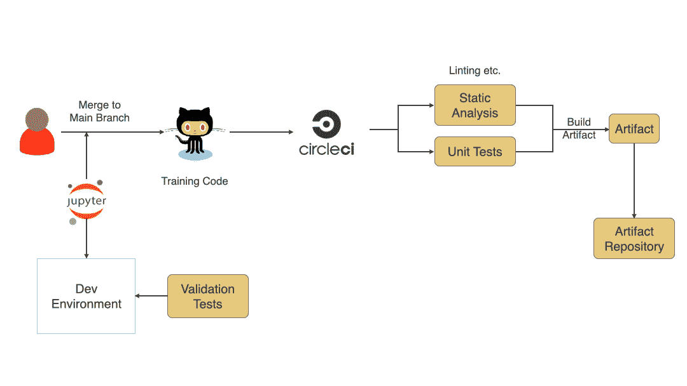
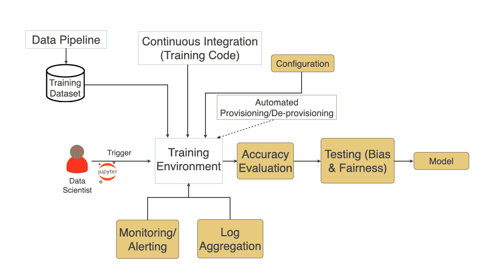
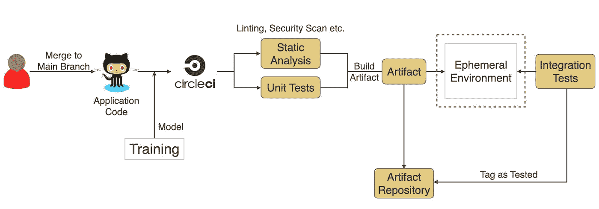

# 机器学习系统的连续交付

> 原文：<https://towardsdatascience.com/continuous-delivery-for-machine-learning-8770390db18c?source=collection_archive---------34----------------------->

## 以可持续的方式安全快速地将机器学习系统部署到生产中

# 目录

> [什么是持续交付？](#fca0)
> [持续集成](#b459)
> [持续交付与持续部署](#a80c)
> [机器学习工作流程](#57d8)
> [持续交付如何帮助应对 ML 挑战？](#be3b)
> [数据管理](#a243)
> - [自动化数据管道](#df85)
> [实验](#968f)
> - [培训代码](#ffb7)
> - [培训流程](#40f1)
> [生产部署](#e4c6)
> - [应用代码](#9737)
> [汇总](#d7b0)
> [人](#c547)
> [结论](#3f31)

机器学习的连续交付

传统软件开发的大多数原则和实践都可以应用到机器学习(ML)中，但某些独特的 ML 特定挑战需要以不同的方式处理。我们在[之前的文章](https://shahadarsh.com/2020/06/19/challenges-deploying-machine-learning-models-to-production/)中讨论了那些独特的“将机器学习模型部署到生产中的挑战”。本文将探讨如何将帮助传统软件解决其部署挑战的连续交付应用于机器学习。

# 什么是持续交付？

> *持续交付是以可持续的方式安全、快速地将所有类型的变更(包括新功能、配置变更、错误修复和实验)投入生产或交付给用户的能力。*
> 
> *-杰兹·亨布尔和戴夫·法利
> (连续交付图书作者)*

以下是书中定义的持续交付原则，你可以在这里了解更多[。](https://continuousdelivery.com/principles/)

*   将质量建立在
*   小批量工作
*   计算机执行重复的任务，人解决问题
*   坚持不懈地追求持续改进(Kaizen)
*   每个人都有责任

# 连续累计

持续集成(CI)应该是团队开始持续交付之旅的第一步。正如您在下面的定义中所看到的，CI 有助于尽快发现任何集成错误，从而提高团队生产力。

> 持续集成是一种软件开发实践，团队成员经常集成他们的工作，通常，每个人至少每天集成一次——导致每天多个集成。每个集成都由一个自动化构建(包括测试)来验证，以尽可能快地检测集成错误。
> 
> *——马丁·福勒*

# 持续交付与持续部署

在本文中，我们不会过多地讨论持续部署，但是理解持续交付和持续部署之间的区别是有好处的。如下图所示，在部署到生产环境之前，连续交付包括一个手动批准步骤。尽管如此，每次代码被推送到主分支时，它都会经过各种自动化步骤，并准备好进行部署。同时，如果所有步骤都成功，它会自动将新代码部署到生产环境中，以防持续部署。

图 1: **连续交付**与**连续部署**

# 机器学习工作流

正如我们在上一篇文章中看到的，典型的 ML 工作流包括数据管理、实验和生产部署，如下图所示。我们将挑战分为三个阶段。

图 2: **机器学习工作流程**

# 持续交付如何帮助应对 ML 挑战？

现在，让我们看看连续交付如何帮助解决机器学习的具体挑战。我们将回顾 ML 工作流程的每个阶段，它的挑战，以及 CD 如何解决它们。

# 数据管理

训练数据集是数据管理阶段的输出，然后输入训练过程。这是决定一个模型表现如何的基本因素之一。这一阶段通常包括数据采集和准备。添加用于生成训练数据集的自动化数据管道有助于解决此阶段的大多数挑战。

## 自动化数据管道

图 3: **自动化数据管道**

自动化数据管道包括以下步骤:

1.  **数据采集:**从各种来源采集数据，如 S3 桶、公共数据集等。有效的方法之一是使用[适配器模式](https://en.wikipedia.org/wiki/Adapter_pattern)。
2.  **数据验证:**验证数据模式和其他类型的验证，以获得更高质量的数据。
3.  **数据准备:**在验证的基础上，为了使数据为训练过程做好准备，该步骤进行归一化、转换、特征提取等。
4.  **数据测试:**这一步经常被忽视，但却非常重要。添加**偏倚和公平性**测试，以确保通过数据在模型中不引入偏倚，这一点至关重要。此外，添加自动化测试以确保获得的数据是**安全且符合**(基于您需要遵守的法规，如 HIPAA、PCI 或 GDPR)。
5.  **数据版本化:**添加一个步骤来对生成的训练数据集进行版本化，以便您可以轻松地返回到特定版本并跟踪更改。当您主要尝试各种体系结构或训练模型，并希望对数据集的多个版本的多次运行的准确性结果进行比较时，版本化会有所帮助。

参见上一篇文章中定义的挑战&添加自动化数据管道如何帮助解决这些挑战。你可以在这里阅读更多关于挑战[的内容。](https://shahadarsh.com/2020/06/19/challenges-deploying-machine-learning-models-to-production/#Stage_1_Data_Management)

**挑战:**大数据量
**解决方案:**由于模型训练通常需要大数据集，手工处理耗时&成本高。拥有如上所述的自动化数据管道，使流程可重复，节省了大量时间，并降低了出现数据问题的几率。

**挑战:**高质量数据
**解决方案:**增加自动化数据验证和测试，如偏见和公平，加上安全性和合规性，有助于确保数据的高质量，这有助于产生更好的模型。

**挑战:**数据集跟踪
**解决方案:**跟踪实验和训练有助于比较各种训练运行，看看哪些有效，哪些无效。对数据进行版本控制有助于追踪哪个数据集能提供更好的结果。如上图所示，应该有一个到版本数据集的步骤。有像 dvc 这样的工具可以为数据提供版本控制。

**挑战:**位置
**解决方案:**当数据集驻留在不同的位置时，由于数据量大、传输成本高或合规性原因，传输数据集可能没有意义，因此在更靠近数据驻留的位置运行数据管道、培训甚至预测是有意义的。在这种情况下，拥有一个可以轻松运行的自动化管道会有所帮助。

小心:确保这是值得努力的。如果您可以在不增加复杂性的情况下进行管理，并集中运行，我建议您这样做。

**挑战:**安全性和合规性
**解决方案:**如上图所示，为了确保数据的安全性和合规性，请在您的数据管道中添加自动化的安全性和合规性测试。

# 实验

这一阶段包括模型开发，在这一阶段，数据科学家将大量时间用于研究各种架构，以了解哪些架构符合他们的需求。他们需要编写训练代码，并使用从数据管理阶段和配置中生成的训练数据集来训练模型。

## 培训代码

尽管这是一个培训代码，而不是一个生产代码，但是代码的持续集成有助于更快地发现问题。由于研究和实验阶段，许多编写的代码通常质量不高，但添加静态分析和单元测试等内容将有助于更快地发现任何问题，并提供更快的反馈。在训练代码的 CI 的末尾，应该生成一个版本化的工件(docker 映像、zip 文件等)。)然后将用于训练模型。由于这是一个试验阶段，可能会发生很多变化。尽管如此，我还是强烈建议您经常将变更合并到主分支并运行 CI。使用像[特性切换](https://martinfowler.com/articles/feature-toggles.html)或者将工件版本化为 alpha、beta 或者 release 这样的技术有助于识别可以在培训过程中使用的工件。

图 4: **培训代码的持续集成**

## 培训过程

见下图(图 5 ),典型的培训流程和各种相关部分。前一阶段生成的训练数据集和最后一步编写的训练代码，以及任何训练环境配置都用作训练过程的输入。数据科学家触发训练过程，这可能会运行几个小时或几天。完成之后，应该添加自动化的准确性评估，以查看模型是否满足预期的标准。在这里添加一个偏差和公平性测试步骤也有助于确保模型在生产中针对实时数据运行时是公平的。如果一切顺利，模型应该被版本化，并存储在工件存储库中，以便在部署到生产时获取。

图 5: **培训流程**

挑战你可以在这里阅读更多:

**挑战:**持续的研究和实验工作流
**解决方案:**为训练代码添加 CI，并确保生成的训练代码、训练数据集和模型是版本化的，这有助于更快地发现问题并跟踪所做的任何更改。如上所述，尽管在这个阶段通常会发生许多变更，我还是强烈建议频繁地将变更合并到主分支并运行 CI。

**挑战:**跟踪实验
**解决方案:**通过跟踪训练过程的各种组件，如训练数据集、训练代码、模型等。我们可以很容易地复制结果和跟踪实验。

**挑战:**代码质量

**挑战:**培训时间和故障排除
**解决方案:**由于培训通常需要几个小时甚至几天的时间，自动化可以更快地发现问题并进行适当的监控，因此警报&日志聚合有助于更好地对这些问题进行故障排除。

**挑战:**模型精度评估
**解决方案:**增加一个自动评估模型精度的步骤，可以在各次运行之间进行比较，并挑选性能最佳的模型用于生产部署。

**挑战:**再训练
**解决:**通常情况下，当出现数据漂移或逻辑发生变化时，需要对模型进行再训练。为此，上面提到的自动化会有所帮助。

**挑战:**基础架构需求
**解决方案:**训练有时预测有一定的特殊基础架构需求像 GPU &高密度内核。这些通常是昂贵的，并且仅在周期性突发时需要。使用基础架构作为代码来自动配置/取消配置基础架构(尤其是在使用云时)可以降低成本，并减少长期基础架构带来的问题。要了解更多信息，请在这里阅读我的关于基础设施的文章[。](https://shahadarsh.com/2020/07/12/principles-patterns-and-practices-for-effective-infrastructure-as-code/)

# 生产部署

在模型经过训练并达到一定的准确性后，它将被部署到生产中，并开始根据实时数据进行预测。

## 应用代码

一旦模型定型，应用程序代码(web 服务或应用程序)就会使用它来根据实时数据进行预测。应用程序代码的持续集成通过各种步骤来确保代码的质量，并将模型打包到 CI 结束时生成的工件中。(注意:您也可以在生产中的运行时提取模型，但是您会失去“[构建一次，在任何地方运行](https://formtek.com/blog/containers-build-once-run-anywhere-technology-a-boon-for-application-services/)”的特性。)

图 6: **应用代码的持续集成**

生产部署期间的挑战您可以在此了解更多[:](https://shahadarsh.com/2020/06/19/challenges-deploying-machine-learning-models-to-production/#Stage_3_Production_Deployment)

**挑战:**离线/在线预测
**解决方案:**根据需要提供离线(批量)和在线(实时)预测的支持是必不可少的。当您在构建一个用于生产部署的系统时，您应该考虑这一方面。

**挑战:**模型退化
**解决方案:**在每次部署后增加冒烟测试，并适当监控&因数据漂移或其他原因引起的模型准确性变化，良好的事件管理流程有助于避免准确性水平降低并从中恢复。

# 将这一切结合在一起

请参见下图，其中包含了我们到目前为止讨论的端到端处理的所有阶段/步骤。

图表#7: **将所有内容整合在一起**

# 人

稍后我会写一篇关于这个的详细文章，但是人对于持续交付的有效性是必不可少的。消除您的 ML 研究人员、ML 工程师、应用程序开发人员、数据工程师和 DevOps/SRE 人员之间的任何隔阂，促进合作会有所帮助。实施本文中提到的建议将使不同团队/个人之间能够协作。

# 结论

感谢您阅读这篇文章，我希望它对您有用。如果你有任何问题，请在下面的评论中告诉我，或者通过 [twitter](https://twitter.com/shahadarsh) 联系我。

*原载于* [*我的网站*](https://shahadarsh.com/2020/09/21/continuous-delivery-for-machine-learning/)