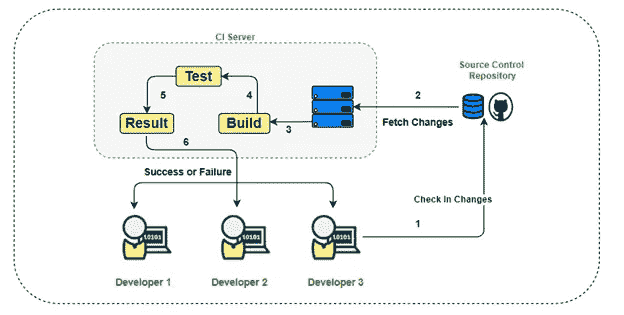
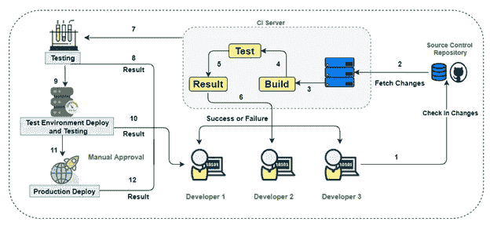
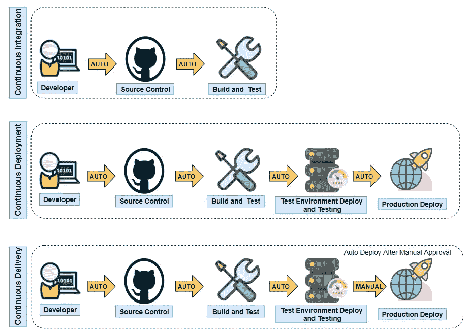
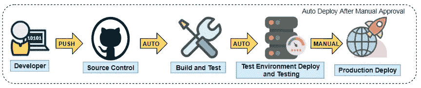

# CICD——神话、陷阱和实践方法

> 原文：<https://towardsdatascience.com/continuous-integration-continuous-delivery-myths-pitfall-and-practical-approach-aaec22edacc5?source=collection_archive---------40----------------------->

## DevOps - CI/CD

## CICD 不仅仅是工具。设计安全、可扩展、强大且自动化的企业 CI/CD 解决方案。

*在本系列文章中，我们将全面讨论 CI/CD、神话、陷阱，然后在下一篇文章中，我们将继续* [*在 AWS*](https://medium.com/@rashimparmar/ci-cd-logical-and-practical-approach-to-build-four-step-pipeline-on-aws-3f54183068ec) *上实际演示 CI/CD 管道，并分别使用 GitHub、Jenkins 和 code deploy 演示 CI/CD 管道。*

图片来自 [Pixabay](https://pixabay.com/?utm_source=link-attribution&utm_medium=referral&utm_campaign=image&utm_content=681175) 的[罗布森·马查多](https://pixabay.com/users/Robzor-840419/?utm_source=link-attribution&utm_medium=referral&utm_campaign=image&utm_content=681175)

在当今快速变化的世界中，技术颠覆已经成为一种常态，并改善了企业的经营方式。组织正试图保持精益，因为这使他们能够快速变化，适应更新的技术，并快速推动创新。这带来了 DevOps，它并不新鲜，但在过去几年中已经有了很多实现。DevOps 是一种软件开发和运营的哲学方法。其核心在于促进协作文化，推动创新速度，并实现自动化软件管理&交付。DevOps 的重要支柱之一是我们将在本文中讨论的持续集成(CI)和持续交付(CD)。

那么问题来了:为什么是 CI/CD？组织越来越以客户为中心，越来越以数据为导向。这导致了更多的独立和并发特性的发布。云服务提供商通过提供无服务器框架和许多其他有利可图的节省成本的功能，为它增添了许多甜头。请注意，只有精心设计的框架才能带来实际的成本效益。显然，用于软件交付的传统工具无法赶上快速发展的“敏捷开发方法”。这导致了对 CI/CD 工具的需求和发展。

# **持续集成**

连续累计

持续集成指的是软件发布的构建或集成阶段。它涉及开发人员定期将他们的代码合并到一个触发构建和测试的中央代码库中。持续集成的目标是更快地发现和修复错误，提高软件质量，并减少验证和发布新软件特性的时间。有两个重要组件:

**自动化** —构建&测试过程的自动化，包括从故障中恢复。目的是使 CI 流程变得枯燥、简单和快速。这意味着开发人员有更多的时间来构建新功能、测试和合并。

**文化和思维转变** —这是 DevOps 的一个重要方面。传统上，团队中的开发人员过去常常长时间地开发代码，并一次性地将变更合并到代码库中。这使得合并变更既困难又耗时。集成失败的可能性更大，并且如果没有修复，错误会存在更长时间。这使得更快地交付软件变得更加困难。另一方面，频繁的集成意味着更少的集成问题，并且 bug 被立即修复。

# **好处**

**提高生产力:**通过自动化构建和测试中的手动步骤，释放开发人员的带宽。更频繁的提交可以确保代码问题得到及时解决。

**更快地修复 bug:**频繁的提交和测试确保问题在成为大问题之前更快地被发现和修复。

**更快更频繁的发布:**持续集成帮助团队向产品频繁发布更多的特性。

**标准化:**包括回归和集成测试在内的标准化测试用例的测试代码确保代码遵循强制性检查。

# **连续交货**

连续交货

持续交付是对持续集成的扩展，其中代码变更以构建工件的形式自动准备，以备部署。现成的工件可以部署到测试环境中进行进一步的测试，或者部署到生产环境中。这种整体集成确保标准化代码经过全面测试，并随时准备部署。它还确保了代码的完整性，因为相同的代码部署在不同的阶段。另一个好处是只需一次点击就可以在多台机器上部署相同的代码。

# **持续交付与持续部署**

这两个术语经常被认为是相同的或混淆的。一个理想的场景是开发人员将代码提交到中央存储库，这可以触发构建和测试管道，并在没有失败或问题的情况下将更改自动部署到生产中。然而，我们大多数人都知道这并不完全是部署工作的方式。在部署到生产环境之前，通常需要手动批准或签署。

持续集成 vs 持续集成 vs 持续交付

在连续部署中—按一个按钮将代码合并到中央存储库中，如果管道中的所有阶段都成功，代码将自动部署到生产中。另一方面，连续交货需要人工批准。这并不意味着连续交付缺少任何东西，但是实际上在签核之前需要人工批准。

# **可变与不可变基础设施**

在继续之前，我想提出一个属于配置管理的重要话题，但是云平台上的现代 CI/CD 工具包括了这一特性——不可变基础设施。简单讨论一下吧。在同一基础设施上升级应用程序或软件被称为可变方法。不变的方法是指构建新的虚拟机或独立的基础架构，升级到所需的技术体系，如果一切正常，则迁移到新的虚拟机并转储/回收旧的基础架构。这两种方法各有利弊，但是如果您的用例需要不变的基础设施，那么现代 CI/CD 云平台服务也支持这种方法。

# **好处**

**自动化软件发布过程:**持续交付有助于从持续集成管道中部署现成的构建工件，并更快地交付更新&特性。

**提高生产力:**通过将开发人员从手工任务中解放出来，并鼓励有助于减少部署到产品中的错误和 bug 数量的行为，帮助团队提高生产力。

更快地修复错误:连续交付让您的团队可以轻松地对您的代码执行其他类型的测试，因为整个过程已经自动化了。

**更快地交付特性:**持续交付帮助您的团队更快更频繁地向客户交付更新。当正确实现时，您将总是拥有一个已经通过标准化测试过程的部署就绪的构建工件

# **CI/CD 管道**

CI/CD 管道

现在，我们已经分别讨论了 CI 和 CD，让我们看一下 CI/CD 渠道。CI/CD 管道是自动化整个软件交付过程的过程。从提交代码到中央存储库，运行测试用例，构建包，以及将代码部署到测试或生产环境。设置 CI/CD 管道没有单一的顺序，但是根据您的组织选择的部署模式，会有最佳实践。

CI/CD 更像是即插即用。它有不同的组件，可以以任何方式使用。有许多开源和付费服务可以单独用于上面列出的每个阶段。例如，下面是管道的一种形式

提交更改->触发构建->构建->通知构建结果->运行测试->通知测试结果->将构建交付到环境->在必要的地方部署

# **好处**

CI/CD 渠道优势

# 陷阱

**不要忘乎所以:**市场上有这么多可用的工具和特性，其中大部分可能并不是特定用例所需要的。所以头脑风暴一下什么最适合你的软件交付，并且只实现相关的组件。如果有一个特别的部分，比如单元测试，它不稳定并且有更多的问题，那么一旦它成熟了，就自动化这个过程，否则你将会花费更多的时间，而不是自动化它。

**不要构建庞大的脚本:**不要构建庞大的测试脚本；相反，构建具有已定义功能的小脚本，并在需要时跨管道重用它。

**运行本地单元测试用例:**在推送到中央存储库之前，在开发人员机器上本地运行特定于业务场景的测试用例。它提供了额外的验证层，并确保较少的集成问题。

**建立以流程而不是工具为中心的管道:**这是一个分裂的时代。软件交付服务正在迅速改进。今天很好的工具明天可能就不够用了(比如几年后)。因此，构建架构时要保持对工具的独立性。尝试在云平台上构建代码库，提供无限的安全存储。最大的好处是，它将数据保存在远离计算设备的中央存储库中，如果您想要过渡到新的服务和软件，这将变得非常容易。

**将正确的组件放置在正确的位置:**根据用例将正确的阶段放置在正确的位置。目标必须是通过关闭高故障管道组件来节省启动时间。例如，您可能想先打包，然后并行运行多个测试用例。

**避免在内部 CI/CD 中构建:**有大量价格合理的开源和付费服务。CI/CD 的主要目标是释放开发人员的带宽，将其用于最重要的事情。内部解决方案需要前期投资和大量维护。管道目标应该是使 CI/CD 无缝。

**使用云原生服务:**AWS 和 Azure 等主要云提供商提供选择原生或流行服务的灵活性，以构建完整的 CI/CD 管道。此外，尽可能不使用服务器，以避免维护成本并关注结果。

# 结论:

在本文中，我们讨论了 CI/CD、好处、误区和要避免的陷阱。如果你喜欢这篇文章，请告诉我并关注我。[点击此处](https://medium.com/@rashimparmar/ci-cd-logical-and-practical-approach-to-build-four-step-pipeline-on-aws-3f54183068ec)阅读下一篇文章，我们将在 AWS 平台上构建 CI/CD 管道。

*免责声明——文中观点仅代表作者个人，不代表作者所属任何组织的观点。*