# 使用 GitHub Actions 对 ML 项目进行持续质量评估。

> 原文：<https://towardsdatascience.com/continuous-quality-evaluation-for-ml-projects-using-github-actions-78f2f078e38f?source=collection_archive---------24----------------------->

## 如何为 GitHub repo 设置自动指标收集，以及我如何使用它赢得 NLP 竞赛。


斯蒂芬·道森在 [Unsplash](https://unsplash.com?utm_source=medium&utm_medium=referral) 上拍摄的照片

在这篇文章中，讨论了基于机器学习(ML)的算法的自动质量评估。

最近，我和我的团队在[俄罗斯储蓄银行 AIJ 竞赛 2019](https://contest.ai-journey.ru/en/competition) 中获得了[第二名](https://contest.ai-journey.ru/en/leaderboard)，这是俄罗斯最大的 ML 竞赛之一(100 个团队，45，000 美元奖金)。今年的任务是解决俄语[高中毕业考试](https://en.wikipedia.org/wiki/Unified_State_Exam)由许多不同的自然语言处理(NLP)子任务组成，每个子任务都需要一个单独的 ML 模型。这使得我们的团队迫切需要一个自动化的质量评估系统。根据我的生产经验，我建立了这样一个系统，我想在这里分享一下。

这篇文章的所有代码都可以在 Github 资源库中找到:[https://github.com/vladimir-chernykh/ml-quality-cicd](https://github.com/vladimir-chernykh/ml-quality-cicd)

# 介绍

在过去的几年里，ML 领域发展非常迅速。由于这种增长和尽可能快地做每件事的持续需求，许多项目缺乏测试。与此同时，经典软件开发是更成熟的领域，有很多值得学习的地方([软件 1.0 vs 软件 2.0](https://medium.com/@karpathy/software-2-0-a64152b37c35) )。对产品进行适当的测试就是其中之一。从这些链接[ [1](https://en.wikipedia.org/wiki/Software_testing) 、 [2](https://medium.com/edureka/types-of-software-testing-d7aa29090b5b) 、 [3](https://testing.googleblog.com) 、 [4](https://techcommunity.microsoft.com/t5/TestingSpot-Blog/bg-p/TestingSpotBlog) 开始，你可以了解更多关于测试及其不同类型的知识

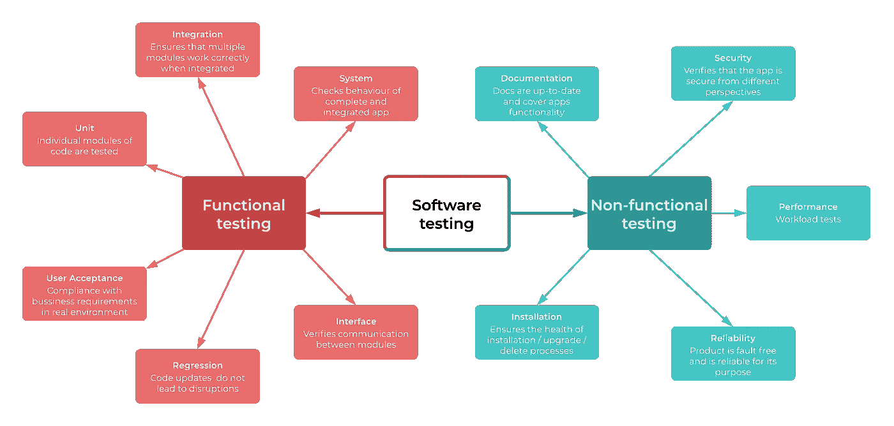

图 1:软件测试分类之一

虽然经典算法和应用程序是确定性的，但大多数基于机器学习的对应程序本质上是随机的。

它引入了另一种类型的测试，这种测试在以前可能并不相关:算法质量测试。他们评估模型解决底层任务的准确性，例如，预测股票价格，区分图像中的猫和狗等。当然，很久以前就有近似和随机算法，但随着 ML 的兴起，它们变得无处不在(许多经典算法在质量上有理论界限)。

当涉及到生产部署时，质量评估至关重要。人们需要知道模型的表现如何，它的适用范围和薄弱环节。只有这样，模型才能被有效地使用，并使产品受益。

几乎每个数据科学家都知道如何在开发环境中评估模型的质量，例如 Jupyter notebook、IDE of choice 等。但是对于生产来说，重要的是不仅要知道当前的质量指标，还要跟踪它们随时间的变化。至少有三种方法可以解决这个问题:

*   浏览代码存储(GitHub、BitBucket 等)中的提交历史。)
*   将结果存储在电子表格、维基页面、自述文件等中。
*   自动化指标收集和存储

这些选项中的每一个都有其使用场景。前两个选项在模型没有太多变化时工作得很好，它们很少发生。而最后一种方法在模型频繁变化时是不可避免的，人们希望有一种稳定而方便的方法来跟踪它。在下文中，最后一种方法称为连续法。

# CI/CD

实施持续评估的一种便捷方式是使用[持续集成/持续交付](https://www.redhat.com/en/topics/devops/what-is-ci-cd) (CI/CD)系统。市场上有许多选择:

*   [詹金斯](https://jenkins.io)
*   [CircleCI](https://circleci.com)
*   [特拉维斯奇](https://travis-ci.com)
*   …

所有 CI/CD 系统的最终目标是自动化构建、测试、合并、部署等。整个 CI/CD 管道与代码存储库协同工作，并由特定事件(通常是提交)触发。

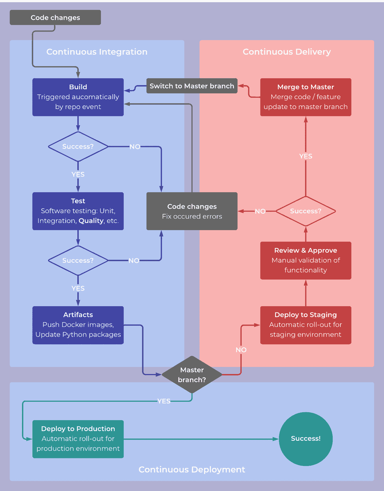

图 2: CI/CD 主要方案。在源[ [5](https://semaphoreci.com/cicd) 、 [6](https://www.atlassian.com/continuous-delivery/principles/continuous-integration-vs-delivery-vs-deployment) 、 [7](https://docs.gitlab.com/ee/ci/introduction/) ]中查找更多信息

最近 GitHub 推出了自己的 CI/CD 系统，名为 [GitHub Actions](https://github.com/features/actions) 。以前，我在几个生产级 CI/CD 系统中使用 Jenkins。AIJ 竞赛是一个试验新工具的绝佳机会，我决定试一试。关于行动，有几点很突出:

*   与 GitHub 的内在集成。如果已经在使用 GitHub 库进行代码管理，那么操作应该可以无缝地工作。
*   GitHub 提供按需虚拟机来运行整个管道。这意味着不需要管理自己的机器及其与 GitHub 动作的连接。虽然如果你需要一个巨大的虚拟机或者有任何其他特定的要求，这是有可能的(自托管运行程序最近已经在测试版中[发布](https://github.blog/2019-11-05-self-hosted-runners-for-github-actions-is-now-in-beta/))。
*   对于私人回购，免费账户有使用限制(2000 分钟/月)，但对于公共回购没有限制。更多信息[点击这里](https://help.github.com/en/github/setting-up-and-managing-billing-and-payments-on-github/about-billing-for-github-actions)。我已经在两个小项目中使用了 GitHub Actions，还没有达到极限，但是对于较大的项目来说还是很容易的。在这种情况下，詹金斯/特拉维斯/等。可能是更好的选择。

有关更全面和详细的描述，请查看[官方文档](https://help.github.com/en/actions)。

# 工作

为了说明系统是如何构建的以及它是如何工作的，我将使用玩具示例并构建一个模型来解决[波士顿房价](https://www.kaggle.com/vikrishnan/boston-house-prices)任务。在实践中，该系统被应用于 AIJ 竞赛的自然语言处理任务中。

## 真实任务:AIJ 竞赛

这个连续质量评估系统产生的真实世界的实际任务是关于解决 AIJ 竞赛中的俄语考试。

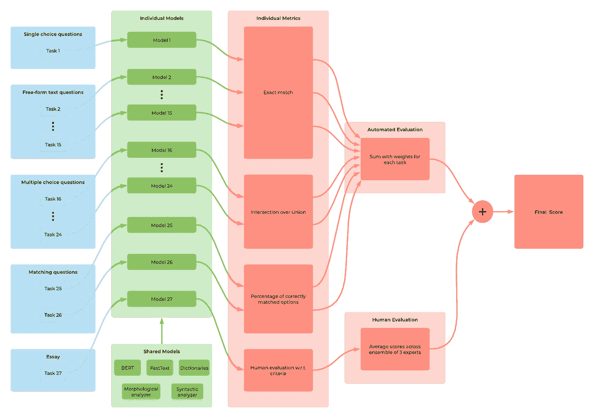

图 4: AIJ 竞赛评估管道

这个竞赛的特点是有许多完全不同的子任务(27 ),我们最终用不同的模型来解决。子任务的例子有:

*   从几个单词中选出重音不正确的单词
*   应该插入逗号的位置
*   在哪些句子中，破折号是根据相同的规则放置的
*   对于给定的文本，哪些语句成立
*   在语法错误的类型和它出现的句子之间建立一个映射

有 3 个不同的自动化度量标准(图 4 ),每个子任务由其中一个来判断。最终的排名是基于子任务之间的指标总和。

我们一直在一个接一个地解决这些子任务，并且经常回到我们之前解决的那个来改进它。因此，我们迫切需要一个自动系统来跟踪特定任务的度量变化以及聚合度量。

我没有在这里描述 AIJ 竞赛的精确解，因为它太庞大和复杂了。这会偏离文章的主旨。但是，进入系统构建的背景可能有助于理解系统和所做的决策。

## 玩具任务:波士顿房价

这是一个回归问题，需要根据不同的因素(如房间数量、社区犯罪率等)来预测住房设施的价格。

这是“默认”经典数据集之一。它甚至直接出现在 [scikit-learn](https://scikit-learn.org/stable/) 库中

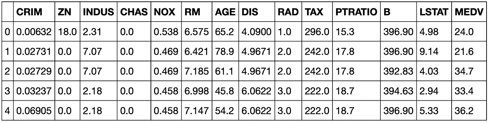

图 3:来自波士顿房价数据集的数据示例

总共有 13 个特征(见[笔记本](https://github.com/vladimir-chernykh/ml-quality-cicd/blob/master/notebooks/train.ipynb)中的详细描述)和一个名为“MEDV”的目标，代表“1000 美元的自有住房的中值”。

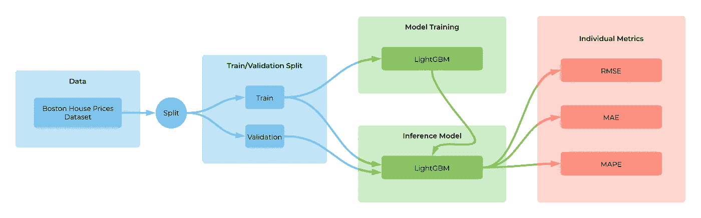

图 5:波士顿房价数据集和 LightGBM 模型的模型开发管道

我会使用三种不同的模型(+基线)来模拟任务的逐步“工作”:

*   平均模型(基线)

*   随机预测

*   线性回归

*   决策树上的梯度增强( [LightGBM](https://github.com/microsoft/LightGBM) )

在现实世界的问题中，它相当于持续改进模型，其变更被推送到存储库。

还应该定义度量标准来评估模型的好坏。在这种情况下，我要使用:

*   均方根误差( [RMSE](https://en.wikipedia.org/wiki/Root-mean-square_deviation) )
*   平均绝对误差( [MAE](https://en.wikipedia.org/wiki/Mean_absolute_error) )
*   平均绝对百分比误差( [MAPE](https://en.wikipedia.org/wiki/Mean_absolute_percentage_error) )

所有的数据预处理和模型训练/评估代码都可以在 GitHub repo 中相应的[笔记本](https://github.com/vladimir-chernykh/ml-quality-cicd/blob/master/notebooks/train.ipynb)中找到。这不是文章的重点:

1.  构建最佳模型
2.  解释如何进行特征工程和开发模型

因此，我不在这里详细描述它。这本笔记本被大量评论并且自成一体。

# 解决方案包装

该解决方案作为[dockered](https://www.docker.com)RESTful web 服务发布。使用 [Flask](https://palletsprojects.com/p/flask/) 将模型包装到服务器应用程序中(详见 repo 中的 [this](https://github.com/vladimir-chernykh/ml-quality-cicd/blob/master/src/server.py) 文件)。

这里需要注意几件事:

*   特征的顺序很重要。否则，模型将无法正确预测。
*   有一个简单返回“OK”的`ready`端点。可以向其发送请求，以了解是否所有模型都已经加载到 RAM 中。如果端点没有回答，则意味着模型仍在加载或者已经加载失败。
*   `predict`端点做预测价格的实际工作。输入是一个 JSON，提供了所有必要的特性。
*   输入可能包含一列数据实例，即不止一个。

人们可以通过进入`ml-quality-cicd/src`并运行`python server.py`来使用本地 Python 启动解决方案服务器。尽管这是一种可以接受的方法，但是使用 Docker 有一种更好的平台无关的方法。我创建了一个特殊的 [Makefile](https://github.com/vladimir-chernykh/ml-quality-cicd/blob/master/Makefile) 来运行所有必要的命令。要运行解决方案服务器，只需键入( [Docker](https://www.docker.com) 应已安装)

它启动一个 Docker 容器，在主机的端口 8000 上有一个可用的解决方案 web 服务器。有关全面的技术说明，请访问 [repo](https://github.com/vladimir-chernykh/ml-quality-cicd) 。

人们可以以任何合适的方式查询启动的网络服务，例如，使用 Python、JS、Go 等。CURL 命令行实用程序和 Python 示例如下:

在这两种情况下，输出应该是相同的:

```
{"predictions":[21.841831683168305]}
```

该解决方案的格式选择由 AIJ 竞赛决定。最近，在洗钱竞赛中有一种转向基于集装箱的解决方案的强劲趋势([ka ggle deep fake Detection](https://www.kaggle.com/c/deepfake-detection-challenge)、 [Sberbank AIJ 竞赛](https://contest.ai-journey.ru/en/competition)等)。)

人们可以选择方便用于特定目的的任何其他形式的解决方案交付。例如，从命令行启动带有数据路径和存储结果的位置的脚本。

# 估价

为了进行评估，我将使用保留技术，并将整个数据集分成训练和验证子集。[交叉验证](https://en.wikipedia.org/wiki/Cross-validation_(statistics)) (CV)也可以用于 Boston House Prices 任务的特殊情况，因为这里使用的模型简单快速。在实际应用中，可能有一个模型被训练了几天。因此，几乎不可能使用 CV。

拆分是在训练[笔记本](https://github.com/vladimir-chernykh/ml-quality-cicd/blob/master/notebooks/train.ipynb)中完成的。这个步骤也显示在图 5 中。

请注意随机状态和其他参数是如何固定的，以保证再现性。之后，将训练和验证数据集保存到 CSV 文件中，以便以后使用，而无需再次启动代码。这些文件位于 repo 中的`data` [文件夹](https://github.com/vladimir-chernykh/ml-quality-cicd/tree/master/data)中。

接下来，有几个可供评估的选项:

*   笔记本
*   通过网络服务手动操作
*   通过网络服务自动完成

下面我们来分解一下每一个是怎么做的。

# 评价:笔记本

在这种方法中，一个是就地测量模型的质量:在开发它的相同环境中。这种方法有助于通过比较许多模型来建立更好的模型。

下面是所有 3 个模型+基线的比较表(完整代码在培训[笔记本](https://github.com/vladimir-chernykh/ml-quality-cicd/blob/master/notebooks/train.ipynb)):

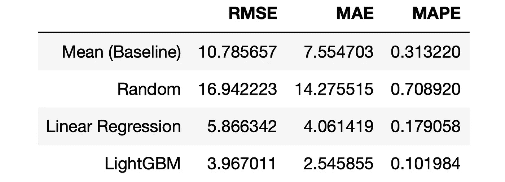

图 6:在 Jupyter 笔记本上完成的验证集的模型比较

算法的就地评估对于即时开发来说是很好的，但是它不允许容易地跟踪变化的历史(在“*简介”*中讨论)。

# 评估:通过网络服务手动进行

这是通向全自动连续质量测试的中间步骤。

这里我将使用上面“*解决方案打包*”部分中描述的服务接口。一方面，有一个 web 服务接受 POST 请求的 JSON 主体中的数据实例列表。另一方面，CSV 文件(train 和 validation)包含行中的数据实例。人们需要:

*   从 web 服务获取 CSV 文件中所有数据的预测
*   计算预测值和实际值的度量

若要运行本节中的代码，请确保包含该解决方案的服务器正在运行，或者使用运行它

请注意，因为端口固定为 8000，所以一次只能运行一台服务器。要终止所有服务器，可以使用`make destroy_all`命令或使用`docker stop ...`手动停止它们。

## 客户

客户端解决这两个任务中的第一个。它的主要目标是:

*   将一种格式(CSV)转换为另一种格式(词典列表)
*   向服务器发送请求
*   接收并处理回答

客户端的完整代码可在回购的`client.py` [文件](https://github.com/vladimir-chernykh/ml-quality-cicd/blob/master/client/client.py)中获得。在这里，我只谈要点。

下面是一个核心逻辑，它能够以适当的格式将文件发送到端点。`client.py`中的所有其他 120 线路实际上都是接口，以使这些线路正常工作。

当答案返回时，需要处理并保存它们。

注意，一行对应一个输入文件。在此任务中，一个文件可以包含多个数据实例。当一行包含一个实例而不是多个实例的列表时，使用 CSV 更容易。因此，下一步是将答案转换成更方便的格式。

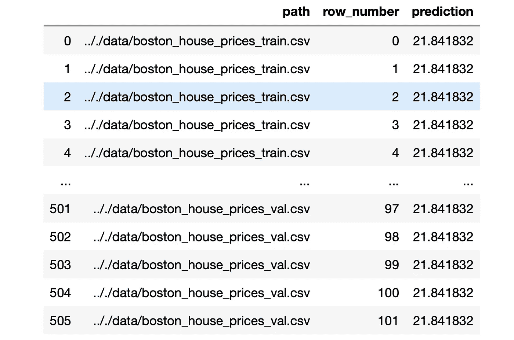

图 7:解析和转换后的答案数据帧。这里，客户机同时启动两个文件:训练集和验证集。转换后的数据帧包含对两个文件的预测。所有预测都是相同的，因为部署了 MeanRegressor 模型。

注意，这个阶段完全依赖于数据。对于每个新的任务和数据结构，应该相应地重写这种转换。

## 度量计算

在接收到答案并以适当的格式存储后，需要将基础真值正确地加入到答案中。它将允许我们计算实例和全局的所有指标。此功能由回购中的`metrics.py`文件[覆盖。](https://github.com/vladimir-chernykh/ml-quality-cicd/blob/master/client/metrics.py)

注意，赋值是在没有任何连接的情况下完成的，因为`parsed_answers`数据帧是按“路径”、“行编号”字段排序的。

一旦基础真值可用，就可以计算所有的实例-wisse 度量，在这种情况下是 MSE、MAE 和 MAPE。

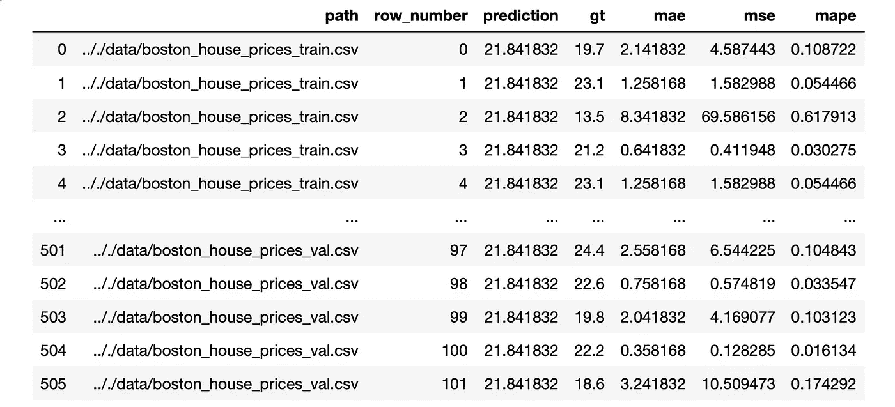

图 8:由基本事实标签和基于实例的计算指标丰富的转换答案

这个丰富的表允许分析错误分布和具有最高/最低错误的实例。

最后，让我们通过平均文件间的实例度量来计算全局度量。

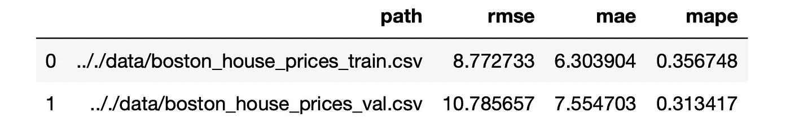

图 9:文件间的平均全局度量

注意，这里测试的型号是`MeanRegressor`。可以将验证质量与图 6 中的相应行进行比较，并确保它们是相同的。

# 评估:通过网络服务自动进行

上一节讨论的所有内容都在 repo 中的`client` [文件夹](https://github.com/vladimir-chernykh/ml-quality-cicd/tree/master/client)中实现。现在的目标是自动化这个过程，并将其包装到 CI/CD 管道中。

自动化是通过 [Makefile](https://github.com/vladimir-chernykh/ml-quality-cicd/blob/master/Makefile) 完成的。我之前在这里使用它来启动 web 服务，现在让我们仔细看看它的主要细节。这个 Makefile 中有几个目标我想讨论一下:

*   运行时变量。请注意主机端口是如何随机选择的(根据启动时的 UNIX 时间戳)。这样做是为了允许多台服务器同时运行。

*   `build`和`push`是准备(构建和推送)Docker 映像的目标。图像非常标准，可以在`dockers` [文件夹](https://github.com/vladimir-chernykh/ml-quality-cicd/tree/master/dockers)中找到。

*   `create`通过解决方案服务器启动 Docker 容器。设置了资源限制，等于 200 MB RAM 和 1 个 CPU。请注意，相对于总 CPU 内核，CPU 限制是如何处理的。这样做是因为如果有人要求比主机上可用的 CPU 更多的 CPU，Docker 无法启动容器。

*   `evaluator`启动“*评估:通过 web 服务手动操作*”一节中讨论的客户端和公制计算机。代码可以在`client` [文件夹](https://github.com/vladimir-chernykh/ml-quality-cicd/tree/master/client)中找到。请注意，启动是在单独的 Docker 容器中进行的(尽管是从同一个 Docker 映像开始的)，网络是与主机共享的。它允许从启动的评估 Docker 内部访问解决方案服务器。

*   `destroy`停止并移除解决方案服务器。请注意在出现错误的情况下，日志是如何转储并打印到输出中的。

用户可以结合上述所有步骤，使用一个命令启动评估:

依次触发`create`、`evaluator`和`destroy`。输出应该是在`client/reports/<timestamp>_<data folder name>`文件夹下可用的评估工件。

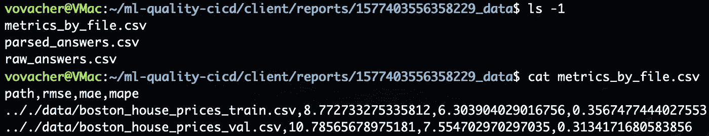

图 10:评估工件

所有这三个文件都在前面的“*评估:通过 web 服务的手动操作*”一节中讨论过，现在应该清楚了。

完成全自动系统的最后一步是将描述的评估过程与 CI/CD 系统联系起来。

# CI/CD: GitHub 操作

[GitHub Actions](https://github.com/features/actions) 平台被用作 CI/CD 引擎。关于 GitHub 动作和 CI/CD 的更多细节，请参阅本文的“ *CI/CD* ”部分。这里也有官方文件[。在接下来的内容中，我将使用三种方法。它们之间的区别在于在哪里以及如何执行 CI/CD 管道步骤:](https://help.github.com/en/actions)

*   GitHub 机器
*   使用 SSH 的远程机器
*   使用自托管运行器的远程机器

## GitHub 机器

这是最容易使用的选项。GitHub 为用户提供了虚拟机(VM ),每当特定事件触发管道时，虚拟机就会自动启动。GitHub 管理虚拟机的整个生命周期，用户不应该为此而烦恼。

所有管道定义都应遵循一些规则:

*   YAML 格式
*   存储在`/.github/workflows`文件夹内的回购
*   遵循语法[规则](https://help.github.com/en/actions/automating-your-workflow-with-github-actions/workflow-syntax-for-github-actions)

让我们构建一个执行评估过程并打印结果的工作流。该规范位于回购中的`evaluate_github.yml` [文件](https://github.com/vladimir-chernykh/ml-quality-cicd/blob/master/.github/workflows/evaluate_github.yml)中。

主分支上发生的每个`push`都会触发管道，并对指定文件进行更改。VM 运行`ubuntu-18.04`并在包列表后安装[。也有其他系统可用(见完整列表](https://help.github.com/en/actions/automating-your-workflow-with-github-actions/software-installed-on-github-hosted-runners#ubuntu-1804-lts)[此处](https://help.github.com/en/actions/automating-your-workflow-with-github-actions/virtual-environments-for-github-hosted-runners#supported-runners-and-hardware-resources))。

第一步是执行被称为`checkout`的公开可用的动作(更多细节[在这里](https://help.github.com/en/actions/automating-your-workflow-with-github-actions/workflow-syntax-for-github-actions#jobsjob_idstepsuses))。它将代码从父存储库签出到虚拟机。下一步是执行评估。如前所述，这是使用`make evaluate`完成的。最后，将指标打印到 stdout。

一旦 YAML 配置被推送到回购，管道将在每个合适的事件上被触发。管道运行的结果可以在 repo 的上部选项卡菜单中的“Actions”选项卡下找到。

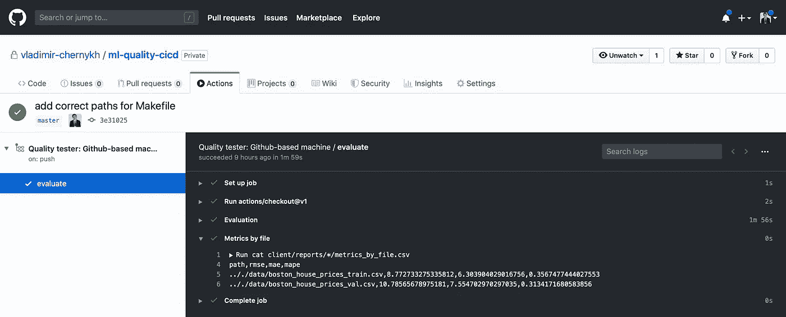

图 11:GitHub 提供的 VM 的工作流运行界面和结果

成功的管道运行如图 11 所示。可以注意到，指标与图 6 和图 9 中的相同。

GitHub 管理的虚拟机是不需要大量资源的工作流的好方法。所有虚拟机只有 2 个 CPU，7GB 内存和 14 GB 磁盘空间([链接](https://help.github.com/en/actions/automating-your-workflow-with-github-actions/virtual-environments-for-github-hosted-runners#supported-runners-and-hardware-resources))。当一个人运行像波士顿房价预测这样的玩具任务时，这是可以的。但对于 AIJ 竞赛，我们很快就用完了资源，这使得它不可能用于评估。并且对于许多 ML 应用来说，这些资源是不够的。这让我想到了下一小节中描述的解决方案。

## 使用 SSH 的远程机器

现在假设，有一个人想要用来执行工作流的工作站。如何做到这一点？

人们可以出于任何目的使用 GitHub 启动的 VM，而不仅仅是直接启动管道。除此之外，GitHub 允许用户[存储机密](https://help.github.com/en/actions/automating-your-workflow-with-github-actions/creating-and-using-encrypted-secrets)并在工作流执行期间使用它们。这个秘密可能是安全地存储在 GitHub 中的任何信息，并且可以传递给 VM。

这两种思想的结合使得使用 SSH 连接到远程工作站并在那里执行所有必要的步骤成为可能。

为此，让我们首先向 GitHub 添加三个秘密:

*   哪一个是远程机器的 IP 地址
*   `EVAL_SSH_USER`是远程机器上的用户名
*   `EVAL_SSH_KEY`是一个私有的 SSH 密钥，对应于所提供的用户和远程机器

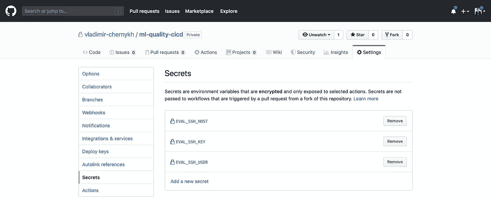

图 12:GitHub 提供的秘密管理 UI

在初始化所有必要的秘密之后，你可以在 GitHub 动作管道定义中使用它们。所述工作流程的代码可在 repo 的`evaluate_remote_ssh.yml` [文件](https://github.com/vladimir-chernykh/ml-quality-cicd/blob/master/.github/workflows/evaluate_remote_ssh.yml)中找到。

触发条件和初始`checkout`步骤与上例相同。下一步是初始化 SSH 私有密钥。注意如何使用特殊的上下文占位符`{{ secrets.<SECRET_NAME> }}`将秘密传递给环境变量。一旦初始化了 ssh 凭证，就可以在 GitHub VM 上用代码创建一个档案，并使用`scp`命令将其加载到远程机器上的指定路径。注意，归档文件是以提交散列`GITHUB_SHA`命名的，默认情况下，提交散列作为环境变量可用(参见此处的[以获得默认环境变量的完整列表](https://help.github.com/en/actions/automating-your-workflow-with-github-actions/using-environment-variables#default-environment-variables))。之后，通过运行`make evaluate`进行评估，并将结果从远程机器复制回 GitHub VM。

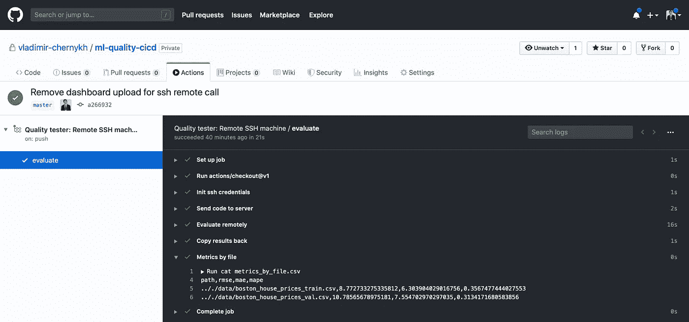

图 13:使用 SSH 连接到远程机器的工作流运行结果

## 使用自托管运行器的远程机器

通过 SSH 远程连接解决了 GitHub VM 资源不足的问题。但是与 GitHub VM 执行(31 行 vs 5 行)相比，它也引入了太多完成目标所需的额外命令。为了解决这个问题，同时兼顾两个世界，你可以使用最近[发布的](https://github.blog/2019-11-05-self-hosted-runners-for-github-actions-is-now-in-beta/)自托管运行器[的测试版](https://help.github.com/en/actions/automating-your-workflow-with-github-actions/about-self-hosted-runners)。

其背后的核心思想是使用特殊的软件将远程机器暴露给 GitHub 动作用于管道执行(关于安装的更多信息[在这里](https://help.github.com/en/actions/automating-your-workflow-with-github-actions/adding-self-hosted-runners))。

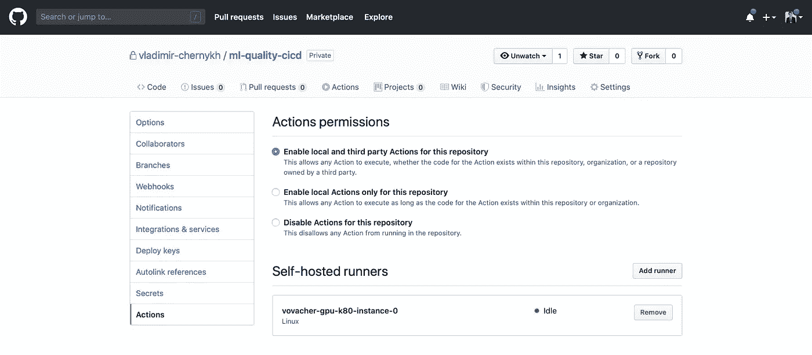

图 14:添加自托管运行程序

建立连接后，用户可以通过 YAML 配置文件的指令`runs-on`在管道中使用新的流道[。](https://help.github.com/en/actions/automating-your-workflow-with-github-actions/using-self-hosted-runners-in-a-workflow)

下面定义了自承载流道的管道。

注意`runs-in: self-hosted`指令是如何告诉 GitHub 动作在之前添加的定制远程机器上运行的(图 14)。

除了几个步骤之外，YAML 的配置与 GitHub 管理的虚拟机几乎相同。

*   管道执行前后的环境清理。必须这样做，因为没有人再为我们处理 env 了(以前是由 GitHub 处理的),而且它可能包含以前版本的工件。`make clean`命令起作用。
*   将工件上传到存储器。这里我用的是 GitHub 中`DASH_SSH` secrets 定义的自定义(可能是单独的)机器。我将结果存储在一个单独的文件夹中，其中每个文件都以其对应的提交散列命名。用户可以使用任何其他存储(AWS S3、GCP 存储等)。)和文件格式。

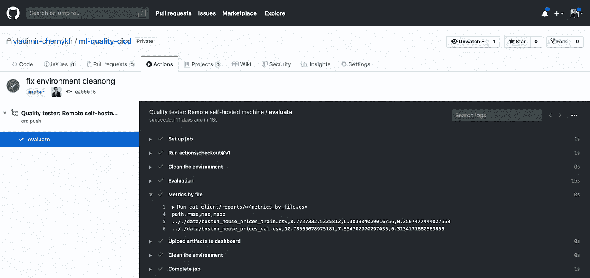

图 15:通过自托管运行器的 CI/CD 管道执行结果

# 结果

本文中所做的所有评估都是一致的，并且给出了相同的`MeanRegressor`基线模型的相同指标。

现在，让我们依次将模型更改为`RandomRegressor`、`LinearRegression`和`LGBMRegressor`，看看指标是如何变化的。我已经使用 [Dash](https://plot.ly/dash/) Python 库实现了这个特殊的仪表板。人们可以在回购协议的这里获得代码细节[。仪表板在 GitHub 中的`DASH_SHH` secrets 指定的特殊远程机器上手动启动。](https://github.com/vladimir-chernykh/ml-quality-cicd/blob/master/dashboard/dashboard.py)

仪表板跟踪的文件夹对应于 CI/CD 自承载管道存储其结果的文件夹。仪表板本身在端口 7050 上可用。

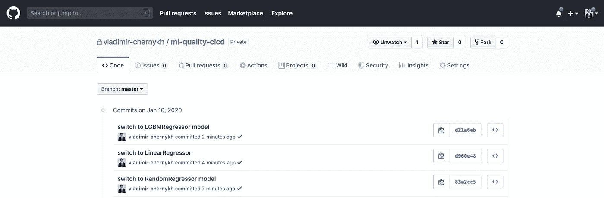

图 16:用不同的模型提交。他们在模型上模拟真实的渐进工作。

图 16 所示的每个提交都会触发所有 3 个描述的 CI/CD 管道。所有的执行都很顺利，这由提交附近的绿色标记表示。自托管运行器还将结果推送到仪表板，如图 17 和 18 所示。


图 17:带有 MAE 度量结果表的仪表板。绿色的行显示最后一个模型的质量比基线好(否则该行被涂成红色)。

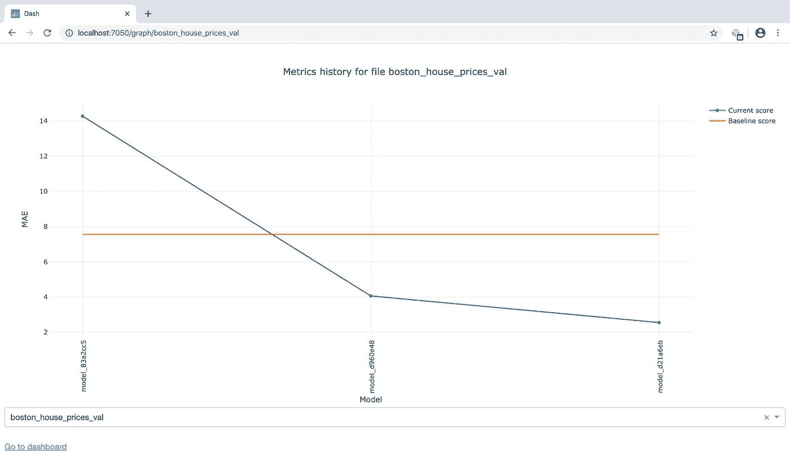

图 18:结果表中一行的图表。注意模型名称是如何重复图 16 中的提交散列的。

仪表板允许用户方便地跟踪历史进度，并比较不同子集/子任务之间的度量。

在现实世界的 AIJ 竞赛中，该仪表板如下所示:

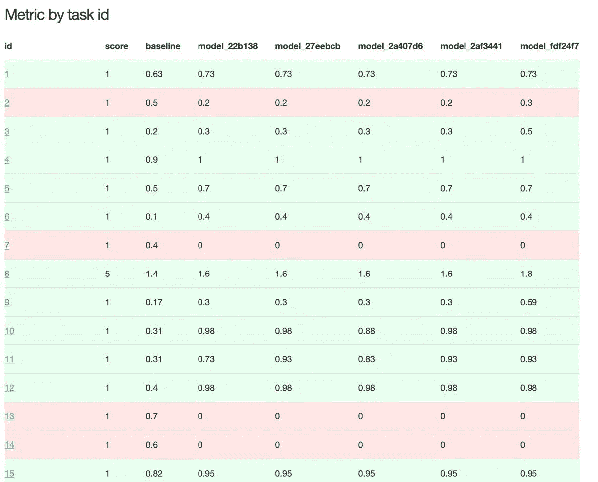

图 19:AIJ 竞赛评估表。每行对应于考试的一个子任务。

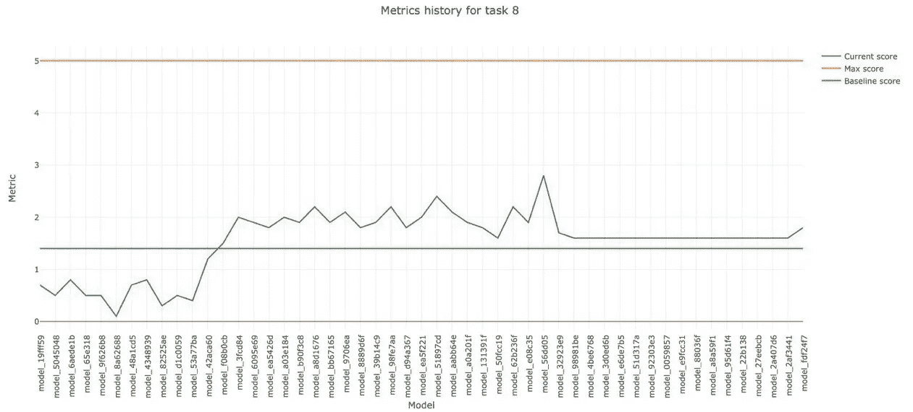

图 20:一个任务的模型进度。

# 结论

在这篇文章中，我描述了我对构建持续质量评估系统的观点，并提供了所有必要的代码和步骤来重现它。

这篇文章中构建的系统对于中小型项目或 ML 竞赛已经足够好了。它还可以在许多方面得到改进，例如:

*   更可靠的日志和指标存储
*   更好的可视化系统
*   日志分析
*   等等。

通过将配置文件重写为适当的特定于工具的格式，所描述的连续质量评估工作流可以很容易地移植到任何其他 CI/CD 引擎。

GitHub Actions 有利有弊。最大的优势是与 GitHub 的紧密集成，以及按需 GitHub 管理的虚拟机的可用性。这对于使用 GitHub 的人来说很方便，如果不使用的话则完全无法接受。主要的缺点是私有存储库的构建数量有限(2000 分钟)。对于大型项目，这导致需要支付保费账户或使用另一种 CI/CD 工具。如果一个人面临分钟溢出的问题，我可能会选择后一种方法。

在我看来，GitHub Actions 是中小型项目的一个很好的选择，这些项目需要一个易于安装的 CI/CD 引擎，并且不太关心它的基础设施。对于更大的项目和更细粒度的控制，可以选择其他 CI/CD 平台。

附注:我要感谢我在 AIJ 大赛中的队友([德国人诺维科夫](https://github.com/elejke)、[奥列格·阿伦金](https://github.com/oalenkin)、[亚历山大·安尼西莫夫](https://github.com/Anisalexvl))为解决方案做出的贡献。