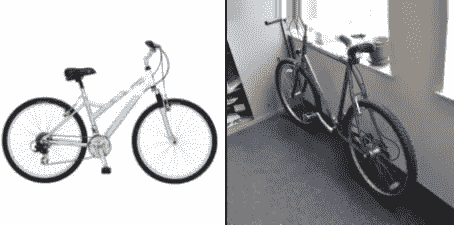
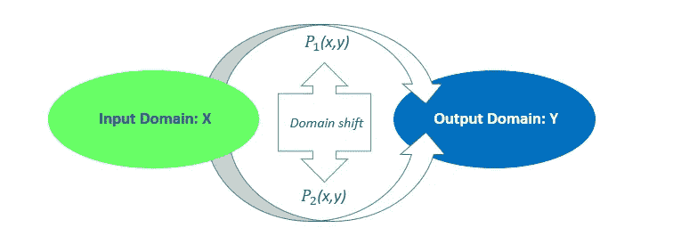
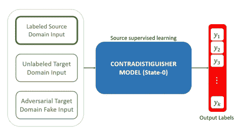
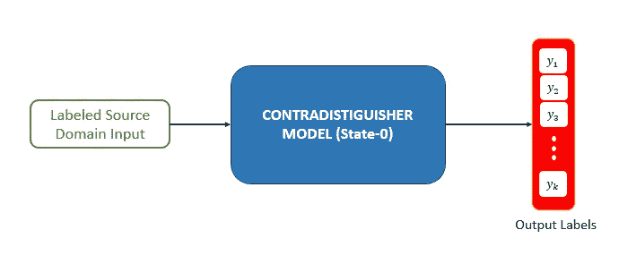

# 简而言之，用于无监督领域适应(CUDA)的对比识别器

> 原文：<https://towardsdatascience.com/contradistinguisher-for-unsupervised-domain-adaptation-cuda-in-a-nutshell-68182572fbcd?source=collection_archive---------57----------------------->

## 一个处理各种域调整方法中涉及的域对齐的某些缺点的模型，同时给出了最新的结果。

正如我们所知，在深度学习世界中，我们可能没有足够的监督数据来训练我们的模型。所以领域适应是一个非常有用的话题。我最近读了一篇[ICDM 19 年的论文“无监督域适配的对比识别器”](https://arxiv.org/abs/1909.03442)，它提出了一种无监督域适配的直接方法，不需要域对齐。

在这篇博客中，我将尝试简单地给出我对这篇论文的理解。该论文的作者还发布了该论文的一个[实现](https://github.com/sobalgi/cuda)。

# 领域适应

正如我们所知，在深度学习的世界中，我们可能没有足够的监督数据来训练我们的模型。但是可能存在另一组非常相似的数据(具有不同的分布)，对于这些数据，我们有足够数量的标记数据。在这种情况下，如果我们能够以某种方式将基于这些数据训练的模型用于我们的任务，那就太好了。为了了解我们正在讨论的内容，让我们讨论一个小例子:

假设我们手里有一个情感分析任务，为了训练的目的，给我们一些带标签的书评。让我们看看其中的一篇书评。

> **回顾-1:** “这本书对其涵盖的主题有深入的概念构建材料。完全值得你花时间。”

现在假设我们要做情感分析任务，评论是关于家具的。让我们看看其中一个家具评论。

> 评论-2: “这件家具的边缘处理非常好，非常舒适。”

我们在这里可以推断的是，没有家具评论会类似于评论-1，即，由于基础分布的差异，在书评上训练的情感分析引擎将与家具评论的不确定性一起工作。

在我们对视觉数据的分类任务中也可以看到另一个类似类型的例子，其中我们有同一物体的两个不同图像，但它们都来自不同的数据集(如图 1 所示)。

图 1:左边是一个电子商务网站上展示的一辆自行车的图像，右边是一个手机摄像头拍摄的自行车的图像。

回到我们之前的例子，假设我们没有标记家具评论，在这种情况下，如果我们可以以某种方式使用我们标记的书评数据集，这将是有用的。处理这些类型的域转移的子学科被称为**域适配。**在更进一步之前，我们需要了解域的含义。

**任意一组数据的域** (D)由其三个属性来表述:其输入特征空间(X)、标签空间(Y)及其底层联合概率分布。

图 2:一个域的表示

## 假设:

域自适应由两个不同的域组成，即源域和目标域，具有共同的输入和输出空间，具有*域偏移。*域偏移是具有公共输入和输出特征空间的两个域的联合概率分布的差异。

图 3:域转移

# 动机

领域适应方法的一般趋势是首先实现源和目标领域对准的中间目标，但是它有一些*缺点*。大的*畴变*使畴变得更难对齐。另一个缺点是使用多分类器，这增加了模型的复杂性。域对齐有时会导致特定于域的信息丢失，因为在此过程中域正在被转换。

本文提出了一种方法，该方法跳过这个无关的中间比对步骤，并分别在源数据和目标数据上以监督和非监督的方式联合学习单个分类器。作者从 Vapnik 那里得到了一口气解决问题的灵感。

> **Vapnik 的想法**:任何想要的问题都应该用最直接的方式解决，而不是解决一个更一般的中间任务。

本文具体讨论了**无监督**版本的域自适应，其中训练数据包含已标记的源域实例和未标记的目标域实例。

> **目的:**通过转移已标记源领域的知识，学习未标记目标领域的分类器。

# 对比识别器(CUDA)

图 4:两种域分布的公共决策边界。

该模型充当两种域分布的分类器。这种方法背后的基本思想是调整在源标记数据上学习的决策边界，使其遵循目标域先验。

我们手里有两个发行版。可以使用监督学习来学习源分布。但是我们需要目标分布来建立目标领域分类器。为了调整在源分布上学习到的决策边界，我们试图提出目标联合分布，作为源分布的函数，加强目标域先验。

图 5:包含目标无监督学习前后的决策边界。

CUDA 模型包含一个编码器和一个同时使用三个数据集训练的分类器。

图 9:每个时期训练 CUDA 模型。

## 寻找源联合分布

根据领域适应的定义，为了传递知识，使用源标记数据来训练模型。交叉熵损失用于学习用于最大化标签相对于它们各自的源实例的条件对数似然的参数。设源分布为 P(θ)。

图 6:关注从标记的源数据中学习。

## 设计目标联合分布

由于源域和目标域之间的唯一区别是其固有的联合概率分布，并且使用监督学习，我们获得了源域的联合概率之后的参数，我们的任务现在转移到获得目标域的联合分布上。

我们知道，任何域的联合分布都满足给定的两个条件，即 x[t]上的边际应给 p(y[t])和 y[t]上的边际应给 p(x[t])。建议的目标分配也必须遵循这两个条件。由于对目标数据进行的学习只能在无人监督的情况下进行，作者巧妙地提出了目标联合分布，它:

*   是 P(θ)以及目标域先验的函数。
*   遵循上述两个条件。
*   可以用来寻找最具对比性的特征。

为了获得最多的对比特征，所提出的联合分布被最大化。当最大化时，建议的分布实施两个属性。它试图增加一个实例被标记为一个类的概率，同时减少所有其他实例被标记为同一类的概率。这两个强制使 contradistinguisher 提取出唯一指定每个实例的特性集。

图 7:聚焦于根据未标记的目标数据进行调整。

## **正规化**

在训练期间使用伪标签时可能出现的一个问题是过拟合伪标签。为了解决这个问题，作者还包括了对抗性正则化，其目标是当模型引入一组不属于任何一类的假阴性样本时，包含不确定性。我们首先构建一组假阴性样本，并同时将它们标记到每个类别。在训练期间，模型将学习将不确定性包括到预测中，这在我们的情况下是一个有效的场景。

这种方法类似于熵正则化，其中不是最小化真实目标样本的熵，而是最小化多类、多标签分类任务的二进制交叉熵损失。用于生成假样本的方法取决于所使用的域。该方法提出了两种类型的伪样本生成:

1.  对于语言类领域，使用高斯或均匀分布随机采样假样本。
2.  对于类似图像的域，使用生成器网络对伪样本进行采样，该生成器网络也在整体模型训练期间被训练。

图 8:专注于包含对抗性的正规化。

作者还提出了对多源域适应的进一步扩展，其中我们可以有多个源域和一个目标域。此处唯一需要的更改是源监督损失。来源监督损失现在将是所有单个来源监督损失的总和。

# 结果

作者对各种类型的数据做了详细的实验。本文给出了低分辨率和高分辨率可视化数据集上的结果，提出的模型给出了所有这些数据集上的最新结果。他们还尝试了语言数据集，在这里，模型也给出了最先进的结果。要详细了解所使用的数据集和与之对应的结果，可以看一下[论文](https://arxiv.org/abs/1909.03442)。

# 结论

本文提出的联合学习对比鉴别器的方法在不牺牲效率的情况下解决了域对齐的缺点。该方法给出了各种测试场景的最新结果。它有可能成为领域适配领域的里程碑。