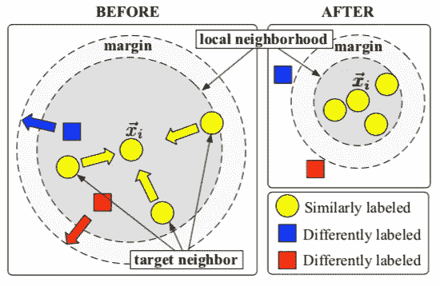
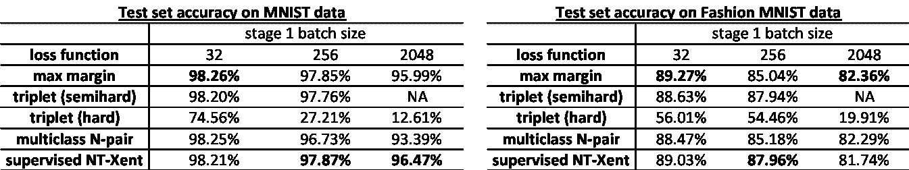

# 对比对比损失函数

> 原文：<https://towardsdatascience.com/contrasting-contrastive-loss-functions-3c13ca5f055e?source=collection_archive---------12----------------------->

## 用于对比学习的四种对比损失函数综合指南

[在之前的一篇文章](/contrastive-loss-for-supervised-classification-224ae35692e7)中，我写了关于监督分类中的对比学习，并在 MNIST 数据集上做了一些实验，发现[科斯拉*等人*提出的两阶段方法。2020 年论文](https://arxiv.org/abs/2004.11362)通过学习具有对比损失的有意义嵌入，确实显示了监督分类任务的显著改进。后来我发现我的实验实际上使用了与科斯拉等人不同的对比损失函数。已提议。尽管共享相同的直觉，即关于它们的标签，显式地对比彼此的例子，但是不同的对比损失函数可以有它们自己的细微差别。在这篇文章中，我将回顾一系列对比损失函数，并比较它们在监督分类任务中的性能。

# 初步的

对比损失函数是为[度量学习](https://en.wikipedia.org/wiki/Similarity_learning)发明的，它旨在学习测量一对对象之间的相似性或距离的相似性函数。在分类的上下文中，期望的度量将使得具有相同标签的一对示例比具有不同标签的一对示例更加相似。深度度量学习涉及深度神经网络，将数据点嵌入到具有非线性的低维空间，然后使用对比损失函数来优化神经网络中的参数。最近的研究项目已经将深度度量学习应用于自我监督学习、监督学习甚至强化学习，例如[对比训练的结构化世界模型(C-SWMs)](https://arxiv.org/abs/1911.12247) 。

为了在深度度量学习的背景下回顾不同的对比损失函数，我使用以下形式化。让𝐱作为输入特征向量，𝑦作为它的标签。设𝑓(⋅)是将输入空间映射到嵌入空间的编码器网络，设𝐳=𝑓(𝐱)是嵌入向量。

# 对比损失函数的类型

这里我按时间顺序回顾四个对比损失函数。我稍微修改了几个函数的名称，以突出它们与众不同的特点。

## 1.最大利润对比损失(Hadsell 等人，2006 年)

最大间隔对比损失函数以一对嵌入向量 **z_i** 和 **z_j** 作为输入。如果它们具有相同的标签( *y_i=y_j* )，那么它们之间的欧几里德距离基本上相等，否则等于[铰链损耗](https://en.wikipedia.org/wiki/Hinge_loss)。它有一个余量参数 *m > 0* 来对具有不同标签的一对样本之间的距离施加一个下限。

## 2.三重态损失(Weinberger 等人，2006 年)

三元组丢失对其标签遵循𝑦_𝑖=𝑦_𝑗和𝑦_𝑖≠𝑦_𝑘.的三元组向量进行操作也就是说，三个矢量中的两个(𝐳_𝐢和𝐳_𝐣)共享相同的标签，而第三个矢量𝐳_𝐤具有不同的标签。在三元组学习文献中，它们分别被称为锚( **z_i** )、正( **z_j** )和负( **z_k** )。三重态损耗定义为:

其中，𝑚也是一个边缘参数，要求锚正和锚负之间的距离增量大于𝑚.这个损失函数的直觉是将负样本推到邻域之外一个余量，同时将正样本保持在邻域内。这是一个很好的图形演示，显示了原始论文中三重态损失的影响:

使用三重态损失的训练前后(来自 Weinberger 等人，2005)

**三重开采**

根据三联体丢失的定义，在任何训练之前，三联体可能有以下三种情况:

*   **简单**:损失为 0 的三元组，因为负数已经比正数离锚点多了一个裕量
*   **:三连音，其中负数比正数更接近锚点**
*   ****半硬**:三连音，负片位于页边**

**三重损失已经被用于在[面网中学习面的嵌入(Schroff *等人*)。2015)论文](https://arxiv.org/abs/1503.03832)。施罗夫*等人*。认为三元组挖掘对于模型性能和收敛性至关重要。他们还发现，最难的三元组在训练早期导致局部最小值，特别是导致模型崩溃，而半难的三元组产生更稳定的结果和更快的收敛。**

## **3.多类 N 对损耗(Sohn 2016)**

**多类 N 对损失是三重损失的推广，允许在多个负样本之间进行联合比较。当应用于一对阳性样品时，𝐳_𝐢和𝐳_𝐣与 2𝑁样品具有相同的标签(𝑦_𝑖=𝑦_𝑗),计算公式如下:**

****

**，其中 **z_i** **z_j** 为内积，当两个向量都有单位范数时等价于余弦相似。**

**如下图所示，N 对丢失同时将 *2N-1* 负样本**推开**，而不是一次一个:**

****

**三重态损失(左)及其延伸(N+1)-三重态损失(右)(来自 Sohn 2016)**

**通过一些代数运算，多类 N 对损耗可以写成如下:**

****

**这种形式的多类 N 对损失帮助我们引入下一个损失函数。**

## **4.监督 NT-Xent 损失(Khosla 等人，2020 年)**

**我们先来看一下 NT-Xent loss 的自监督版本。NT-Xent 是由[陈*等人*杜撰的。2020，是“归一化温度标度交叉熵损失”的简称。它是对多类 n 对损耗的修改，增加了温度参数(𝜏)来衡量余弦相似性:](https://arxiv.org/abs/2002.05709)**

****

**自我监督 NT-Xent 损失**

**陈*等*发现一个合适的温度参数可以帮助模型从硬底片中学习。此外，他们还表明，最佳温度在不同的批次大小和训练时期数上有所不同。**

**科斯拉*等人*。用于监督学习的后来扩展的 NT-Xent 损失:**

****

**监督 NT-Xent 损失**

# **实验结果**

**接下来，我评估这些对比损失函数是否可以帮助编码器网络学习数据的有意义的表示，以帮助分类任务。遵循与我前一篇文章中[完全相同的实验设置，使用小批量(32)和低学习率(0.001)，我发现除了具有硬负挖掘的三重损失之外，所有这些对比损失函数都优于没有阶段 1 预训练的 MLP 基线:](https://docs.google.com/presentation/d/1iB59aKvWtjeN2ZYlPih2ygH8R4J8YS6k3iGQJNfukeE/edit?usp=sharing)**

****

**在 MNIST 和时尚 MNIST 数据集的保留测试集上的性能(准确性)(来自具有硬负挖掘的三元组的结果未显示)。**

**这些结果证实了在网络的编码器部分的预训练中使用对比损失函数对于后续分类的益处。它还强调了三重态开采对三重态损失的重要性。具体来说，半硬开采在这些实验中效果最好，这与 FaceNet 的论文一致。**

**Chen *等人* (SimCLR)和 Khosla *等人*都使用非常大的批量和更高的学习率来获得更好的 NT-Xent 损失性能。接下来，我用不同的批量 32、256 和 2048 进行了实验，学习率分别为 0.001、0.01 和 0.2。**

****

**结果表明，对于所有损失函数，性能随着批量的增加而降低。虽然半硬负挖掘的三重丢失在中小批量上表现非常好，但它非常占用内存，我的 16G RAM 不可能处理 2048 的批量。与同类产品相比，受监督的 NT-Xent 损失确实在较大批量上表现得相对更好。如果我要优化温度参数，受监督的 NT-Xent 可能还有改进的空间。我用的温度是 0.5。**

**接下来，我检查了使用对比损失函数学习的嵌入的 PCA 投影，以查看它们是否在预训练阶段学习了任何信息表示。**

****

****MNIST 数据集上不同对比损失函数和批量大小的编码网络学习嵌入的 PCA 投影。**从左到右:通过 1)最大边际损失学习的预测；2)半硬开采的三重损失；3)多类 N 对损失；4)监督 NT-Xent 丢失。从上到下:批量大小为 32，256，2048。**

****

****显示 MNIST 数据集模型学习的 PCA 投影密度的联合图。**从左至右:通过 1)最大边际损失学习的预测；2)半硬开采的三重损失；3)多类 N 对损失；4)监督 NT-Xent 丢失。从上到下:批量大小为 32，256，2048。**

**从彩色 PCA 投影和它们的密度来判断，我们可以看到最大余量和监督 NT-Xent 为每个类学习更紧密的聚类，而来自半硬挖掘的三重丢失的聚类最大程度地扩大，但仍然是独特的。随着批量大小的增加，在多类 N 对损失和最大边际损失中，表示质量退化，但在监督 NT-Xent 损失中不那么严重，这表明这种损失对于更大的批量大小确实更稳健。**

**下面是在更困难的时尚 MNIST 数据集上的学习表示的 PCA 投影。总的来说，它显示了与 MNIST 相似的观察结果。**

****

****不同对比损失函数和批量大小的编码网络学习到的嵌入在时尚 MNIST 数据集上的 PCA 投影。**从左至右:通过 1)最大边际损失学习的预测；2)半硬开采的三重损失；3)多类 N 对损失；4)监督 NT-Xent 丢失。从上到下:批量大小为 32，256，2048。**

# ****总结****

**对比损失函数对于通过学习有用的表示来改进监督分类任务非常有帮助。最大利润和监督 NT-Xent 损失在实验数据集(MNIST 和时尚 MNIST)中表现最佳。此外，NT-Xent 损失对于大批量是稳健的。**

**值得注意的是，这里回顾的所有对比损失函数都具有超参数，例如输入向量的裕度、温度、相似性/距离度量。这些超参数可能会严重影响其他研究的结果，因此应该针对不同的数据集进行优化。**

**这些实验所用的代码可以在这里找到:[https://github.com/wangz10/contrastive_loss](https://github.com/wangz10/contrastive_loss)**

# **参考**

*   **[哈德塞尔，r .，乔普拉，s .&纽约勒村(2006 年 6 月)。通过学习不变映射进行降维。](http://yann.lecun.com/exdb/publis/pdf/hadsell-chopra-lecun-06.pdf)2006 年 IEEE 计算机学会计算机视觉和模式识别会议(CVPR’06)(第 2 卷，第 1735-1742 页)。IEEE。**
*   **[温伯格，K. Q .，布利泽，j .，&索尔，L. K. (2006)。用于大间隔最近邻分类的距离度量学习。](https://papers.nips.cc/paper/2795-distance-metric-learning-for-large-margin-nearest-neighbor-classification.pdf)神经信息处理系统的进展(第 1473-1480 页)。**
*   **[f .施罗夫，d .卡列尼琴科，&j .菲尔宾(2015)。Facenet:人脸识别和聚类的统一嵌入。](https://arxiv.org/abs/1503.03832)IEEE 计算机视觉和模式识别会议论文集(第 815-823 页)。**
*   **[Sohn，K. (2016)。具有多类 n 对损失目标的改进深度度量学习。](https://papers.nips.cc/paper/6200-improved-deep-metric-learning-with-multi-class-n-pair-loss-objective)神经信息处理系统的进展(第 1857-1865 页)。**
*   **[t .陈、s .科恩布利思、m .&辛顿 G. (2020)。视觉表征对比学习的简单框架。](https://arxiv.org/pdf/2002.05709.pdf) arXiv 预印本 arXiv:2002.05709**
*   **[Khosla，p .，Teterwak，p .，Wang，c .，Sarna，a .，Tian，y .，Isola，p .，… & Krishnan，D. (2020)。监督对比学习。arXiv 预印本 arXiv:2004.11362。](https://arxiv.org/pdf/2004.11362.pdf)**