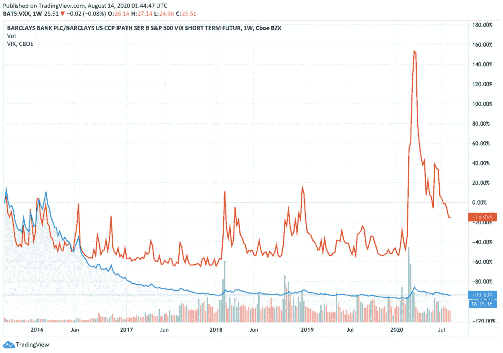
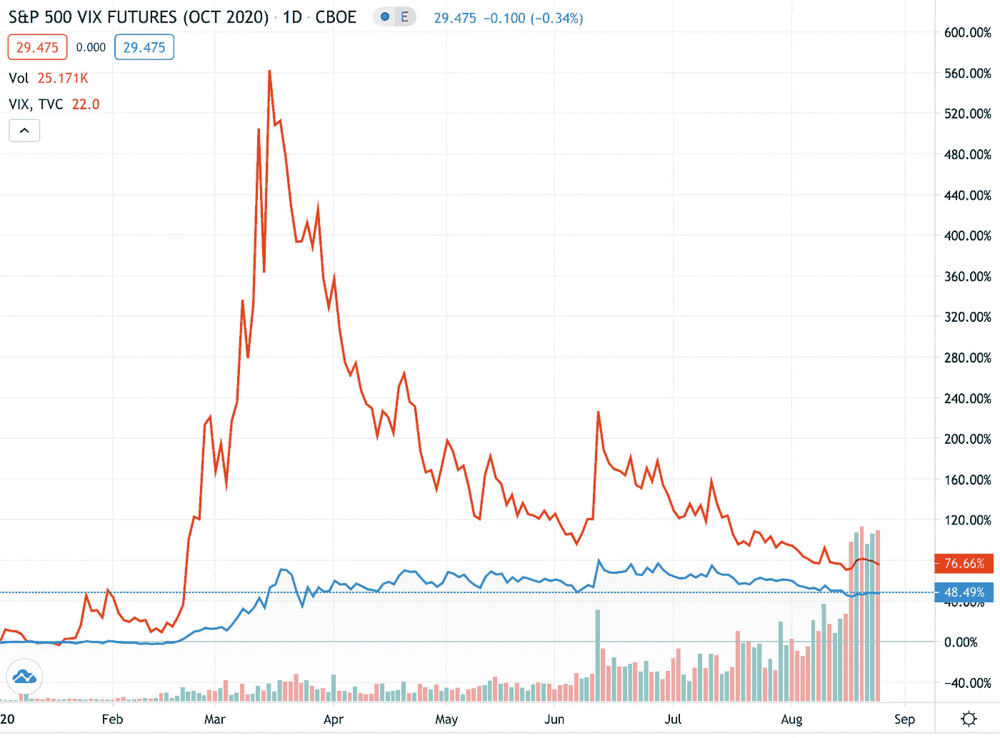
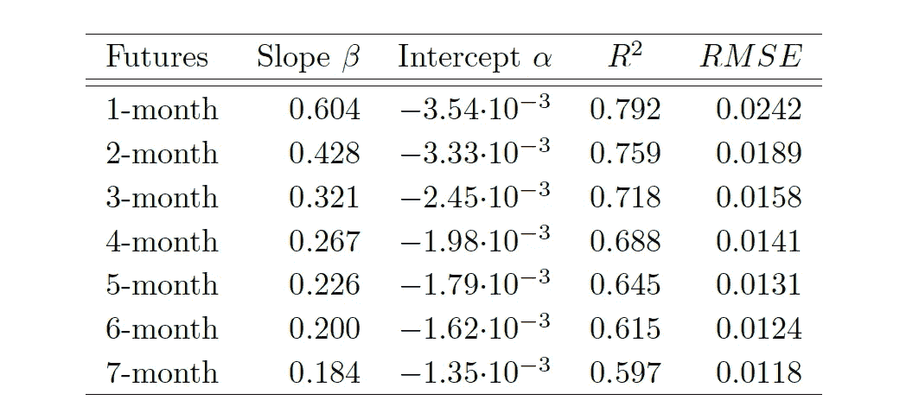
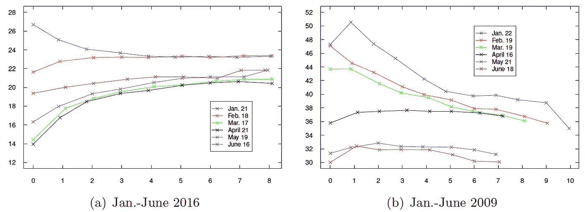
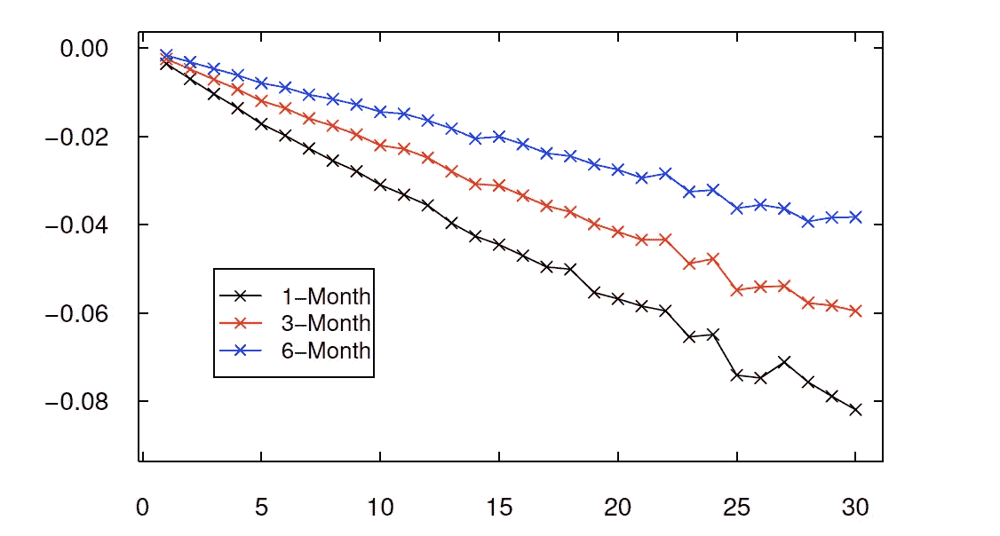

# 对比 VIX 和 VIX 期货的价格动态

> 原文：<https://towardsdatascience.com/contrasting-the-price-dynamics-of-the-vix-and-vix-futures-cbb42e889f4f?source=collection_archive---------28----------------------->

## 期货市场

## 交易 VIX 期货之前你需要知道什么

蒂姆·斯蒂夫在 [Unsplash](https://unsplash.com/s/photos/mountain?utm_source=unsplash&utm_medium=referral&utm_content=creditCopyText) 上的照片

一个最广泛认可的预期市场波动指标是 CBOE 波动指数(VIX)。直接投资 VIX 的优势是显而易见的，但实际上 VIX 是不可直接交易的。

# 下行保护的 VIX 风险敞口

为了说明持有 VIX 债券的好处，可以考虑一下 2011 年标准普尔下调美国信用评级的事件。2011 年 4 月 18 日，S&P 对美国信用评级持负面展望的消息传出。如图 1(a)所示，在 2011 年 8 月 5 日官方降级后的几个月里，仅持有 SPDR 标准普尔 500 交易所交易基金(SPY)的投资组合将继续下跌约 10%。

(a)2011 年 4 月 1 日至 2011 年 9 月 30 日，以及(b)2014 年 1 月 1 日至 2014 年 12 月 31 日期间，100%投资于 SPY，90%投资于 SPY，10%投资于 VIX 的投资组合的历史投资组合价值。

(a)2011 年 4 月 1 日至 2011 年 9 月 30 日，以及(b)2014 年 1 月 1 日至 2014 年 12 月 31 日期间，100%投资于 SPY，90%投资于 SPY，10%投资于 VIX 的投资组合的历史投资组合价值。

相比之下，一个混合了间谍(90%)和 VIX (10%)的假设投资组合在降级期间将保持稳定，最终获得正回报。图 1(b)显示了 2014 年同一对投资组合。

两者都获得了大致相同的 15%的回报，尽管《间谍》一书明显比《间谍》和 VIX 的投资组合更不稳定。VIX 股市上涨应对了大规模的下跌(例如 2014 年 10 月 15 日)，对投资组合的价值产生了稳定效应。

这个例子激发了对直接跟踪 VIX 和其他指数的交易策略的研究，或者实现任何关于指数或市场因素的预先指定的暴露。

# 获取 Vol 曝光

相反，波动性敞口是通过使用 VIX 期货或期权以及一些交易所交易基金/票据(ETF/Ns)来实现的。众所周知，VIX ETF/etn 无法一对一地跟踪 VIX，并持续带来负回报。

VXX(蓝色)明显偏离 VIX(红色)，在过去几年中损失了 93%以上。

但是直接持有 VIX 期货怎么样呢？

在任何时间点，市场上都有少量合约交易，期限从 1 个月到 10 个月不等。

这里先来看看单一 VIX 期货合约与 VIX 期货合约的不同回报动态:

VIX(红色)和 2020 年 10 月到期的 VIX 期货(蓝色)的累积收益时间序列。

在我们的[论文](https://ssrn.com/abstract=3412132)中，我们讨论了 VIX 期货和标的指数的价格动态，并构建了 VIX 期货的静态和动态投资组合以跟踪该指数。除了推导和实施最佳跟踪策略，我们还检查跟踪投资组合的有效性。

# 数据

我们从分析 VIX 期货相对于现货 VIX 的价格动态开始。VIX 期货的历史价格数据来自 Quandl。我们已经将 Quandl 的数据与直接来自 CBOE 的数据进行了对比。对于现货 VIX 数据以及相关的 etn，我们使用雅虎！金融。

编译后，我们的数据集由从 2004 年 3 月 26 日(VIX 期货开始交易的第一天)到 2017 年 1 月 27 日的全部收盘价历史组成。但是，我们选择只分析从 2011 年 1 月 3 日(2011 年的第一个交易日)到 2016 年 12 月 30 日，即从 2011 年到 2016 年的 6 年时间。

这个数据量可能足以避免过度拟合，并且足够新以理解 VIX、期货和 VXX 之间的动态。当然，人们可以用更近的数据来遵循我们的程序。

整个样本期包含 1510 个交易日的数据。此外，在样本集的任何一天，都有 7 到 9 个期货合约可用。特别是，有 15 天只有 7 个期货合约可用，278 天只有 8 个期货合约可用，以及 1217 天有整整 9 个月的合约可用。

在这段时间内，期货合约总是连续几个月(从 1 个月合约开始)。换句话说，当有 N 个期货合约可供交易时，它们总是由 N 个前月组成。

例如，如果当前交易日期是 1 月初的某个时间(在 1 月期货到期日之前)，并且有 7 个期货合同可用于交易，则期货合同的到期日将是连续的 1 月到 7 月。数据集的这些特征符合 CBOE 协议。他们表示，他们目前将列出最多 9 个月的近期交易。然而，在我们的分析中，我们排除了第八个月和第九个月的合约，因为人们并不总是可以交易第八个月或第九个月的合约。

这允许我们使用全部 1510 天的数据，并且避免了消除只有 7 或 8 个期货交易的 15 + 278 = 293 天的需要。

# 针对 VIX 的倒退

表 1:1 个月至 7 个月期货的一天收益对现货 VIX 的一天收益进行回归的回归系数和拟合优度的总结。

我们观察到所有期货的高 R 值，表明它们与现货高度相关。期限较短的期货有较高的 R 值。这可以解释为

(I)期货价格趋向于接近到期日的现货价格，

㈡长期合同的流动性不如短期合同。

斜率系数都具有统计显著性，并且小于 1，这是直观的，因为期货回报往往比现货回报波动性小。负截距具有统计学意义，表明即使现货价格不动，期货价格也会下跌。

原因在于 VIX 期货的期限结构，它通常在到期日增加。即使现货价格不动，期货价格也倾向于下降，以匹配到期日的现货价格，从而形成负截距。

# 期限结构

(a) 2016 年和(b) 2009 年 1 月至 6 月的期限结构。图例显示了构建期限结构的日期。

如上图所示，VIX 市场的典型案例是一条上升的凹形期货曲线(左图)。然而，2016 年 1 月，VIX 价格飙升，对未来波动性的预期也是如此。像这样的峰值会导致 VIX 期货的期限结构反转，产生一条递减的凸形期货曲线。在 2009 年初(右图)，期货价格处于非常高的水平，期限结构显示出不同的形状属性。

# **保持时间的影响**

当我们对长期持有的期货回报和现货回报进行回归时，新的模式出现了。当我们计算回报时，我们使用不同长度的不相交区间，这意味着对于更长的时间范围，我们有更少的数据点。

我们绘制了 1 个月期货回报相对于 1 天回报(左)和 10 天回报(右)的 VIX 回报的回归曲线，绘制在相同的 x -y 轴刻度上。红色的 x 是成双成对的回报，而黑色的线是最好的 t 线。人们注意到，10 天的回报要大得多，因此比 1 天的回报更不稳定。

然而，对于两个持有期，期货回报比相应的现货回报波动性小。准确地说，我们发现现货的 1 天收益率在-26.96%和 50%之间变化，而 10 天收益率在-39.76%和 148.06%之间变化(即持有期越长，波动性越大)。

另一方面，对于 1 个月的期货，1 天的收益率在-20.81%和 35.83%之间变化，而 10 天的收益率在-36.91%和 88.89%之间变化(即期货收益率的波动性小于相应的现货收益率)。

在上图中，10 天回报率的斜率略高于 1 天回报率的斜率。此外，对于 1 天的回报，散点图更紧密地绑定到最佳拟合线，表明比 10 天的回报观察到的拟合更好。然而，这种模式并不普遍适用。随着保持时间的延长，在 R 或斜率中没有可辨别的模式。

这可以通过观察 R 或斜率与保持时间的关系图来证明。我们在这里省略了这样的图，因为没有增加或减少预测能力(以 R 衡量)或杠杆的清晰模式，这是复制图中任何到期合约的即期回报所必需的。(杠杆可以用斜率的倒数来衡量。)

另一方面，如果我们 x 持有期，增加合同的到期时间，我们看到预测能力下降，斜率下降。(因此，复制现货需要增加杠杆。)我们在表 2 中针对多个不同的持有期(1、5、10 和 15 天)证明了这一点。

在上半部分，我们给出了相对于现货回报的期货回报回归的斜率系数，在下半部分，我们显示了 R 值。通过查看任一半中的行，可以注意到报告的统计数据减少了。这再次证实了我们之前的观察，即短期期货比长期期货更接近现货。

事实上，在 15 天的时间里，结果表明，跟踪 1 个月期货需要大约 1.6 倍的杠杆，而 7 个月期货需要 7.2 倍的杠杆。这些隐含的杠杆值是通过计算斜率的倒数(分别为 0.622 和 0.139)获得的。7 个月期货的杠杆相当大，由于交易成本或交易限制，在市场上可能不可行。

表 2:对期货收益和 VIX 回归的斜率和 R 的总结

接下来，我们绘制了许多不同持有期(从 1 天到 30 天)的 1 个月期货(黑色)、3 个月期货(红色)和 6 个月期货(蓝色)的回归截距。很明显，随着持有期的延长，截距变得越来越负。

此处报告的所有截距(以及之前的斜率)在 1%显著性水平上具有统计显著性。因此，存在统计上的显著差异，并且随着保持期的延长而继续恶化。

这证实了我们已经讨论过的一个属性:相对于现货回报，VIX 期货往往表现不佳并亏损。更负的截距表明这种表现不佳在更长的时间内会恶化。

# 参考

T.Leung 和 B. Ward，**用 VIX 期货跟踪 VIX:投资组合构建和业绩**[[pdf](https://www.google.com/url?q=https%3A%2F%2Fssrn.com%2Fabstract%3D3412132&sa=D&sntz=1&usg=AFQjCNH-QAPyzjp9WuonmwO3BBHqrEZZpg)；[链接](https://www.google.com/url?q=https%3A%2F%2Fwww.worldscientific.com%2Fworldscibooks%2F10.1142%2F11727&sa=D&sntz=1&usg=AFQjCNFksh7UkdTHSRqYwg2Lf5epEl3RIw)，载于*应用投资研究手册，* J. Guerard 和 W. Ziemba 合编。，世界科学出版公司，印刷中，2020 年

更多信息，请关注/联系 Linkedin:[https://www.linkedin.com/in/timstleung/](https://www.linkedin.com/in/timstleung/)