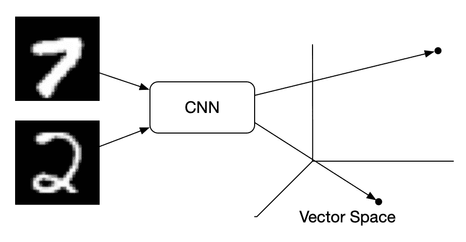
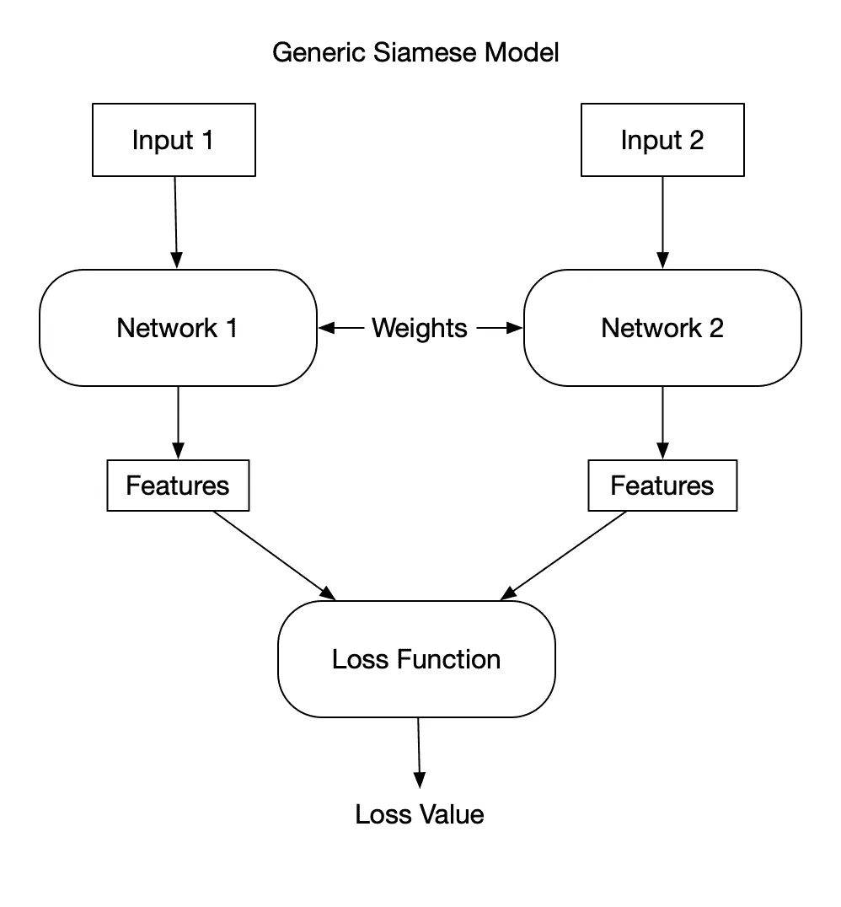
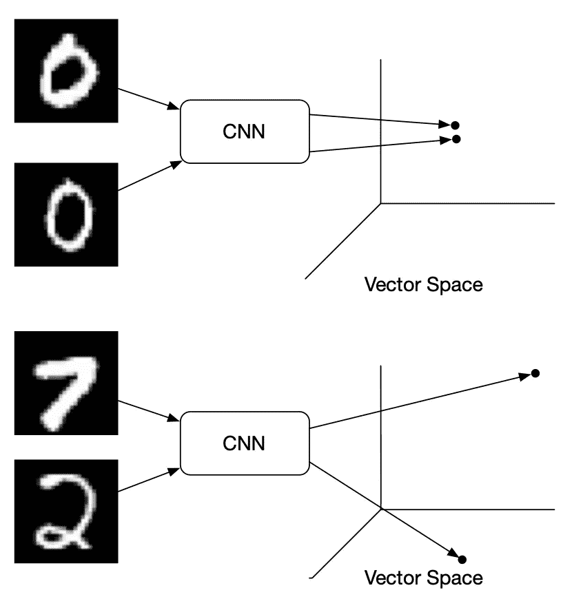
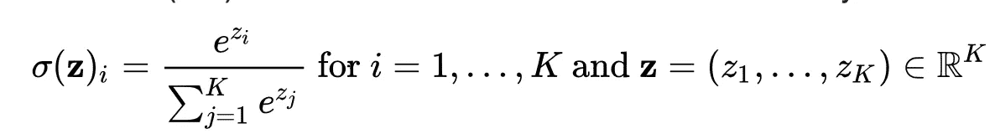
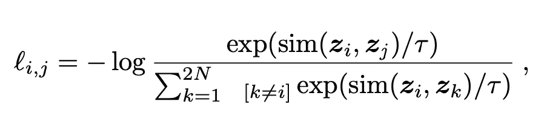

# 对比损失解释

> 原文：<https://towardsdatascience.com/contrastive-loss-explaned-159f2d4a87ec?source=collection_archive---------2----------------------->



对比损失最近在一些论文中使用，显示了无监督学习的最新成果。 [MoCo](https://arxiv.org/abs/1911.05722) 、 [PIRL](https://arxiv.org/abs/1912.01991) 、*和 [SimCLR](https://arxiv.org/abs/2002.05709) 都遵循非常相似的使用具有对比损耗的连体网络的模式。当阅读这些论文时，我发现总的想法非常简单，但是从数学到实现的翻译没有得到很好的解释。正如机器学习论文中经常出现的情况一样，一旦你掌握了主要思想，数学就不难了。我将尝试清楚地解释对比损失是如何工作的，并使用 Python 和 Numpy 提供一个完整的实现。*

## 暹罗网络

在深入了解细节之前，先谈谈暹罗网络(也称为**孪生网络**，但这不是一个广泛使用的术语)会有所帮助。训练连体网络时，会对 2 个或更多输入进行编码，并比较输出特征。这种比较可以在[中以多种方式进行](https://gombru.github.io/2019/04/03/ranking_loss/)。一些比较是三重损失、[具有交叉熵损失的伪标记](https://arxiv.org/abs/2001.07685)和对比损失。

连体网络通常显示为共享权重的两个不同的编码网络，但实际上，在进行反向传播之前，同一个网络只使用了两次。



## 例子

让我们来看一个例子，在这个例子中，我们想从 MNIST 数中提取特征。MNIST 数的每个图像应该被编码成与来自相同类别的图像的向量接近的向量。相反，不同的数字应该编码成彼此远离的向量。



嵌入向量空间的正(上)样本和负样本

由于我们有 MNIST 输入的分类标签，因此可以使用常规网络和分类交叉熵损失。问题是当我们没有很好标记的数据时，这是通常的情况。世界上没有标签的数据比有标签的数据多得多。这就是对比损失的来源。

对比损失将网络的输出作为一个正例，并计算其与同类样本的距离，并将其与到负例的距离进行对比。换句话说，如果正样本被编码成相似(更接近)的表示，而负样本被编码成不同(更远)的表示，则损失较低。

这是通过取向量的余弦距离并将所得距离视为来自典型分类网络的预测概率来实现的。大意是，你可以把正例的距离和反例的距离当作输出概率，并使用交叉熵损失。

执行监督分类时，网络输出通常通过 softmax 函数运行，然后是负对数似然损失。

让我们把这个说得更具体些。这个例子将有两个相似的向量和一个不相似的向量的数组。p1 和 p2 是正向量，p2 是 P1 的稍微修改版本。Neg 是相异向量的数组。

## 示例设置

```
import numpy as npp1 = np.array([-0.83483301, -0.16904167, 0.52390721])
p2 = np.array([-0.83455951, -0.16862266, 0.52447767])
neg = np.array([
 [ 0.70374682, -0.18682394, -0.68544673],
 [ 0.15465702,  0.32303224,  0.93366556],
 [ 0.53043332, -0.83523217, -0.14500935],
 [ 0.68285685, -0.73054075,  0.00409143],
 [ 0.76652431,  0.61500886,  0.18494479]])
```

请注意，我在这里使用了预归一化向量(又名单位向量)。

## 计算距离

为了测量两个向量有多相似，我们需要一种测量距离的方法。在二维或三维中，欧几里德距离(“普通”或直线距离)是测量两点之间距离的最佳选择。然而，在一个大维度空间中，通过欧几里德度量，所有点往往相距很远。在更高维度中，向量之间的角度是更有效的度量。余弦距离测量向量之间角度的余弦值。相同向量的余弦为 1，而正交向量和相反向量分别为 0 和-1。更多的相似向量将导致更大的数量。计算余弦距离是通过取向量的点积来完成的。当不使用单位向量时，你要么将向量归一化，要么将乘积除以归一化向量。

```
# P1 and p2 are nearly identically, thus close to 1.0
pos_dot = p1.dot(p2)
pos_dot -> 0.999999716600668# Most of the negatives are pretty far away, so small or negative
num_neg = len(neg)
neg_dot = np.zeros(num_neg)
for i in range(num_neg):
    neg_dot[i] = p1.dot(neg[i])neg_dot -> [-0.91504053,  0.30543542, -0.37760565, -0.44443608, -0.64698801]
```

## Softmax

softmax 函数获取一个实数向量，并强制它们在 0 到 1 的范围内，所有数字之和等于 1。softmax 的另一个好特性是其中一个值通常比其他值大得多。计算类别交叉熵的损失时，第一步是取值的 softmax，然后是标记类别的负对数。



Softmax，数学版

让我们把 pos_dot 的 softmax 加上 neg_dot 向量。

```
# make a vector from the positive and negative vectors comparisons
v = np.concatenate(([pos_dot], neg_dot))# take e to the power of each value in the vector
exp = np.exp(v)# divide each value by the sum of the exponentiated values
softmax_out = exp/np.sum(exp)softmax_out -> [0.4296791, 0.0633071, 0.2145353, 0.1083572, 0.1013523, 0.0827687]
```

我们的正例(0.4296791)现在比随机的大得多，而且都大于 0 小于 1。

## 对比损失

最后，我们得到了本文的重点，对比损失。



对比损失函数

对比损失看起来很像 softmax 函数。这是因为它增加了向量相似性和温度归一化因子。相似度函数就是我们之前讲过的余弦距离。另一个区别是分母中的值是从正样本到负样本的余弦距离。与 CrossEntropyLoss 差别不大。这里的直觉是，我们希望我们的相似向量尽可能接近 1，因为-log(1) = 0，这是最优损失。我们希望反例接近 0，因为任何非零值都会降低相似向量的值。

```
# Contrastive loss of the example values
# temp parameter
t = 0.07# concatenated vector divided by the temp parameter
logits = np.concatenate(([pos_dot], neg_dot))/t#e^x of the values
exp = np.exp(logits)# we only need to take the log of the positive value over the sum of exp. 
loss = - np.log(exp[0]/np.sum(exp))
loss -> 4.9068650660314756e-05
```

这就是全部了。对比损失可以被实现为交叉熵损失的修改版本。对比损失，如三重损失和磁损失，用于映射对输入项的相似性建模的向量。这些映射可以支持许多任务，如无监督学习、一次性学习和其他距离度量学习任务。我希望这篇文章能帮助你更好地理解对比损失。