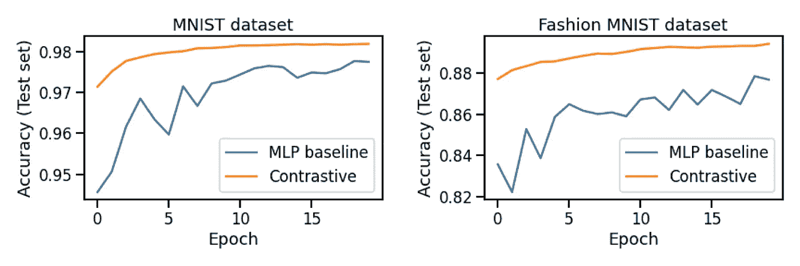
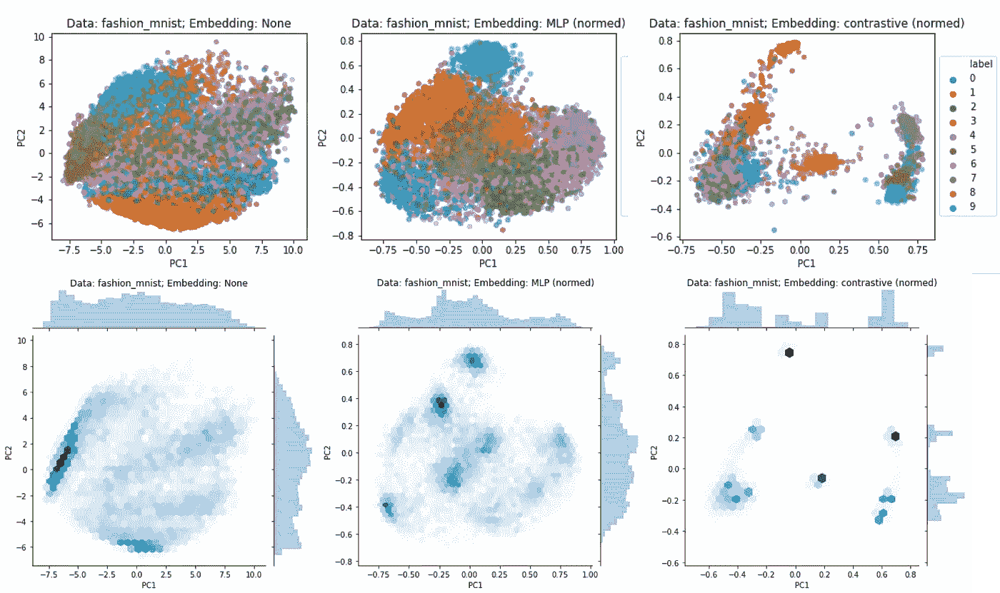

# 监督分类的对比损失

> 原文：<https://towardsdatascience.com/contrastive-loss-for-supervised-classification-224ae35692e7?source=collection_archive---------10----------------------->

## 对比交叉熵损失和对比损失

最近，来自谷歌研究院和麻省理工学院的研究人员(Khosla 等人)发表了一篇名为“有监督的对比学习”的论文[。在对比学习的基础上，提出了一种新的损失函数“对比损失”来训练有监督的深度网络。他们证明，在](https://arxiv.org/abs/2004.11362) [ImageNet](http://www.image-net.org/) 数据集上，对比损失在一系列神经架构和数据增强机制的分类中的表现明显优于传统的交叉熵损失。

我发现这篇论文特别有趣，因为它的思想非常简洁，可能是监督分类任务甚至回归的一种简单而通用的改进。在进入细节之前，让我们首先回顾一下用于监督分类的损失函数(又名目标函数)的基础知识。

## 交叉熵损失

交叉熵，也称为对数损失、逻辑损失，可以说是分类中最常用的损失函数。顾名思义，它来自信息论，信息论测量两个概率分布之间的互熵， *p* 和 *q* 。它也与[kull back-lei bler 散度](https://en.wikipedia.org/wiki/Kullback%E2%80%93Leibler_divergence)密切相关，可以写成熵 *H(p)* 与从 *p* 到 *q* 的 KL 散度之和:

*H(p，q) = H(p) + D_{KL}(p||q)*

当用作分类的损失函数时，可以使用交叉熵来度量基础真实类分布和预测类分布之间的差异:

交叉熵损失

其中 *M* 是类的数量 *c* 和 *y_c* 如果类标签是 *c* 和*p(y = c |****x****)*是在给定输入特征向量 ***x 的情况下分类器认为标签应该是 *c* 的概率***

## 对比损失

对比损失广泛应用于无监督和自监督学习中。这个损失函数最初是由 Yann LeCun 的小组的 [Hadsell 等人在 2016 年](http://yann.lecun.com/exdb/publis/pdf/hadsell-chopra-lecun-06.pdf)开发的，它作用于成对的样本，而不是单个样本。它为每对样本定义了一个二进制指示符 *Y* ，表示它们是否应该被视为不相似(如果 ***x_1*** 、 ***x_2*** 被视为相似，则 Y = 0)；否则 Y=1)，以及一个可学习的距离函数*D _ W(****x _ 1****，****x _ 2****)*在一对样本 ***x_1*** ， ***x_2*** 之间，由权重 *W* 参数化对比损失定义为:

对比度损失函数

，其中 *m > 0* 为余量。裕度定义了样本嵌入空间周围的半径，使得不同的样本对仅在距离 *D_W* 在裕度内时对对比损失函数有贡献。

直观地，该损失函数鼓励神经网络学习嵌入，以将具有相同标签的样本彼此靠近放置，同时在嵌入空间中使具有不同标签的样本远离。

## 自我监督学习和监督学习的对比损失

在标签不可用并且目标是学习数据的有用嵌入的自我监督设置中，对比损失与数据扩充技术结合使用，以创建共享相同标签的扩充样本对。就像科斯拉论文中的插图一样，比熊犬图片的不同放大应该彼此靠近，远离任何其他图片，无论是其他狗还是猫。然而，正如作者指出的，这种通过自我监督对比损失学习的嵌入不一定对监督学习者有用，因为引入了假阴性:一只比熊犬的嵌入也应该与其他狗的嵌入在同一邻域，无论是柯基犬还是西班牙猎犬。

为了使对比损失适应监督学习，科斯拉和他的同事开发了一个两阶段程序，将标签和对比损失的使用结合起来:

*   阶段 1:使用对比损失来训练编码器网络，以嵌入由它们的标签引导的样本。
*   阶段 2:冻结编码器网络，并在已学习的嵌入之上学习分类器，以使用交叉熵损失来预测标签。

最初研究中的实验是在 ImageNet 上进行的。作者还评估了不同的数据增强选项和各种类型的最新架构，如 VGG-19 和 ResNets。

# **MNIST 和时尚 MNIST 数据集上的实验**

我不是计算机视觉专家，我更感兴趣的是，对于通用分类问题，所提出的监督对比损失是否优于交叉熵。为了在我的笔记本电脑上运行比较典型损失函数和对比损失函数的有效性的实验，我选择了小得多的 MNIST 和时尚 MNIST 数据集。我还忽略了像素之间的空间关系，避免使用任何卷积层来模拟表格数据集。

我在接下来的实验中使用的架构非常简单，两个密集的隐藏层，每个都有 256 个神经元，通过泄漏的 ReLU 激活连接。最后一个隐藏层的输出被归一化，以将输出向量定位在单位超球面中。这种架构对于用对比损失和 MLP 基线训练的编码器是相同的。最后的分类层由对应于 10 个类别的 10 个单元组成。

遵循 Khosla 论文提出的相同过程:编码器在阶段 1 中使用对比损失进行预训练，然后在阶段 2 中被冻结以仅训练分类器。如下所示，在两个数据集上，具有监督对比损失的模型确实优于具有交叉熵损失的 MLP 基线，具有完全相同的架构。这种改善在时尚的 MNIST 上更高，一个比 MNIST 更困难的任务。

**在 MNIST 和时尚 MNIST 数据集的保留测试集上的性能(准确性)。**

另一个有趣的观察是，对于有监督对比损失的模型，学习曲线更平滑，这可能是由于预先训练的表示。

为了证实性能的提高是由于更好的嵌入空间，我使用交叉熵检查了来自 MLP 基线和使用对比损失学习的嵌入的 PCA 投影。作为阴性对照，我还检查了没有任何嵌入的原始数据空间的 PCA 投影。

**模型学习到的嵌入(或无嵌入)的 PCA 投影。**从左到右:原始数据空间；基线 MLP 的最后一个隐藏层；使用对比损失学习的投影

如散点图所示，MLP 模型和对比模型都比原始数据更好地聚类具有相同标签的样本，但是对比嵌入中的聚类更紧密。为了更加突出这一点，我绘制了 PCA 投影的密度，从对比嵌入中可以清楚地看到 10 个不同的聚类:

**显示模型学习的 PCA 投影密度的联合图。**从左到右:原始数据空间；基线 MLP 的最后一个隐藏层；使用对比损失学习的投影

上面的图是在 MNIST 数据上生成的，类似的观察结果也可以在时尚 MNIST 数据集上持续存在，尽管一些类混合在一起。

**不同模特在时尚 MNIST 数据集上学习的表征的主成分分析。**

总之，我的实验清楚地再现了原始研究的发现，即监督对比损失在分类任务中优于交叉熵。事实上，它还可以在更小的数据集上工作，无需数据扩充，也无需使用特定领域的架构，如卷积，这非常令人鼓舞。这表明监督对比损失可以作为任何监督任务的通用技术。我期待将其应用于未来的 ML 任务，并探索其在回归中的适用性。

这些实验使用的代码可以在这里找到:【https://github.com/wangz10/contrastive_loss 

# 参考

*   [Hadsell 等人(2006): **通过学习不变映射进行维数约简。**](http://yann.lecun.com/exdb/publis/pdf/hadsell-chopra-lecun-06.pdf)
*   [科斯拉等人(2020): **监督对比学习**。](https://arxiv.org/abs/2004.11362)
*   [tensor flow 中的三元组丢失和在线三元组挖掘](https://omoindrot.github.io/triplet-loss)
*   [深度学习中的回归:连体和三联体网络](https://sites.icmc.usp.br/moacir/p17sibgrapi-tutorial/2017-SIBGRAPI_Tutorial-DLCV-Part2-Regression-Deep-Learning-Siamese_and_Triplet_Nets.pdf)