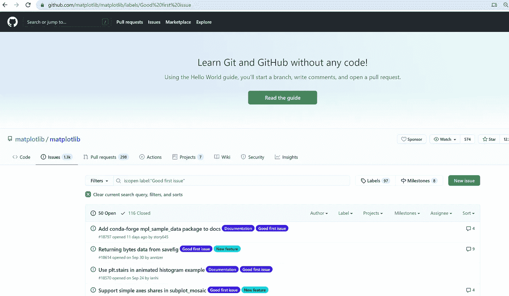

# 为初学者贡献开源

> 原文：<https://towardsdatascience.com/contributing-to-open-source-for-beginners-cfe98d0a2689?source=collection_archive---------45----------------------->

## [入门](https://towardsdatascience.com/tagged/getting-started)

## *我是如何在短短几周内从几乎不知道如何使用 GitHub 变成为熊猫做贡献的*

# 关于开源的一句话

让我们从什么是开源开始:可以自由修改和重新发布的代码，它通常是合作开发的。

数据科学中使用的许多工具都是开源的，从 pandas 和 matplotlib 等 Python 包到 Hadoop 等程序，任何人都可以免费访问它们的事实极大地促进了该领域的访问。了解到这些工具的广泛使用和有效性，令人惊讶的是，志愿者们提供了这些工具，并且仍然在业余时间定期维护它们。

源代码管理允许多人同时在同一个代码库上工作。照片由[扬西·敏](https://unsplash.com/@yancymin?utm_source=medium&utm_medium=referral)在 [Unsplash](https://unsplash.com?utm_source=medium&utm_medium=referral) 拍摄

# 我该如何开始？

我第一次有了为开源做贡献的想法是在听 podcas t 的[线性题外话时。以前，我认为为开源做贡献是软件工程师的专利，但在他们的节目中，他们涵盖了数据科学开源生态系统，我意识到我使用的许多工具都是该生态系统的一部分。](http://lineardigressions.com/episodes/2020/6/28/the-data-science-open-source-ecosystem)

然而，当时似乎仍然很难想象所有的碎片是如何组合在一起的。我看了几个 GitHub 库，这似乎有点违背直觉，所以我把这个想法放在后面，但把它藏在心里，作为我将来想做的事情。

然后到了九月，我看到了一条关于 [Hacktoberfest](https://hacktoberfest.digitalocean.com/) 的推文，在这个活动中，一个月内，你可以对开源做出 4 点贡献，并在过程中学习。这似乎是一个以有组织的方式尝试的完美机会，所以我报名了。

图片来自[数字海洋](https://www.figma.com/proto/oc9p0mS6A0cAOOhipLT9aV/DODX-959-Hacktoberfest-2020-Brand-Guidelines?node-id=7058%3A0&viewport=-36%2C134%2C0.37746772170066833&scaling=min-zoom)

# 基本资源

我做的第一件事就是跟着一个 GitHub 教程。当然，我以前上传过一些代码，但是我不知道拉请求的来龙去脉，合并冲突，甚至不知道分支是什么。

外面有很多 GitHub 教程，但我看了活动主页上的那个，它真的很有用。这里可以找到[。](https://www.digitalocean.com/community/tutorial_series/an-introduction-to-open-source)

之后，我需要找到几个需要帮助的项目。对我有帮助的是，我发现许多存储库用“好的第一期”或类似的标签来标记初学者可以帮助的问题。你可以在[熊猫](https://github.com/pandas-dev/pandas/labels/good%20first%20issue)、 [numpy](https://github.com/numpy/numpy/labels/good%20first%20issue) 和 [matplotlib](https://github.com/matplotlib/matplotlib/labels/Good%20first%20issue) 中找到例子。

概括地说，你可以去任何 github 仓库，切换到“问题”标签，并根据适当的标签进行过滤。

未决问题列表。来源:[github.com](https://github.com/)

# 我与熊猫和 matplotlib 的经历

我不是软件工程师。如果你找到了这个教程，但也不是，你很幸运，我们还有很多可以做的！一些简单的事情可以从解决文档问题或处理您已经使用过并有经验的特定功能开始。

对于我对数据空间的第一个贡献，我修正了熊猫文档中的代码风格。你可以在这里看到未解决的问题，即文档使用了在 pandas 中不再使用的某些编码风格约定，所以我必须通过工具运行一些 python 文件来重新格式化它们，并合并回主分支。我提出的最后一个 pull 请求可以在这里看到，它需要一些 python 格式的知识，以及从 GitHub 下载和运行一个工具，所以如果你知道如何打开一个 Python 文件和如何安装一些东西，你可以很容易地做一些类似的事情！

我的第二个[问题](https://github.com/matplotlib/matplotlib/issues/18491)来自 matplotlib，需要从文档页面中删除术语表及其所有引用，我认为这是一个简单的任务，但结果是需要在本地构建文档和一些 html。幸运的是，维护人员非常乐于助人，一路指引着我。我的第二个拉动请求以及所有细节可以在这里找到。

# 我在路上学到了什么？

在你点击离开这篇文章之前，我想告诉你一些事情。

1.  **开源维护者都是不可思议的人**。他们是志愿者，但是他们非常乐于助人和积极响应。我接触过的每个人都很乐意随时帮忙，不管是在深夜还是周末，即使没有紧迫的截止日期或公司盈利电话催得急。这些人对数据充满热情，他们激励我也这样做。
2.  **阅读投稿指南**。大多数回购都有一个自述文件，解释他们接受捐款的首选方法。请注意，这些问题可能已经被分配了，或者有人已经开始处理它们了，所以在开始之前，请检查问题页面上的评论，并与维护人员沟通您想要开始处理它。
3.  **请勿发送垃圾邮件**。开源贡献者和维护者非常忙碌，我在 Twitter 上看到了很多关于 Hacktoberfest 和其他活动的有用性的来回，其中有一种趋势是垃圾邮件小的改进，以满足您的拉请求配额。请确保您的开源贡献是有用的，或者是对“问题”选项卡上提到的某个问题的回应。
4.  **享受过程中的乐趣**！我非常喜欢为开源做贡献，一旦我发现下一个我可以帮忙的问题，我会再做一次。