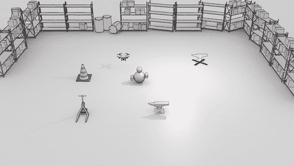
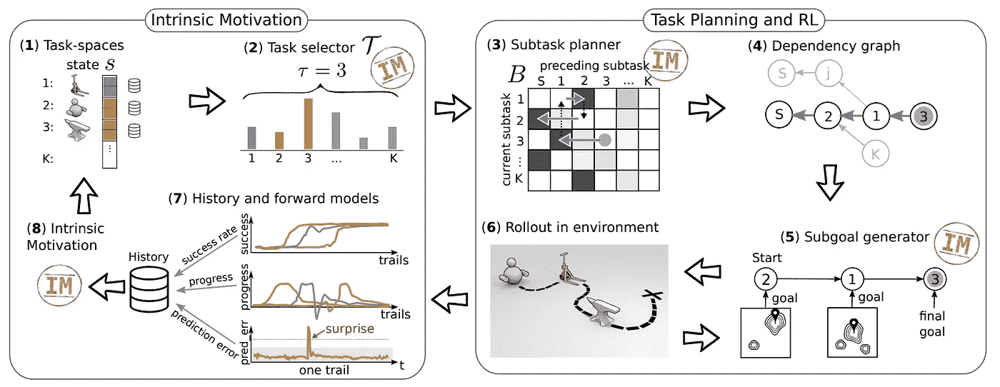
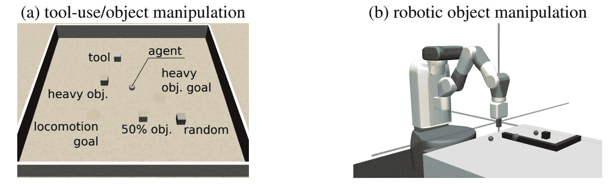
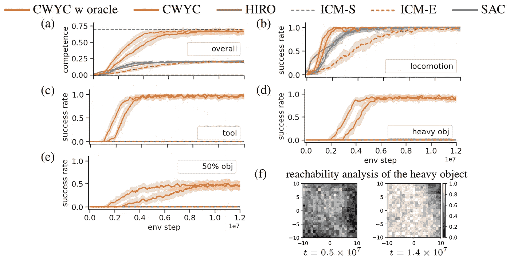
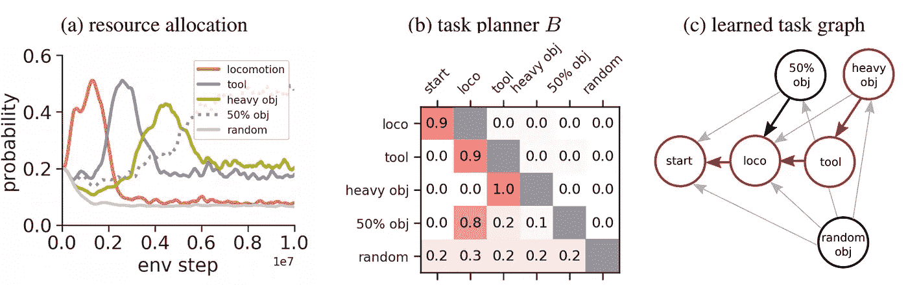

# 控制你所能控制的:通过任务规划强化学习！

> 原文：<https://towardsdatascience.com/control-what-you-can-reinforcement-learning-with-task-planning-b1fc9959b773?source=collection_archive---------25----------------------->

[2]

## 在这里我谈谈我们 NeurIPS 2019 的论文，将规划与强化学习代理 agraphnd 内在动机结合起来。

现实世界中的许多控制问题都有某种层次结构。当我们谈论真正的自主机器人时，理想情况下，我们希望它们获得对环境的最大控制。我们希望这发生在通过奖励功能很少或没有监督的基础上。此外，我们希望代理在环境中利用**这些固有的任务层次**，以使学习更加有效。通俗地说，就是想让机器人自己一个人呆着，没有任何规范，让它自己想明白一切。大多数方法只处理这些问题中的一个，因此我们[1]提出了一种同时处理所有这些问题的方法。

在开始使用这种方法之前，我们必须弄清楚我们所做的假设和某些术语。首先，我们假设环境有明确定义的任务空间，并且对我们可用。在我们的情况下，任务空间被定义为观察空间的子空间，例如物体的坐标，尽管机器人不知道语义。这意味着自我强加的目标对应于达到任务空间中的目标，例如，将对象移动到某个位置。

自然地，任务可以相互依赖，然而，现在仅仅学习这种依赖性就足够了，因为我们还需要知道在子任务中需要达到哪个确切的目标。举个例子，考虑一个仓库里的机器人。仓库中有一个重物太重，无法直接提起，因此机器人需要使用叉车。这个场景自然分解为 3 个任务(简化):机器人位置、叉车位置、重物位置。我们希望机器人自己想出应该移动到叉车，让叉车靠近重物，然后移动物体。这包括分别瞄准每个子任务的正确目标。

有机器人的仓库场景。我们提出的方法学习重物、叉车和机器人之间的正确任务依赖性。(1)

记住所有这些，在我们提议的方法中，这些是我们试图解决的主要挑战:

1.  在使用代理执行首次展示之前，我们如何选择要尝试的任务？
2.  假设任务之间有相互依赖关系，我们如何找到正确的任务依赖关系？
3.  我们如何根据学习到的任务依赖关系生成子目标？

## 你能控制的框架

在《控制你所能》( CWYC)中，我们有多个部分共同发挥作用，以实现学习中的样本效率。但是在进入单个组件之前，我们需要一种方法来指导缺乏外在奖励的学习。人们可以依靠前向模型的预测误差作为替代奖励，但预测误差是不够的。它不够用的原因是在嘈杂的环境中。如果我们在环境中有不可预测的因素，这将产生持续的预测误差。因此，我们在以下所有组成部分**中严重依赖**惊喜**对**内在动机**的衡量。**在没有成功信号的情况下(如果任务被解决，则为 1)，该算法更依赖**惊喜作为替代奖励。如果一个事件/转变在一定的置信区间之外引起相当大的误差，我们说它是令人惊讶的，这使我们能够处理环境中的噪声。**

**任务选择器**决定代理要尝试哪个任务。任务选择器实际上是一个多臂强盗，我们需要一种方法来适应它的臂分布。应该尝试的任务是可以改进最多的任务，因此我们引入**改进/学习进度**(成功的时间导数)作为更新分布的手段。

关于任务依赖性的信息包含在**任务规划器**中，它实际上是一个对任务图或上下文多臂 bandit 进行编码的矩阵(其中上下文是要解决的任务，动作是之前的任务)。我们根据单元格条目从任务规划器中抽取任务序列。作为示例，从任务 A 到任务 B 的转移概率与求解 B 所需的时间量成比例，给定求解任务 A 和在 B 的目标空间中在求解任务 B 之前求解任务 A 时看到的惊奇

**子目标生成器**使我们能够**给定任务链中的任务转移**来设置目标。即，这意味着假设我们知道我们想要稍后解决任务 B，生成器输出任务 a 的目标。子目标生成器可以被视为任务的目标空间上的潜在函数。同样，在没有成功信号的情况下，这种奖励被**惊喜所主导。**

下图总结了上述所有组件:

## 实验

我们在两个连续的控制任务上评估了我们的方法，一个合成工具使用任务和一个挑战性机器人工具使用任务，对照内在动机和分级 RL 基线。我们注意到的是，在缺乏一个良好的奖励的情况下，基线无法学习如何解决这些层次化的任务。这与这样一个事实紧密相关，即状态空间中只有很小一部分与解决任务相关。在一个形状良好的奖励面前，其他方法也能够解决任务。

我们在评估中使用的环境

下图是工具使用任务的性能图。我们的方法(CWYC)在层次结构中稍微复杂一点的任务上一直优于基线，比如拿起一个重物。详见[1]。

实验结果。HIRO 是另一种分层 RL 算法，ICM 是我们的内在动机基线，SAC(软行动者-批评家)是标准 RL 算法。

(2)

在动画(2)中，我们可以看到算法在机械臂任务中的训练进度。盒子太远，机器人无法自己够到，所以它需要意识到它应该先抓住钩子，才能成功地将盒子移动到目标位置(红色)。

此外，我们测量了算法的“资源分配”,即算法为每个单独的任务贡献了多少时间。在下图中，我们可以很好地说明我们的观点。基于我们的方法，通过使用**意外信号**及其与**成功信号**的组合，我们实现了有效的资源分配。无法解决的任务，如移动一个物体，随机出现在不同的地方，很快得不到关注。

图(a)示出了代理随时间的资源分配，图(b)示出了任务依赖图的学习编码，较高的数字意味着在展开任务链时任务转移发生的概率较高。图(c)是学习任务图的图形表示，注意，进入任务的箭头意味着该任务是箭头所源自的任务的依赖项。例如，loco(运动)是工具任务的依赖项。

然而，问题仍然存在，我们能否进一步简化我们的假设，就像在任务空间的情况下一样。对于一个导致高效学习的问题，我们能学习到高效的任务空间划分吗？假设我们不知道任务空间的哪一部分是可达的，我们如何学习为任务取样可行的目标？这个我们留待以后研究。

## 参考

[1] Blaes，Sebastian 等人[控制你所能控制的:内在激励的任务规划代理](https://bit.ly/3aSzEsZ)，NeurIPS 2019

[2]图片取自 Pixabay

**确认**

这是马克斯·普朗克智能系统研究所[自主学习小组](https://al.is.tuebingen.mpg.de/)的工作。