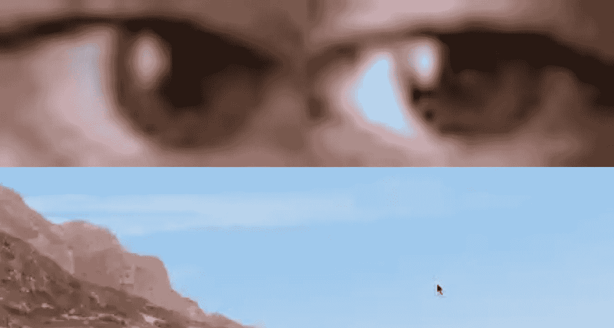
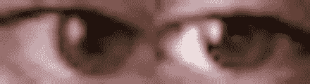

# 用眼睛控制鼠标

> 原文：<https://towardsdatascience.com/controlling-a-mouse-with-your-eyes-f1097e7cf2e9?source=collection_archive---------29----------------------->



根据眼睛位置自动导航到坐标的鼠标(图片由作者提供)

## 仅从单个正面视角作为输入的眼睛姿态估计的机器学习方法

在这个项目中，我们将编写代码，在你每次点击鼠标时裁剪你眼睛的图像。使用这些数据，我们可以反向训练一个模型，从你的眼睛预测鼠标的位置。

我们需要几个图书馆

```
# For monitoring web camera and performing image minipulations
import cv2# For performing array operations
import numpy as np# For creating and removing directories
import os
import shutil# For recognizing and performing actions on mouse presses
from pynput.mouse import Listener
```

我们先来了解一下 pynput 的`Listener`是如何工作的。

`pynput.mouse.Listener`创建一个记录鼠标移动和鼠标点击的后台线程。下面是一个简化代码，当鼠标按下时，它打印鼠标的坐标:

```
from pynput.mouse import Listenerdef on_click(x, y, button, pressed):
  """
  Args:
    x: the x-coordinate of the mouse
    y: the y-coordinate of the mouse
    button: 1 or 0, depending on right-click or left-click
    pressed: 1 or 0, whether the mouse was pressed or released
  """
  if pressed:
    print (x, y)with Listener(on_click = on_click) as listener:
  listener.join()
```

现在，为了我们的目的，让我们扩展这个框架。然而，我们首先需要编写裁剪眼睛边框的代码。稍后我们将从`on_click`函数中调用这个函数。

我们使用 [Haar 级联对象检测](https://docs.opencv.org/3.4/db/d28/tutorial_cascade_classifier.html)来确定用户眼睛的包围盒。你可以点击下载探测器文件[。让我们做一个简单的演示来说明这是如何工作的:](https://raw.githubusercontent.com/opencv/opencv/master/data/haarcascades/haarcascade_eye.xml)

```
import cv2# Load the cascade classifier detection object
cascade = cv2.CascadeClassifier("haarcascade_eye.xml")# Turn on the web camera
video_capture = cv2.VideoCapture(0)# Read data from the web camera (get the frame)
_, frame = video_capture.read()# Convert the image to grayscale
gray = cv2.cvtColor(frame, cv2.COLOR_BGR2GRAY)# Predict the bounding box of the eyes
boxes = cascade.detectMultiScale(gray, 1.3, 10)# Filter out images taken from a bad angle with errors
# We want to make sure both eyes were detected, and nothing else
if len(boxes) == 2:
  eyes = []
  for box in boxes:
    # Get the rectangle parameters for the detected eye
    x, y, w, h = box
    # Crop the bounding box from the frame
    eye = frame[y:y + h, x:x + w]
    # Resize the crop to 32x32
    eye = cv2.resize(eye, (32, 32))
    # Normalize
    eye = (eye - eye.min()) / (eye.max() - eye.min())
    # Further crop to just around the eyeball
    eye = eye[10:-10, 5:-5]
    # Scale between [0, 255] and convert to int datatype
    eye = (eye * 255).astype(np.uint8)
    # Add the current eye to the list of 2 eyes
    eyes.append(eye) # Concatenate the two eye images into one
  eyes = np.hstack(eyes)
```

现在，让我们用这些知识写一个函数来裁剪眼睛的图像。首先，我们需要一个帮助函数来进行规范化:

```
def normalize(x):
  minn, maxx = x.min(), x.max()
  return (x - minn) / (maxx - minn)
```

这是我们的眼睛裁剪功能。如果找到了眼睛，它将返回图像。否则，返回`None`:

```
def scan(image_size=(32, 32)):
  _, frame = video_capture.read() gray = cv2.cvtColor(frame, cv2.COLOR_BGR2GRAY)
  boxes = cascade.detectMultiScale(gray, 1.3, 10) if len(boxes) == 2:
    eyes = []
    for box in boxes:
      x, y, w, h = box
      eye = frame[y:y + h, x:x + w]
      eye = cv2.resize(eye, image_size)
      eye = normalize(eye)
      eye = eye[10:-10, 5:-5]
      eyes.append(eye) return (np.hstack(eyes) * 255).astype(np.uint8)
  else:
    return None
```

现在，让我们编写我们的自动化程序，它将在我们每次按下鼠标按钮时运行。(假设我们已经在代码中将变量`root`定义为我们想要存储图像的目录):

```
def on_click(x, y, button, pressed):
  # If the action was a mouse PRESS (not a RELEASE)
  if pressed:
    # Crop the eyes
    eyes = scan()
    # If the function returned None, something went wrong
    if not eyes is None:
      # Save the image
      filename = root + "{} {} {}.jpeg".format(x, y, button)
      cv2.imwrite(filename, eyes)
```

现在，我们可以回忆起我们对 pynput 的`Listener`的实现，并进行完整的代码实现:

当我们运行这个时，每次我们点击鼠标(如果我们的双眼都在视野中)，它将自动裁剪网络摄像头并将图像保存到适当的目录中。图像的文件名将包含鼠标坐标信息，以及是右键还是左键单击。

这是一个示例图像。在此图像中，我在分辨率为 2560x1440 的显示器上的坐标(385，686)处执行左键单击:



一个例子(图片由作者提供)

级联分类器的准确率很高，我自己的数据目录到目前为止还没有看到任何错误。

现在，让我们编写用于训练神经网络的代码，以在给定眼睛图像的情况下预测鼠标位置。

让我们导入一些库

```
import numpy as np
import os
import cv2
import pyautoguifrom tensorflow.keras.models import *
from tensorflow.keras.layers import *
from tensorflow.keras.optimizers import *
```

现在，让我们添加级联分类器:

```
cascade = cv2.CascadeClassifier("haarcascade_eye.xml")
video_capture = cv2.VideoCapture(0)
```

让我们添加我们的助手函数。

标准化:

```
def normalize(x):
  minn, maxx = x.min(), x.max()
  return (x - minn) / (maxx - minn)
```

捕捉眼球:

```
def scan(image_size=(32, 32)):
  _, frame = video_capture.read() gray = cv2.cvtColor(frame, cv2.COLOR_BGR2GRAY)
  boxes = cascade.detectMultiScale(gray, 1.3, 10) if len(boxes) == 2:
    eyes = []
    for box in boxes:
      x, y, w, h = box
      eye = frame[y:y + h, x:x + w]
      eye = cv2.resize(eye, image_size)
      eye = normalize(eye)
      eye = eye[10:-10, 5:-5]
      eyes.append(eye) return (np.hstack(eyes) * 255).astype(np.uint8)
  else:
    return None
```

让我们定义一下显示器的尺寸。您必须根据自己电脑屏幕的分辨率来更改这些参数:

```
# Note that there are actually 2560x1440 pixels on my screen
# I am simply recording one less, so that when we divide by these
# numbers, we will normalize between 0 and 1\. Note that mouse
# coordinates are reported starting at (0, 0), not (1, 1)
width, height = 2559, 1439
```

现在，让我们加载我们的数据(同样，假设您已经定义了`root`)。我们并不关心是右键还是左键，因为我们的目标只是预测鼠标的位置:

```
filepaths = os.listdir(root)
X, Y = [], []for filepath in filepaths:
  x, y, _ = filepath.split(' ')
  x = float(x) / width
  y = float(y) / height
  X.append(cv2.imread(root + filepath))
  Y.append([x, y])X = np.array(X) / 255.0
Y = np.array(Y)
print (X.shape, Y.shape)
```

让我们定义我们的模型架构:

```
model = Sequential()
model.add(Conv2D(32, 3, 2, activation = 'relu', input_shape = (12, 44, 3)))
model.add(Conv2D(64, 2, 2, activation = 'relu'))
model.add(Flatten())
model.add(Dense(32, activation = 'relu'))
model.add(Dense(2, activation = 'sigmoid'))
model.compile(optimizer = "adam", loss = "mean_squared_error")
model.summary()
```

以下是我们的总结:

```
_________________________________________________________________
Layer (type)                 Output Shape              Param #
=================================================================
conv2d (Conv2D)              (None, 5, 21, 32)         896
_________________________________________________________________
conv2d_1 (Conv2D)            (None, 2, 10, 64)         8256
_________________________________________________________________
flatten (Flatten)            (None, 1280)              0
_________________________________________________________________
dense (Dense)                (None, 32)                40992
_________________________________________________________________
dense_1 (Dense)              (None, 2)                 66
=================================================================
Total params: 50,210
Trainable params: 50,210
Non-trainable params: 0
_________________________________________________________________
```

让我们训练我们的模型。我们将在图像数据中添加一些噪声:

```
epochs = 200
for epoch in range(epochs):
  model.fit(X, Y, batch_size = 32)
```

不，让我们用我们的模型用我们的眼睛移动鼠标。请注意，这需要大量数据才能正常工作。然而，作为一个概念的证明，你会注意到只有大约 200 张图片，它确实可以将鼠标移动到你正在查看的大致区域。当然，除非你有更多的数据，否则这是不可控的。

```
while True:
  eyes = scan() if not eyes is None:
      eyes = np.expand_dims(eyes / 255.0, axis = 0)
      x, y = model.predict(eyes)[0]
      pyautogui.moveTo(x * width, y * height)
```

这里有一个概念验证的例子。请注意，在拍摄这个屏幕记录之前，我用很少的数据进行了训练。这是我的鼠标根据眼睛自动移动到终端应用窗口的视频。就像我说的，这很不稳定，因为数据很少。随着更多的数据，它将有望足够稳定，以更高的特异性进行控制。只有几百张图片，你只能把它移动到你的视线范围内。此外，如果在整个数据收集过程中，没有拍摄到您注视屏幕特定区域(比如边缘)的图像，则该模型不太可能在该区域内进行预测。这是我们需要更多数据的众多原因之一。

[](https://drive.google.com/file/d/1TkU3rRS68U9vk4t7AB--NEQgyYH77Irm/view?usp=sharing) [## eye_mouse_movement.mp4

### 根据凝视自动移动鼠标的视频

drive.google.com](https://drive.google.com/file/d/1TkU3rRS68U9vk4t7AB--NEQgyYH77Irm/view?usp=sharing) 

如果您自己测试代码，记得在代码文件`prediction.py`中将`width`和`height`的值更改为您显示器的分辨率。

您可以在此处查看本教程中的代码:

[](https://github.com/Ryan-Rudes/eye_mouse_movement) [## Ryan-Rudes/眼睛 _ 鼠标 _ 运动

### GitHub 是一个使用机器学习方法来控制具有眼睛姿态估计的计算机鼠标的项目

github.com](https://github.com/Ryan-Rudes/eye_mouse_movement)